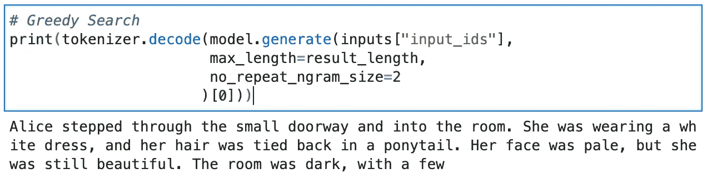

# Bloom 入门

> 原文：<https://towardsdatascience.com/getting-started-with-bloom-9e3295459b65>

## 用 Bloom 生成文本的概述和 Codelab


帕特里克·托马索在 [Unsplash](https://unsplash.com/s/photos/text?utm_source=unsplash&utm_medium=referral&utm_content=creditCopyText) 上的照片

## 目录

*   [什么是布鲁姆？一些注意事项](#9e12)
*   [设置您的环境](#9b20)
*   [下载预先训练好的标记器&模型](#3e75)
*   [运行推理:更好反应的策略](#83a2)
*   [结论&下一步](#b4a4)
*   [参考文献](#0624)

## 什么是盛开，为什么我们要小心行事

[Bloom](https://huggingface.co/bigscience/bloom) 是来自 [BigScience](https://bigscience.huggingface.co/) 的一个新的 176B 参数多语言 LLM(大型语言模型)，由 [Huggingface](https://huggingface.co/) 主持，与全球数百名研究人员和机构进行开放合作。除了贡献者的多样性之外，Bloom 最值得注意的一点是，Bloom 是完全开源的，Huggingface 通过其 transformers API 向公众提供了他们完整的(以及一些较小的)预训练模型。对 LLM 进行研究的其他组织，包括 OpenAI、Meta 和 Google，已经选择将他们的 LLM 主要保留在内部，或者限制访问严格控制的封闭测试组。



作者提供的图片；布鲁姆发的短信。提示:“爱丽丝穿过小门”

关于在现实世界中使用这些模型的危险，已经有了一场对话，更不用说让他们公开化了。担忧的范围从强化不公平和系统性偏见，到加速网上错误信息的传播。比我更有能力的声音，并继续倡导更多的人负责，透明和公平的发展和使用这一技术。如果你不熟悉，我鼓励你在这里停下来，花一些时间了解一下像[蒂姆尼特·格布鲁](https://twitter.com/timnitGebru) ( [DAIR 研究所](https://www.dair-institute.org/))、[玛格丽特·米歇尔](https://twitter.com/mmitchell_ai)和人工智能合作伙伴团队等许多人的工作。

因此，我鼓励每个人坚持[预期用途](https://huggingface.co/bigscience/bloom#intended-use)，并在继续本`Hello World`风格的介绍性教程时，注意[布鲁姆的模型卡](https://huggingface.co/bigscience/bloom)上列出的[风险和限制](https://huggingface.co/bigscience/bloom#risks-and-limitations)。

## 设置您的环境

我们将在 PyTorch 中使用通用 Bloom 模型的 1.3B 参数版本，仅使用 CPU 运行推理。当我在 Google Cloud 的 Vertex 服务上使用 Python 3 Jupyter Lab VM 时，你应该能够在几乎任何本地或托管的*nix Jupyter 环境上使用。

首先，我们需要设置一个虚拟环境作为洁净室，以安装所有正确版本的依赖项。我们将创建一个名为`.venv`的环境(它也产生一个同名的隐藏目录)，然后激活它开始工作:

```
pip install venv
python -m venv .venv
source .venv/bin/activate
```

接下来，我们将把需要的包安装到我们的`.venv`环境中:

```
pip install transformers
pip install torch torchvision torchaudio --extra-index-url [https://download.pytorch.org/whl/cpu](https://download.pytorch.org/whl/cpu)
```

最后，我们需要退出我们的 venv，向 Jupyter Lab 注册我们的新环境作为内核，并重新启动它:

```
deactivate
ipython kernel install --user --name=venv
source .venv/bin/activate
```

当你在 Jupyter Lab 中选择一个内核选项时，你应该会看到一个选项`venv`。让我们选择并连接到它。

## 下载预先训练的标记器和模型

启动我们的示例笔记本(在 [GitHub](https://github.com/dptrsa-300/start_with_bloom/blob/main/bloomex_nb.ipynb) 上也有)，我们首先从之前安装到`venv`的包中导入一些模块:

```
import transformers
from transformers import BloomForCausalLM
from transformers import BloomTokenizerFast
import torch
```

现在到主事件，我们下载预训练的 Bloom 1.3B 参数通用 LLM。虽然我还没有准确地确定它的大小，但似乎这个版本的模型的权重和偏差占用了大约 1.5Gb 的空间。关键的是，我们还需要获取布鲁姆的记号赋予器。这将允许我们将输入文本(“提示”)转换成 Bloom 可以理解的嵌入文本:

```
model = BloomForCausalLM.from_pretrained("bigscience/bloom-1b3")
tokenizer = BloomTokenizerFast.from_pretrained("bigscience/bloom-1b3")
```

说到这里，我们来设置一些全局，包括我们的提示文字:

```
prompt = "It was a dark and stormy night"
result_length = 50
inputs = tokenizer(prompt, return_tensors="pt")
```

一些注意事项:

*   `result_length`校准我们从模型得到的提示响应的大小(以令牌为单位)。
*   `inputs`包含`prompt`的嵌入表示，专门由 PyTorch 编码使用。如果我们使用 TensorFlow，我们会通过`return_tensors="tf"`。

## 运行推理:更好反应的策略

在我们向模型发送提示之前，我们需要考虑哪些解码/搜索策略可能最适合我们的用例。使用自回归转换器(为下一个令牌预测而训练),我们有许多选项来搜索答案空间以获得最“合理”的输出。Patrick von Platen[(hugging face)的这篇](https://huggingface.co/patrickvonplaten)[好文章](https://huggingface.co/blog/how-to-generate)很好地解释了我们将要尝试的 3 种技术背后的细节和数学，所以我不会在这里重新发明轮子。然而，我会给你 TL；每个的灾难恢复版本:

*   **贪婪搜索**简单地在每个时间步长 t+1 选择下一个单词，该单词在 t 处跟随该单词的预测概率最高。这里的一个主要问题是，如果贪婪搜索前面有一个在 t 处概率低的单词，则贪婪搜索将错过在 t+1 处概率高的单词
*   **波束搜索**跟踪第 n(`num_beams`)个最可能的字*序列*并输出最可能的*序列*。听起来不错，但是当输出长度变化很大时，这种方法就失效了——就像开放式文本生成一样。贪婪搜索和波束搜索也产生输出，其分布与人类可能执行相同任务的方式不太一致(即，两者都容易产生相当重复、乏味的文本)。
*   **用 Top-k + Top-p** 采样是三种方法的组合。通过**采样**，我们的意思是基于其条件概率分布随机选择下一个单词( [von Platen，2020](https://huggingface.co/blog/how-to-generate#sampling) )。在 **Top-k** 中，我们选择`k`个最有可能的单词，然后在下一次抽签之前在它们之间重新分配概率质量。 **Top-p** 为 top-k 增加了一个额外的约束，因为我们从累积概率超过`p`的最小单词集中进行选择。

现在，我们将尝试所有 3 种策略，以便比较结果。：

```
# Greedy Search
print(tokenizer.decode(model.generate(inputs["input_ids"], 
                       max_length=result_length
                      )[0]))
```

> 那是一个漆黑的暴风雨之夜，风刮得很大。雪下得很大，地上覆盖着雪。所有的马都冻僵在地上，男人们蜷缩成一团

```
# Beam Search
print(tokenizer.decode(model.generate(inputs["input_ids"],
                       max_length=result_length, 
                       num_beams=2, 
                       no_repeat_ngram_size=2,
                       early_stopping=True
                      )[0]))
```

> 那是一个漆黑的暴风雨之夜，风刮得很大。我在路中间，这时我听到一声巨响。它来自我马路对面的房子。一个男人

```
# Sampling Top-k + Top-p
print(tokenizer.decode(model.generate(inputs["input_ids"],
                       max_length=result_length, 
                       do_sample=True, 
                       top_k=50, 
                       top_p=0.9
                      )[0]))
```

> 那是一个漆黑的暴风雨之夜。快到中午了。当我下车脱鞋时，一个男人走到我面前坐下。他留着小胡子，浓密的头发和棕色的眼睛。男性

## 结论和后续步骤

就个人而言，所有这些结果似乎大多是合理的。您会发现，当您迭代并调整参数和提示时，一些策略可能会为您的特定用例产生更优的输出。事实上，[构造提示来哄 LLM 做一些有用的事情](https://blog.andrewcantino.com/blog/2021/04/21/prompt-engineering-tips-and-tricks/)本身就有点像艺术和科学。

另外，在**采样 top-k + top-p** 输出中，术语“夜晚”和输出“几乎中午”之间的不一致说明了一个有价值的观点，即[很容易将](https://www.washingtonpost.com/technology/2022/06/11/google-ai-lamda-blake-lemoine/)LLM 误认为是推理机器，它们使用世界的内部模型来构建自己的响应(像人类一样)。事实上，我们不需要深度学习、大数据或者 LLMs 来证明[人类会拟人化任何东西](https://99percentinvisible.org/episode/the-eliza-effect/)。相反，我们应该看到 LLM 的本来面目:语法上可信的句子生成器，应该睁大眼睛(以及大量减轻工程和包容性设计)部署它们的局限性。

考虑到这一点，我自己与布鲁姆的旅程将沿着几条线索前进；很大程度上侧重于使文本生成和分类标题适应现代审计中的问题。具体来说:

*   代码摘要。布鲁姆能用通俗易懂的英语概括一个代码块的逻辑吗？
*   令牌分类的迁移学习。Bloom 能被训练识别过程文件中的风险和/或控制吗？
*   可靠性。对于生成的摘要和分类的事实准确性，我们可以在 Bloom 预测中构建什么保证(如果有的话)?

快乐发电！

## 参考

*   [布鲁姆模特卡](https://huggingface.co/bigscience/bloom-1b3)，2022，拥抱脸
*   [绽放](https://huggingface.co/docs/transformers/model_doc/bloom) `[transformers](https://huggingface.co/docs/transformers/model_doc/bloom)` [文档](https://huggingface.co/docs/transformers/model_doc/bloom)，2022，拥抱脸
*   [如何生成文本:用变形金刚使用不同的解码方法进行语言生成](https://huggingface.co/blog/how-to-generate)，2020，Patrick von Platen
*   `[venv](https://docs.python.org/3/library/venv.html#module-venv)` [模块文档](https://docs.python.org/3/library/venv.html#module-venv)，2022，Python.org
*   [提示 GPT-3 的工程技巧和诀窍](https://blog.andrewcantino.com/blog/2021/04/21/prompt-engineering-tips-and-tricks/)，2021，安德鲁·坎蒂诺
*   [布鲁姆入门:样本笔记本](https://github.com/dptrsa-300/start_with_bloom/blob/main/bloomex_nb.ipynb)，2022，丹妮·塞隆