# Python Pandas 中的数据清理入门

> 原文：<https://towardsdatascience.com/getting-started-with-data-cleaning-in-python-pandas-76d977f95b57>

## 数据清理

## 使用流行的 Python 库执行数据清理的实际例子。


Mick Haupt 在 [Unsplash](https://unsplash.com?utm_source=medium&utm_medium=referral) 上拍摄的照片

**数据清理是处理数据时必不可少的步骤之一。**事实上，在大多数情况下，您的数据集是脏的，因为它可能包含丢失的值、重复的值、错误的格式等等。在没有清理数据的情况下运行数据分析可能会导致错误的结果，并且在大多数情况下，您甚至无法训练您的模型。

为了说明执行数据清理所需的步骤，我使用了一个非常有趣的数据集，由 Open Africa 提供，其中包含维多利亚湖 4 个子区域的历史和预测降雨量和径流量。该数据集在知识共享许可下发布，可通过[此链接](https://africaopendata.org/dataset/messy-data-for-data-cleaning-exercise)获得。我发现这个数据集非常有趣，因为虽然它很小，但它是故意脏的，因此它可以用来说明如何执行数据清理。

所以，我们继续吧！

文章组织如下:

*   加载数据集
*   缺少值
*   数据标准化
*   初步探索性数据分析。

# 1 加载数据集

数据集以 Excel 文件的形式提供，所以我通过`read_excel()`函数加载它。为了正常工作，这个函数需要安装`openpyxl`库。要安装它，你可以运行`pip install openpyxl`。

```
import pandas as pddf = pd.read_excel('source/rainfall.xlsx')
df.head()
```

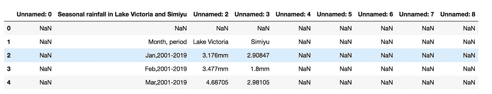

作者图片

数据集未正确加载，因为列名不正确。因此，我需要再次读取数据集，跳过前两行:

```
df = pd.read_excel('source/rainfall.xlsx', skiprows=2)
df.head()
```

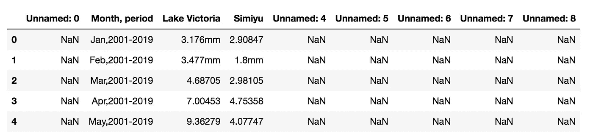

作者图片

还有一些额外的列，我可以通过`usecols`参数删除它们:

```
df = pd.read_excel('source/rainfall.xlsx', skiprows=2, usecols='B:D')
df.head(20)
```

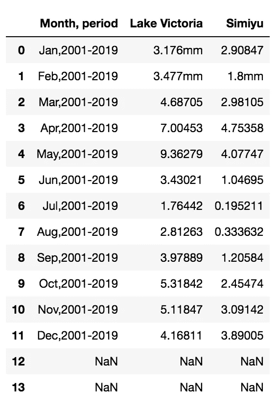

作者图片

# 2 个缺失值

有两排完全空着。我可以通过`dropna()`功能放下它们:

```
df.dropna(inplace=True, axis=0)
df.head(20)
```

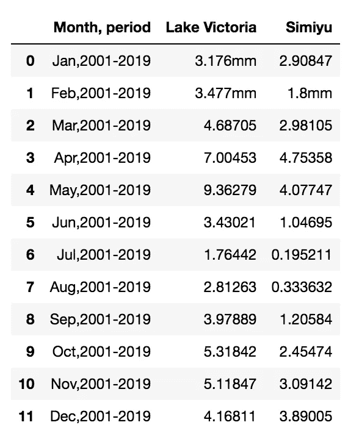

作者图片

# 3 数据标准化

第一列包含两列。我使用`split()`功能将它们分开。

```
splitted_columns = df['Month, period'].str.split(',',expand=True)
splitted_columns
```

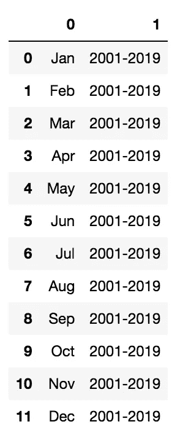

作者图片

现在，我将每个新列分配给原始数据帧中的一个新列:

```
df['Month'] = splitted_columns[0]
df['Period'] = splitted_columns[1]
df.head(15)
```

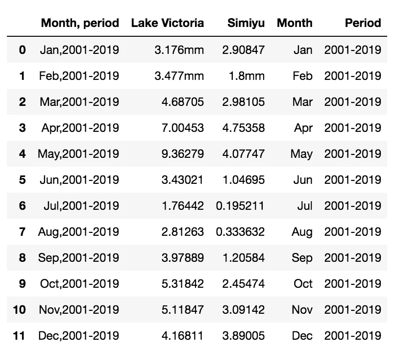

作者图片

我放下`Month,period`栏:

```
df.drop('Month, period', axis=1, inplace=True)
df.head(15)
```

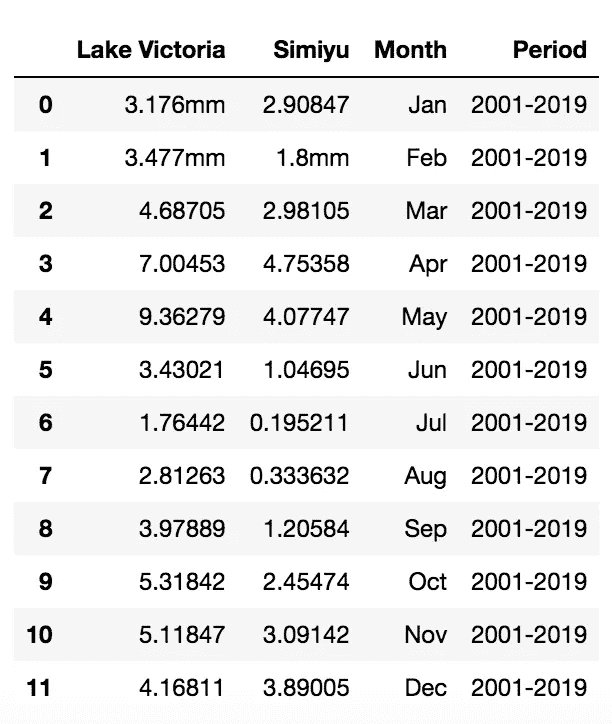

作者图片

有些列包含字符串`mm`，所以我定义了一个函数来消除它。

```
def remove_mm(x):
    if type(x) is str:
        return x.replace('mm', '')
    else:
        return x
```

我将前面的函数应用于列`Lake Victoria`和`Simiyu`:

```
df['Lake Victoria'] = df['Lake Victoria'].apply(lambda x: remove_mm(x))
df['Simiyu'] = df['Simiyu'].apply(lambda x: remove_mm(x))
df.head(20)
```

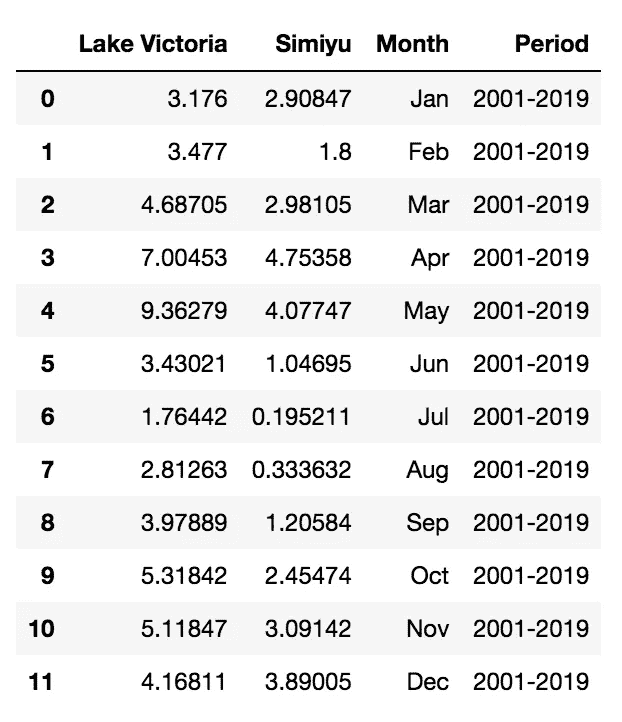

作者图片

我描述了每一列的类型

```
df.dtypes
```

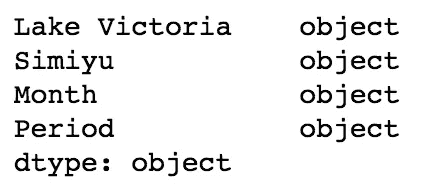

作者图片

`Lake Victoria`和`Simiyu`列应该是浮动的。所以我把它们转换成浮点数:

```
df["Lake Victoria"] = pd.to_numeric(df["Lake Victoria"])
df["Simiyu"] = pd.to_numeric(df["Simiyu"])
df.dtypes
```

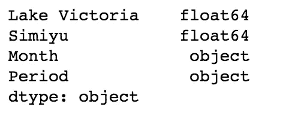

作者图片

# 4 初步探索性数据分析

为了执行探索性数据分析(EDA)，我使用 pandas profiling 库。我可以这样安装它:

```
pip install pandas-profiling
```

然后，我用它来构建一个报告:

```
from pandas_profiling import ProfileReportprofile = ProfileReport(df, title="rainfall")
profile.to_file("rainfall.html")
```

该库构建一个 HTML 文件，其中包含每一列的所有统计数据，并计算每对数字列之间的相关性。下图显示了生成的报告的示例:

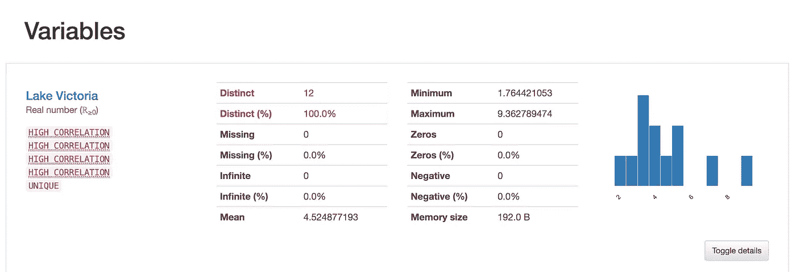

作者图片

# 摘要

恭喜你！您刚刚清理了 Python Pandas 中的第一个数据集！过程简单快捷！

您可以从[我的 Github 库](https://github.com/alod83/data-science/blob/master/Preprocessing/DataCleaning/Data%20Cleaning.ipynb)下载本文使用的代码。

如果你读到这里，对我来说，今天已经很多了。谢谢！你可以在[这个链接](https://alod83.medium.com/my-most-trending-articles-4fbfbe107fb)阅读我的趋势文章。

# 相关文章

</data-preprocessing-with-python-pandas-part-1-missing-data-45e76b781993>  </data-processing-with-python-pandas-part-2-data-formatting-710c2eafa426>  </data-preprocessing-with-python-pandas-part-3-normalisation-5b5392d27673>  </data-preprocessing-with-python-pandas-part-4-standardization-ccd5b1608f1c>  </data-preprocessing-with-python-pandas-part-5-binning-c5bd5fd1b950>  </data-preprocessing-in-python-pandas-part-6-dropping-duplicates-e35e46bcc9d6>  

## 你知道 scikit-learn 也提供数据清理功能吗？

阅读[这篇文章](/data-preprocessing-with-scikit-learn-missing-values-8dff2c266db)来学习如何处理 scikit-learn 中的缺失值。