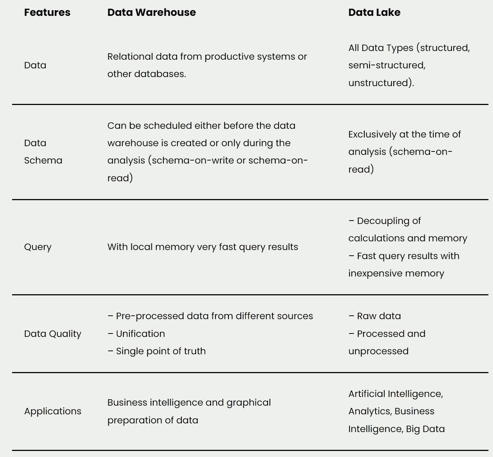

# 数据湖入门

> 原文：<https://towardsdatascience.com/getting-started-with-data-lakes-6761e0317442>

## 数据仓库补充背后的想法和解释

照片由 [Aaron Burden](https://unsplash.com/es/@aaronburden?utm_source=medium&utm_medium=referral) 在 [Unsplash](https://unsplash.com?utm_source=medium&utm_medium=referral)

数据湖以原始格式存储大量来自不同来源的[数据](https://databasecamp.de/en/data)，以使它们可用于[大数据](https://databasecamp.de/en/data/big-data-basics)分析。这些数据可以是结构化的、半结构化的或非结构化的。这些信息一直存储在那里，直到需要进行分析评估。

# 为什么公司要使用数据湖？

存储在数据湖中的数据可以是结构化的、半结构化的或非结构化的。这种数据格式不适合关系数据库，而关系数据库是许多 T4 数据仓库的基础。

此外，关系数据库也不是水平可伸缩的，这意味着存储在数据仓库中的数据在超过某个级别后会变得非常昂贵。水平可伸缩性意味着系统可以在几台不同的计算机之间进行划分，因此负载不会落在一台计算机上。这样做的好处是，在压力很大的情况下，可以根据需要临时添加新系统，例如有许多同时进行的查询。

根据定义，关系数据库不能在许多计算机之间划分数据集，否则，数据一致性将会丧失。因此，在数据仓库中存储大量数据是非常昂贵的。大多数用于数据湖的系统，如 [NoSQL](https://databasecamp.de/en/data/nosql-databases) 数据库或 [Hadoop](https://databasecamp.de/en/data/hadoop-explained) ，都是水平可伸缩的，因此可以更容易地伸缩。这就是为什么数据湖和数据仓库是许多公司数据架构的基石之一的主要原因。

# 体系结构

数据湖的具体实现因公司而异。但是，有一些基本原则应该适用于数据湖的数据架构:

*   可以包含所有数据。基本上，来自源系统的所有信息都可以加载到数据湖中。
*   不必首先处理数据，但可以以原始形式加载和存储数据。
*   只有在特殊的用例对数据有需求时，才会处理和准备数据。这个过程也称为模式读取。

否则，不管系统如何，储存时仍应考虑一些基本要点:

*   具有统一命名约定的通用文件夹结构，以便可以快速轻松地找到数据。
*   创建数据目录，命名文件的来源并简要说明各个数据。
*   数据筛选工具，这样就可以很快发现数据质量有多好，以及是否有任何缺失值。
*   标准化的数据访问，以便可以分配授权，并明确谁可以访问数据。

# 数据仓库的差异

数据仓库还可以通过数据湖来补充，非结构化的原始数据以较低的成本临时存储在数据湖中，以便以后使用。这两个概念的主要区别在于它们存储的数据和存储信息的方式。

数据仓库和数据湖的比较|图片:作者

# 这是你应该带走的东西

*   数据湖是指一个大型数据存储，它以原始格式存储来自源系统的数据，以便供以后分析使用。
*   它可以存储结构化、半结构化和非结构化数据。
*   它从根本上不同于数据仓库，因为它存储未处理的数据，并且直到有特定的用例时才准备数据。
*   这主要是数据保留的问题。

*如果你喜欢我的作品，请在这里订阅*<https://medium.com/subscribe/@niklas_lang>**或者查看我的网站* [*数据大本营*](http://www.databasecamp.de/en/homepage) *！还有，medium 允许你每月免费阅读* ***3 篇*** *。如果你希望有****无限制的*** *访问我的文章和数以千计的精彩文章，请不要犹豫，点击我的推荐链接:*[【https://medium.com/@niklas_lang/membership】](https://medium.com/@niklas_lang/membership)每月花$***5****获得会员资格**

*</learn-coding-13-free-sites-to-help-you-do-it-9b2c1b92e573>  </introduction-to-random-forest-algorithm-fed4b8c8e848>  </understanding-mapreduce-with-the-help-of-harry-potter-5b0ae89cc88>  <https://medium.com/@niklas_lang/membership>  

*最初发布于*[*https://database camp . de*](https://databasecamp.de/en/data/data-lakes)*。**