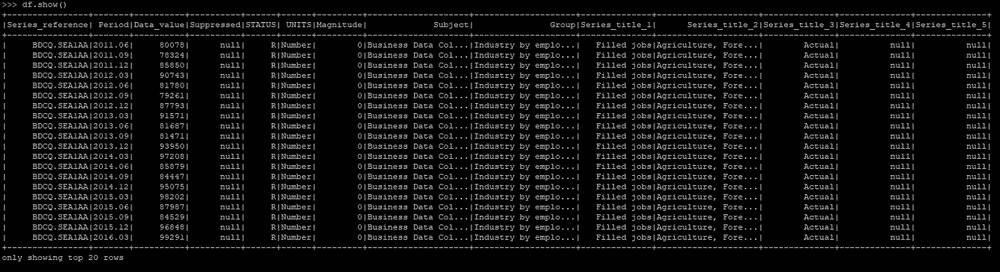
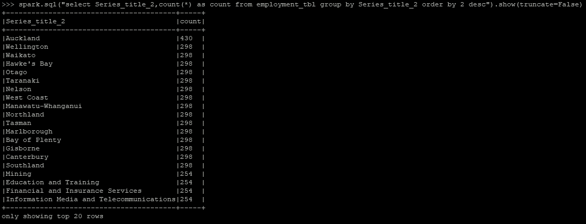
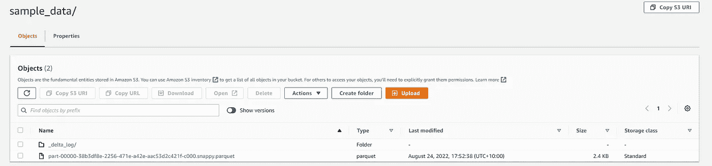
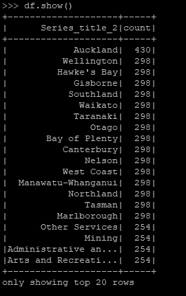
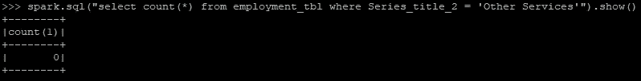
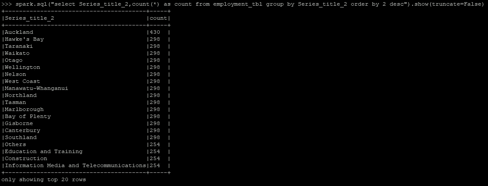

# 在 AWS 中开始使用 Delta Lake & Spark 简单的方法

> 原文：<https://towardsdatascience.com/getting-started-with-delta-lake-spark-in-aws-the-easy-way-9215f2970c58>

## 在 AWS 中配置 EC2 上的 Apache Spark 和 Delta Lake 的分步教程，以及 Python 中的代码示例


约书亚·索蒂诺在 [Unsplash](https://unsplash.com?utm_source=medium&utm_medium=referral) 上拍摄的照片

如果您从事过数据湖或湖屋解决方案的工程设计，那么您可能已经针对数据湖平台的可伸缩存储层采用了(或听说过)解耦和分布式计算框架。尽管这种计算框架的列表在不断增长，但 Apache Spark 一直在不断发展，并证明了它在大数据处理领域的稳健性。随着 Apache Spark 越来越成功，许多供应商也在提供各种风格的基于 Apache Spark 的解决方案(如 Databricks、Amazon EMR)。此外，在解决现有数据湖解决方案的[酸性限制方面出现了激增，在这种情况下，您可能听说过像 D](https://www.databricks.com/discover/data-lakes/introduction#:~:text=all%20at%20once.-,Data%20lake%20challenges,-Despite%20their%20pros) [埃尔塔湖](https://delta.io/)、胡迪、冰山这样的解决方案。所有这些看起来都很吸引人，但是对于初学者来说，有时会有点不知所措。有一种可能性是，您可能希望从小处着手，在 ACID 兼容的数据湖中利用 Apache Spark 的潜力(例如，通过在 AWS 中的 VM (EC2)中正确配置它)。或者，您可能希望解决特定的用例，这些用例不需要基于供应商的产品，或者不需要大量实例来进行大规模分布式处理。此类特定用例的一些示例可能是:

*   您发现您现有的 ETL 过程没有类似 SQL 的处理能力。例如，假设您正在使用 Python，您主要依赖 Python 原生数据结构(如列表、字典)及其模块(如 csv、pandas)来实现所需的转换。您认为，能够运行 SQL 表达式并与更抽象和可扩展的数据结构(如 dataframes)互换以实现您想要的转换，可以加速和简化您的开发，例如，而不是求助于多行代码来从登录目录读取数据并根据列的值将其拆分到多个目标目录；您可以通过 Spark SQL 中的几行代码方便地实现它。
*   你发现 [S3 选择](https://aws.amazon.com/blogs/aws/s3-glacier-select/)是相当有限的，并且想要一个更好的解决方案来运行除雅典娜之外的 S3 上的 SQL。
*   如果您的数据速度接近实时，并且在任何时间点，正在处理的数据量可以在资源范围内，即虚拟机的 CPU 和 RAM，因此它不需要分布式计算。
*   您希望构建基于 Apache Spark 和 Delta Lake 的解决方案原型，通过从小处着手(即在您选择的 EC2 实例中运行)来实现其业务价值。您不希望为您的初始原型运行一个成熟的基于供应商的解决方案。如果你想学习这些新技术，同样的启发法也适用。

如果以上任何一个条款引起了您的共鸣，那么您可能会发现这篇文章非常有帮助，因为它以简单/容易的方式解释了如何在 AWS 中的 EC2 实例上开始使用 Apache Spark 和 Delta Lake。

## 先决条件

要跟进，您将需要以下内容:

*   AWS 帐户
*   EC2 实例(可以是任何大小，但建议至少是具有 2 个 vCPUs 的实例)配置如下:
    - Python(理想情况下是> 3.8)(可选地配置了虚拟环境)
    - JDK(理想情况下是 Oracle 的，但 OpenJDK 也工作得很好。我特别发现 Oracle JDK 11 对于 Apache Spark 3 来说相当可靠
*   S3 桶(您将在那里为您的三角洲湖水合/存储数据)
*   附加到 EC2 实例的 IAM 角色，允许对 S3 存储桶进行读/写操作

## 步伐

第一步是在您的(虚拟)环境中安装 PySpark。在撰写本文时，我发现 pyspark 3.2.2 在与 Delta Lake dependencies 结合使用时相当稳定。所以我将在本文中使用它。

如果您使用 pip 在您的环境中安装依赖项，请运行以下命令:

```
pip install pyspark==3.2.2
```

如果一切顺利，PySpark 模块将安装在您的 Python 环境中！现在是时候使用它了。

下面是代码片段中发生的事情的概要分析:

*   第 1 行—我们从 pyspark.sql 模块导入 SparkSession 类
*   第 2 行—我们指定 Spark 工作所需的依赖关系，例如允许 Spark 与 AWS(在我们的例子中为 S3)交互、使用 Delta Lake 核心等
*   第 3 行——我们实例化了 SparkSession 对象，该对象标记为在脚本中使用 Spark 的入口点。在创建对象时发生了很多事情，您可能希望仔细阅读 spark 文档以了解每一个的基本原理，但有几个是关键的:
    - spark.sql.extensions:扩展 Spark 会话对象以使用 Delta Lake 功能
    - spark.jars.packages:以逗号分隔的 jar Maven 坐标列表以包含在驱动程序和执行器类路径中
    -Spark . SQL . sources . partitionoverwritemode:允许更好地/动态写入分区数据，即不删除现有分区，只插入当前数据帧中的分区

提示:如果您使用的是公司 HTTP/HTTPS 代理，您可以添加以下配置来允许遍历代理，从而允许 Spark 从 Maven repo 下载指定的 jars 包:

```
.config("spark.driver.extraJavaOptions", "-Duser.timezone=UTC -Dhttp.proxyHost=proxy_hostname -Dhttp.proxyPort=port -Dhttps.proxyHost=proxy_hostname -Dhttps.proxyPort=port")
```

一旦完成，Spark 会话对象就可以使用了。

## 从 S3 读取数据

让我们使用一个样本数据集。对于本文，我选择了来自新西兰统计局网站的[就业数据(请参考本文末尾关于数据集许可方面的参考资料部分)。](https://stats.govt.nz/large-datasets/csv-files-for-download/)

我也将 CSV 文件上传到我的帐户中的一个桶中。

以下是如何在 Spark 中读取带头文件的 CSV 文件:

```
df = spark.read.option("recursiveFileLookup", "true").option("header","true").csv("s3://your_bucket/test/machine-readable-business-employment-data-mar-2022-quarter.csv")
```

需要注意的是，由于 Spark 遵循惰性执行模型，所以在这个阶段它不会在内存中加载任何数据。仅当您在 Spark 中执行某个操作时(例如。count()，。show()函数)，然后它会将所需的数据加载到内存中进行处理。

让我们先看一下数据是什么样子的:

```
df.show()
```

输出如下所示:



## 基于 SQL 的数据转换

Spark 最强大的特性之一是能够对数据运行 SQL 查询。这大大加速和简化了 ETL，因为您可以通过 SQL 快速表达非常强大的数据转换逻辑，而不是编写冗长/复杂的代码来实现相同的功能。

要运行 SQL 查询，您需要在数据上创建一个“临时视图”。此视图未注册到集成目录/hive-metastore(例如 Glue ),并且将仅位于当前会话的本地。

要创建临时视图:

```
df.createOrReplaceTempView("employment_tbl")
```

完成后，您可以对 S3 上的数据运行 SQL 查询。你可以通过使用 spark.sql()函数来完成:

```
spark.sql("select Series_title_2,count(*) as count from employment_tbl group by Series_title_2 order by 2 desc").show(truncate=False)
```

输出如下所示:



在这里，我们运行一个 group by SQL 查询来计算唯一值在 series_title_2 列中出现的次数。

您还可以根据以下转换逻辑创建新的数据帧:

```
df_groupby = spark.sql("select Series_title_2,count(*) as count from employment_tbl group by Series_title_2 order by 2 desc")
```

## 将增量格式的数据写入 S3

让我们将这个转换后的数据帧以 delta 格式写入 S3，以实现我们的“delta-lake”

```
df_groupby.write.format("delta").save("s3://your_bucket/test/sample_data/")
```

完成后，您可以从 S3(例如通过管理控制台)验证数据是否以增量格式写入:



如果你想在 Spark 中读取 delta 格式的数据:

```
df = spark.read.format("delta").load("s3://your_bucket/test/sample_data/")
```

如果你想看数据:

```
df.show()
```

这是它看起来的样子:



## 对数据执行更新

像 Delta Lake 这样的技术的独特主张之一是能够对 data-lake 上的数据执行符合 ACID 的更新/删除。传统上，在受 Hadoop 影响的大数据范式中，这是一个严重的限制，数据工程师不得不求助于各种变通办法来实现数据集中所需的更新/删除效果。但是现在，这个功能在 Delta Lake(和胡迪的 Iceberg)中得到了原生支持。

假设您想要删除 series_title_2 = '其他服务'的所有记录。您可以这样做的方法之一如下。

在上面的代码片段中，我们在表数据以增量格式存储的路径上创建了对增量表的引用。然后，我们指定了如何更新数据的逻辑，即将 Series_title_2 列值从“其他服务”更改为“其他”。执行时，这将直接将更新应用于 S3 上的底层增量文件。

为了验证更新是否发生，让我们读回 dataframe 中的数据并运行一些 SQL 查询:

```
df = spark.read.format("delta").load("s3://your_bucket/test/delta_format/")df.createOrReplaceTempView("employment_tbl")spark.sql("select count(*) from employment_tbl where Series_title_2 = 'Other Services'").show()
```

这个计数是零:



让我们运行另一个执行 Group By 的 SQL 查询来验证“Other Services”不存在，并且已被替换为“Others”:



如您所见，数据帧中倒数第四个条目是“Others”，如果您将它与我们之前运行的 group by query 的输出进行比较，您会发现它是“Other Services”。

使用类似的方法，您也可以删除数据。此外，我没有使用 SQL 表达式来执行更新和删除，但是您也可以轻松地做到这一点。

因此，如果您一直遵循本文，那么您已经完成了整个工作流程，即读取原始数据(CSV 格式)、进行一些转换、以 delta 格式写入数据、更新数据，然后再次读取 delta 格式的数据。这是通过 Spark 可以实现的所有高级转换的基础。

值得指出的是，本文中的方法确实有一些限制:

*   该设置未与集中式 Hive Metastore 或目录(如 Glue)集成。因此，如果您运行 CREATE TABLE 语句，这些语句将不会在中央目录中注册，因此其他 Spark 实例或工具(如 Athena)将无法访问这些表。虽然你可以自己配置与 Glue catalog 集成，但是在这种情况下，EMR 确实提供了一些好处，因为它提供了与 Glue 的开箱即用集成。
*   该设置不是分布式的，即它不利用多个虚拟机来执行分布式计算。

符合 ACID 标准的 datalake 解决方案，如 Delta Lake 和胡迪等，以及像 Databricks 这样提供基于它的商业解决方案的相关公司，在数据行业正获得相当好的发展势头，因此了解这项技术将是一项很好的投资。最好的学习方法是通过实践，如果你发现了一个有价值的用例，就从小处着手，做实验，打破常规，构建东西，然后进化！

## 参考

*   三角洲湖泊:[https://delta.io/](https://delta.io/)
*   文章中使用的数据集:[https://stats . govt . NZ/assets/Uploads/Business-employment-data/Business-employment-data-March-2022-quarter/Download-data/Business-employment-data-March-2022-quarter-CSV . zip](https://stats.govt.nz/assets/Uploads/Business-employment-data/Business-employment-data-March-2022-quarter/Download-data/business-employment-data-march-2022-quarter-csv.zip)
    ([根据知识共享 4.0 国际许可授权重用](https://stats.govt.nz/large-datasets/csv-files-for-download/#:~:text=Unless%20indicated%20otherwise%2C%20all%20content%20on%20stats.govt.nz%20is%20licensed%20for%20re%2Duse%20under%20a%20Creative%20Commons%204.0%20International%20Licence))