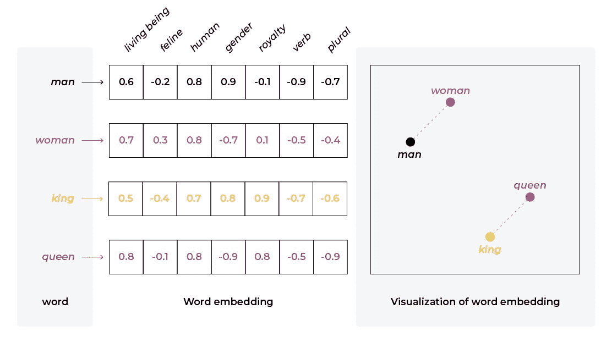
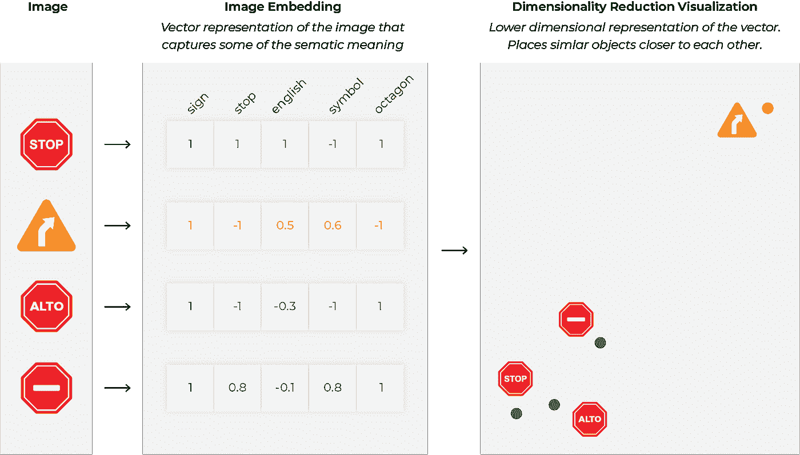

# 嵌入入门比您想象的要容易

> 原文：<https://towardsdatascience.com/getting-started-with-embeddings-is-easier-than-you-think-e88b7b10bed1>

作者图片

## 理解嵌入的快速指南，包括真实世界的应用和如何计算它们

*与 Arize AI 的数据科学家*[*Francisco Castillo carr ASCO*](https://www.linkedin.com/in/f-castillo-carrasco/)*合作撰写。*

想象一下，你是一家有前途的聊天机器人初创公司的工程师，致力于帮助人们快速找到他们需要的医疗服务。客户和医务人员之间有数百万次聊天互动。您正在构建一个模型，将问题发送到医院和诊所的不同部门。由于机器学习是数学，而不是魔术，你需要以某种方式向你的模型“解释”，“扭伤的脚踝”和“肿胀的脚”可能是类似的查询。你是怎么做到的？

输入[嵌入](https://arize.com/blog-course/embeddings-meaning-examples-and-how-to-compute/)。

# 什么是嵌入？

嵌入是数据的矢量(数学)表示，其中线性距离捕获原始数据集中的结构。

这个数据可以由单词组成，就像上面描述的场景一样，在这种情况下，我们称之为单词嵌入。但是嵌入也可以表示图像、音频信号，甚至是大块的结构化数据。

嵌入在现代深度学习中无处不在，例如变压器、推荐引擎、SVD 矩阵分解、深度神经网络层、编码器和解码器。

嵌入是基础性的，因为:

1.  它们为您的数据提供了一种通用的数学表示
2.  他们压缩你的数据
3.  它们保留了数据中的关系
4.  它们是深度学习层的输出，为模型学习的复杂非线性关系提供可理解的线性视图

我们来看一个经典的琐碎例子。如果您的数据集只有四个词——女王、国王、公主和王子——您可以使用一个带有三维稀疏向量的热编码。这意味着您需要三列，其中大部分包含零。

作者图片

然而，如果你观察这些单词，它们在两个方面有所不同:年龄和性别。因此，您可以将数据表示如下:

作者图片

你不仅去掉了一个专栏，还保留了有价值的信息。很明显，在这样一个简单的例子中，你不会得到太多——但是如果你的语料库包含了英语中的每一个单词呢？如果它包含了每种语言的每一个单词呢？后一种表示显然不可能手工构建，但如果它存在的话，它将是非常有价值的。坚持这个想法。

在实践中，嵌入并没有真正给你 1 和 0，而是介于两者之间的东西，并且逐列解释它们要困难得多(如果不是不可能的话)。尽管如此，重要的信息可以以这种紧凑的形式保存下来。

经典例子，作者图片

# 嵌入现实世界

# 推荐系统

可以说今天推动最大商业价值的机器学习产品之一是[推荐系统](https://arize.com/blog/the-who-what-where-when-why-and-how-of-recommender-systems/)。从如何保持用户参与到推荐什么产品到什么新闻可能与你相关，推荐系统无处不在。推荐系统的一种常见方法是协同过滤(例如，与你品味相似的人喜欢什么？).现代推荐系统中的协同过滤几乎总是使用嵌入技术。因此，许多数据科学家第一次接触嵌入是在推荐系统中。

几年前，嵌入也开始出现在其他类型的商业模型中，比如最初的 Word2vec。Word2vec 中生成嵌入的方式明显不同于推荐系统中使用的矩阵分解方法；它们基于将单词关系训练成线性向量。Word2vec 拒绝许多团队去确定关系可以超越文字多远，以及嵌入可以表示什么关系。快进到今天，变形金刚——许多现代人工智能技艺背后的魔法——可以被视为一个复杂的概率调整嵌入层次。

简而言之，嵌入在现代人工智能中无处不在。除了无处不在之外，将数据表示为嵌入还有另一个优点:它可以作为模型、团队甚至组织之间的接口。

这里有几个其他的例子来说明嵌入在现实世界中的应用。

# 无人驾驶汽车

使用嵌入式的另一个重要且具有挑战性的问题是自动驾驶汽车。假设你的团队正在训练汽车刹车系统的模型。你想要的一个重要的模型特征是“停止标志”考虑到这一点，你在你所在区域的一堆停车标志上进行训练，但不幸的是在现实世界中你可能会遇到不同语言甚至不同形状的停车标志。不用担心这个就好了。幸运的是，贵公司的另一个团队有一个嵌入的停止标志供您使用。

现在，您可以专注于问题的一部分，而另一个团队可以负责交通标志嵌入，并作为输入提供给您。嵌入成为模型之间的接口，就像不同微服务之间的 REST 接口。您可能需要在维度上达成一致，但除此之外，下游模型可能是一个黑盒。

图片作者:艾瑞泽·艾

# 文件分类

如果你花时间关注机器学习的最新发展，其中许多都围绕着自然语言处理。这些任务可以包括翻译、情感分析、主题建模、摘要等等。该领域最近爆发的核心是一种特殊类型的神经网络，称为变压器。今天的变压器在整个架构的多个地方使用嵌入，包括输入和输出。就数学数据而言，语言是非结构化的，因此为嵌入技术的发展提供了绝佳的机会。甚至更简单的架构也依赖嵌入来表示输入数据。

因为根据定义，嵌入更紧凑地表示数据，所以它们也可以用于压缩目的。例如，ImageNet 是 150GB。如果嵌入可以帮助你用 1/50 的空间来表示它，那会使你的许多任务更简单。

嵌入的核心价值是线性关系，如距离、投影、平均值、加法和减法在向量空间中都有意义。非常简单的线性操作可以提供很多价值。点积可以告诉你两个项目有多相似。不同城市的平均值可以创建一个平均“城市”的代表向量投影可以显示一个概念如何与另一个概念相关联。

# 你如何计算嵌入？

今天，关于如何创建嵌入的许多讨论都围绕着深度神经网络(DNN)。由于 DNN 训练的嵌入在业界如此普遍，这篇文章将主要关注它们。然而，需要指出的是，生成嵌入并不需要 DNN。比如 GloVe 就是一个很重要的不使用 DNNs 的单词嵌入。

奇异值分解(SVD)和主成分分析(PCA)是获得不依赖于神经网络的嵌入的常用方法。这两种方法都来自于降维和矩阵分解技术家族，可以有效地处理大量数据。

假设有许多模型架构应用于不同的用例，有许多方法可以从 DNN 模型中提取嵌入向量。让我们来看一种方法。

假设您正在寻找一个用于翻译系统的单词嵌入。对于这项技术来说，这是一个非常自然的应用，因为例如，英语中的“cat”和西班牙语中的“gato”之间的相似性可能会被保留下来。您可以在多种语言的大量文本上训练一个 transformer 模型。

该架构可能非常复杂，也可能非常简单，但让我们假设一个输入层(编码器)、许多前馈形式的隐藏层和一个输出层(解码器)。暂且忽略变形金刚的位置注意力，当你的网络在某个单词位置看到“猫”时，它在相关的隐藏层上有一组激活值——当它看到“狗”时，它有另一组激活值。太好了！那是你的嵌入。您可以简单地获取该层的激活值。

这当然只是表现猫的一种方式。其他可能包括:

*   取最后 N 层的激活值的平均值
*   取单词位置嵌入的平均值来创建上下文
*   从编码器和解码器中提取嵌入
*   仅取第一层值

模型架构和您选择的方法将影响模型维度(一个向量有多少个值)以及层次信息。由于维数取决于作为机器学习实践者的你，你可能想知道:嵌入应该有多少维？

有时模型和架构已经是板上钉钉的了，你所做的只是提取一个嵌入层来理解内部。在这种情况下，你的维度已经为你设计好了。然而，如果您构建模型本身来生成嵌入，则存在一个很大的设计权衡。

参数越少，嵌入操作就越简单，在下游也越有用，但是参数太少可能会错过值得保存的重要信息。另一方面，原始数据大小的嵌入不是嵌入！您选择保留的每个维度都会损失一些压缩优势。

保持嵌入越大的另一个好处是:嵌入越大，可以使用的距离度量就越简单。更复杂的距离度量通常难以描述和理解。这是嵌入通常使用几百到几千个参数的主要原因之一。

# 结论

嵌入是高维数据的密集、低维表示。它们是输入数据表示、压缩和跨团队协作的极其强大的工具。

虽然有许多方法可以获得这样的表示，但是作为一名工程师，你必须注意你产生的表示的大小、准确性和可用性。这就像机器学习中的许多其他任务一样，是一个迭代问题，正确的版本控制既具有挑战性，也是必不可少的。

尽管嵌入极大地降低了输入特征的维数，但是如果不通过像 UMAP 这样的技术进一步降低维数，它们仍然是难以理解的。敬请关注本内容系列中关于[可视化和故障诊断嵌入](https://arize.com/blog-course/sne-t-sne-umap/)的最佳实践的下一次更新。

# 联系我们

如果这个博客引起了你的注意，并且你渴望了解更多关于[机器学习可观察性](https://arize.com/ml-observability/)和[模型监控](https://arize.com/model-monitoring/)，请查看我们其他的[博客](https://arize.com/blog/)和 [ML 监控](https://arize.com/ml-monitoring/)上的资源！如果您有兴趣加入一个有趣的 rockstar 工程团队来帮助模型成功生产，请随时[联系](https://arize.com/contact/)我们，注册一个免费帐户，或者在这里[找到我们的空缺职位](https://arize.com/careers/)！