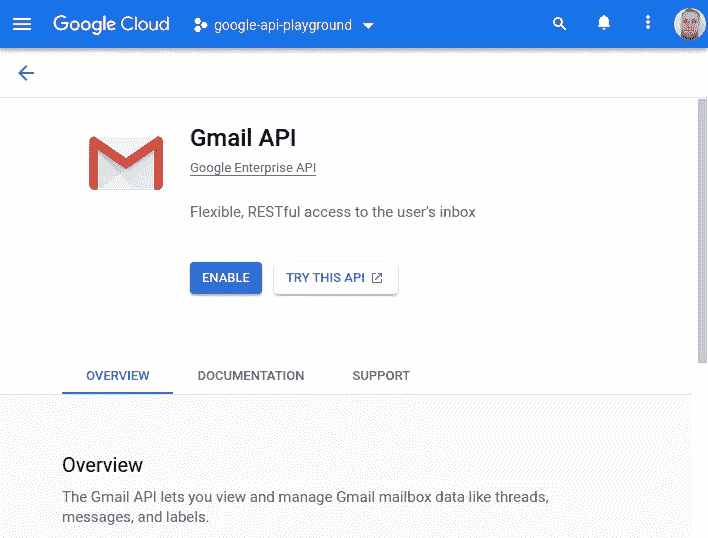
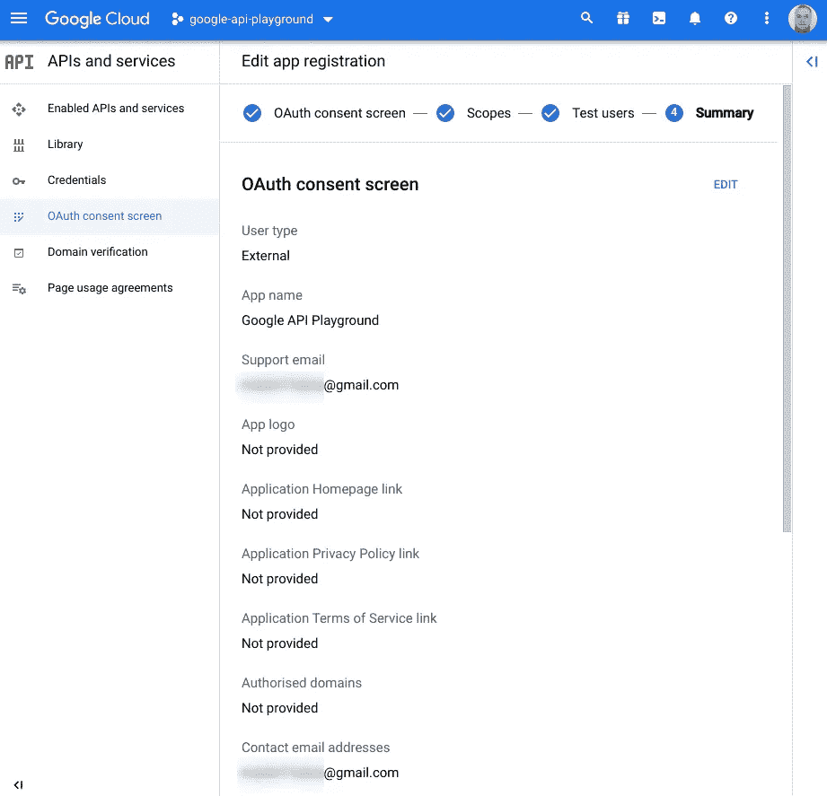
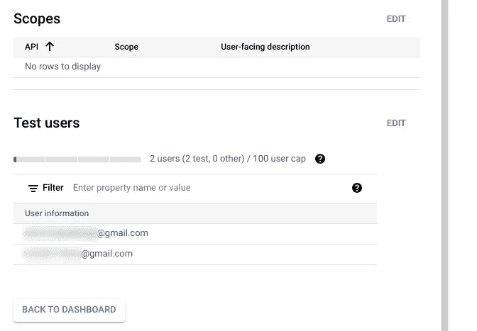
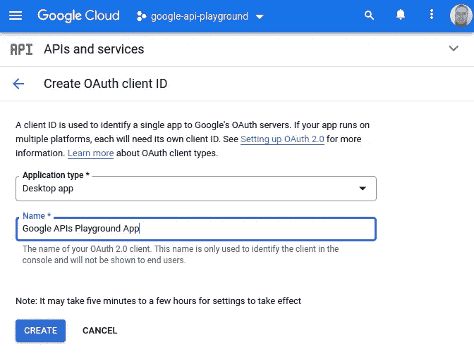
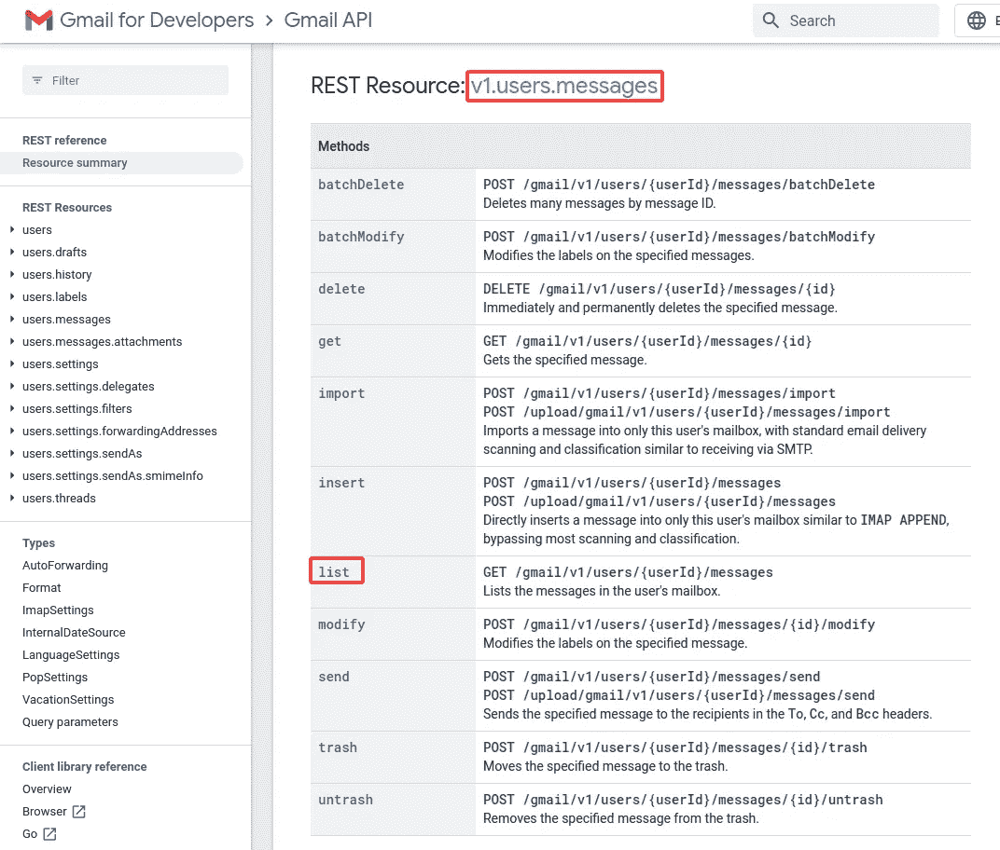

# Python 中的 Google APIs 入门

> 原文：<https://towardsdatascience.com/getting-started-with-google-apis-in-python-7f07b5d8b806>

## 使用 Python 和 Google API 自动完成 Gmail、Google Drive、Calendar 或任何其他 Google API 的速成课程

产生稳定的扩散

谷歌有数百个 API，包括 Gmail、Drive、地图、翻译、分析等等。所有这些共享相同的概念，如授权、分页或媒体上传/下载。在本文中，我们将探索所有这些概念，并尝试使用上述一些 API，了解您可以使用任何或所有 Google API 做的所有很酷的事情。

# 安装

为了能够访问 API，我们需要首先在 Google Cloud 中创建一个项目。为此，请前往[云资源管理器](https://console.cloud.google.com/cloud-resource-manager)并点击*创建项目*。或者，您也可以通过 CLI 使用`gcloud projects create $PROJECT_ID`来完成。几秒钟后，你会在列表中看到新项目。

接下来，我们需要为这个项目启用 API。你可以在 [API 库](https://console.cloud.google.com/apis/library)中找到所有可用的 API。我们将在接下来的部分中使用的功能包括 Gmail、Drive 和 Forms，但是您可以选择您想要启用的功能。

启用 Google API

API 现在可以使用了，但是我们需要凭证来访问它。根据应用程序的类型，有几种不同类型的凭据。它们中的大多数适合于需要/要求用户同意的应用，例如客户端(桌面)或 Android/iOS 应用。对我们来说，更好的凭证类型是*服务帐户*，因为它适合自动化——也就是说——无需用户交互即可访问。*服务帐户*凭证然而，不能与许多 API 一起工作——例如，照片 API 不支持它，并且所有 Google Workspace(g suite)API(例如，Gmail、Sheets、Docs…)仅在您拥有自己的带有[域范围访问委托](https://developers.google.com/identity/protocols/oauth2/service-account#delegatingauthority)的工作空间时才允许它。因此，我们唯一的选择是使用 OAuth 凭证。

要创建 OAuth 凭证，请转到[凭证页面](https://console.cloud.google.com/apis/credentials)，点击*创建凭证*并选择 *OAuth 客户端 ID* 。您将被要求配置 *OAuth 同意屏幕*，然后创建它——在第一个屏幕中，您将被要求选择用户类型，我们将选择*外部*。

在下一个屏幕中，您将在*开发者联系信息*下指定*应用名称*、*用户支持电子邮件*和电子邮件地址。之后您可以点击*保存并继续*，跳过*范围*部分。在*测试用户*部分，点击*添加用户*并添加您将用于测试的 Google 帐户的电子邮件地址(您可能需要为此创建额外的 Google 帐户)，点击*保存并再次继续*。总之，配置应该如下所示:

Google 同意屏幕摘要 1

Google 同意屏幕摘要 2

现在我们需要返回到[凭证页面](https://console.cloud.google.com/apis/credentials)点击*创建凭证*并选择 *OAuth 客户端 ID* 。接下来，我们将选择*应用程序类型*作为*桌面应用程序*，并为其命名:

Google API OAuth 应用程序

您将看到客户端 ID 和客户端密码——单击*下载 JSON* 按钮，以名称`credentials.json`保存它们——我们稍后会用到它们。

完成后，我们现在有了启用 API 的项目和 OAuth 申请/同意屏幕，这将允许我们授权访问我们选择的 API 和范围。

最后，我们需要安装 Python 客户端库来使用 API。我们需要两个，一个用于认证，一个用于实际的 Google APIs:

# 访问 API

现在我们准备开始编写一些 Python 代码。我们需要做的第一件事是进行身份验证并获得用户同意:

我们从定义访问 API 的访问范围开始。要找到你需要的，在特定的 API 文档页面中搜索*“范围”*，第一个结果应该会导致类似于 [Gmail](https://developers.google.com/gmail/api/auth/scopes) 或[照片](https://developers.google.com/photos/library/guides/authorization)的页面。选择您需要的所有范围，并将它们添加到`SCOPES`列表中。这里我们选择`gmail.readonly`进行测试。

接下来，我们检查`token.json`是否存在，它是一个存储用户访问和刷新令牌的文件。该文件是在授权流程首次完成时自动创建的。如果文件在那里，但是它存储的凭证无效，我们尝试刷新它们。如果文件不存在，我们让用户通过 OAuth 流登录。这将打开浏览器选项卡，要求您登录。在这里，您应该使用您在 OAuth 屏幕设置期间指定的测试用户。

在接受应用程序请求的作用域后，将创建`token.json`文件。当您再次运行此身份验证代码时，将使用该令牌(假设它没有过期)，因此您不必再次在浏览器中批准它。

如果您决定在某个时候改变作用域，一定要删除`token.json`，因为应用程序需要重新授权。

# 基础知识

Google API Python 客户端库包含了所有 Google API 的函数，这使得它变得非常复杂和难以导航。大部分也是生成的代码(包括文档)，这对用户体验没有帮助。现在让我们看看所有各种 Google APIs 的基本模式，它们可以帮助我们更好地理解客户端库，从而更有效地导航和使用它。

无论您选择使用哪种 API，它们都有一个共同点——创建 API 对象和发出请求的方式:

无论你想调用 Gmail API 还是任何其他 API，你总是会通过提供 API 名称、版本和先前创建的凭证，从`googleapiclient.discovery`使用`build`函数来*【构建】*服务*。然后，使用返回的`service`对象，您可以调用该 API 的任何函数。因为这是生成的代码，你不会得到自动完成，所以最好的方法是找到你的选项，是去文档页面。URL 有点难找到，不过一般来说，你可以浏览[https://Google apis . github . io/Google-API-python-client/docs/dyn/](https://googleapis.github.io/google-api-python-client/docs/dyn/)来找到你需要的 API 组和方法。例如，对于上面的`service.users().messages()`，你可以从[转到](https://googleapis.github.io/google-api-python-client/docs/dyn/gmail_v1.users.messages.html)。*

最后，不要忘记调用`.execute()`方法，否则得不到任何真正的响应。说到这里，响应将只是 Python dictionary 形式的 JSON，您必须遍历它以获得您想要的数据——要了解您可以预期的字段，请查看上面生成的文档，其中包括示例响应对象。

当您需要弄清楚单个方法的各个参数时，基于上述 API 文档构建方法链会很好地工作，但是当您试图导航或学习一般的 API 选项时，可能不太方便。为此，你最好搜索 REST API 参考，比如 Gmail[的参考。浏览一下，您会很快注意到它遵循了与 Python 方法链(`.users().messages().list`)相同的结构:](https://developers.google.com/gmail/api/reference/rest)

Gmail API 参考

# 踢轮胎

既然我们知道了如何导航 API 并调用它的端点，那么让我们试试它的轮胎，看看各种各样的 Google APIs 能为我们做些什么。

我们已经介绍了 Gmail API，所以在这里，我们可以看看它的更多方法:

上面的片段显示了我们如何从登录的帐户发送电子邮件。这是通过创建一个消息对象来实现的，该对象随后被 base64 编码，并使用`body`参数传递给`.send(...)`。还要注意，我们使用了`"me"`作为`userId`的值——这是一个特殊的值，用于标识当前登录的用户。

假设您有一堆带有附件的电子邮件，您希望提取这些附件以进行备份或进一步处理。您可以使用 Gmail API 抓取这些附件:

这里我们假设您已经有了一些消息及其 ID。我们使用这个`message_info`来查询消息对象的 API。然后，我们遍历消息有效负载的各个部分，寻找引用附件的部分——也就是具有非空`filename`属性的部分。然后，我们使用在消息部分找到的 ID 向 API 请求每个附件。返回的附件数据是 base64 编码的，这里我们假设它是明文数据，但也可能是 PDF、图像等。

Gmail API 是最广泛的 API 之一，人们可以用它做更多的事情，所以请确保查看它的 [API 参考](https://developers.google.com/gmail/api/reference/rest)。

从 Gmail 继续，另一个受欢迎的谷歌服务是 *Drive* ，让我们看看如何从它上面搜索和下载文件:

我们使用`.files().list()`方法来搜索文件。为了便于搜索，我们在`q`参数中指定了一个查询，其格式为`query_term operator values`——在本例中——`mimeType`为`query_term` , `=`为`operator`,`'image/png'`为`values`。这个查询确保我们只接收 MIME 类型为`image/png`的文件。您可以构建许多查询，在[文档](https://developers.google.com/drive/api/guides/ref-search-terms)中有一个完整的列表。在我们的搜索中，我们还指定了`fields`参数，它告诉 API 只返回文件的 ID 和名称，而不是完整的有效负载。

从 API 获得文件列表后，我们使用`.files().get_media`获得文件元数据，然后使用该信息创建`downloader`对象，用它下载实际文件。最后，我们将下载的数据写入一个文件。

除了管理文件，使用其他 API 时也需要 Google Drive API。例如，如果您想访问您的 *Google 表单*，您需要使用 Drive API 来搜索它们:

为了搜索表单，我们使用与搜索图像时相同的`.files().list`方法，唯一的不同是我们改变了`q`参数来搜索 Google 表单。

然后，我们可以使用返回的信息来处理我们的表单，例如获取所有表单响应。注意，在这个例子中，我们将`static_discovery`指定为`False`，这是因为目前静态发现文档不是 Python 客户端库的一部分，因此我们需要从互联网上获取它，否则我们会得到`UnknownApiNameOrVersion`异常。

上面的例子还演示了在初始调用`list`后使用`list_next`进行分页。这很方便，因为我们不必处理存储在响应对象中的“下一页令牌”,相反，我们只需将请求和响应对象传递给`list_next`方法，让库来处理剩下的部分。

另一个你可能想要检查的 API 是*照片 API* ，然而这个需要更多的努力来使它工作:

与 Forms API 一样，对于 Photos API，我们也需要将`static_discovery`指定为`False`。然而，这个问题更多——如果你试图在前面提到的[生成的 API 参考](https://googleapis.github.io/google-api-python-client/docs/dyn/)中寻找它，它根本不存在。这是因为它还没有像这个 [GitHub 问题](https://github.com/googleapis/google-api-python-client/issues/1594)中提到的那样发布，所以在此期间，如果我们想看看有哪些方法可供我们使用，我们需要通过如上所示的私有属性做一点挖掘。

虽然不太方便，但该 API 仍可用于——例如——将图像上传到相册:

我们首先创建一个样本相册，我们将在其中上传我们的图像—这是必要的，因为您只允许将图像上传到您的应用程序创建的相册。之后，我们将上传图像，这是一个两步过程—首先我们必须上传图像字节，然后我们将上传的数据与图像相关联。

第一步，我们必须使用 raw REST API，将图像数据发布到 Photos API `uploads`端点。之后，我们使用相册 ID、图像名称和从原始数据上传返回的上传令牌构建一个请求体，然后使用`batchCreate`方法将其发送给 API。在这个例子中，我们只上传了一个图像，但是您可以使用一个`batchCreate`调用上传多个图像，同时将多个项目传递给请求体中的`newMediaItems`条目。

回到 Google Workspace APIs，让我们看看日历 API。假设我们希望在日历中创建新活动时收到通知:

从 Calendar API 的角度来看，我们需要做的就是建立一个事件将要到来的通道。我们通过使用包含 ID、地址和通道到期(生存时间)的主体调用`.events().watch()`来实现这一点。这里的地址必须是互联网上的一个 HTTPS 网站(不是`localhost`)。在开发过程中，最简单的设置方法是使用像 [ngrok](https://ngrok.com/) 这样的服务，它会将请求转发给你的`localhost`。

在设置了转发(使用 ngrok 或任何其他工具)之后，您应该开始看到 HTTP POST 请求进来，您可以在其中开始处理。示例请求可能如下所示:

我们要看的最后一个 API 是*事实检查工具 API* ，我们可以用它来验证/反驳几乎任何事情:

这个和以前的没什么不同。以前，我们只使用 OAuth 进行身份验证，但是事实检查工具 API 是一个公共 API，不需要访问/授权用户数据，因此可以使用基本的 API 密钥身份验证。要获得谷歌云 API 密匙，请点击这里的[指南](https://github.com/googleapis/google-api-python-client/blob/main/docs/api-keys.md)。

我们在上面的例子中还演示了一个新的东西，那就是使用批处理请求——而不是直接单独调用`.claims().search()`,这里我们使用`new_batch_http_request`创建一个批处理，并将所有我们想要的搜索请求添加到其中。在将请求添加到批处理中时，我们还提供了一个`callback`函数，在特定的请求被执行后会调用这个函数。在这种情况下，回调函数- `print_claim_review` -通过打印我们搜索的原始索赔及其文本评级来处理响应。

如果您像上面的代码片段那样只发出几个请求，这种批处理可能没有意义，但是如果您必须发出数千个 API 调用，则可能通过最小化 HTTP 请求开销来提高性能。

# 结论

在本文中，我试图捕捉大多数常见的工作流和概念，比如批处理、分页、搜索或认证，这些都是您在使用 Google APIs 时可能会遇到的。然而，这并不是使用它们可以完成的所有事情的详尽指南，所以一定要查看其他资源，例如 [Python API 客户端示例](https://github.com/googleapis/google-api-python-client/tree/main/samples)或 Google Workspace [示例和片段](https://github.com/googleworkspace/python-samples)。此外，对于任何严肃的应用程序，你肯定也应该研究测试，API 客户端文档包括关于模拟的章节。

最后，还有很多本文没有涉及的 API。一些值得探索的是[翻译 API](https://cloud.google.com/translate/docs/reference/rest/) 、[语音转文本](https://cloud.google.com/speech-to-text/docs/reference/rest)或[路由 API(地图)](https://developers.google.com/maps/documentation/routes/reference/rest)，它们都包含一个免费层。

*本文原帖*[*martinheinz . dev*](https://martinheinz.dev/blog/84)

[成为会员](https://medium.com/@martin.heinz/membership)阅读媒体上的每一个故事。**你的会员费直接支持我和你看的其他作家。你还可以在媒体上看到所有的故事。**

 [## 通过我的推荐链接加入媒体-马丁·海因茨

### 阅读马丁·海因茨(以及媒体上成千上万的其他作家)的每一个故事。您的会员费直接支持…

medium.com](https://medium.com/@martin.heinz/membership) 

你可能也喜欢…

 [## 用 Python 探索 Google Analytics 实时数据

### 使用 REST API 和 Python 充分利用所有 Google Analytics 特性和数据

towardsdatascience.com](/exploring-google-analytics-realtime-data-with-python-8625849c7d7a)  [## Python f-strings 比您想象的更强大

### 了解 Python 的 f 字符串的未知特性——格式化的字符串文字——以及您的文本格式化…

towardsdatascience.com](/python-f-strings-are-more-powerful-than-you-might-think-8271d3efbd7d)