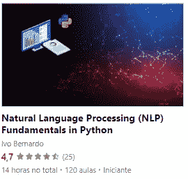

# Python 中的 NLTK 入门

> 原文：<https://towardsdatascience.com/getting-started-with-nltk-eb4ed6eb7a37>

## 探索一些我们可以用来开发基本 NLP 管道的最常见的函数和技术。


照片由[亚伦·伯顿](https://unsplash.com/@aaronburden) @unsplash.com 拍摄

N LTK ( *自然语言工具包*)是自然语言处理技术在 Python 中的首批实现之一。尽管它可能看起来有点过时，并且面临来自其他库的竞争(例如， [*spaCy*](https://spacy.io/) )，但我仍然认为 *NLTK* 是对 Python 中文本方法的一个非常温和的介绍。

起初，使用 *NLTK* 可能看起来有点奇怪，因为它有很多方法，特别是对于 Python 初学者来说。但实际上，它是从简单的 NLP 任务开始更方便的库之一，因为它有简单的单行方法，人们可以调用这些方法来执行一些很酷的文本转换。

当然，你不应该指望使用 *NLTK 来训练最先进的模型。*然而*，*这个库给了你很多工具，用于小的宠物项目和开发小规模的 NLP 项目。此外，它也是第一次接触 NLP 技术的最好的库之一。

这篇文章会给你一些简短的解释和例子，你可以马上用在 NLTK 中。我们将做一些 *NLTK* 函数的代码示例，并讨论一些我们可以使用的替代方法。

为了使这段代码易于复制，我们将使用来自 [Python 的维基百科页面](https://en.wikipedia.org/wiki/Python_(programming_language))的前几段:

```
python_wiki = '''
Python is a high-level, interpreted, general-purpose programming language. Its design philosophy emphasizes code readability with the use of significant indentation.
Python is dynamically-typed and garbage-collected. It supports multiple programming paradigms, including structured (particularly procedural), object-oriented and functional programming. It is often described as a “batteries included” language due to its comprehensive standard library.
Guido van Rossum began working on Python in the late 1980s as a successor to the ABC programming language and first released it in 1991 as Python 0.9.0.[33] Python 2.0 was released in 2000 and introduced new features such as list comprehensions, cycle-detecting garbage collection, reference counting, and Unicode support. Python 3.0, released in 2008, was a major revision that is not completely backward-compatible with earlier versions. Python 2 was discontinued with version 2.7.18 in 2020.
Python consistently ranks as one of the most popular programming languages.
'''
```

# 单词分词器

自然，如果没有某种类型的转换，计算机无法真正理解大量的文本。在处理 NLP 管道时，标记化是第一个想到的转换。

“*令牌*”是 NLP 行业中一个非常常见的表达。令牌是某个特定文本的子集或整个文本的分解。例如，孤立的单词！

由于有多种方法可以将单词从文本中分离出来，`nltk`有一些关于记号赋予器的很酷的不同实现，即:

*   *空白符号化器*
*   [*tree bank*](https://en.wikipedia.org/wiki/Treebank)*分词器*

*记号赋予者把我们的句子分割成记号。然后，这些标记可以被送入多种单词表示算法，如 *tf-idf* ，二进制或计数矢量器。让我们从最简单的开始， *whitespace* tokenizer，它根据单词之间的空格分割文本:*

```
*from nltk import tokenizews_tok = tokenize.WhitespaceTokenizer()
token_list = ws_tok.tokenize(python_wiki)
print(token_list[0:10])*
```

*分解上面的代码:*

*   *`from nltk import tokenize` —我们从导入通用的`tokenize`模块开始，该模块包含标记化器的不同实现。*
*   *我们在`ws_tok`中定义了一个`WhitespaceTokenizer`的实例。*
*   *我们使用`ws_tok`实例来标记我们的`python_wiki`文本。*

*`print`语句产生以下结果:*

```
*['Python', 'is', 'a', 'high-level,', 'interpreted,', 'general-purpose', 'programming', 'language.', 'Its', 'design']*
```

*`WhitespaceTokenizer`的一个主要问题是，它最终通过每个空格分割文本，形成一些由单词和标点组成的记号。*

*例如，“`interpreted,`”被认为是一个单独的标记，注意这个单词上的逗号。如果你有另一个没有逗号的`interpreted`，这个单词会被认为是一个完全不同的单词。这是一个重大的挫折，因为如果单词在逗号、句号或其他标点符号旁边，它们的意思不会真正改变。*

*幸运的是，我们有其他可用的记号赋予器，比如 [TreeBank](https://www.nltk.org/_modules/nltk/tokenize/treebank.html) 记号赋予器。这个记号赋予器的一些特性是(摘自官方文档):*

> *该记号赋予器执行以下步骤:*
> 
> *-拆分标准缩写，例如:“不要”、“不要”和“他们会”、“他们会”*
> 
> *-将大多数标点符号视为单独的符号-当逗号和单引号后跟空格时，将其分开*
> 
> *-在行尾出现单独的句点*

*让我们用我们的`python_wiki`文本做同样的测试:*

```
*tb_tokenizer = tokenize.treebank.TreebankWordTokenizer()
token_list = tb_tokenizer.tokenize(python_wiki)
print(token_list[0:10])*
```

*让我们检查一下印刷品:*

```
*['Python', 'is', 'a', 'high-level', ',', 'interpreted', ',', 'general-purpose', 'programming', 'language.']*
```

*酷！一些问题已经解决。注意`language.`还是一个单词和标点结合的令牌。幸运的是，这个问题用默认的混合了`TreebankWordTokenizer`和`PunkSentenceTokenizer`的`word_tokenize`函数解决了(我们没有测试的一个记号赋予器)。*

```
*from nltk import word_tokenize
token_list = word_tokenize(python_wiki)
print(token_list[0:10])*
```

*让我们看看我们的前十个令牌:*

```
*['Python', 'is', 'a', 'high-level', ',', 'interpreted', ',', 'general-purpose', 'programming', 'language']*
```

*酷！NLTK 的默认`word_tokenize`似乎很好地隔离了句子中的标记，因为它没有在单个标记中附加任何标点符号。*

*总的来说，这些记号化器是将我们的文本分割成记号的好方法，然后将它们输入到其他应用程序中，如简单的情感分析或单词向量。我们的实验有助于你理解不存在单一的“记号赋予者”。虽然有人可能会说`word_tokenize`产生了最好的结果，但是在`nltk`中可以尝试其他的选择和实现。*

# *堵塞物*

*减少文本的变化可能是您在处理文本数据时首先要做的实验之一。*

*文本数据本质上是高维的——英语中有成千上万的单词，其维数与其他语言相似。*

*词干可能是减小文本大小的一个好选择——词干的作用是从单词中去掉一些后缀。词干是一种有点“蛮力”的技术，在从文本中剪切字符时被认为是相当激进的。像`tokenizers`一样，词干分析器有不同的风格——让我们看看 NLTK 中的一些实现，从`PorterStemmer`开始:*

```
*from nltk.stem import PorterStemmer
porter = PorterStemmer()
porter_tokens = [porter.stem(token) for token in token_list]*
```

*分解我们代码的每个指令:*

*   *我们从从`nltk.stem`模块导入`PorterStemmer`开始。*
*   *我们在`porter`变量中定义了一个`PorterStemmer`的实例。*
*   *我们使用列表理解并在`porter.stem`函数中传递每个`token`来阻止每个标记。*

*让我们打印我们的第一个 10 个词干标记:*

```
*['python', 'is', 'a', 'high-level', ',', 'interpret', ',', 'general-purpos', 'program', 'languag']*
```

*在某些情况下，我们的词干与我们的原始单词不同——例如，原始单词`interpreted`变成了`interpret`。词干意味着首字母相同的单词将被认为是相同的，例如:*

*   *`interpretation`变为`interpret`*
*   *`interpreted`变为`interpret`*
*   *`interpret`停留`interpret`*

*根据定义，有些单词没有词干。当我们通过词干算法时,`python`保持`python`。*

*更具侵略性的斯特梅尔是 T20——我们也可以用它来表达*

```
*from nltk.stem import LancasterStemmer
lanc = LancasterStemmer()
lanc_tokens = [lanc.stem(token) for token in token_list]*
```

*检查我们的`lanc_tokens`:*

```
*['python', 'is', 'a', 'high-level', ',', 'interpret', ',', 'general-purpose', 'program', 'langu']*
```

*一般来说，`LancasterStemmer`会比`PorterStemmer`从文本中删除更多的字符，但这并不意味着，在某些情况下，与`Lancaster`相比，`Porter`可以进一步阻止单词。从上面的例子来看:*

*   *`language`在`Lancaster`中变成`langu`，在`Porter`中变成`languag`。*
*   *反过来，`general-purpose`在`Porter`中有词干，但在`Lancaster`中没有。*

*如果你检查全文，你会发现`Lancaster`减少了更多的文本，进一步规范化。*

*文本规范化是一项很酷的技术，可以减少输入的差异，并规范化可能(或可能不)表达相同意思的相似单词。然而，要注意的是，每次你应用`Stemmer`，你都在减少来自*语料库*的信息。*

*目前，人们正在讨论`Stemmers`或`Lemmatizers`(接下来将详细介绍)是否应该成为大多数数据管道的一部分，尤其是在新的神经网络技术应用于文本的情况下。有人可能会说，它们将来可能会过时，但是，在下列情况下，它们仍然有效:*

*   *你缺乏训练大量参数的计算能力；*
*   *由于可解释性或其他潜在原因，您需要应用更简单的模型。*

*如果你想了解更多关于`Stemmers`的事情，你可以在这里查看我关于此事的博文[！](/stemming-corpus-with-nltk-7a6a6d02d3e5)*

# *词汇化*

*与词干化类似，词汇化是另一种标准化技术，目的是减少文本的变化。*

*主要区别在于，它不是将单词切割成后缀，而是试图找到单词的词根，通常称为 *lemma。**

*NLTK 还包含一个现成的 WordNet Lemmatizer 实现，这是一个非常著名的词汇数据库，包含关于单词关系的数据。让我们检查一下`WordNetLemmatizer`模块:*

```
*['Python', 'is', 'a', 'high-level', ',', 'interpreted', ',', 'general-purpose', 'programming', 'language']*
```

*那很有趣..看来我们的令牌和我们的句子完全一样！解释很简单——我们需要给`lemmatizer`输入我们想要减少的单词的词性标签。让我们从我们的代币中选择单词`programming`:*

*   *`lemmatizer.lemmatize('programming')`产量`programming`*
*   *`lemmatizer.lemmatize('programming', pos = 'v')`产量`program`*

*当我们给出论点`pos`时，引理者能够理解单词 programming 是一个与词根“program”相关的动词*。*NLTK*wordnet*lemmatizer*接收 5 个`pos`标签:**

*   *名词的“n”——这是默认值。实际上，如果我们只是调用我们的`lemmatizer.lemmatize`而没有`pos`参数，我们将把所有的单词都看作名词；*
*   *动词用“v ”;*
*   *形容词用“a ”;*
*   *r 代表副词；*
*   *s 代表卫星形容词——不常使用；*

*当然，手动输入这些`pos`标签是非常低效的。幸运的是，`nltk`有一个超级酷的实现来自动检索 POS 标签！*

# *词性标注*

*正如我们在词汇化一节中看到的，词性标注包括根据单词在句子中的功能对其进行分类。*

*一个特定的词在一个句子中有一定的功能(通常称为*词性*)——例如，句子“`I like learning Python`”包含 4 个词和下面的*词性*:*

*   *代词`I`*
*   *动词`like`和`learning`*
*   *名词`Python`*

*棘手的是，某些单词在句法上可能是相同的，但在不同的句子中有不同的“功能”:*

*   *我正在洗*水槽*。*
*   *我要把*沉入水中**

*单词`sink`的写法完全相同，但有不同的词性标签。在第一句中，`sink`是名词。第二个，是一个`verb`。*

*在`NLTK`中，我们有现成的 POS tagger 可供使用，幸运的是，它避免了这些问题:*

```
*import nltk
pos_tags = nltk.pos_tag(token_list)
print(pos_tags[0:10])*
```

*第 10 期`pos_tags`:*

```
*[('Python', 'NNP'), ('is', 'VBZ'), ('a', 'DT'), ('high-level', 'JJ'), (',', ','), ('interpreted', 'JJ'), (',', ','), ('general-purpose', 'JJ'), ('programming', 'NN'), ('language', 'NN')]*
```

*与上面的一些例子相反，`nltk.pos_tag`返回一个元组列表。每个元组包含单词及其对应的`pos_tag`。让我们看几个例子:*

*   *`Python`被归类为`NNP`——专有单数名词；*
*   *`is`是一个`VBZ`——现在时态的动词。*

*从预告中，我们看到很多标签！我们必须记住他们吗？当然不是！我们有两种方法来理解每个标签的含义:*

*   *查找 [Penn Treebank POS 表](https://www.ling.upenn.edu/courses/Fall_2003/ling001/penn_treebank_pos.html)。*
*   *使用您想要检查的标签运行`nltk.help.upenn_tagset()`。例如，`nltk.help.upenn_tagset('NN')`返回标签`NN`的完整 wiki。*

*让我们从第一句话开始，看看这位经过预先训练的 pos 标记员是否能够处理我们的“下沉”问题:*

```
*print(nltk.pos_tag(['I','am','washing','the','sink']))*
```

*这会产生:*

```
*[('I', 'PRP'), ('am', 'VBP'), ('washing', 'VBG'), ('the', 'DT'), ('sink', 'NN')]*
```

*爽，这里沉的是一只`NN`！让我们看看另一句话:*

```
*print(nltk.pos_tag([‘I’,’am’,’going’,’to’,’sink’,’in’,’the’,’water’]))*
```

*这会产生:*

```
*[('I', 'PRP'), ('am', 'VBP'), ('going', 'VBG'), ('to', 'TO'), ('sink', 'VB'), ('in', 'IN'), ('the', 'DT'), ('water', 'NN')]*
```

*厉害！`sink`是`vb` —一个动词！*

*这是因为这个预先训练的词性标注器考虑了单词的上下文。由于`sink`紧挨着`to`，标记者立即意识到它应该标记为动词，因为没有其他场景中这些单词一起出现，而`sink`是名词。*

*你也可以在我在 Udemy 上的 [NLP 基础课程中了解更多关于训练你自己的 pos 标签员的信息。](https://www.udemy.com/course/nlp_natural_language_processing_python_beginners/?referralCode=MEDIUMREADERS)*

*…*

*但是，等等..这些标签与我们必须输入到词汇化过程中的标签不匹配！这是怎么回事？*

*幸运的是，我们可以用下面的函数很容易地转换它们:*

```
*def get_lemma_tag(pos_tag):
    if pos_tag.startswith('J'):
        return 'a'
    elif pos_tag.startswith('V'):
        return 'v'
    elif pos_tag.startswith('N'):
        return 'n'
    elif pos_tag.startswith('R'):
        return 'r'
    else:
        return ''*
```

*您只需检查`pos_tag`函数的起始字母是什么，并将其转换为输入到 lemmatizer 的单字母版本——让我们测试一下:*

```
*lemmatizer.lemmatize(‘programming’, pos = get_lemma_tag(‘VBZ’))*
```

*这输出`program`。成功了！*

*为了简单起见，我们在函数中忽略了“附属形容词”——它们不常使用，需要更复杂的规则。*

*POS 标签是 NLP 中一个非常重要的概念。你可能最终会使用你自己训练过的标签或者更高级的标签，比如 spacy 的实现。尽管如此， *NLTK 的*版本仍然被广泛使用，并且可以实现很好的性能，足以完成一些 NLP 任务。*

# *N-Grams*

*到目前为止，我们只把我们的*记号*看作孤立的单词。在许多 NLP 应用程序中，将单词耦合在一起作为单个“令牌”来考虑是很重要的。*

*例如，否定是解释的基本要素。Bi-grams 是“两个连续单词”的自然语言处理方式。让我们来考虑这个句子:*

*   *我不喜欢剧院。*

*在典型的*单字符*方式中，我们的令牌是:*

*   *我没有去剧院*

*在这种情况下，将“**不像**”视为一个单独的标记是有意义的。想象一个情感分析应用程序，它将检查相关的标记来理解我们文本的整体“情感”。在这种情况下，它显然是一个否定的句子，因为“代理人”不喜欢剧院。*

*对于这个用例，了解我们的文本包含多少“不喜欢”的表达是有用的。如果我们只考虑一个孤立的单词“like”，我们的算法将很难拾取这种“负面情绪”，因为单词“*而不是*”也将是孤立的。此外，一个孤立的“ *not* ”本身并不一定代表一种负面情绪——例如在句子“*我不认为这个剧院不好。**

*在更高级的模型中，如神经网络，算法能够自己挑选这些*二元模型*、*三元模型*(三个令牌)——这实际上是它们的优势之一。但是，对于更简单的模型(朴素贝叶斯、回归、基于树的模型),必须显式地给出 *n-grams* 作为特征。*

**NLTK* 有一个我们可以获取的*二元模型*和*三元模型*的快速实现:*

```
*print(list(nltk.bigrams(token_list)))*
```

*超级容易！我们只是把我们原来的`token_list`喂给`nltk.bigrams`然后…*

```
*[('Python', 'is'),
 ('is', 'a'),
 ('a', 'high-level'),
 ('high-level', ','),
 (',', 'interpreted'),
 ('interpreted', ','),
 (',', 'general-purpose'),
 ('general-purpose', 'programming'),
 ('programming', 'language'),
 ('language', '.'),
 ('.', 'Its'),*
```

*这是我们课文的前 10 个双字母组合的预览。我们现在有了一个元组列表，每个元组包含来自`python_wiki`文本的两个单词。*

*如果我们想要三个词呢？使用`nltk`很简单:*

```
*list(nltk.trigrams(token_list))*
```

*我们有一个功能叫做`trigrams`！让我们看看前 10 个:*

```
*[('Python', 'is', 'a'),
 ('is', 'a', 'high-level'),
 ('a', 'high-level', ','),
 ('high-level', ',', 'interpreted'),
 (',', 'interpreted', ','),
 ('interpreted', ',', 'general-purpose'),
 (',', 'general-purpose', 'programming'),
 ('general-purpose', 'programming', 'language'),
 ('programming', 'language', '.'),
 ('language', '.', 'Its'),*
```

*酷！现在我们有了一个元组列表，其中每个元组包含文本中三个连续单词的每一对。我们能有更多的三字母组合吗？没错。使用带额外参数的通用`ngrams`函数:*

```
*list(nltk.ngrams(token_list, 4))*
```

*这产生了*四个字母:**

```
*[('Python', 'is', 'a', 'high-level'),
 ('is', 'a', 'high-level', ','),
 ('a', 'high-level', ',', 'interpreted'),
 ('high-level', ',', 'interpreted', ','),
 (',', 'interpreted', ',', 'general-purpose'),
 ('interpreted', ',', 'general-purpose', 'programming'),
 (',', 'general-purpose', 'programming', 'language'),
 ('general-purpose', 'programming', 'language', '.'),
 ('programming', 'language', '.', 'Its'),
 ('language', '.', 'Its', 'design'),*
```

*对于你的 *NLP* 管道来说，N-grams 是一个非常重要的概念，尤其是当你处理可能需要一些聪明的特征工程的更简单的模型的时候。*

*我们完事了。如果你想开始使用自然语言处理管道，NLTK 是一个非常酷的库。虽然你不应该期望使用 *NLTK 来构建*最先进的*模型，但是*熟悉这个库将是向你介绍很酷的 *NLP* 概念*的一个极好的方式。**

****我在***[***Udemy***](https://www.udemy.com/course/nlp_natural_language_processing_python_beginners/?referralCode=MEDIUMREADERS)***上开设了一门学习自然语言处理基础知识的课程，在这里我向学生们介绍 nltk、词向量和神经网络！这门课程是为初学者量身定做的，我希望你能在我身边。****

**

*[Python 中的自然语言处理基础](https://www.udemy.com/course/nlp_natural_language_processing_python_beginners/?referralCode=MEDIUMREADERS) —图片作者*

*<https://ivopbernardo.medium.com/membership>  

这篇文章的代码有一个小要点:*