# 规范化流程入门:线性代数与概率

> 原文：<https://towardsdatascience.com/getting-started-with-normalizing-flows-linear-algebra-probability-f2b863ff427d>

## 变易法则、双射与微分同胚


平静的流动(鸣谢:作者)

生成模型的基础是理解数据样本的来源分布。在我以前的一篇文章中，通过完成期望最大化算法的步骤，展示了一个生成模型的例子，其中我们假设潜在变量产生了期望的数据。我们还知道其他一些基于神经网络的方法，如变分自动编码器(VAE)和生成对抗网络(GAN ),它们显示了(它们的变体)引人注目的应用，但是它们缺少一个关键特征；它们不允许对新点的概率密度进行精确评估。通过标准化流量，可以通过易处理的分布进行采样和密度估计。

为了理解标准化流的基本原理，我们在这里讨论必要的本科水平的概率和线性代数，这将有助于逐步掌握将简单分布转换为复杂分布的概念。你能从这篇文章中学到什么？

1.  什么是双射和微分同胚？
2.  线性代数和雅可比矩阵基础。
3.  转换概率分布和雅可比矩阵。
4.  规范化流程在前面的概念中处于什么位置？
5.  通过使用张量流概率库检查我们的理解。

## 1.双射与微分同胚；

一个函数 *f* : *A* → *B* 如果这 2 个集合( *A* ， *B* )的元素有完美的一一对应，那么这个函数就是双射的。双射函数最重要的性质是存在一个*反函数，它可以撤销函数*的作用。

例:由公式*f*(*x*)=*x*+7 定义的从集合{1，2，3，4}到集合{8，9，10，11}的函数是一个双射。

***微分同胚:*** 把 *x* 看作一个 *D* 维向量，我们想定义一个 *x* 上的联合分布。基于流建模的主要思想是将 *x* 表示为从 *p_u* ( *u* )采样的实向量 *u* 的变换 *ϕ* :

*x*=*ϕ*(*u*)其中，*u*∽*p _ u*(*u*)……(*eq*:1)

这里 *p_u(u)* 称为流量模型的基分布。基于流的模型的定义属性是变换 *ϕ* 必须可逆，并且 *ϕ* 和 Inv( *ϕ)* *必须可微*。这些变换被称为*微分同胚*，并且要求 *u* 也必须是 *D* 维的[1]。

## 2.变量和雅可比矩阵的变化:

在这里，我们得到了大学线性代数课的帮助。

考虑一个线性变换 *T* : R →R(在数学中，维数为 *n* 的实坐标空间，表示为 Rⁿ).这样的线性变换可以用一个 2×2 矩阵 *A* 来描述。将有序对作为列向量，我们可以写出:

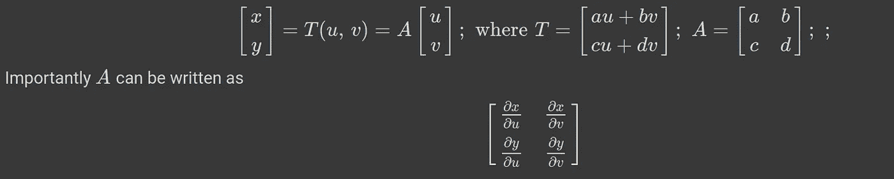

情商。2.1:线性变换和雅可比矩阵

矩阵 *A* 将单位正方形(两边为标准单位向量 *i* 和 *j* 的正方形)发送到两边为 A 的*列*的平行四边形，即 *a c* 、 *b d* 。偏导数矩阵 *A* (如果 T 是线性变换，它将是常数矩阵)有一个行列式；这叫做 *T* 的**雅可比**。这个平行四边形的面积是|*det*(*A*)|*A*的行列式的绝对值。

一般来说，如果 *D* 是 R 中的任意区域，*D _*1 =*T*(*D*)是它在这种线性变换下的像，那么:Area(*D _*1)= |*det*(*A*)| Area(*D*)。我们举一个在 R 空间从笛卡尔坐标转换到极坐标的例子，就可以很容易地验证这一点。我们知道变换规则由*x*=*r*cos*θ*，*y*=*r*sin*θ*给出，那么变换的雅可比矩阵为:


情商。2.2:用于从笛卡尔坐标系转换到极坐标系统的雅可比矩阵

利用上面雅可比矩阵的定义我们可以得到面积元素为: *dA* ( *x* ，*y*)= |*det**J*|*dA*(*r*， *θ* ) = *r dr dθ。*最后，变量公式的变换在多元微积分中非常有用，我们可以总结如下:

设 *T* 是从 *D_* 1 到 *D* 的一个 *C* 微分同胚(若 t 是 *r* 次连续可微， *T* 称为一个 *C* ʳ微分同胚)。对于 *D:* 中的任何连续功能 *f*

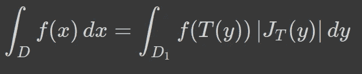

情商。2.3:使用雅可比的变换规则

这个表达式可以推广到 n 维。

## 3.1.变量的概率和变化:

我们将上述概念从单/多变量函数扩展到概率分布。考虑一个简单的变换，一个均匀分布在单位立方体上的随机变量 *U* ，*U*∈【0，1】。我们可以将 *U* 缩放一个因子 *n* 得到一个新的随机变量 *X* (如下图 1 所示)。

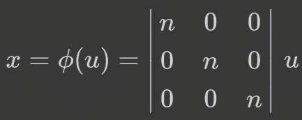

情商。3.1.1:用因子 n 缩放随机变量

由于总概率是守恒的，我们可以写成:

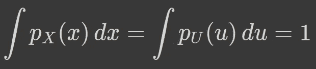

情商。3.1.2:概率总和为 1

由于我们从单位体积的立方体上的随机变量( *V_u* )开始，缩放随机变量也将缩放概率密度，如下所示:

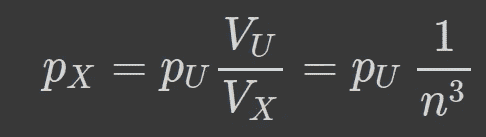

情商。3.1.3:当 n>1 时，概率密度缩小

前面关于从 *u* → *x* 的变换的讨论(图 1)告诉我们，由于映射函数(可逆)*【ϕ】*，从*p*(*u*)→*p*(*x*)的变换，有多少 *du* 被收缩/拉伸到 *dx*

为什么这很重要？因为这是流量正常化的起点。我们就是这样从情商开始的。1 在微分同胚一节之前。我们考虑从概率分布 *p_u* 采样的实向量 *u* 和改变 *u→x* 的变换函数 *ϕ* 。对于基于流动的模型， *ϕ* 是一个微分同胚。

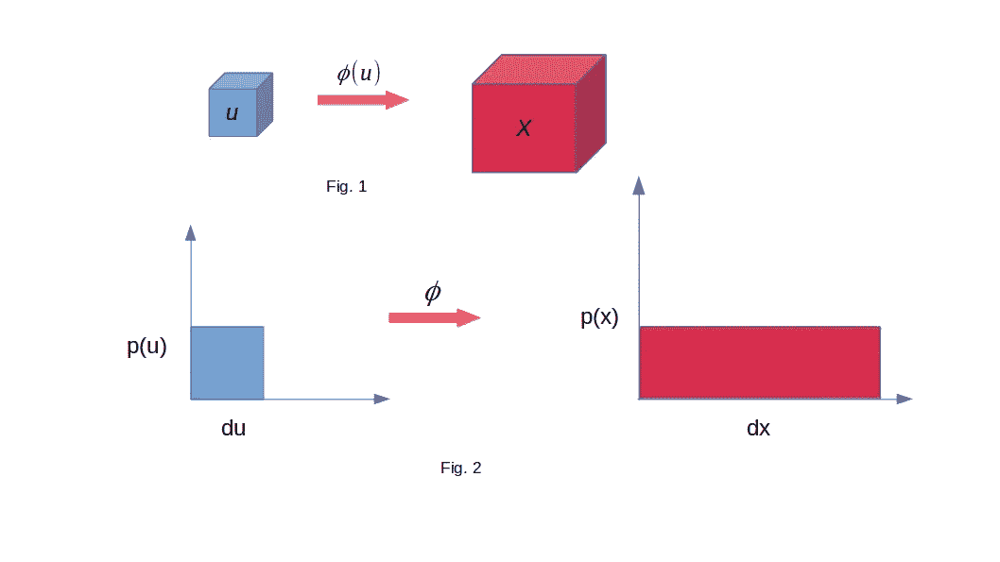

图 1:使用微分同胚变换概率分布:由于总概率总是 1，我们在变换后得到一个收缩/拉伸的空间。(鸣谢:作者幻灯片)

## 3.2.转换概率分布:

为了推导一些转换概率分布的简单公式，我们从方程开始。3.1.2.上一节中又考虑了一个单一的区域，所以我们可以去掉积分:


情商。3.2.1:概率守恒导致第一对数概率公式。

我们记得我们通过映射函数 *ϕ* 从 *u* 到 *x* 的转换为*x*=*ϕ*(*u*)；*u*= inv {*ϕ}*(*x*)。从前面关于变换的讨论(在线性代数部分)中，我们知道由线性/非线性变换引起的拉伸/收缩可以通过雅可比矩阵的行列式来量化。非常类似地，这里的变换规则也变成了:

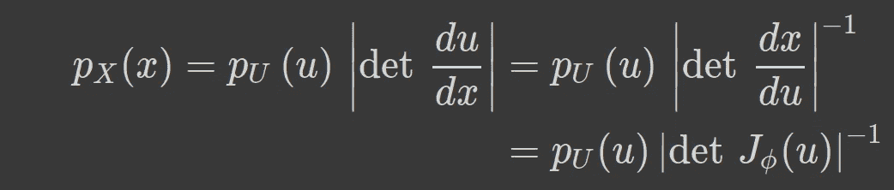

情商。3.2.2:根据之前的线性代数讨论，用雅可比矩阵写出之前的方程。

R.这个方程的 H.S 现在完全取决于基本变量 *u* 。雅可比矩阵定义保持不变:

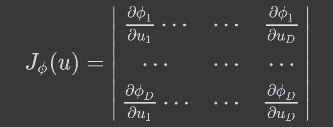

情商。3.2.3:强大的雅各比派:它所代表的…

取上式两边的对数，我们可以写成如下:

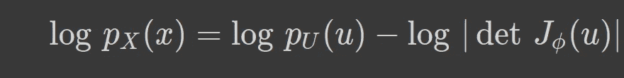

情商。3.2.4:取等式的对数。3.2.2.

由于变换函数 *ϕ* 是可逆的，我们也可以写出如下等式:

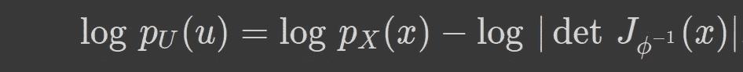

情商。3.2.5:由于可逆变换，我们可以增加一些步骤并重写等式。3.2.4 以不同的形式。

我们稍后将使用这些转换规则来转换概率分布。

## 4.标准化流程:

在介绍了所有必要的基础知识和数学公式之后，我们准备介绍标准化流程。

之前我们只讨论了一种通过可逆函数 *ϕ* 的变换。微分同胚(通过函数变换使得函数及其逆均可微)的一个非常重要的性质是它们是*可复合的*即*给定两个这样的变换ϕ1，ϕ2，它们的复合ϕ1⋅ϕ2 也是可逆的和可微的。*逆矩阵和雅可比行列式由下式给出

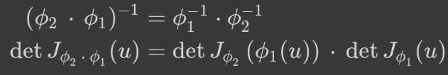

情商。4:多重微分同胚的组合。

规范化流程背后的想法是将多个微分同胚 *ϕ* 1、 *ϕ* 2、⋯ *ϕk* 链接在一起，以逐渐获得来自复杂分布 *p_X* ( *x* )的 *x【原始数据】，从 *u* 开始，来自简单基础分布*p _ u*(*u**

*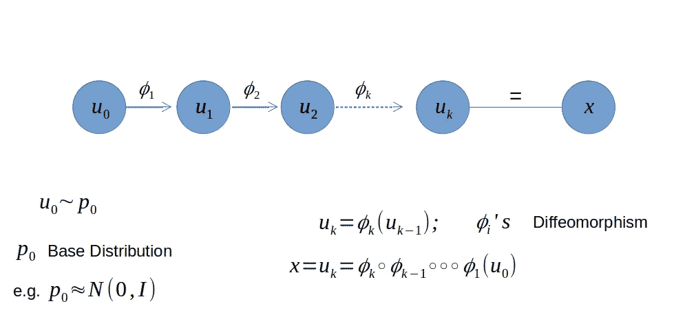*

*图 2:标准化流程做什么？通过一系列微分同胚将简单分布(例如:N(0，I))转换为复杂分布。(鸣谢:作者幻灯片)*

## *张量流概率库的简单例子:*

*我们将从使用 TensorFlow 概率库的一些简单的正向和反向转换的例子开始，该概率库具有[双投影器模块](https://www.tensorflow.org/probability/api_docs/python/tfp/bijectors/Bijector)。让我们加载必要的库:*

```
*import tensorflow as tfimport tensorflow_probability as tfptfd = tfp.distributionstfb = tfp.bijectors*
```

****变换张量:*** 让我们使用两个最简单的双射运算(缩放和移位)并将它们组合起来，以“正向”变换一个张量，并执行反向运算以再次检索原始张量:*

*我们从一个常数张量[1]开始。, 2., 3.]然后我们通过`tfb.Chain`链接两个双射操作(移动 3 个单位和缩放 2 个单位)。然后，我们可以很容易地执行正向和反向操作，我们验证，在正向变换后，使用反向变换，我们得到了原始张量。*

****变换分布:*** 在前面的例子中我们变换了一个张量，但这里我们来变换一个分布。我们从正态分布中抽取样本，并使用我们之前用于变换的相同链式双射运算:*

*仅考虑正态分布中的 5 个随机样本，我们应用链式双投影器(scale & shift ),下面是正向变换的结果图(直方图)。*

*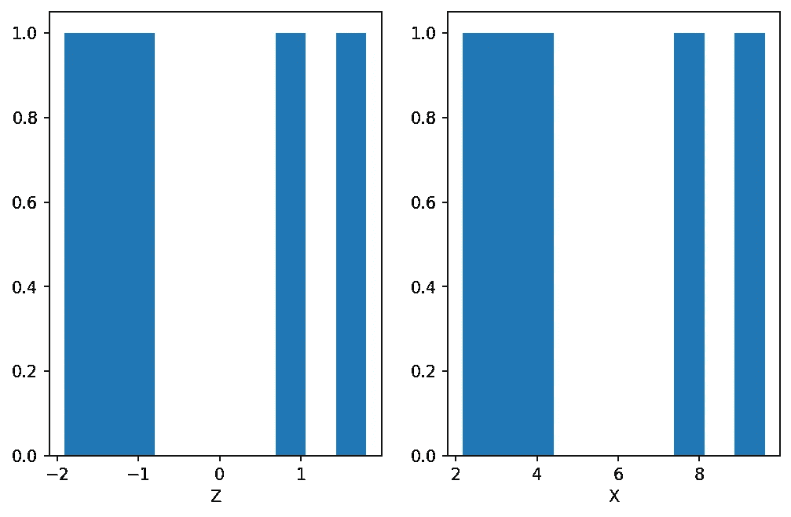*

*图 3:正态分布的样本(左)和正向变换后的结果(3 个单位移位+ 2 个单位标度)。*

*我们还检查了等式 2 中描述的对数概率规则。3.2.4 & 3.2.5.这些很容易检查，因为双投影器在张量流概率中有方法`forward_log_det_jacobian`和`inverse_log_det_jacobian`。*

*如果考虑 2D 分布，而不是 1D 分布，会发生什么？让我们看一个从 2D 均匀分布开始的例子，并应用如下的缩放双射运算:*

*2D 均匀分布在 x 方向上缩放-2 个单位，在 y 方向上缩放 0.5 个单位。我们可以对缩放双射前后的 100 个样本进行散点图绘制:*

*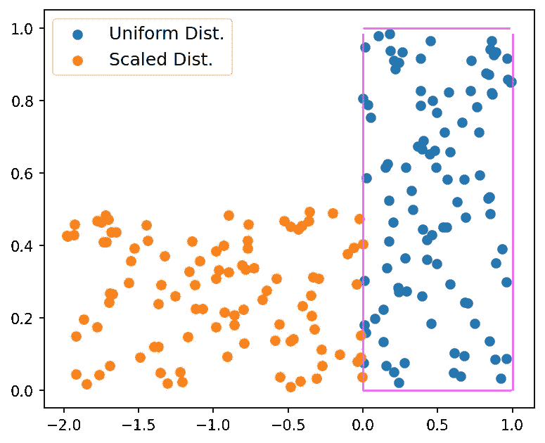*

*图 4:通过正向运算变换 2D 分布(变换函数是双射的)。*

*对角矩阵将始终独立地在两个维度上执行缩放操作，即矩形分布保持矩形，我们在上一个示例中看到了这一点。*

*如果要从矩形分布变成四边形分布呢？这里我们可以使用下三角矩阵进行缩放双射运算。让我们看看:*

*从矩形分布开始，我们最终得到如下四边形分布:*

**

*图 5:与图 4 相同，但是这里我们将矩形分布转换为四边形分布。这里显示了这些分布的示例。*

*就像以前一样，我们可以通过应用如下的逆变换来恢复到原始分布:*

```
*y2_inv = scale_bijector2.inverse(scale_bijector2(x))*
```

*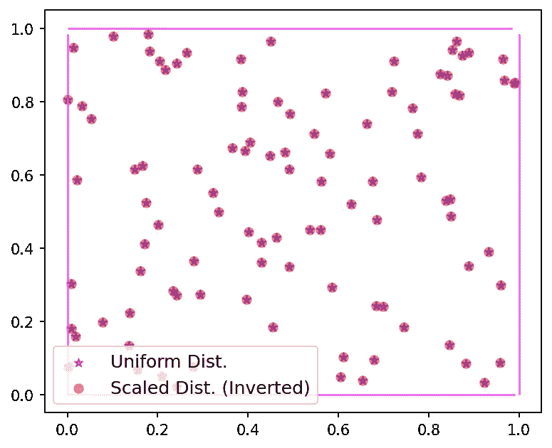*

*图 6:我们总是可以执行逆变换(只要变换是双射的)并取回原始样本(来自均匀的 2D 分布)。*

*我们讨论了标准化流程的核心概念和构建模块。从线性代数、雅可比行列式和概率分布变换开始，我们已经看到了线性代数中雅可比行列式的概念如何无缝地用于变换概率分布。最后，我们使用了张量流概率库中的双射器模块来验证我们推导的概念和公式。*

*在下一篇文章中，我将更多地关注复杂分布的转换(例如，从正态分布到双峰分布等)。)使用双射函数，但是这里使用的概念和公式在研究标准化流的任何阶段都将非常有用。*

*干杯，保持坚强！！*

## *参考资料:*

*[1]“用于概率建模和推理的标准化流”:G. Papamakarios 等人[arXiv: [1912.02762](https://arxiv.org/abs/1912.02762) 。*

*[2] [正常化流动:分布和决定因素](https://blog.evjang.com/2018/01/nf1.html) : Eric Jang。*

*[3]本帖使用的笔记本: [GitHub 链接](https://github.com/suvoooo/Learn-TensorFlow/blob/master/TF-Proba/Norm-Flows/Normalizing%20Flows_GettingStarted.ipynb)。*