# PyTorch 图像模型(timm)入门:实践者指南

> 原文：<https://towardsdatascience.com/getting-started-with-pytorch-image-models-timm-a-practitioners-guide-4e77b4bf9055>

## 如何在自己的培训脚本中使用这个神奇的库

PyTorch Image Models (timm) 是一个用于最先进的图像分类的库，包含图像模型、优化器、调度器、增强器等等的集合；最近，它被命名为[2021 年](https://medium.com/paperswithcode/papers-with-code-2021-a-year-in-review-de75d5a77b8b)最热门的图书馆！

虽然越来越多的低代码和无代码解决方案使得开始将深度学习应用于计算机视觉问题变得容易，但在我目前作为微软 CSE 的一部分的角色中，我们经常与希望寻求针对其特定问题定制解决方案的客户接触；利用最新和最大的创新超越这些服务提供的性能水平。由于新的架构和培训技术被引入这个快速发展的领域的速度，无论您是初学者还是专家，都很难跟上最新的实践，并且在处理新的愿景任务时很难知道从哪里开始，以便重现与学术基准中呈现的结果类似的结果。

无论我是从头开始训练，还是对现有模型进行微调以适应新任务，以及希望利用现有组件来加快我的工作流程，timm 都是 PyTorch 中我最喜欢的计算机视觉库之一。然而，尽管 timm 包含参考[培训](https://github.com/rwightman/pytorch-image-models/blob/master/train.py)和[验证](https://github.com/rwightman/pytorch-image-models/blob/master/validate.py)脚本，用于再现 [ImageNet](https://www.image-net.org/) 培训结果，并且在官方文档和[timm docs 项目](https://fastai.github.io/timmdocs/)中包含涵盖核心组件[的文档，但是由于该库提供的特性数量庞大，在定制用例中应用这些特性时，可能很难知道从哪里开始。](https://rwightman.github.io/pytorch-image-models/)

本指南的目的是从从业者的角度探索 timm，重点是如何在定制培训脚本中使用 timm 中包含的一些功能和组件。重点不是探究这些概念是如何或为什么工作的，或者它们是如何在 timm 中实现的；为此，在适当的地方会提供原始论文的链接，我会推荐 [timmdocs](https://fastai.github.io/timmdocs/) 去了解更多关于 timm 的内部情况。此外，本文决不是详尽的，所选择的领域是基于我使用这个库的个人经验。

这里的所有信息都是基于撰写本文时最近发布的`timm==0.5.4`。


图片由[克里斯托弗·高尔](https://unsplash.com/@cgower)在 [Unsplash](https://unsplash.com/photos/m_HRfLhgABo) 上拍摄

# 目录

虽然这篇文章可以按顺序阅读，但它也可以作为图书馆特定部分的参考。为了便于导航，下面提供了一个目录。

*   [**模型**](#b83b) [](#983b) - [定制模型](#9388)-
    -[特征提取](#0583)-
    -[导出不同格式](#c193)
*   [**数据增强**](#4cc7)-[rand augment](#8549)
    -[cut mix 和 MixUp](#e618)
*   [**数据集**](#c725)
    - [从 TorchVision 加载数据集](#2c65)
    - [从 TensorFlow 数据集加载数据集](#96e0)
    - [从本地文件夹加载数据集](#03bd)
    -[image dataset 类](#a4d1)
*   [**优化器**](#18f9)
    - [用法举例](#5e2d)-
    -[前瞻](#0afa)
*   [**调度器**](#50f2)- [使用示例](#9ad3)
    - [调整学习率调度器](#65e2)
*   [**指数移动平均模型**](#429c)
*   [**把这一切联系在一起！**](#901e)

***Tl；dr:*** *如果你只是想看一些可以直接使用的工作代码，复制这篇文章所需的所有代码都可以在这里*[*GitHub gist*](https://gist.github.com/Chris-hughes10/a9e5ec2cd7e7736c651bf89b5484b4a9)*中找到。*

# 模型

timm 最受欢迎的特性之一是其庞大且不断增长的模型架构集合。这些模型中的许多都包含预先训练的权重——要么在 PyTorch 中进行本机训练，要么从 Jax 和 TensorFlow 等其他库移植而来——可以轻松下载和使用。

我们可以列出并查询可用模型集合，如下所示:

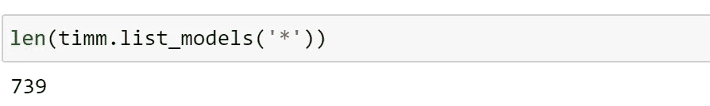

我们还可以使用*预训练*参数将此选择过滤到具有预训练权重的模型:

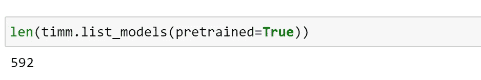

这仍然是一个令人印象深刻的数字！如果此时你正经历一点点选项麻痹，不要绝望！一个有用的资源可用于探索一些可用的模型，并了解它们的性能，这是由代码为的[论文的](https://paperswithcode.com/)[摘要页](https://paperswithcode.com/lib/timm)，其中包含 timm 中许多模型的基准和原始论文的链接。

为了简单起见，让我们继续使用熟悉的、经过测试的 ResNet 模型系列。我们可以通过提供一个通配符字符串来列出不同的 ResNet 变体，该字符串将用作基于模型名称的过滤器:

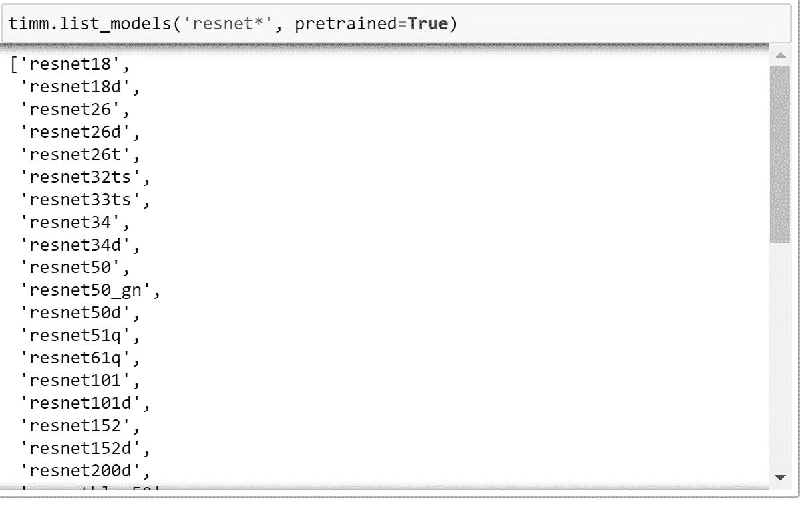

正如我们所看到的，还有很多选择！现在，让我们探索如何从这个列表中创建一个模型。

## 一般用法

创建模型最简单的方法是使用`create_model`；可用于在 timm 库中创建任何模型的工厂函数。

让我们通过创建一个 Resnet-D 模型来演示这一点，如 [*卷积神经网络图像分类锦囊*论文](https://arxiv.org/abs/1812.01187)中所介绍的；这是对 ResNet 体系结构的一个修改，它利用一个平均池来进行下采样。这在很大程度上是一个任意的选择，这里演示的特性应该可以在 timm 中包含的大多数模型上工作。

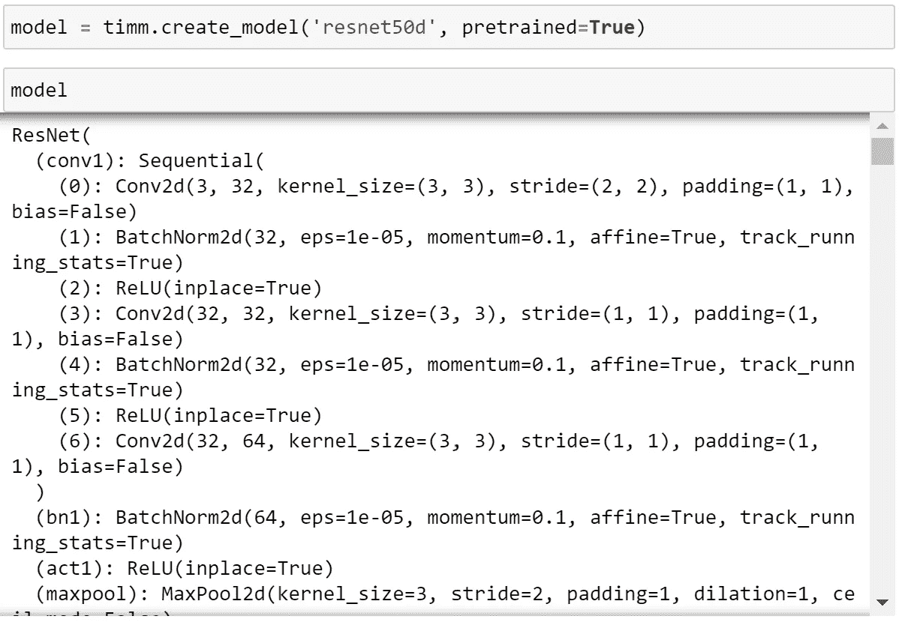

正如我们所见，这只是一个普通的 PyTorch 模型。

为了帮助我们更好地了解如何使用该模型，我们可以访问其配置，其中包含的信息包括用于归一化输入数据的统计数据、输出类的数量以及网络分类部分的名称。

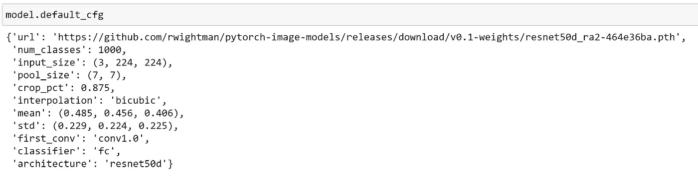

**具有不同数量输入通道的图像的预训练模型**

timm 模型的一个不太为人所知但非常有用的特性是，它们能够处理具有不同数量通道的输入图像，这对大多数其他库来说是个问题；在这里有一个关于这是如何工作的精彩解释[。直观上，timm 通过对小于 3 的信道的初始卷积层的权重求和，或者智能地将这些权重复制到期望数量的信道来实现这一点。](https://fastai.github.io/timmdocs/models#So-how-is-timm-able-to-load-these-weights?)

我们可以通过将 *in_chans* 参数传递给`create_model`来指定输入图像的通道数。

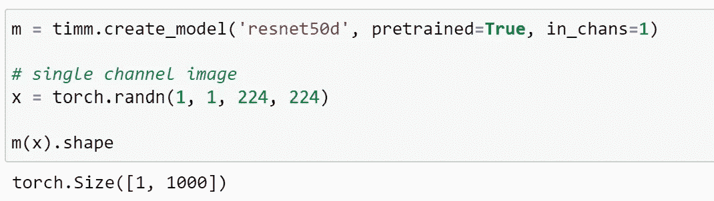

在这种情况下，使用随机张量来表示单通道图像，我们可以看到模型已经处理了图像并返回了预期的输出形状。

值得注意的是，虽然这使我们能够使用预训练的模型，但输入与模型训练的图像明显不同。因此，我们不应该期望相同级别的性能，并在将模型用于任务之前对新数据集进行微调！

## **定制模型**

除了用股票架构创建模型之外，`create_model`还支持许多参数，使我们能够为我们的任务定制一个模型。

受支持的参数可能取决于底层模型架构，其中一些参数如下:

*   **global_pool** :确定最终分类层之前要使用的全局池的类型

因型号而异。在这种情况下，它取决于架构是否采用全局池层。因此，虽然我们可以在类似 ResNet 的模型中使用它，但是在不使用平均池的 [ViT](https://arxiv.org/abs/2010.11929v2) 中使用它就没有意义了。

虽然有些论点是特定于模型的，但诸如以下论点:

*   **drop_rate** :设置训练的辍学率(默认为‘0 ’)
*   **num_classes** :类别对应的输出神经元的数量

几乎可用于所有型号。

在我们探索实现这一点的一些方法之前，让我们检查一下当前模型的默认架构。

**改变班级数量**

检查我们之前看到的模型配置，我们可以看到我们网络的分类头的名称是 *fc* 。我们可以用它来直接访问相应的模块。

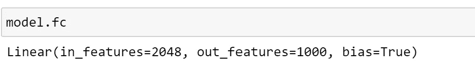

然而，这个名称可能会根据所使用的模型架构而改变。为了给不同的模型提供一致的接口，timm 模型有`get_classifier` 方法，我们可以用它来检索分类头，而不必查找模块名。

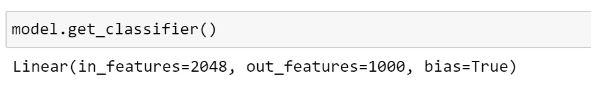

正如所料，这将返回与之前相同的线性图层。

由于这个模型是在 ImageNet 上预训练的，我们可以看到最终的层输出了 1000 个类。我们可以用 *num_classes* 参数来改变这一点:

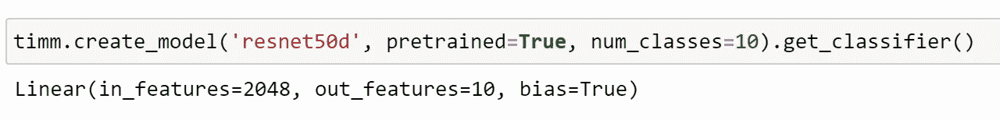

检查分类器，我们可以看到，timm 已经用一个新的、未经训练的、具有所需类别数的线性层替换了最后一层；准备好微调我们的数据集！

如果我们想完全避免创建最后一层，我们可以设置类的数量等于 0，这将创建一个具有身份函数的模型作为最后一层；这对于检查倒数第二层的输出非常有用。

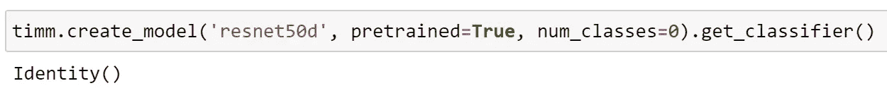

**全局池选项**

从我们模型的配置中，我们还可以看到设置了 *pool_size* ，通知我们在分类器之前使用了一个全局池层。我们可以按如下方式对此进行检查:

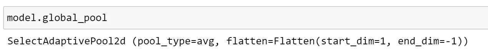

这里我们可以看到这返回了一个`SelectAdaptivePool2d`的实例，它是 timm 提供的自定义层，支持不同的池化和扁平化配置。在撰写本文时，支持的池选项有:

*   *平均值*:平均池
*   *最大*:最大池
*   *avgmax:* 平均池和最大池之和，按 0.5 重新调整
*   *catavgmax:* 沿特征维度的平均和最大池输出的串联。请注意，这将使特征尺寸加倍。
*   *“”:*不使用池，池层被一个标识操作替换

我们可以看到不同池选项的输出形状，如下所示:

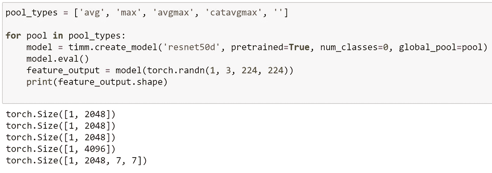

**修改现有模型**

我们还可以使用`reset_classifier` 方法修改现有模型的分类器和池层:

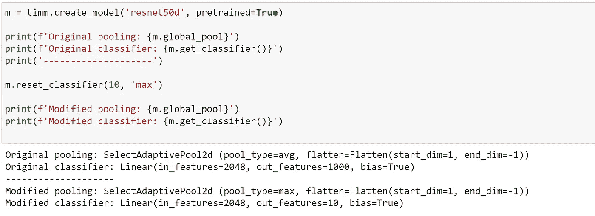

**创建新的分类头**

虽然已经证明使用单一线性层作为我们的分类器足以获得良好的结果，但当在下游任务上微调模型时，我经常发现使用稍大的头部可以提高性能。让我们探索如何进一步修改我们的 ResNet 模型。

首先，让我们像以前一样创建我们的 ResNet 模型，指定我们想要 10 个类。因为我们使用了一个更大的头，所以让我们使用 *catavgmax* 进行池化，这样我们就可以提供更多的信息作为分类器的输入。

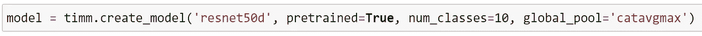

从现有的分类器中，我们可以得到输入特征的数量:


现在，我们可以通过直接访问分类器，用修改后的分类头替换最后一层。这里，分类标题的选择有些随意。

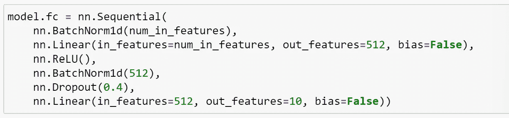

用虚拟输入测试模型，我们得到预期形状的输出。现在，我们的改装模型可以开始训练了！

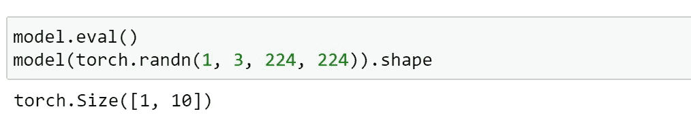

## 特征抽出

timm 模型还具有用于获得各种类型的中间特征的一致机制，这对于将架构用作下游任务的特征提取器是有用的；比如在物体检测中创建[特征金字塔](https://ieeexplore.ieee.org/document/8099589)。

让我们通过使用来自[牛津宠物数据集](https://www.robots.ox.ac.uk/~vgg/data/pets/)的图像来想象这是如何工作的。

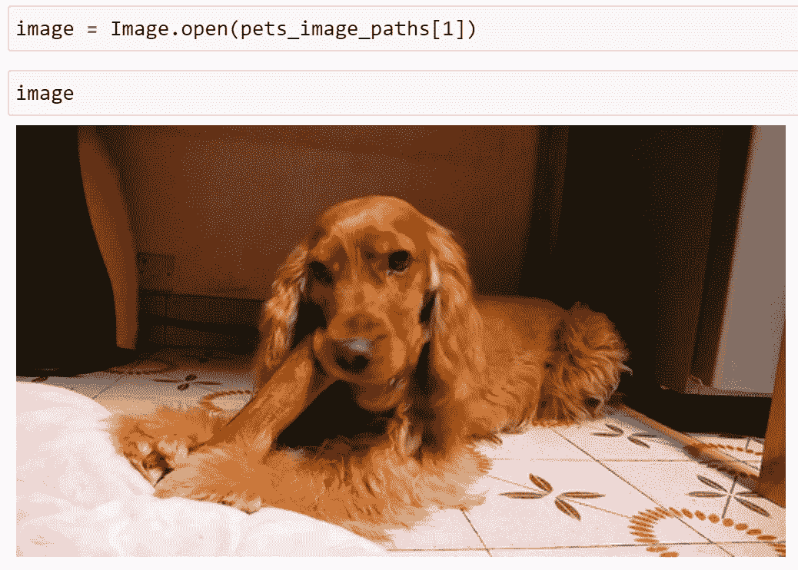

我们可以将其转换为张量，并将通道转换为 PyTorch 预期的格式:


让我们再次创建我们的 ResNet-D 模型:

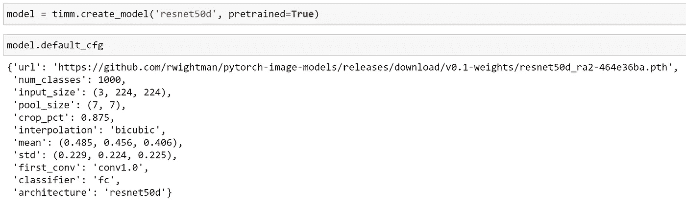

如果我们只对最终的特征图感兴趣——在这种情况下，这是合并之前最终卷积层的输出——我们可以使用`forward_features` 方法绕过全局合并和分类层。


我们可以将它形象化如下:

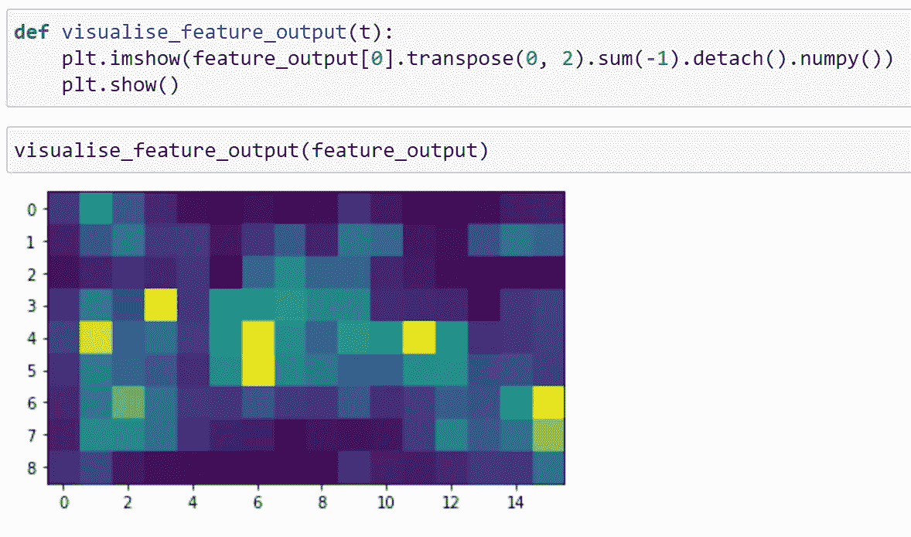

**多特征输出**

虽然正向特征方法可以方便地检索最终特征图，但 timm 还提供了使我们能够将模型用作输出选定级别的特征图的特征主干的功能。

当创建一个模型时，我们可以通过使用参数 *features_only=True* 来指定我们想要使用一个模型作为特征主干。默认情况下，大多数模型将输出 5 步(并非所有模型都有这么多)，第一步从 2 开始(但有些从 1 或 4 开始)。

可以使用`*out _ indexes*和` *output_stride* 参数修改特征级别的指数和步数，如文档中的[所示。](https://rwightman.github.io/pytorch-image-models/feature_extraction/#multi-scale-feature-maps-feature-pyramid)

让我们看看这是如何与我们的 ResNet-D 模型一起工作的。

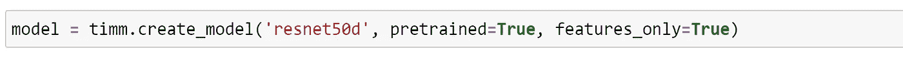

如下所示，我们可以获得关于返回的特性的更多信息，例如特定的模块名称、特性的减少和通道的数量:

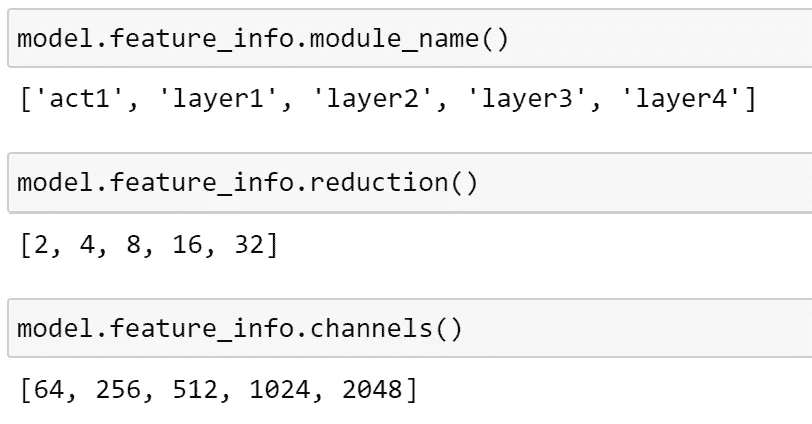

现在，让我们通过我们的特征提取器传递一个图像，并研究输出。

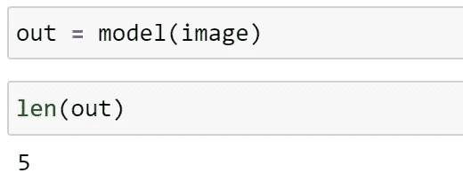

正如所料，已返回 5 个特征地图。检查形状，我们可以看到通道的数量与我们预期的一致:

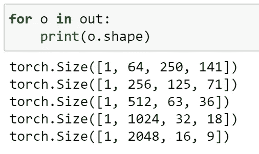

可视化每个特征图，我们可以看到，图像是逐步下降采样，正如我们所期望的。

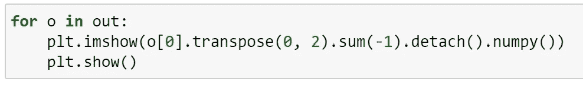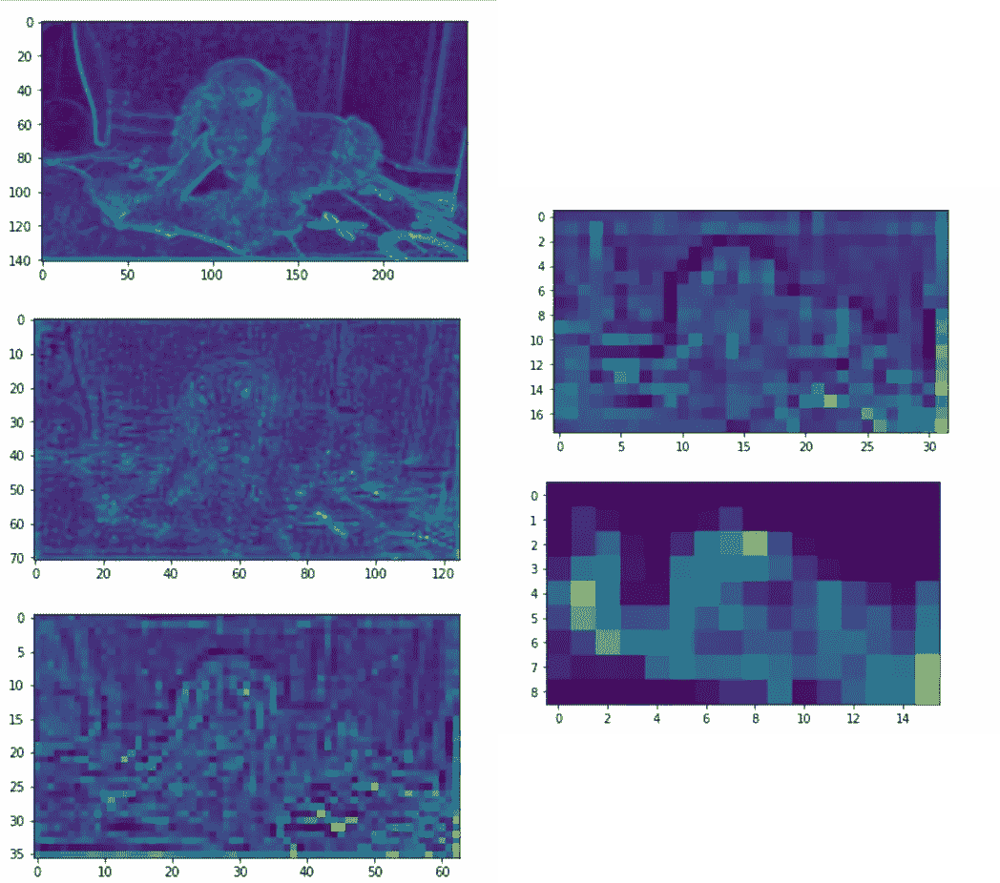

**使用火炬特效**

[TorchVision](https://pytorch.org/vision/stable/index.html) 最近发布了一个名为 FX 的新工具，它使得在 PyTorch 模块向前传递期间访问输入的中间转换变得更加容易。这是通过象征性地跟踪 forward 方法来产生一个图来完成的，其中每个节点代表一个操作。由于节点被赋予了人类可读的名称，因此很容易准确地指定我们想要访问的节点。FX 在文件和博客中[有更详细的描述。](https://pytorch.org/docs/stable/fx.html#module-torch.fx)

**注**:在撰写本文时，使用 FX 时，动态控制流还不能用静态图来表示。

由于 timm 中几乎所有的模型都是象征性可追溯的，我们可以使用 FX 来操纵它们。让我们探索一下如何使用 FX 从 timm 模型中提取特征。

首先，让我们从 TorchVision 导入一些 helper 方法:


现在，我们重新创建我们的 ResNet-D 模型，使用分类头，并使用 *exportable* 参数来确保模型是可跟踪的。


现在，我们可以使用`get_graph_nodes`方法按照执行顺序返回节点名称。由于模型被跟踪了两次，在 train 和 eval 模式下，两组节点名都被返回。

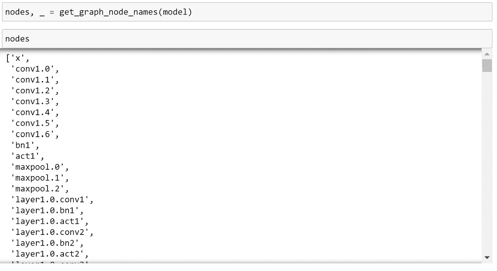

使用 FX，可以很容易地从任何节点访问输出。让我们在*层 1* 中选择第二次激活。

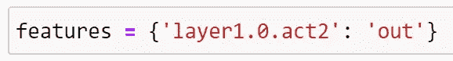

使用`create_feature_extractor`，我们可以在该点“切割”模型，如下图所示:

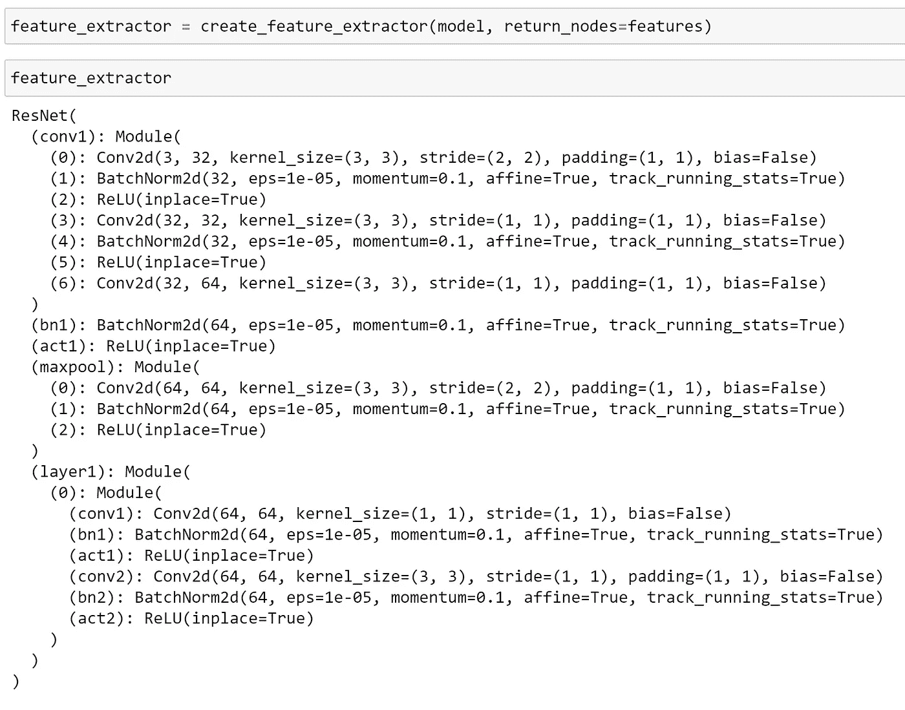

现在，通过我们的特征提取器传递一个图像，这将返回一个张量字典。我们可以像以前一样想象这个:

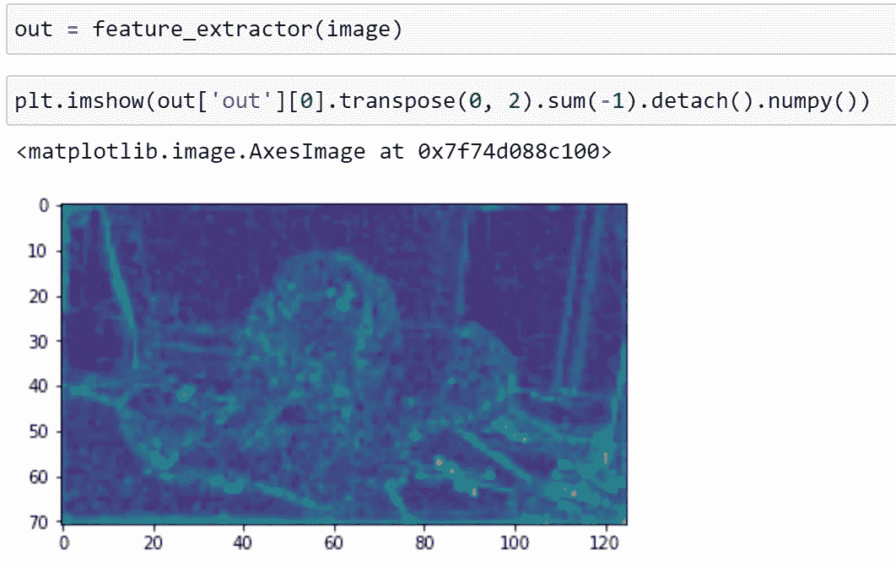

## 导出到不同的格式

训练之后，通常建议将您的模型导出到一个优化的格式，以便进行推理；PyTorch 有多种方法可以做到这一点。由于几乎所有的 timm 模型都是可脚本化和可追踪的，我们可以利用这些格式。

让我们检查一些可用的选项。

**导出到 TorchScript**

TorchScript 是一种从 PyTorch 代码创建可序列化和可优化模型的方法；任何 TorchScript 程序都可以从 Python 进程中保存，并在没有 Python 依赖的进程中加载。

我们可以通过两种不同的方式将模型转换为 TorchScript:

*   *跟踪*:运行代码，记录发生的操作，构建包含这些操作的 ScriptModule。控制流或动态行为(如 if/else 语句)被删除。
*   *脚本*:使用脚本编译器对 Python 源代码进行直接分析，将其转换成 TorchScript。这保留了动态控制流，并且对不同大小的输入有效。

关于 TorchScript 的更多信息可以在文档中的[和本教程](https://pytorch.org/docs/stable/jit.html)中的[中看到。](https://pytorch.org/tutorials/beginner/Intro_to_TorchScript_tutorial.html)

由于大多数 timm 模型都是可脚本化的，所以让我们使用脚本来导出我们的 ResNet-D 模型。我们可以设置层配置，以便在创建模型时使用*可脚本化的*参数使模型是 jit 可脚本化的。

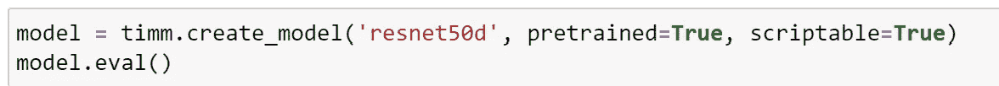

在导出模型之前调用`model.eval()`将模型置于推理模式是很重要的，因为像 dropout 和 batchnorm 这样的操作符根据模式的不同会有不同的行为。

我们现在可以验证我们能够编写脚本并使用我们的模型。

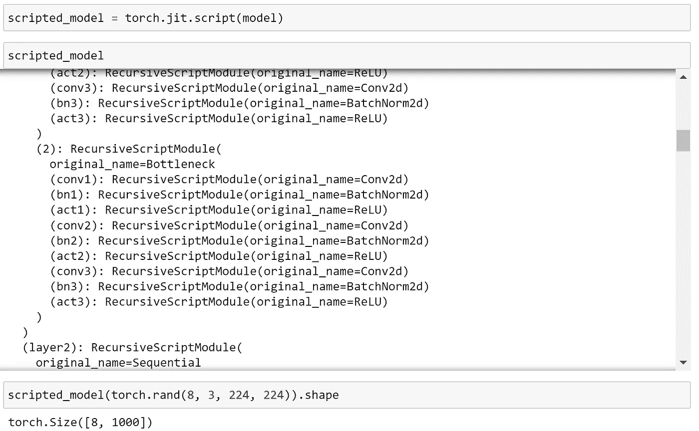

**导出到 ONNX**

[开放神经网络交换(ONNX)](https://onnx.ai/) 是一种用于表示机器学习模型的开放标准格式。

我们可以使用`torch.onnx`模块将 timm 模型导出到 ONNX 使它们能够被支持 ONNX 的许多运行时所使用。如果用一个还不是 ScriptModule 的模块调用`torch.onnx.export()`，它首先执行与`torch.jit.trace()`等效的操作；它使用给定的参数执行模型一次，并记录执行过程中发生的所有操作。这意味着，如果模型是动态的，例如，根据输入数据改变行为，则导出的模型将不会捕捉这种动态行为。类似地，跟踪可能只对特定的输入大小有效。

关于 ONNX 的更多细节可以在文档中找到[。](https://pytorch.org/docs/master/onnx.html)

为了能够以 ONNX 格式导出 timm 模型，我们可以在创建模型时使用 *exportable* 参数，以确保模型是可追踪的。

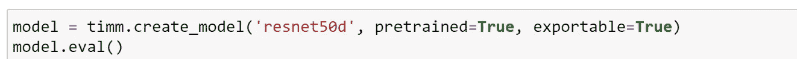

我们现在可以使用`torch.onnx.export`来跟踪和导出我们的模型:

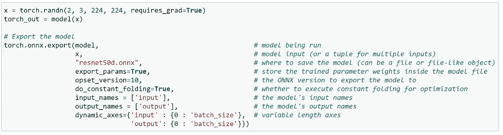

我们现在可以使用`check_model`函数来验证我们的模型是有效的。

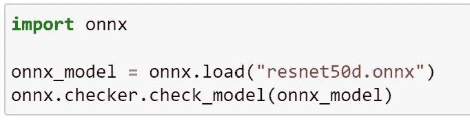

由于我们指定了我们的模型应该是可追踪的，我们也可以手动执行追踪，如下所示。

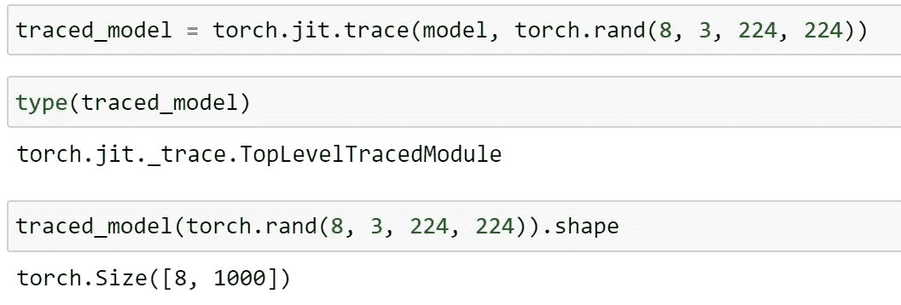

# 数据扩充

timm 包括许多数据扩充转换，它们可以链接在一起形成扩充管道；与火炬视觉类似，这些管道期望 PIL 图像作为输入。

最简单的开始方式是使用`create_transform`工厂函数，让我们在下面探索如何使用它。

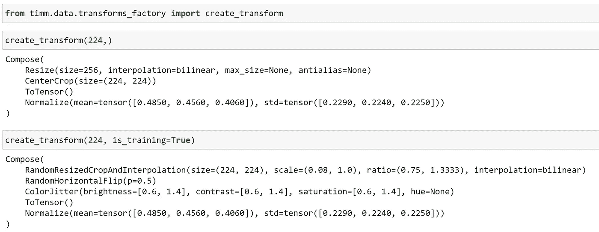

在这里，我们可以看到这已经创建了一些基本的增强管道，包括调整大小，规范化和转换图像为张量。正如我们所料，我们可以看到，当我们设置 *is_training=True* 时，包括了额外的变换，如水平翻转和颜色抖动。这些增强的幅度可以用诸如 *hflip* 、*v lip*和 *color_jitter* 之类的参数来控制。

我们还可以看到，根据我们是否在训练，用于调整图像大小的方法也有所不同。虽然在验证过程中使用了标准的 *Resize* 和 *CenterCrop* ，但是在训练过程中，使用了*RandomResizedCropAndInterpolation*，让我们看看它在下面做了什么。因为在 timm 中实现这种变换使我们能够设置不同的图像插值方法；这里我们选择插值是随机选择的。

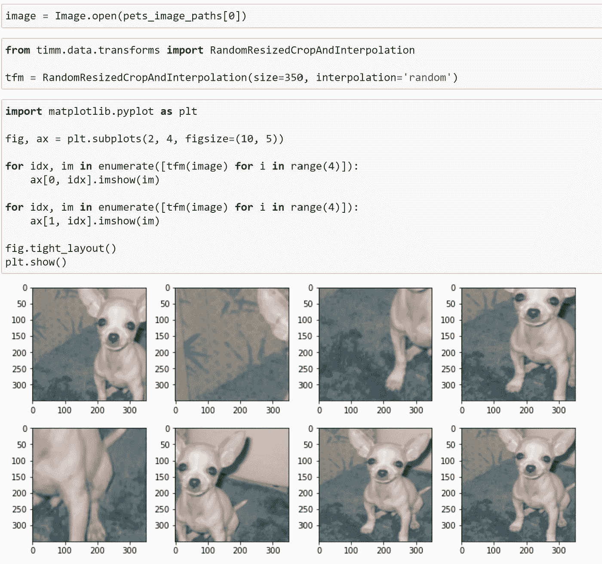

运行几次转换，我们可以观察到不同的作物已采取的形象。虽然这在培训期间是有益的，但在评估期间可能会使任务变得更加困难。

取决于图像的类型，这种类型的变换可能导致图片的主题从图像中被裁剪掉；如果我们看第一行的第二张图片，我们可以看到这样的例子！虽然如果不经常发生，这应该不是一个大问题，但我们可以通过调整比例参数来避免这种情况:

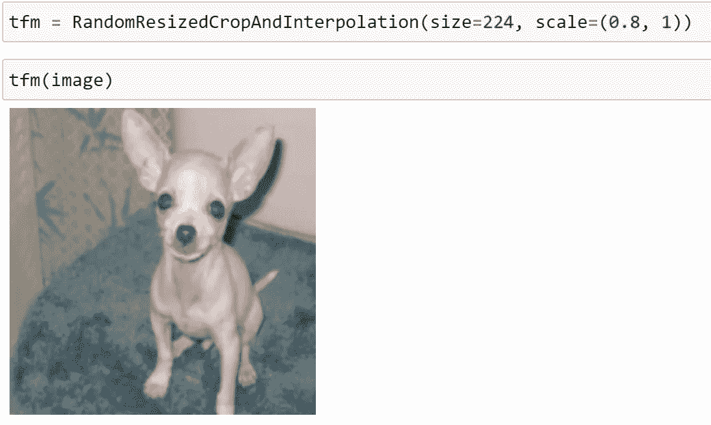

## **RandAugment**

当开始一项新任务时，可能很难知道使用哪些增强，以及以何种顺序使用；随着现在可用的增强数量的增加，组合的数量是巨大的！

通常，一个好的起点是使用在其他任务中表现良好的增强管道。一种这样的策略是 RandAugment，这是一种自动化的数据增强方法，它从一组增强中统一采样操作，如均衡、旋转、曝光、颜色抖动、色调分离、改变对比度、改变亮度、改变锐度、剪切和平移，并顺序应用其中的一些操作；更多信息，请参见[原始文件](https://arxiv.org/abs/1909.13719)。

然而，在 timm 中提供的实现中有几个关键的差异，timm 的创建者 Ross Wightman 在[ResNets Strike Back paper](https://arxiv.org/pdf/2110.00476v1.pdf)的附录中对此进行了最好的描述，我在下面解释了这些差异:

> 原始 RandAugment 规范有两个超参数，M 和 N；其中 M 是失真幅度，N 是每幅图像均匀采样和应用的失真数量。RandAugment 的目标是 M 和 N 都是人类可以解释的。
> 
> 然而，对于 M[在最初的实现中]来说，情况并非如此。几个增强的尺度在该范围内是向后的或者不是单调增加的，因此增加 M 不会增加所有增强的强度。

在最初的实现中，虽然随着 M 的增加，一些增强的强度上升，但是其他增强的强度下降或者被完全移除，使得每个 M 本质上代表其自己的策略。

> timm 中的实现试图通过添加“增加”模式(默认启用)来改善这种情况，在该模式中，所有增强强度都随着幅度增加。

这使得增加 M 更直观，因为所有的强化现在应该随着 M 的相应减少/增加而减少/增加强度。

> [此外，] timm 添加了一个 MSTD 参数，该参数将具有指定标准偏差的高斯噪声添加到每个失真应用的 M 值中。如果 MSTD 设置为'-inf '，则对于每个失真，M 从 0-M 均匀采样。
> 
> 在 timm 的 RandAugment 中，为了减少对图像均值的影响，归一化参数可以作为一个参数传递，以便所有可能引入边界像素的增强都可以使用指定的均值，而不是像在其他实现中那样默认为 0 或硬编码元组。
> 
> [最后，]默认情况下不包括剪切，以支持单独使用 timm 的随机擦除实施*，这对增强图像的平均值和标准偏差的
> 影响较小。

* timm 中随机擦除的实现在[这里](https://fastai.github.io/timmdocs/RandomErase)详细探讨。

现在我们已经了解了什么是 RandAugment，让我们看看如何在增强管道中使用它！

在 timm 中，我们通过使用一个配置字符串来定义 RandAugment 策略的参数；它由用破折号(`-`)分隔的多个部分组成

第一部分定义了 rand augment 的具体变体(目前只支持`rand`)。其余部分可以按任意顺序排列，它们是:

*   **m** ( *整数*):rand 增大的幅度
*   **n** ( *integer* ):每个图像选择的变换操作数，这是可选的，默认设置为 2
*   **mstd (** *float* ):应用的噪声幅度的标准偏差
*   **mmax** ( *integer* ):将幅度的上限设置为默认值 10 以外的值
*   **w** ( *integer* ):概率权重指数(影响操作选择的一组权重的指数)
*   **inc** ( *bool — {0，1}* ):使用严重性随幅度增加的增强，这是可选的，默认值为 0

    例如:
*   `rand-m9-n3-mstd0.5`:产生 9 级随机增强，每幅图像 3 次增强，mstd 0.5
*   `rand-mstd1-w0`:mstd 1.0，权重 0，默认 m 值 10，每幅图像放大 2 倍

向`create_transform`传递一个配置字符串，我们可以看到这是由`RandAugment`对象处理的，我们可以看到所有可用操作的名称:

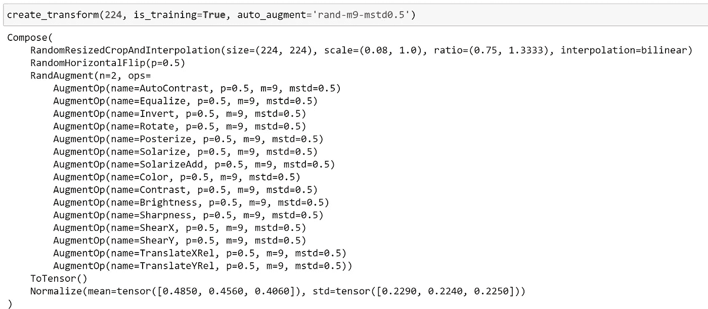

我们还可以通过使用`rand_augment_transform`函数来创建这个对象，以便在自定义管道中使用，如下所示:

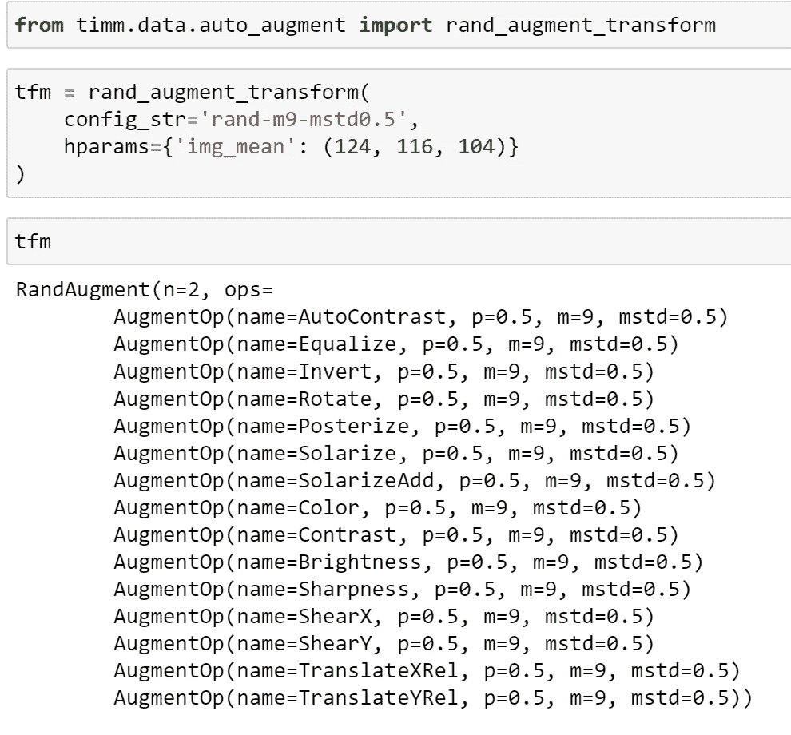

让我们将这个策略应用到一个图像上，来可视化一些转换。

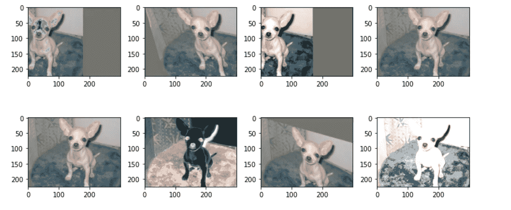

由此，我们可以看到使用 RandAugment 给了我们很多不同的图像！

## **剪切和混合**

timm 使用`Mixup`类提供了[剪切混合](https://arxiv.org/abs/1905.04899)和[混合](https://arxiv.org/abs/1710.09412)增强的灵活实现；它处理这两种扩充并提供在它们之间切换的选项。

使用`Mixup,`,我们可以从各种不同的混音策略中进行选择:

*   *批次*:每批次执行切割混合与混合选择、λ和切割混合区域采样
*   *pair* :对一个批次内的采样对进行混合、lambda 和区域采样
*   *elem* :对批次内的每幅图像进行混合、λ和区域采样
*   *half* :与元素方面相同，但是每个混合对中的一个被丢弃，以便每个样本在每个时期被看到一次

让我们想象一下这是如何工作的。要做到这一点，我们需要创建一个数据加载器，遍历它并将扩充应用到批处理中。我们将再次使用来自 Pets 数据集的图像。

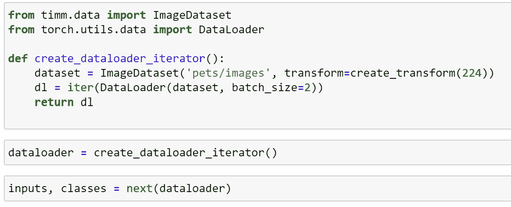

使用 TorchVision 和 [timmdocs](https://fastai.github.io/timmdocs/mixup_cutmix) 的帮助函数，我们可以在没有应用增强的情况下可视化我们批次中的图像:

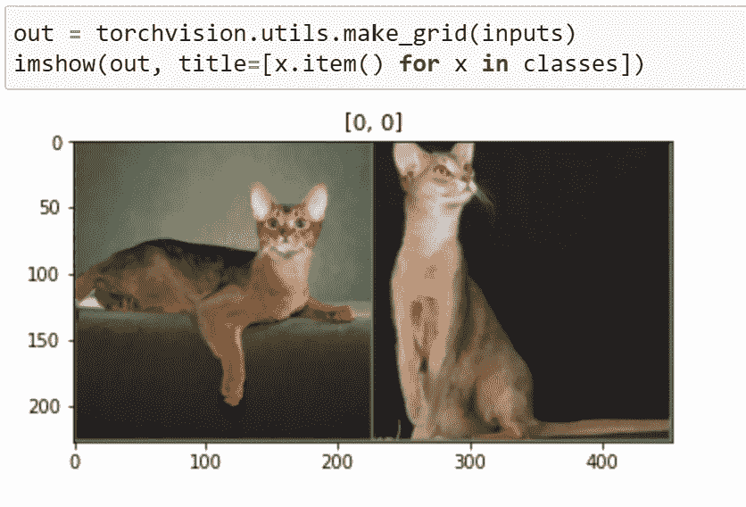

现在，让我们创建我们的混音转换！`Mixup`支持以下参数:

*   **mixup _ alpha**(*float*):mix up alpha 值，如果>为 0，则 mix up 有效。，(默认值:1)
*   **cutmix _ alpha**(*float*):cut mix alpha 值，如果>为 0，则 cut mix 有效。(默认值:0)
*   **cutmix _ minmax**(*List【float】*):cut mix 最小/最大图像比率，cut mix 处于活动状态，如果不是无，则使用此 vs alpha。
*   **prob** ( *float* ):每个批次或元素应用 mix 或 cutmix 的概率(默认值:1)
*   **switch _ prob**(*float*):当两者都激活时，切换到 cutmix 而不是 mix 的概率(默认值:0.5)
*   **模式** ( *str* ):如何应用 mixup/cutmix 参数(默认:*批次*)
*   **label _ smoothing**(*float*):应用于混合目标张量的标签平滑量(默认值:0.1)
*   **num _ classes**(*int*):目标变量的类的数量

让我们定义一组参数，以便我们将 mixup 或 cutmix 应用于一批图像，并且以概率 1 交替，并且使用这些来创建我们的“Mixup”变换:

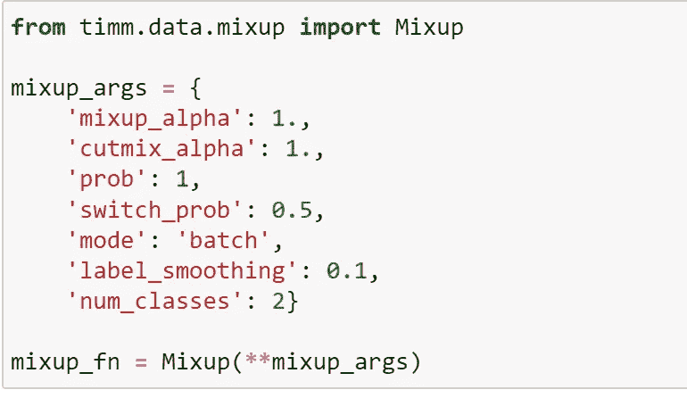

由于 mixup 和 cutmix 发生在一批图像上，所以我们可以在应用增强来加速之前将该批图像放在 GPU 上！在这里，我们可以看到 mixup 已经应用于这批图像。

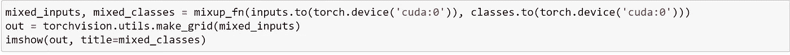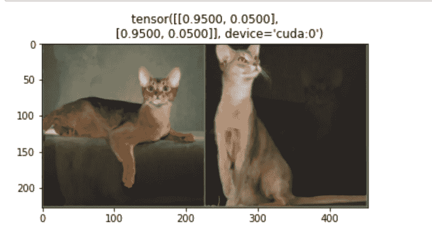

再次运行增强，我们可以看到，这一次，应用了 CutMix。

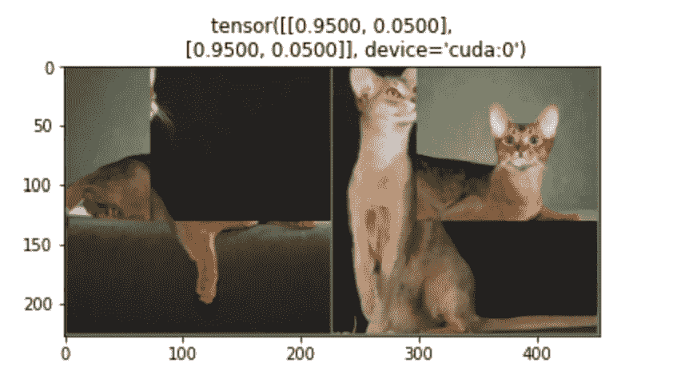

从彼此上面打印的标签可以观察到，我们也可以使用`Mixup`进行标签平滑！

# 数据集

timm 为处理不同类型的数据集提供了许多有用的工具。最简单的开始方式是使用`create_dataset`函数，它将为我们创建一个合适的数据集。

`create_dataset`总是期望两种说法:

*   *名称*:我们要加载的数据集的名称
*   *root:* 本地文件系统上数据集的根文件夹

但是有额外的关键字参数，可用于指定选项，如我们是否希望加载定型集或验证集。


我们还可以使用`create_dataset`，从几个不同的地方加载数据:

*   [火炬视觉中可用的数据集](https://pytorch.org/vision/0.11/datasets.html)
*   [张量流数据集中可用的数据集](https://www.tensorflow.org/datasets)
*   存储在本地文件夹中的数据集

让我们探索其中的一些选项。

## 从 TorchVision 加载数据集

要加载 TorchVision 包含的数据集，我们只需在希望加载的数据集名称前指定前缀`torch/`。如果文件系统上不存在这些数据，我们可以通过设置 *download=True* 来下载这些数据。此外，我们在这里指定我们希望加载带有 *split* 参数的训练数据集。

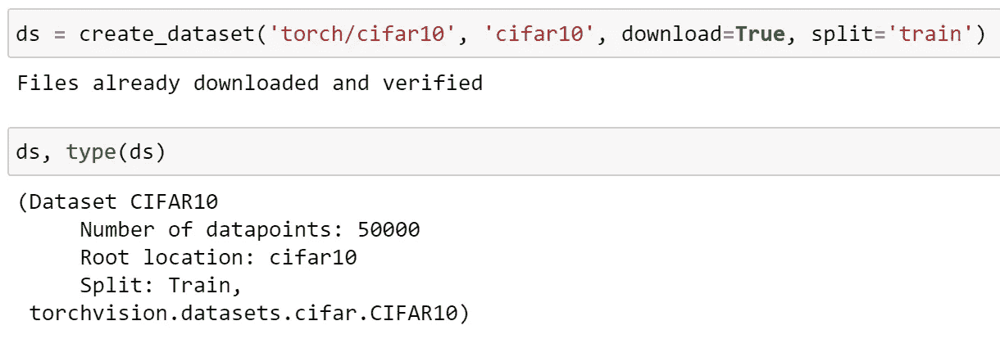

检查类型，我们可以看到这是一个 TorchVision 数据集。我们可以像往常一样通过索引来访问它:


## 从 TensorFlow 数据集加载数据集

除了通过 TorchVision 使用 PyTorch 时通常可用的数据集，timm 还使我们能够从 TensorFlow 数据集下载和使用数据集；为我们包装底层的`tfds`对象。

从 TensorFlow 数据集加载时，建议我们设置几个额外的参数，本地或 TorchVision 数据集不需要这些参数:

*   **batch_size** :用于保证分布式训练时，批量大小除以所有节点的样本总数
*   **is_training** :如果设置，数据集将被混洗。注意，这不同于设置*分割*

虽然这个包装器从 TFDS 数据集中返回解压缩的图像示例，但是我们需要的任何扩充和批处理仍然由 PyTorch 处理。

在这种情况下，我们用`tfds/`作为数据集名称的前缀。可用于图像分类的数据集列表可在[这里](https://www.tensorflow.org/datasets/catalog/overview#image_classification)找到。对于这个例子，我们将任意选择*bean*数据集。


我们还可以看到，对于*拆分*参数，我们指定了一个`tfds` 拆分字符串，如这里的[所述](https://www.tensorflow.org/datasets/splits)。

检查我们的数据集，我们可以看到底层的 TensorFlow 数据集已经被包装在一个`IterableImageDataset`对象中。作为一个可迭代的数据集，它不支持索引——参见这里的差异[和](https://pytorch.org/docs/stable/data.html#dataset-types)——所以为了查看来自这个数据集的图像，我们必须首先创建一个迭代器。


我们现在可以使用这个迭代器来依次检查图像和标签，如下所示。


我们可以看到我们的图像已经正确加载！

## 从本地文件夹加载数据

我们还可以从本地文件夹加载数据，在这种情况下，我们只需使用空字符串(`''`)作为数据集名称。

除了能够从 ImageNet 风格的文件夹层次结构中加载之外，`create_dataset`还允许我们从一个或多个 tar 文档中提取；我们可以利用这一点来避免必须解压缩存档！作为一个例子，我们可以在 [Imagenette 数据集](https://github.com/fastai/imagenette)上进行试验。

此外，到目前为止，我们一直在加载原始图像，所以让我们也使用 *transform* 参数来应用一些转换；这里，我们可以使用前面看到的`create_transform`函数快速创建一些合适的转换！

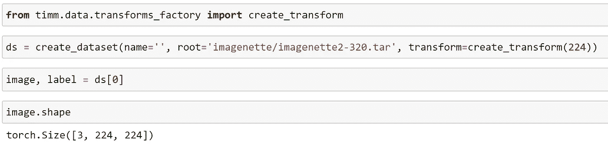

通过检查图像的羞耻，我们可以看到我们的变换已经被应用。

## ImageDataset 类

正如我们所见，`create_dataset`函数为处理不同类型的数据提供了许多选项。timm 能够提供这种灵活性的原因是通过尽可能使用 TorchVision 中提供的现有数据集类，以及提供一些额外的实现— `ImageDataset`和`IterableImageDataset`，它们可以在广泛的场景中使用。

本质上，`create_dataset`通过选择一个合适的类为我们简化了这个过程，但是有时我们可能希望直接使用底层组件。

我最常使用的实现是`ImageDataset`，它类似于[*torch vision . datasets . image folder*](https://pytorch.org/vision/main/generated/torchvision.datasets.ImageFolder.html)，但是增加了一些额外的功能。让我们探索一下如何使用它来加载解压缩的 imagenette 数据集。

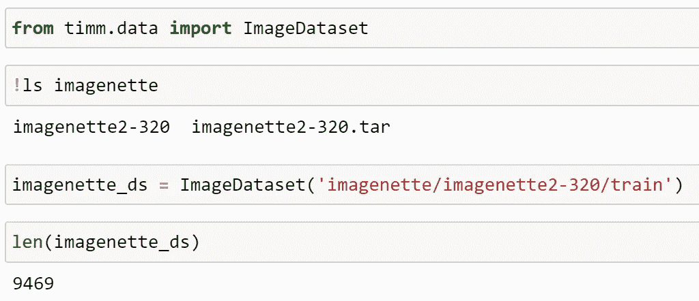

`ImageDataset`灵活性的关键在于它索引和加载样本的方式被抽象成了一个`Parser`对象。

timm 包含了几个解析器，包括从文件夹、tar 文件和 TensorFlow 数据集读取图像解析器。解析器可以作为参数传递给数据集，我们可以直接访问解析器。


这里，我们可以看到默认解析器是`ParserImageFolder`的一个实例。解析器还包含有用的信息，比如类查找，我们可以像下面这样访问它。


我们可以看到，这个解析器已经将原始标签转换成整数，可以输入到我们的模型中。

**手动选择解析器— tar 示例**

因此，除了选择合适的类，`create_dataset`还负责选择正确的解析器。再次考虑压缩的 Imagenette 数据集，我们可以通过手动选择`ParserImageInTar`解析器并覆盖`ImageDataset`的默认解析器来获得相同的结果。


检查第一个样本，我们可以验证这已经正确加载。


**创建自定义解析器**

不幸的是，数据集并不总是像 ImageNet 那样结构化；也就是说，具有以下结构:

```
root/class_1/xx1.jpg
root/class_1/xx2.jpg
root/class_2/xx1.jpg
root/class_2/xx2.jpg
```

对于这些数据集，`ImageDataset`不能开箱即用。虽然我们总是可以实现一个自定义数据集来处理这一点，但这可能是一个挑战，取决于数据是如何存储的。另一种选择是编写一个定制的解析器来使用`ImageDataset`。

作为一个例子，让我们考虑一下[牛津宠物数据集](https://www.robots.ox.ac.uk/~vgg/data/pets/)，其中所有图像都位于一个文件夹中，文件名中包含类名——在本例中是每个品种的名称。


在这种情况下，由于我们仍然从本地文件系统加载图像，所以对`ParserImageFolder`只做了一点小小的调整。让我们看看这是如何实现的灵感。


由此，我们可以看到“ParserImageFolder”做了几件事:

*   为类创建映射
*   执行`__len__`返回样品数量
*   实现`_filename`来返回样本的文件名，并带有选项来确定它应该是绝对路径还是相对路径
*   执行`__getitem__`返回样品和目标。

现在我们已经了解了我们必须实现的方法，我们可以在此基础上创建我们自己的实现！这里，我使用了 [*pathlib*](https://docs.python.org/3/library/pathlib.html) ，从标准库中提取类名并处理我们的路径；因为我发现它比`os`更容易使用。

我们现在可以将解析器的一个实例传递给`ImageDataset`，这将使它能够正确加载 pets 数据集！


让我们通过检查第一个样本来验证我们的解析器已经工作。


由此看来，我们的解析器起作用了！此外，与默认解析器一样，我们可以检查已经执行的类映射。


在这个简单的例子中，创建一个自定义数据集实现只需要稍微多做一点工作。然而，希望这有助于说明编写自定义解析器并使其与`ImageDataset`一起工作是多么容易！

# 优化者

timm 具有大量的优化器，其中一些不是 PyTorch 的一部分。除了方便访问熟悉的优化器，如 [SGD](https://pytorch.org/docs/stable/generated/torch.optim.SGD.html) 、[亚当](https://pytorch.org/docs/stable/generated/torch.optim.Adam.html#torch.optim.Adam)和 [AdamW](https://pytorch.org/docs/stable/generated/torch.optim.AdamW.html#torch.optim.AdamW) ，一些值得注意的内容包括:

*   **AdamP** :本文所述
*   **rms propf**:基于原始 TensorFlow 实现的 [RMSProp](http://www.cs.toronto.edu/~tijmen/csc321/slides/lecture_slides_lec6.pdf) 的实现，此处讨论其他[小调整](https://github.com/pytorch/pytorch/issues/23796)。根据我的经验，这通常会比 PyTorch 版本带来更稳定的训练
*   **LAMB**:Apex 的 [FusedLAMB 优化器的纯 pytorch 变体，在使用 PyTorch XLA 时与 TPU 兼容](https://nvidia.github.io/apex/optimizers.html#apex.optimizers.FusedLAMB)
*   **adabelieve**:本文所述。关于设置超参数的指南可在[此处](https://github.com/juntang-zhuang/Adabelief-Optimizer#quick-guide)获得
*   **马德格拉德**:本文所述
*   **AdaHessian** :自适应二阶优化器，在本文中描述

timm 中的优化器支持与 [*torch.optim*](https://pytorch.org/docs/stable/optim.html) 中相同的接口，并且在大多数情况下可以简单地放入一个训练脚本中，而无需进行任何更改。

要查看 timm 实现的所有优化器，我们可以检查 timm.optim 模块。


创建优化器最简单的方法是使用`create_optimizer_v2`工厂函数，该函数需要:

*   一个模型或一组参数
*   优化程序的名称
*   要传递给优化器的任何参数

我们可以使用这个函数来创建 timm 中包含的任何优化器实现，以及 torch.optim 中流行的优化器和 [Apex](https://nvidia.github.io/apex/index.html) 中的[融合优化器](https://nvidia.github.io/apex/optimizers.html)(如果安装的话)。

让我们来看一些例子。


在这里，我们可以看到，由于 timm 不包含 SGD 的实现，它已经使用“torch.optim”中的实现创建了我们的优化器。

让我们尝试创建一个在 timm 中实现的优化器。


我们可以验证已经使用了 timm 的`Lamb`实现，并且我们的权重衰减已经应用于参数组 1。

**手动创建优化器**

当然，如果我们不想使用`create_optimizer_v2`，所有这些优化器都可以用通常的方式创建。

```
optimizer = timm.optim.RMSpropTF(model.parameters(), lr=0.01)
```

## 用法示例

现在，我们可以使用大多数优化器，如下所示:

```
*# replace
# optimizer = torch.optim.Adam(model.parameters(), lr=0.01)

# with* optimizer = timm.optim.AdamP(model.parameters(), lr=0.01)

for epoch in num_epochs:
    for batch in training_dataloader:
        inputs, targets = batch
        outputs = model(inputs)
        loss = loss_function(outputs, targets)

        loss.backward()
        optimizer.step()
        optimizer.zero_grad()
```

在撰写本文时，唯一的例外是二阶`Adahessian`优化器，它在执行`backward`步骤时需要一个小的调整；类似的调整可能需要额外的二阶优化器，它们可能会在未来添加。

这将在下面演示。

```
optimizer = timm.optim.Adahessian(model.parameters(), lr=0.01)

is_second_order = (
    hasattr(optimizer, **"is_second_order"**) and optimizer.is_second_order
)  *# True* for epoch in num_epochs:
    for batch in training_dataloader:
        inputs, targets = batch
        outputs = model(inputs)
        loss = loss_function(outputs, targets)

        loss.backward(create_graph=second_order)
        optimizer.step()
        optimizer.zero_grad()
```

## 向前看

timm 还使我们能够将前瞻算法应用于优化器；[此处介绍](https://arxiv.org/abs/1907.08610)和[此处精彩讲解](https://www.youtube.com/watch?v=TxGxiDK0Ccc)。前瞻可以提高学习的稳定性，降低内部优化器的方差，而计算和存储开销可以忽略不计。

我们可以通过在优化器名称前面加上`lookahead_`来对优化器应用前瞻。

```
optimizer = timm.optim.create_optimizer_v2(model.parameters(), opt='lookahead_adam', lr=0.01)
```

或者由 timm 的 Lookahead 类中的优化器实例进行包装:

```
timm.optim.Lookahead(optimizer, alpha=0.5, k=6)
```

当使用 Lookahead 时，我们需要更新我们的训练脚本以包括下面的行，来更新慢速权重。

```
optimizer.sync_lookahead()
```

下面是如何使用它的一个例子:

```
optimizer = timm.optim.AdamP(model.parameters(), lr=0.01)
optimizer = timm.optim.Lookahead(optimizer)

for epoch in num_epochs:
    for batch in training_dataloader:
        inputs, targets = batch
        outputs = model(inputs)
        loss = loss_function(outputs, targets)

        loss.backward()

        optimizer.step()
        optimizer.zero_grad()

    optimizer.sync_lookahead()
```

# 调度程序

在撰写本文时，timm 包含以下调度程序:

*   **StepLRScheduler** :学习率每 n 步衰减一次；类似于 [torch.optim.lr_scheduler。StepLR](https://pytorch.org/docs/stable/generated/torch.optim.lr_scheduler.StepLR.html#torch.optim.lr_scheduler.StepLR)
*   **multi step scheduler**:一个步骤调度器，支持多个里程碑，在这些里程碑上降低学习速率；类似 [torch.optim.lr_scheduler。多步](https://pytorch.org/docs/stable/generated/torch.optim.lr_scheduler.MultiStepLR.html#torch.optim.lr_scheduler.MultiStepLR)
*   **PlateauLRScheduler** :每次指定的指标达到稳定状态时，以指定的因子降低学习率；类似于 [torch.optim.lr_scheduler。ReduceLROnPlateau](https://pytorch.org/docs/stable/generated/torch.optim.lr_scheduler.ReduceLROnPlateau.html#torch.optim.lr_scheduler.ReduceLROnPlateau)
*   **余弦调度器**:带重启的余弦衰减调度，如本文[所述](https://arxiv.org/abs/1608.03983)；类似于 [torch.optim.lr_scheduler。CosineAnnealingWarmRestarts】](https://pytorch.org/docs/stable/generated/torch.optim.lr_scheduler.CosineAnnealingWarmRestarts.html#torch.optim.lr_scheduler.CosineAnnealingWarmRestarts)
*   **tanhlr scheduler**:hyberbolic-tangent 衰变纲图，重启，如本文[所述](https://arxiv.org/abs/1806.01593)
*   **PolyLRScheduler** :多项式衰减时间表，如[本文](https://arxiv.org/abs/2004.05909)所述

虽然在 timm 中实现的许多调度程序在 PyTorch 中都有对应的程序，但 timm 版本通常有不同的默认超参数，并提供额外的选项和灵活性；所有 timm 调度程序都有预热时期，并且可以选择向调度添加随机噪声。此外，`CosineLRScheduler`和`PolyLRScheduler`支持称为 *k-decay* 的衰减选项，如这里的[所介绍的](https://arxiv.org/abs/2004.05909)。

在研究这些调度器提供的一些选项之前，让我们首先探索如何在定制的训练脚本中使用来自 timm 的调度器。

## 用法示例

与 PyTorch 中包含的调度程序不同，每个时期更新两次 timm 调度程序是一种很好的做法:

*   在每次优化器更新之后，应该调用`.step_update`方法**，使用下一次更新的 I*index；在这里，我们将为 PyTorch 调度程序调用`.step`***
*   在每个时段的末尾，应该调用`.step` 方法**，并使用下一个时段的*索引***

通过明确地提供更新的数量和时期索引，这使得 timm 调度器能够消除在 PyTorch 调度器中观察到的混淆的“最后时期”和“1”行为。

下面是我们如何使用 timm 调度程序的一个例子:

```
training_epochs = 300
cooldown_epochs = 10
num_epochs = training_epochs + cooldown_epochs

optimizer = timm.optim.AdamP(my_model.parameters(), lr=0.01)
scheduler = timm.scheduler.CosineLRScheduler(optimizer, t_initial=training_epochs)

for epoch in range(num_epochs):

    num_steps_per_epoch = len(train_dataloader)
    num_updates = epoch * num_steps_per_epoch

    for batch in training_dataloader:
        inputs, targets = batch
        outputs = model(inputs)
        loss = loss_function(outputs, targets)

        loss.backward()
        optimizer.step()
        scheduler.step_update(num_updates=num_updates)

        optimizer.zero_grad()

    scheduler.step(epoch + 1)
```

## 调整学习率计划

为了演示 timm 提供的一些选项，让我们探讨一些可用的超参数，以及修改这些参数对学习率计划的影响。

这里，我们将重点关注`CosineLRScheduler`，因为这是 timm 的培训脚本中默认使用的调度程序。然而，如上所述，在上面列出的所有调度器中都存在诸如添加预热和噪声之类的特性。

为了让我们能够可视化学习率计划，让我们定义一个函数来创建一个模型和优化器，以便与我们的计划程序一起使用。注意，由于我们将只更新调度程序，模型实际上并没有被优化，但是我们需要一个优化器实例来与我们的调度程序一起工作，而优化器需要一个模型。

```
def create_model_and_optimizer():
    model = torch.nn.Linear(2, 1)
    optimizer = torch.optim.SGD(model.parameters(), lr=0.05)
    return model, optimizer
```

**使用 PyTorch 中的“CosineAnnealingWarmRestarts”调度程序**

为了说明 timm 的余弦调度器不同于 PyTorch 中包含的调度器，我们先来看看如何使用`ConsineAnnealingWarmRestarts`的 Torch 实现。

该类支持以下参数:

*   **T_0** ( *int* ):第一次重启的迭代次数。
*   **T_mult** ( *int* ):重启后增加 *T_{i}* 的因子。(默认值:` 1 `)
*   **eta _ min**(*float*):最小学习率。(默认值:` 0 .`)
*   **last _ epoch**(*int*)—最后一个 epoch 的索引。(默认值:`-1 `)

为了设置我们的时间表，我们需要定义以下内容:时期的数量、每个时期发生的更新的数量，以及——如果我们想要允许重新启动——学习速率应该返回到其初始值的步骤的数量。因为我们在这里没有使用任何数据，所以我们可以任意设置这些数据。

```
num_epochs=300
num_epoch_repeat = num_epochs//2
num_steps_per_epoch = 10
```

**注意**:在这里，我们已经指定我们希望学习率在训练运行的中途“重启”。这主要是出于可视化的目的而选择的，这样我们可以了解该调度程序的重启情况，而不是在实际训练运行中使用该调度程序的推荐方式。

现在，让我们创建我们的学习率调度程序。由于 *T_0* 需要根据迭代次数来指定直到第一次重启的时间——其中每次迭代是一批——我们通过将我们希望重启发生的时期的索引乘以每个时期的步数来计算。这里，我们还指定学习率永远不应该低于“1e-6”。


现在，我们可以在训练循环中模拟使用这个调度程序。因为我们使用 PyTorch 实现，所以我们只需要在每次优化器更新后调用`step`，这是每批一次。在这里，我们记录每一步后的学习率值，这样我们可以直观地看到学习率值在整个训练过程中是如何调整的。


从该图中，我们可以看到，学习率衰减到第 150 个时期，在第 150 个时期，学习率在再次衰减之前被重置为初始值；正如我们所料。

**使用 timm 中的“CosineLRScheduler”调度程序**

现在我们已经了解了如何使用 PyTorch 的余弦调度器，让我们来看看它与 timm 中包含的实现以及提供的其他选项有何不同。首先，让我们使用 timm 实现的余弦学习率调度器— `CosineLRScheduler`来复制前面的图。

我们需要这样做的一些论据与我们之前看到的相似:

*   **t_initial** ( *int* ):第一次重启的迭代次数，相当于 torch 实现中的‘t _ 0’
*   **lr_min** ( *float* ):最小学习率，相当于 torch 实现中的 **eta_min** (默认:` 0 .`)
*   **cycle _ mul**(*float*):重启后增加 *T_{i}* 的因子，相当于 torch 实现中的 **T_mult** (默认:` 1 `)

但是，为了观察与 Torch 一致的行为，我们还需要设置:

*   **cycle _ Limit**(*int*):限制一个周期内的重启次数(默认:` 1 `)
*   **t _ in _ epochs**(*bool*):迭代次数是否按照 epoch 而不是批量更新的次数给出(默认:` True `)

首先，让我们像以前一样定义相同的时间表。

```
num_epochs=300
num_epoch_repeat = num_epochs/2
num_steps_per_epoch = 10
```

现在，我们可以创建调度程序实例了。这里，我们用更新步骤的数量来表示迭代的次数，并将周期限制增加到超过我们期望的重新启动次数；以便参数与我们之前在 torch 实现中使用的参数相同。


现在，让我们定义一个新函数来模拟在训练运行中使用 timm 调度程序，并记录学习率的更新。

```
def plot_lrs_for_timm_scheduler(scheduler):
    lrs = []

    for epoch in range(num_epochs):
        num_updates = epoch * num_steps_per_epoch

        for i in range(num_steps_per_epoch):
            num_updates += 1
            scheduler.step_update(num_updates=num_updates)

        scheduler.step(epoch + 1)

        lrs.append(optimizer.param_groups[0][**"lr"**])

    plt.plot(lrs)
```

我们现在可以用它来绘制我们的学习进度计划！


正如所料，我们的图表看起来与我们之前看到的一模一样。

既然我们已经复制了我们在 torch 中看到的行为，让我们更详细地看看 timm 提供的一些附加功能。

到目前为止，我们已经用优化器更新来表示迭代次数；这需要我们使用`num_epoch_repeat * num_steps_per_epoch`来计算第一次重复的迭代次数，但是，通过根据历元指定迭代次数(这是 timm 中的默认设置),我们可以避免进行这种计算。使用默认设置，我们可以简单地传递我们希望第一次重启发生的时期的索引，如下所示。


我们可以看到，我们的时间表没有改变，我们只是稍微不同地表达了我们的论点。

**添加预热和噪音**

所有 timm 优化器的另一个特点是，它们支持在学习率计划中增加热身和噪音。我们可以使用 *warmup_t* 和 *warmup_lr_init* 参数指定预热时期的数量以及预热期间使用的初始学习率。如果我们指定想要 20 个预热时期，让我们看看我们的时间表是如何变化的。


在这里，我们可以看到，这导致了我们的最低学习率的逐渐增加，而不是像我们之前看到的那样从那个点开始。

我们还可以使用 *noise_range_t* 和 *noise_pct* 参数向一系列时期添加噪声。让我们给前 150 个纪元添加少量噪声:


我们可以看到，直到纪元 150，添加的噪声影响我们的时间表，因此学习率不会以平滑的曲线下降。我们可以通过增加 *noise_pct* 来使其更加极端。


**“cosinelrscheduler”的附加选项**

虽然预热和噪声可用于任何调度程序，但还有一些附加功能是`CosineLRScheduler`特有的。让我们探讨一下这些是如何影响我们的学习率周期的。

我们可以使用 *cycle_mul* ，增加到下一次重启的时间，如下图所示。


此外，timm 提供了使用 *cycle_limit* 限制重启次数的选项。默认情况下，该值设置为“1 ”,这将产生以下计划。


`CosineLRScheduler`还支持不同类型的衰变。我们可以使用 *cycle_decay* 来减少(或增加)将在每次连续重启期间设置的学习率值。


**注意**:这里我们增加了重启次数的频率，以更好地说明衰减。

为了控制曲线本身，我们可以使用 *k_decay* 参数，学习率的变化率由其 k 阶导数改变，如本文[所述](https://arxiv.org/abs/2004.05909)。


该选项提供了对该调度程序执行的退火的更多控制！

**timm 培训脚本中的默认设置**

如果我们使用 timm 培训脚本中的默认设置来设置这个调度程序，我们会看到下面的调度程序。

**注**:在训练脚本中，训练将继续额外的 10 个周期，而不会进一步修改学习率作为“冷却”。


正如我们所看到的，在默认设置下根本没有重启！

**其他学习率计划**

虽然 timm 中我最喜欢的调度器是`CosineLRScheduler`，但是可视化一些其他调度器的调度可能会有帮助，这些调度器在 PyTorch 中没有对应的调度器。这两种调度器都类似于余弦调度器，即学习率在指定数量的时期后重置(假设没有设置周期限制)，但退火的方式略有不同。

对于`TanhLRScheduler`，使用双曲正切函数进行退火，如下所示。


timm 还提供了`PolyLRScheduler`，它使用多项式衰减:


与`CosineLRScheduler`类似，`PolyLRScheduler`调度器也支持 *k_decay* 参数，如下所示:


# 指数移动平均模型

在训练模型时，通过对在整个训练运行中观察到的参数进行移动平均来设置模型权重值可能是有益的，这与使用在最后一次增量更新之后获得的参数相反。实际上，这通常是通过维护一个 *EMA 模型*来实现的，它是我们正在训练的模型的副本。然而，不是在每个更新步骤之后更新该模型的所有参数，而是使用现有参数值和更新值的线性组合来设置这些参数。这是使用以下公式完成的:

> 已更新 _EMA_model_weights =
> 
> 衰变* EMA_model_weights + (1。—衰变)*更新 _ 模型 _ 权重

其中 _decay_ 是我们设置的参数。例如，如果我们设置*衰变=0.99* ，我们有:

> 已更新 _EMA_model_weights =
> 
> 0.99 * EMA_model_weights + 0.01 *更新的 _model_weights

我们可以看到它保留了 99%的现有状态，只保留了 1%的新状态！

为了理解为什么这可能是有益的，让我们考虑这样的情况，我们的模型在训练的早期阶段，在一批数据上表现得非常差。这可能导致对我们的参数进行大量更新，过度补偿所获得的高损失，这对即将到来的批次是不利的。通过仅并入最新参数的一小部分，大的更新将被“平滑”，并且对模型的权重具有较小的整体影响。

有时，这些平均参数有时可以在评估期间产生明显更好的结果，并且这种技术已经在流行模型的几个训练方案中使用，例如训练 [MNASNet](https://arxiv.org/abs/1807.11626v3) 、 [MobileNet-V3](https://arxiv.org/abs/1905.02244v5) 和[efficient net](https://arxiv.org/abs/1905.11946v5)；使用 TensorFlow 中包含的[实现。使用 timm 中实现的`ModelEmaV2`模块，我们可以复制这种行为，并将相同的实践应用到我们自己的训练脚本中。](https://www.tensorflow.org/api_docs/python/tf/train/ExponentialMovingAverage)

`ModelEmaV2`的实现需要以下参数:

*   **模型**:nn*的子类。我们正在培训的模块*。这是将在我们的训练循环中正常更新的模型
*   **衰减** : ( *float* )要使用的衰减量，它决定了之前的状态会保持多少。TensorFlow 文档建议衰减的合理值接近 1.0，通常在多个 9 的范围内:0.999、0.9999 等。(默认值:` 0.9999 `)
*   **设备**:应该用来评估 EMA 模型的设备。如果未设置此项，EMA 模型将在用于该模型的同一设备上创建。

让我们探索一下如何将这一点融入到培训循环中。

```
model = create_model().to(gpu_device)
ema_model = ModelEmaV2(model, decay=0.9998)

for epoch in num_epochs:
    for batch in training_dataloader:
        inputs, targets = batch
        outputs = model(inputs)
        loss = loss_function(outputs, targets)

        loss.backward()
        optimizer.step()
        optimizer.zero_grad()

        model_ema.update(model)

    for batch in validation_dataloader:
        inputs, targets = batch
        outputs = model(inputs)
        validation_loss = loss_function(outputs, targets)

        ema_model_outputs = model_ema.module(inputs)
        ema_model_validation_loss = loss_function(ema_model_outputs, targets)
```

正如我们看到的，要更新 EMA 模型的参数，我们需要在每次参数更新后调用`.update`。由于 EMA 模型和被训练的模型有不同的参数，我们必须单独评估。

值得注意的是，这个类对它的初始化位置很敏感。在分布式训练期间，应该在转换到 *SyncBatchNorm* 之前和使用*分布式数据并行*包装器之前应用它！

此外，当保存 EMA 模型时， *state_dict* 中的键将与被训练模型的键相同，所以应该使用不同的检查点！

# 把所有的东西放在一起！

虽然整篇文章中的伪代码片段说明了如何在训练循环中单独使用每个组件，但是让我们探索一下一次使用许多不同组件的示例！

在这里，我们将看看如何在 Imagenette 上训练一个模型。注意，由于 Imagenette 是 Imagenet 的子集，如果我们使用预训练的模型，我们会稍微作弊，因为只有新的分类头会用随机权重初始化；因此，在本例中，我们将从头开始训练。

**注意:**这个例子的目的是演示如何一起使用 timm 的多个组件。因此，所选择的特征以及所使用的超参数在某种程度上是任意选择的；因此，通过一些仔细的调整，性能可能会得到提高！

为了去除我们通常在 PyTorch 训练循环中看到的样板文件，比如遍历数据加载器和在设备之间移动数据，我们将使用 PyTorch-accelerated 来处理我们的训练；这使我们能够只关注使用 timm 组件时所需的差异。

*如果您对 PyTorch-accelerated 不熟悉，并且希望在阅读本文之前了解更多相关信息，请查看* [*介绍性博客文章*](https://medium.com/@chris.p.hughes10/introducing-pytorch-accelerated-6ba99530608c?source=friends_link&sk=868c2d2ec5229fdea42877c0bf82b968) *或* [*文档*](https://pytorch-accelerated.readthedocs.io/en/latest/index.html#)*；或者，这很简单，缺乏这方面的知识不会影响您对本文所探讨内容的理解！*

在 PyTorch-accelerated 中，训练循环由“训练者”类处理；我们可以覆盖特定的方法来改变特定步骤的行为。在伪代码中，PyTorch 加速训练器中训练运行的执行可以描述为:

```
train_dl = create_train_dataloader()
eval_dl = create_eval_dataloader()
scheduler = create_scheduler()

training_run_start()
on_training_run_start()

**for** epoch **in** num_epochs:
    train_epoch_start()
    on_train_epoch_start()
    **for** batch **in** train_dl:
        on_train_step_start()
        batch_output = calculate_train_batch_loss(batch)
        on_train_step_end(batch, batch_output)
        backward_step(batch_output["loss"])
        optimizer_step()
        scheduler_step()
        optimizer_zero_grad()
    train_epoch_end()
    on_train_epoch_end()

    eval_epoch_start()
    on_eval_epoch_start()
    **for** batch **in** eval_dl:
        on_eval_step_start()
        batch_output = calculate_eval_batch_loss(batch)
        on_eval_step_end(batch, batch_output)
    eval_epoch_end()
    on_eval_epoch_end()

    training_run_epoch_end()
    on_training_run_epoch_end()

training_run_end()
on_training_run_end()
```

关于训练器如何工作的更多细节可以在文档中找到[。](https://pytorch-accelerated.readthedocs.io/en/latest/trainer.html#)

我们可以对默认教练进行子类化，并在培训脚本中使用，如下所示:

在使用 2 个 GPU 的 Imagenette 上使用此培训脚本，[按照此处的说明](https://pytorch-accelerated.readthedocs.io/en/latest/quickstart.html)，我获得了以下指标:

*   *精度* : 0.89
*   *ema_model_accuracy* : 0.85

34 个纪元后；考虑到超参数还没有调优，这并不坏！

# 结论

希望这已经提供了 timm 中包含的一些特性的全面概述，以及如何将这些特性应用到定制的培训脚本中。

最后，我想花点时间感谢 timm 的创造者 Ross Wightman 为创建这个令人敬畏的图书馆所付出的巨大努力。Ross 致力于为整个数据科学界提供易于访问的最先进的计算机视觉模型的实现，这是首屈一指的。如果你还没有，那就去加星星吧！

复制这篇文章所需的所有代码都可以在 GitHub gist [**这里**](https://gist.github.com/Chris-hughes10/a9e5ec2cd7e7736c651bf89b5484b4a9) 找到。

*克里斯·休斯正在上*[*LinkedIn*](http://www.linkedin.com/in/chris-hughes1/)*。*

# 参考

*   [rwightman/py torch-image-models:py torch 图像模型、脚本、预训练权重— ResNet、ResNeXT、EfficientNet、EfficientNetV2、NFNet、Vision Transformer、MixNet、MobileNet-V3/V2、RegNet、DPN、CSPNet 等等(github.com)](https://github.com/rwightman/pytorch-image-models)
*   [代码为 2021 的论文:一年回顾|作者 Elvis | Papers with Code | 2021 年 12 月| Medium](https://medium.com/paperswithcode/papers-with-code-2021-a-year-in-review-de75d5a77b8b)
*   [ImageNet(image-net.org)](https://www.image-net.org/)
*   [Pytorch 图像模型(rwightman.github.io)](https://rwightman.github.io/pytorch-image-models/)
*   [Pytorch 图像模型(timm)| timm docs(fastai . github . io)](https://fastai.github.io/timmdocs/)
*   [PyTorch 图像模型|论文代码](https://paperswithcode.com/lib/timm)
*   [【1812.01187】卷积神经网络图像分类的锦囊妙计(arxiv.org)](https://arxiv.org/abs/1812.01187)
*   [【2010.11929 v2】一张图像抵得上 16x16 字:大规模图像识别的变形金刚(arxiv.org)](https://arxiv.org/abs/2010.11929v2)
*   [用于目标检测的特征金字塔网络| IEEE 会议出版物| IEEE Xplore](https://ieeexplore.ieee.org/document/8099589)
*   [牛津大学视觉几何组](https://www.robots.ox.ac.uk/~vgg/data/pets/)
*   [火炬视觉—火炬视觉 0.11.0 文档(pytorch.org)](https://pytorch.org/vision/stable/index.html)
*   [torch.fx — PyTorch 1.10.1 文档](https://pytorch.org/docs/stable/fx.html#module-torch.fx)
*   [火炬视觉中使用火炬 FX | PyTorch 的特征提取](https://pytorch.org/blog/FX-feature-extraction-torchvision/)
*   [TorchScript — PyTorch 1.10.1 文档](https://pytorch.org/docs/stable/jit.html)
*   [torch script 简介— PyTorch 教程 1.10.1+cu102 文档](https://pytorch.org/tutorials/beginner/Intro_to_TorchScript_tutorial.html)
*   [ONNX | Home](https://onnx.ai/)
*   [torch.onnx — PyTorch 主文档](https://pytorch.org/docs/master/onnx.html)
*   [【1909.13719】rand augment:缩小搜索空间的实用自动数据扩充(arxiv.org)](https://arxiv.org/abs/1909.13719)
*   [【2110.00476 v1】雷斯内特反击:蒂姆(arxiv.org)的改进训练程序](https://arxiv.org/abs/2110.00476v1#:~:text=ResNet%20strikes%20back%3A%20An%20improved%20training%20procedure%20in,or%20as%20baselines%20when%20new%20architectures%20are%20proposed.)
*   [【1905.04899】cut mix:训练具有可本地化特征的强分类器的正则化策略(arxiv.org)](https://arxiv.org/abs/1905.04899)
*   [【1710.09412】混乱:超越经验风险最小化(arxiv.org)](https://arxiv.org/abs/1710.09412)
*   [torch vision . datasets—torch vision 0 . 11 . 0 文档(pytorch.org)](https://pytorch.org/vision/0.11/datasets.html)
*   [张量流数据集](https://www.tensorflow.org/datasets)
*   [torch . utils . data—py torch 1 . 10 . 1 文档](https://pytorch.org/docs/stable/data.html#dataset-types)
*   [path lib——面向对象的文件系统路径——Python 3 . 10 . 2 文档](https://docs.python.org/3/library/pathlib.html)
*   [torch.optim — PyTorch 1.10.1 文档](https://pytorch.org/docs/stable/optim.html)
*   [【2006.08217】AdamP:在尺度不变权重上减缓动量优化器的减速(arxiv.org)](https://arxiv.org/abs/2006.08217)
*   [讲座 _ 幻灯片 _ LEC 6 . pdf(toronto.edu)](http://www.cs.toronto.edu/~tijmen/csc321/slides/lecture_slides_lec6.pdf)
*   [Apex(py torch 扩展)— Apex 0.1.0 文档(nvidia.github.io)](https://nvidia.github.io/apex/index.html)
*   [【2010.07468】AdaBelief 优化器:根据观测梯度的置信度调整步长(arxiv.org)](https://arxiv.org/abs/2010.07468)
*   [庄/Adabelief-Optimizer:neur IPS 2020 聚焦“AdaBelief Optimizer:通过对观测梯度的信念来调整步长”(github.com)](https://github.com/juntang-zhuang/Adabelief-Optimizer#quick-guide)
*   [【2101.11075】不妥协的适应性:随机优化的动量化、适应性、双平均梯度法(arxiv.org)](https://arxiv.org/abs/2101.11075)
*   [【2006.00719】ADAHESSIAN:用于机器学习的自适应二阶优化器(arxiv.org)](https://arxiv.org/abs/2006.00719)
*   [【1907.08610】前瞻优化器:向前 k 步，向后 1 步(arxiv.org)](https://arxiv.org/abs/1907.08610)
*   [前瞻优化器:向前 k 步，向后 1 步| Michael Zhang — YouTube](https://www.youtube.com/watch?v=TxGxiDK0Ccc)
*   [torch.optim — PyTorch 1.10.1 文档](https://pytorch.org/docs/stable/optim.html#how-to-adjust-learning-rate)
*   [【1806.01593】分类上具有双曲正切衰减的随机梯度下降(arxiv.org)](https://arxiv.org/abs/1806.01593)
*   [【2004.05909】k-decay:一种学习速率表的新方法(arxiv.org)](https://arxiv.org/abs/2004.05909)
*   [【1807.11626 v3】mnas net:面向移动的平台感知神经架构搜索(arxiv.org)](https://arxiv.org/abs/1807.11626v3)
*   【arxiv.org 【1905.11946 V5】efficient net:卷积神经网络模型缩放的再思考
*   【arxiv.org 【1905.02244 V5】搜索 MobileNetV3
*   [tf.train .指数移动平均| TensorFlow Core v2.7.0](https://www.tensorflow.org/api_docs/python/tf/train/ExponentialMovingAverage)
*   [介绍 PyTorch 加速|克里斯·休斯| 2021 年 11 月|迈向数据科学](/introducing-pytorch-accelerated-6ba99530608c)
*   [欢迎阅读 pytorch-accelerated 的文档！— pytorch 加速 0.1.3 文档](https://pytorch-accelerated.readthedocs.io/en/latest/index.html)