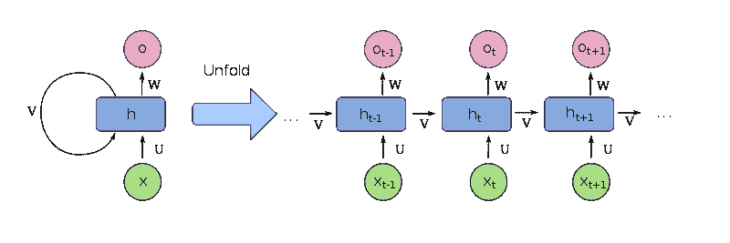
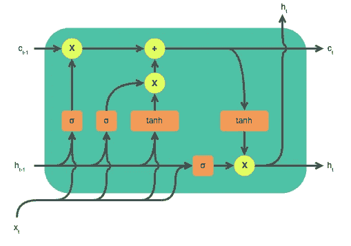
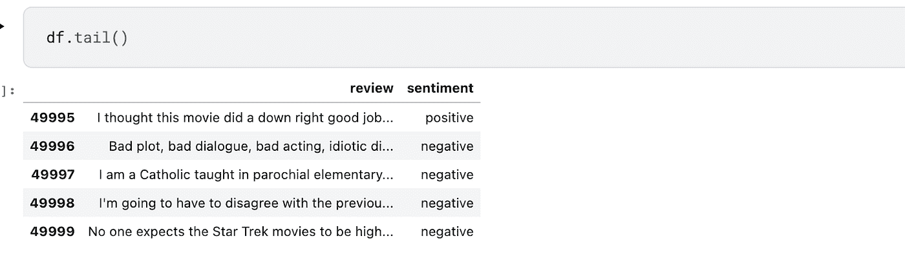
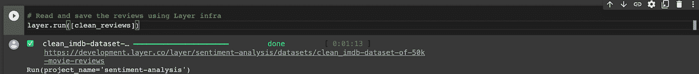
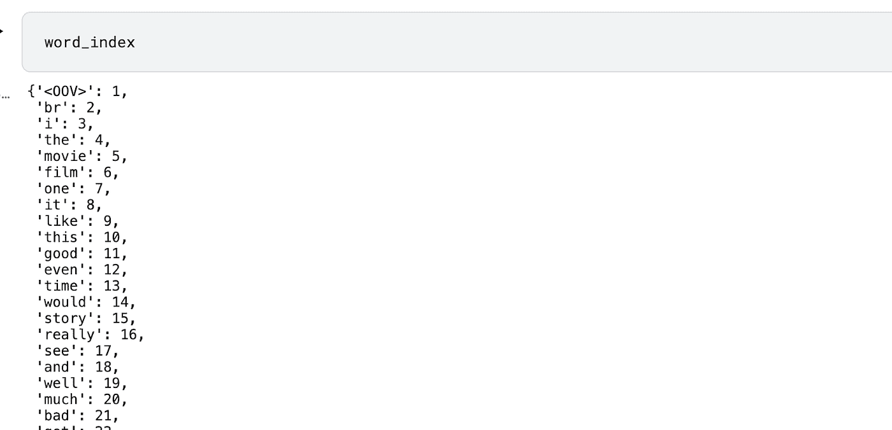
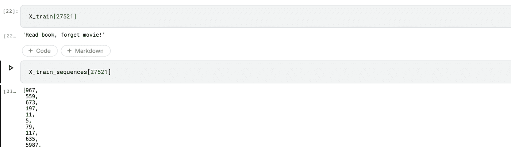
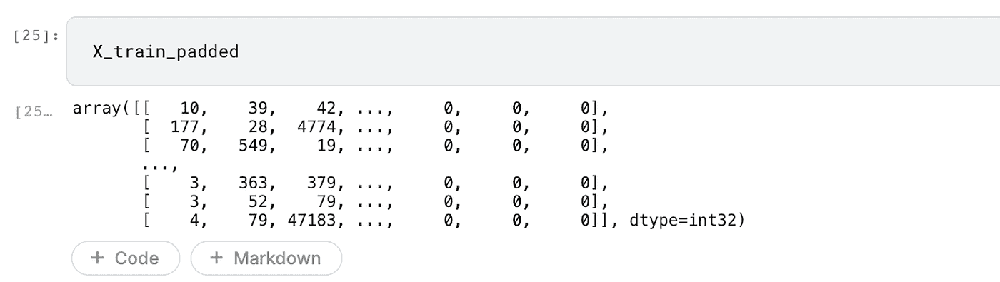
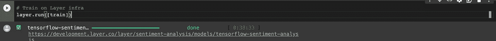

# 递归神经网络(RNNs)入门

> 原文：<https://towardsdatascience.com/getting-started-with-recurrent-neural-network-rnns-ad1791206412>

## 使用 RNNs 进行情感分析


照片由 [Unsplash](https://unsplash.com/photos/jL-gB8uM7NU) 的 [Nishaan Ahmed](https://unsplash.com/@nishaan_ahmed) 拍摄

本文将讨论一组称为递归神经网络(RNNs)的独立网络，用于解决序列或时间序列问题。

让我们开始吧！

# 什么是递归神经网络？

一个**循环神经网络**是一种特殊类别的神经网络，允许信息双向流动。RNN 具有短期记忆，这使它能够在产生输出时考虑先前的输入。短期记忆允许网络保留过去的信息，从而揭示彼此远离的数据点之间的关系。rnn 非常适合处理时间序列和序列数据，如音频和文本。

# RNN 结构

下图显示了 RNN 的结构。



[维基媒体的 RNN 图像开源结构](https://commons.wikimedia.org/wiki/File:Recurrent_neural_network_unfold.svg)

展开的网络产生于为每个时间步长 *t* 创建 RNN 的副本。ht 表示网络在时间 *t，*的输出，而 Xt 是网络在时间 *t* 的输入。

# rnn 的类型

现在让我们简单地提一下各种类型的 rnn。

rnn 主要有四种类型:

*   **单输入单输出的一对一**。
*   **单输入多输出的一对多**，例如图像字幕。
*   **多对一**多输入单输出，例如情感分析。
*   **多对多**多输入多输出，例如机器翻译。

# 递归神经网络是如何工作的？

正如你在上面展开的 RNN 中看到的，RNNs 通过应用**时间** (BPPTT)反向传播来工作。以这种方式，当前和先前输入的权重被更新。通过将误差从最后一个时间步长传播到第一个时间步长来更新权重。因此，计算每个时间步长的误差。

rnn 不能处理长期依赖。在很长的时间步长中会出现两个主要问题:消失梯度和爆炸梯度。

# RNN 挑战——消失的梯度问题

当用于计算权重的梯度开始*消失时，消失梯度出现，*意味着它们变成接近零的小数字。结果就是网络不学习。与此相反的是爆炸梯度问题。

爆炸梯度问题通过[剪切梯度](https://www.tensorflow.org/api_docs/python/tf/clip_by_norm)来解决。消失梯度问题由某种类型的 rnn 解决，这种 rnn 可以处理长期依赖性，例如，[长短期记忆(LSTMs)](https://www.tensorflow.org/api_docs/python/tf/keras/layers/LSTM) 。

# LSTMs

递归神经网络有几种变体。这里有几个例子:

*   **长短期记忆(LSTM)** 通过引入*输入、输出、*和*忘记*门解决了消失梯度问题。这些网关控制着网络中保留的信息。
*   **门控循环单元(GRU)** 通过引入重置和更新门来处理消失梯度问题，重置和更新门决定在整个网络中保留哪些信息。

在本教程中，我们主要关注 LSTMs。LSTMs 可以处理长期依赖关系，更适合处理长序列问题，如情感分析。例如，在一个长的电影评论中，在决定评论的情绪时，记住评论的开始是很重要的。想想评论，“这部电影相当慢，有些角色相当无聊，但总的来说，这是一部非常有趣的电影。”如果你只考虑这篇评论的第一部分，你会给它贴上负面评论的标签。然而，在评论快结束时，观众说这部电影很有趣。



[维基媒体开源 LSTM 图片](https://commons.wikimedia.org/wiki/File:LSTM_cell.svg)

# 为情感分析实现 LSTMs

接下来，让我们在 TensorFlow 中实现用于情感分析的 LSTM。我们将使用 Kaggle 上著名的 50K 电影评论的 IMDB 数据集。该数据集在斯坦福大学网站上公开发布。

我们将使用[层](http://layer.ai)获取数据并运行项目。因此，第一步是验证图层帐户并初始化项目。

`get_dataset`函数可用于获取数据集。



接下来，让我们定义一个从评论中删除常用词的函数。

现在让我们使用上面的函数来清理评论。我们可以保存清理后的数据集，这样就不会再次重复这个过程。

将数据集保存到层是通过用 [@dataset](https://docs.app.layer.ai/docs/sdk-library/dataset-decorator) 装饰器装饰函数来完成的。`pip_requirements`装饰器用于传递运行该函数所需的包。

执行上述函数将保存数据并输出一个可用于查看的链接。



# 文本预处理

由于数据是文本形式的，我们需要将其转换成数字表示。此外，我们必须做到以下几点:

*   删除特殊字符和标点符号。
*   将评论转换成小写。

我们可以使用来自 [TensorFlow](https://www.tensorflow.org/api_docs/python/tf/keras/preprocessing/text/Tokenizer) 的 Tokenizer 类来执行上述所有操作。这是通过创建该类的一个实例并在训练集上安装它的`fit_on_texts`方法来实现的。在这样做的时候，我们定义了一个词汇表之外的标记，在以后将文本转换为序列时，这个标记将用于替换词汇表之外的单词。默认情况下，分词器会保留最常用的单词，但是，这可以使用`num_words`参数来覆盖。

此时，每个单词都被映射为一个整数表示。这被称为*单词索引*，可以通过调用分词器上的`*word_index*` 来查看。



如果我们可以保存这个标记器，这样我们就不必在这个数据集上再次训练标记器，那就太好了。让我们创建一个函数来保存这个记号赋予器。我们使用 [@model decorator](https://docs.app.layer.ai/docs/sdk-library/model-decorator) ，因为该函数返回一个模型。 [@fabric decorator](https://docs.app.layer.ai/docs/sdk-library/fabric-decorator) 决定了函数执行的环境类型。

执行上述函数将训练记号赋予器并保存它。

# 创建文本序列

既然每个单词都有一个整数表示，我们需要为每个评论创建一个序列表示。这是由`texts_to_sequences`函数完成的。我们获取刚刚保存的记号赋予器，并将其用于该操作。

下图显示了一个评论及其数字表示:



# 填充文本序列

处理这些评论的挑战之一是它们的长度不同。但是，我们稍后要构建的 LSTM 神经网络希望数据长度相同。我们通过定义每个评论的最大长度并截断它们来解决这个问题。之后，我们用零填充最大长度以下的评论。填充可以在评论的开始(前)或结束(后)进行。`pad_sequences`是从 [TensorFlow](https://www.tensorflow.org/api_docs/python/tf/keras/preprocessing/sequence/pad_sequences?authuser=1) 中得到的预处理方法。

填充后的数据如下所示:



在创建 LSTM 模型之前，让我们将数据捆绑到一个 [TensorFlow 数据集](https://www.tensorflow.org/api_docs/python/tf/data/Dataset)中。

# 定义 LSTM 模式

准备好数据后，我们可以创建一个简单的 LSTM 网络。为此，我们将使用 [Keras 顺序 API](https://keras.io/api/models/sequential/) 。该网络将由以下主要构件组成:

*   一个[**嵌入层**](https://keras.io/api/layers/core_layers/embedding/) **。**单词嵌入是单词在密集向量空间中的表示。在该空间中，语义相似的单词一起出现。例如，这有助于情感分类，因为负面词汇可以捆绑在一起。

Keras 嵌入层希望我们传递词汇表的大小、密集嵌入的大小和输入序列的长度。该层还在迁移学习中加载预训练的单词嵌入权重。

*   [**双向 lstm**](https://keras.io/api/layers/recurrent_layers/bidirectional/)允许数据从两边通过，即从左到右和从右到左。两个方向的输出连接在一起，但可以选择求和、求平均值或相乘。双向 LSTMs 帮助网络学习过去和未来单词之间的关系。

当如下定义两个 LSTM 时，第一个必须返回将传递给下一个 LSTM 的序列。

现在让我们将上述操作捆绑到一个单一的训练函数中。该函数将返回 LSTM 模型。为了保存这个模型、它的度量和参数，我们用@model decorator 包装它。

执行上述函数训练并保存模型。它还记录函数中定义的所有项目，如训练和验证准确性。



经过训练的模型现在可以对新数据进行预测了。

# 最后的想法

在本文中，我们已经讨论了递归神经网络及其变体。特别是，我们涵盖了:

*   什么是递归神经网络？。
*   一种递归神经网络的结构。
*   与注册护士合作的挑战。
*   如何在 TensorFlow 和[层](http://layer.ai)实现 LSTM？

[在 LinkedIn](https://www.linkedin.com/in/mwitiderrick/) 上关注我，了解更多技术资源。

## 资源

[Colab 笔记本](https://colab.research.google.com/github/layerai/examples/blob/main/sentiment-analysis/sentiment_analysis.ipynb)

*图片经许可使用。*

*数据集引用*

```
@InProceedings{maas-EtAl:2011:ACL-HLT2011,
  author    = {Maas, Andrew L.  and  Daly, Raymond E.  and  Pham, Peter T.  and  Huang, Dan  and  Ng, Andrew Y.  and  Potts, Christopher},
  title     = {Learning Word Vectors for Sentiment Analysis},
  booktitle = {Proceedings of the 49th Annual Meeting of the Association for Computational Linguistics: Human Language Technologies},
  month     = {June},
  year      = {2011},
  address   = {Portland, Oregon, USA},
  publisher = {Association for Computational Linguistics},
  pages     = {142--150},
  url       = {http://www.aclweb.org/anthology/P11-1015}
}
```