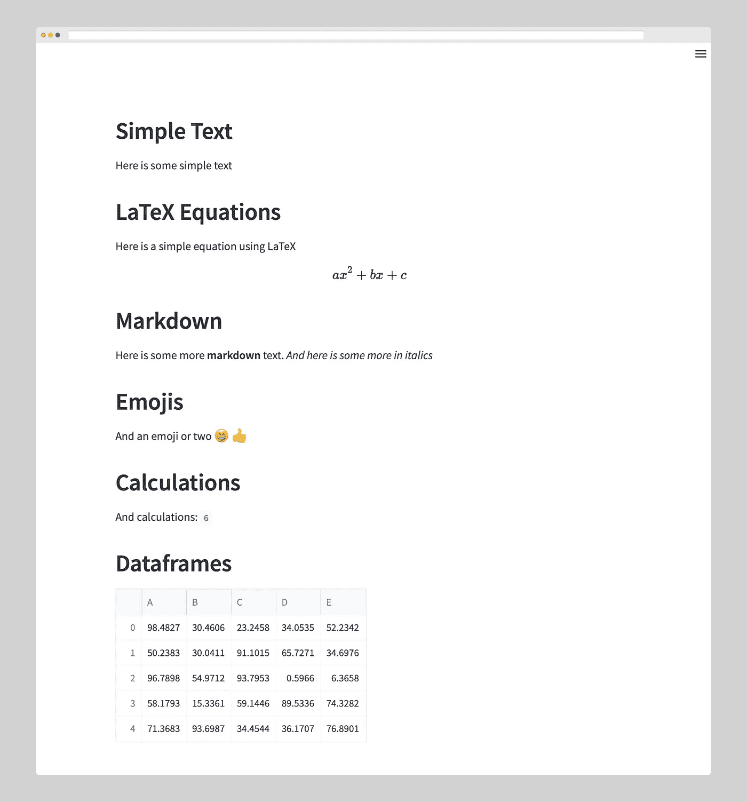
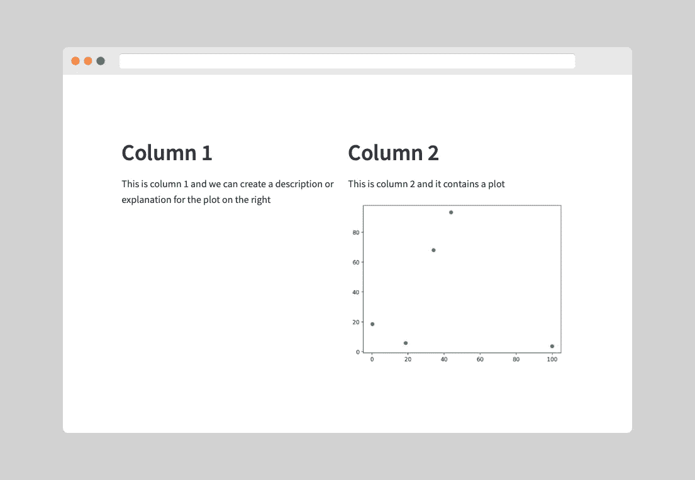
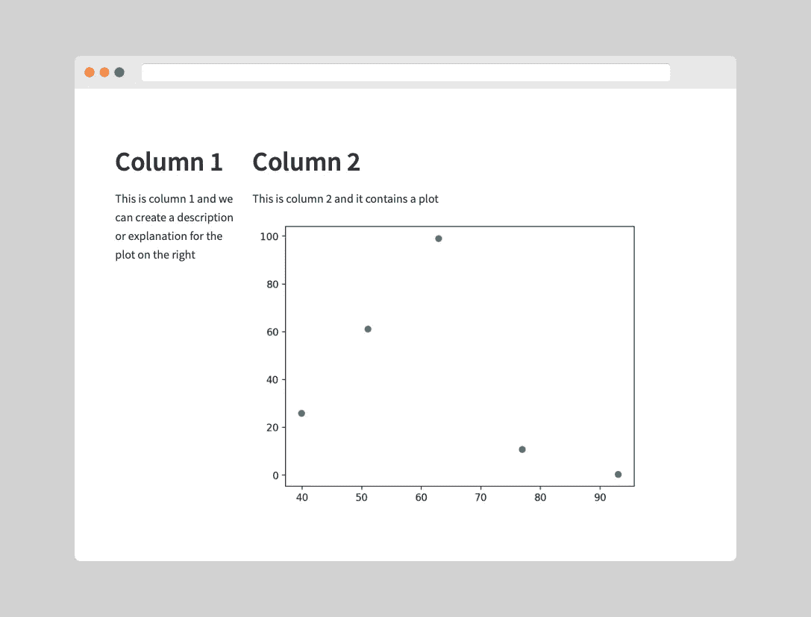
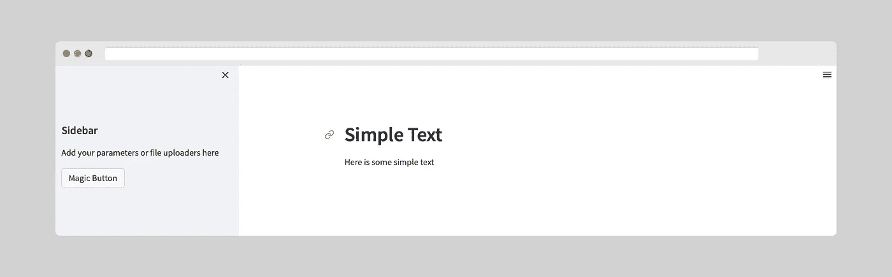
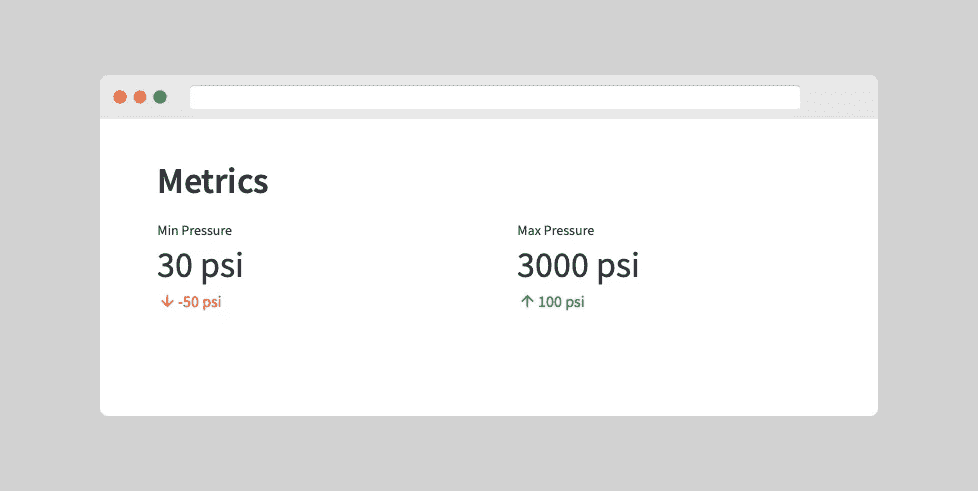

# 开始使用 Streamlit:开始使用时需要知道的 5 个功能

> 原文：<https://towardsdatascience.com/getting-started-with-streamlit-5-functions-you-need-to-know-when-starting-out-b35ed7d872b9>

## 利用这 5 项功能简化您的简化学习


克里斯蒂娜·莫里路摄于 Pexels。

[Streamlit](https://streamlit.io/) 是一个基于 Python 的开源框架，允许您轻松创建和部署交互式数据科学仪表盘和机器学习模型。

该库和公司由一群前谷歌工程师于 2018 年成立，他们认识到数据科学家和机器学习专业人员在开发和部署交互式仪表盘和模型时面临的挑战。作为回应，他们创建了 Streamlit 作为解决方案来简化流程，并使其更容易被更广泛的用户使用。

[Streamlit](https://streamlit.io/) 建立在 Python 之上，它支持许多常用于数据科学和机器学习的主流 Python 库，如 [matplotlib](https://matplotlib.org/) 、 [plotly](https://plotly.com/) 和 [pandas](https://pandas.pydata.org/) 。

要全面了解 Streamlit 的功能，请务必点击下面的链接查看其全面的文档。

[](https://docs.streamlit.io/library/get-started) [## 开始-简化文档

### 下载安装可帮助您设置虚拟环境，并引导您在…上安装 Streamlit

docs.streamlit.io](https://docs.streamlit.io/library/get-started) 

在本文中，我们将了解开始使用 Streamlit 必不可少的 5 个功能。使用下面的目录跳转到您感兴趣的部分。

[最通用的细流功能:st.write()](#cbc7)
[用 st.columns()](#878e)
∘ [控制细流列的宽度](#a83b)
[用 st.siderbar()](#7b42)
[整理你的 App 用 ST . file _ uploader()](#db52)
∘[用 st.file_uploader()](#db27)
∘上传多个文件

# 安装 Streamlit

在运行 Streamlit 应用程序之前，我们首先需要安装库。如果您使用的是 PIP，只需使用下面的命令即可。

```
pip install streamlit
```

一旦安装了 Streamlit，我们可以创建一个名为`app.py`的新文件，并开始向其中添加我们的代码。

要运行代码，我们需要在终端中输入以下内容:

```
streamlit run app.py
```

这将在您的默认浏览器中启动 Streamlit。

# 最通用的 Streamlit 函数:st.write()

这是 Streamlit 中最通用的功能之一，也是您开始使用时首先遇到的功能之一。

在帮助文档中，该函数被描述为“Streamlit 命令的瑞士军刀”。当你开始使用它的时候，你会发现它是多么的万能。

有了`st.write()`我们就可以进去了:

*   文本
*   减价
*   乳液
*   熊猫数据框
*   带有文本和变量的多个参数
*   图表对象
*   表情符号
*   计算

下面的代码演示了`st.write()`函数的不同应用。

```
import streamlit as st
import pandas as pd
import numpy as np

# Simple Text
st.header('Simple Text')
st.write('Here is some simple text')

# Latex
st.header('LaTeX Equations')
st.write("""Here is a simple equation using LaTeX
$$
ax^2 + bx + c
$$
""")

# Markdown
st.write('## Markdown')
st.write('Here is some more **markdown** text. *And here is some more in italics*')

# Emojis
st.header('Emojis')
st.write('And an emoji or two :smile: :thumbsup:')

# Calculations
st.header('Calculations')
a = 3
b = 3
st.write('And calculations:', a + b )

# Dataframes
st.header('Dataframes')
arr_data = np.random.default_rng().uniform(0, 100, size=(5,5))
df = pd.DataFrame(arr_data, columns=list('ABCDE'))

st.write(df)
```

当我们运行上面的代码时，我们得到下面的页面。



使用 Streamlit st.write()函数可以实现的功能示例。图片由作者提供。

# 使用`st.columns()`将列添加到您的 Streamlit 应用程序

开始使用 Streamlit 应用程序时，您显示的任何内容都包含在一列中。这对于一些简单的应用程序来说可能没问题，但是如果您想要创建稍微复杂一点的布局呢？

这就是`[st.columns()](https://docs.streamlit.io/library/api-reference/layout/st.columns)`功能发挥作用的地方。

由于 Streamlit 没有创建网格的本地方法，我们可以使用这个函数开始向我们的应用程序添加列。

```
# Creating a dataframe with random values in 5 columns
arr_data = np.random.default_rng().uniform(0, 100, size=(5,5))
df = pd.DataFrame(arr_data, columns=list('ABCDE'))

# Creating a simple figure
fig, ax = plt.subplots(1,1)
ax.scatter(x=df['A'], y=df['B'])

col1, col2 = st.columns(2)

with col1:
    st.write('## Column 1')
    st.write("""This is column 1 and we can create a description or 
    explanation for the plot on the right""")

with col2:
    st.write('## Column 2')
    st.write('This is column 2 and it contains a plot')
    st.pyplot(fig)
```

当我们运行我们的应用程序时，我们现在看到两列:



使用 st.columns()创建的包含两列的 Streamlit 应用程序。图片由作者提供。

或者，我们可以删除`with`语句，直接在列对象上添加方法，如下所示:

```
col1.write('## Column 1')
col1.write("""This is column 1 and we can create a description or 
    explanation for the plot on the right""")

col2.write('## Column 2')
col2.write('This is column 2 and it contains a plot')
col2.pyplot(fig)
```

## 控制细流列的宽度

如果我们想要控制这些列的宽度，我们可以将一个列表传递给`st.columns()`函数。在这个例子中，我使用了`[1,3]`，这意味着 Streamlit 将生成 2 列。第二列的宽度将是第一列的三倍。

```
col1, col2 = st.columns([1,3])

with col1:
    st.write('## Column 1')
    st.write("""This is column 1 and we can create a description or 
    explanation for the plot on the right""")

with col2:
    st.write('## Column 2')
    st.write('This is column 2 and it contains a plot')
    st.pyplot(fig)
```



使用 st.columns()创建的具有 2 个不同宽度列的 Streamlit 应用程序。图片由作者提供。

# 使用 st.siderbar()整理您的应用程序

当你开始用 Streamlit 构建更大的应用程序时，你可能会发现它变得杂乱，并且很难找到你放在页面上的任何小部件。

在我们的 Streamlit 应用程序上有一个侧边栏(以类似于传统网页的方式),允许我们将关键输入参数、文件上传器和导航全部放在 Streamlit 应用程序的左侧。

要为我们的 Streamlit 应用程序创建侧边栏，我们只需调用`st.sidebar`，然后调用任何标准的 Streamlit 函数。

```
# Sidebar
st.sidebar.header('Sidebar')
st.sidebar.write('Add your parameters or file uploaders here')
st.sidebar.button('Magic Button')

# Main Section
st.header('Simple Text')
st.write('Here is some simple text')
```

当这段代码运行时，我们可以看到我们已经将应用程序分成了两部分。左侧包含侧边栏，右侧是我们的主要部分，我们可以在这里显示图表、数据等等。



Streamlit 应用程序中的侧边栏。图片由作者提供。

如果你想知道如何使用侧边栏来创建导航菜单，那么看看我几个月前分享的下面这篇文章:

[](/creating-true-multi-page-streamlit-apps-the-new-way-2022-b859b3ea2a15) [## 创建真正的多页面简化应用——新方式(2022 年)

### 制作多页简化应用程序的最新方法

towardsdatascience.com](/creating-true-multi-page-streamlit-apps-the-new-way-2022-b859b3ea2a15) 

# 使用 st.file_uploader()上传文件

Streamlit 为您提供了允许应用程序用户上传文件的功能。与对加载过程进行硬编码相比，这是一种更好的加载数据的方式。

要创建一个文件上传小部件，我们可以调用`st.file_uploader()`并传入一些参数。在这个例子中，我们可以使用 label 参数来提供关于用户应该上传什么的信息。

```
st.header('File Uploader')
uploaded_file = st.file_uploader(label='Please upload your file')
```

运行上面的代码将创建一个基本的文件上传器小部件。


Streamlit 应用程序中的文件上传器小部件。图片由作者提供。

Streamlit 中的文件上传程序已经预先格式化，因此您不需要使用任何 CSS 或 HTML 来增强其外观。

## 使用 st.file_uploader()上传多个文件

如果我们想允许上传多个文件，我们可以添加一个`accept_multiple_files`参数，并将其设置为真:

```
st.header('File Uploader')
uploaded_file = st.file_uploader(label='Please upload your file',  
accept_multiple_files=True)
```

## 使用 st.file_uploader()限制文件格式

如果我们想将文件上传限制到特定的文件扩展名，我们可以添加`type`参数并传入一个文件扩展名列表:

```
st.header('File Uploader')
uploaded_file = st.file_uploader(label='Please upload your file', 
type=['.png', '.jpg', '.gif'])
```

# 使用 st.metric()显示关键指标

构建仪表板时，通常需要显示数据集中的关键指标或值。这可以让你轻松地与读者交流，让他们一目了然地了解关键信息。

您可以用`st.write()`函数来实现这一点，但是这样做需要几行代码和使用 markdown。

为了简化关键指标的显示，我们可以使用`st.metric()`功能。

该函数接受一个标签、一个值(可以是您之前计算的变量)和一个增量(值的变化)。

```
st.header('Metrics')

col1, col2 = st.columns(2)

with col1:
    st.metric(label="Min Pressure", value="30 psi", delta="-50 psi")

with col2:
    st.metric(label="Max Pressure", value="3000 psi", delta="100 psi")
```

当我们运行我们的应用程序时，我们将看到我们的关键指标。每个指标的增量也会显示出来，并根据是负变化还是正变化进行颜色编码。



使用 st.metrics()在 Streamlit 仪表板上显示关键指标。图片由作者提供。

# 摘要

Streamlit 是一款功能强大、用户友好的工具，可以轻松创建和访问用于数据科学和机器学习的仪表盘。创建一个 Streamlit 应用程序相对简单，有了这 5 个关键功能，你就可以马上开始了。

*感谢阅读。在你走之前，你一定要订阅我的内容，把我的文章放到你的收件箱里。* [***你可以在这里做！***](https://andymcdonaldgeo.medium.com/subscribe)**或者，您也可以* [***注册我的简讯***](https://fabulous-founder-2965.ck.page/2ca286e572) *免费将更多内容直接发送到您的收件箱。**

*其次，通过注册会员，你可以获得完整的媒介体验，并支持我和其他成千上万的作家。每月只需花费你 5 美元，你就可以接触到所有精彩的媒体文章，也有机会通过写作赚钱。*

**如果你用* [***我的链接***](https://andymcdonaldgeo.medium.com/membership)**报名，你直接用你的一部分费用支持我，不会多花你多少钱。如果你这样做了，非常感谢你的支持***