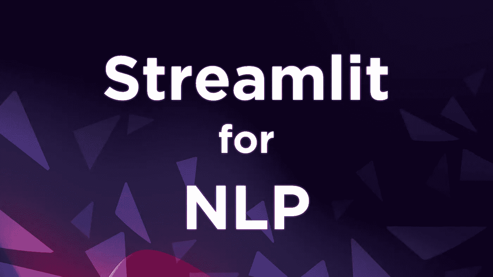
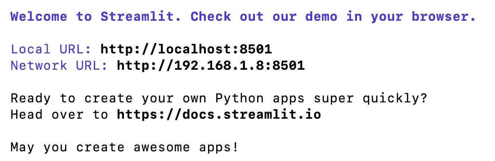
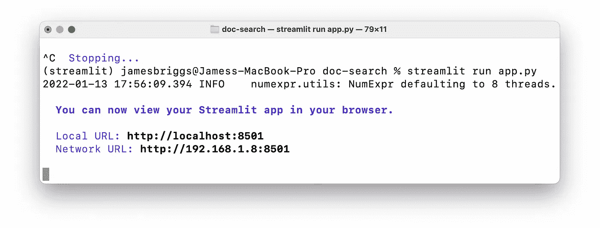
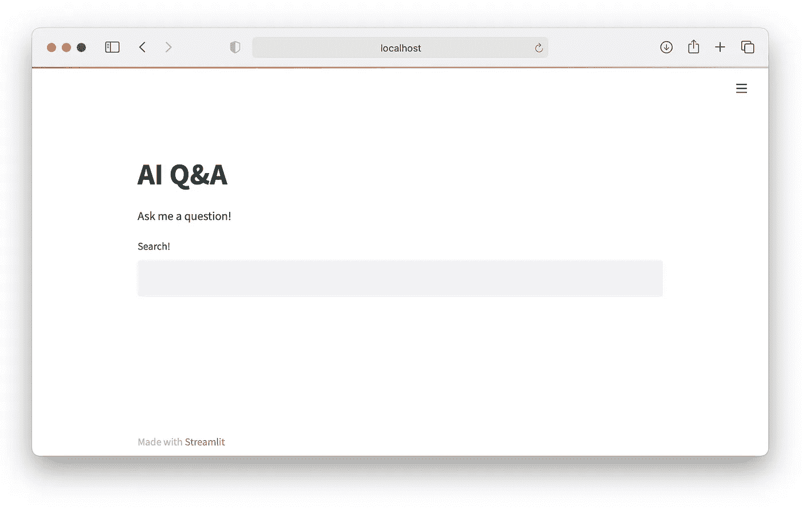
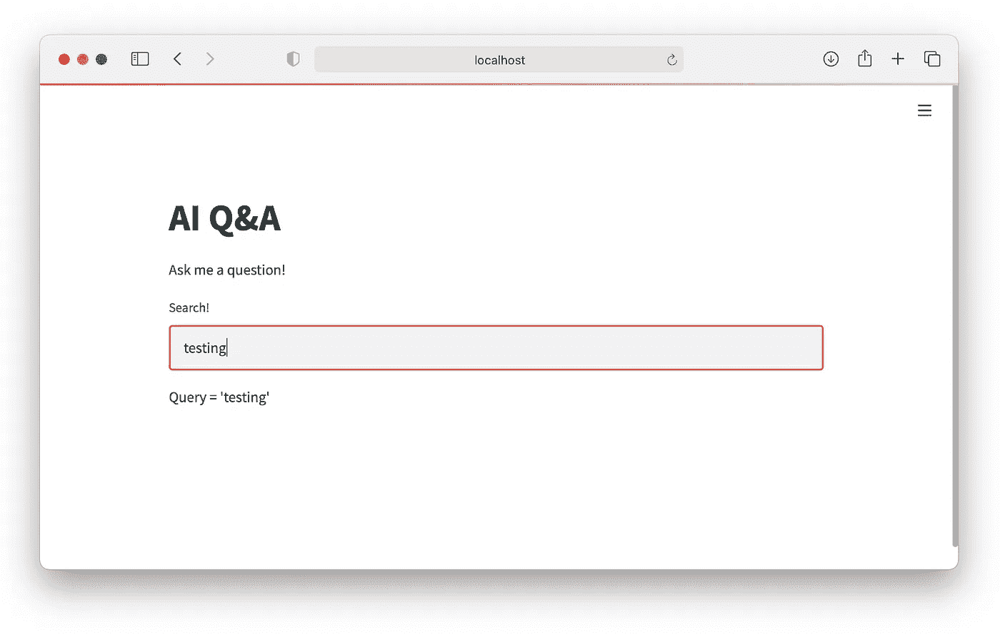
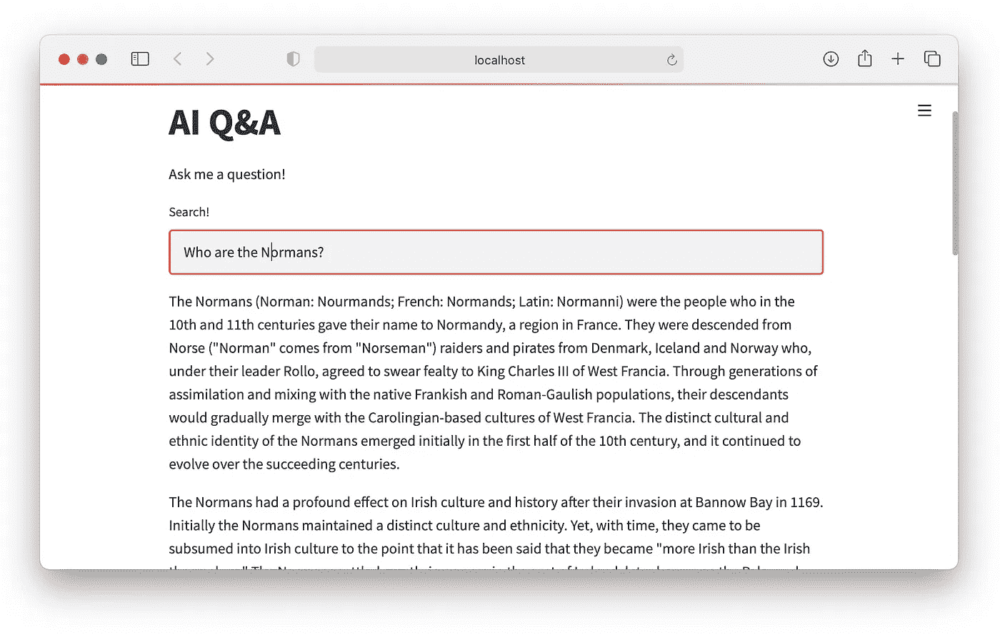
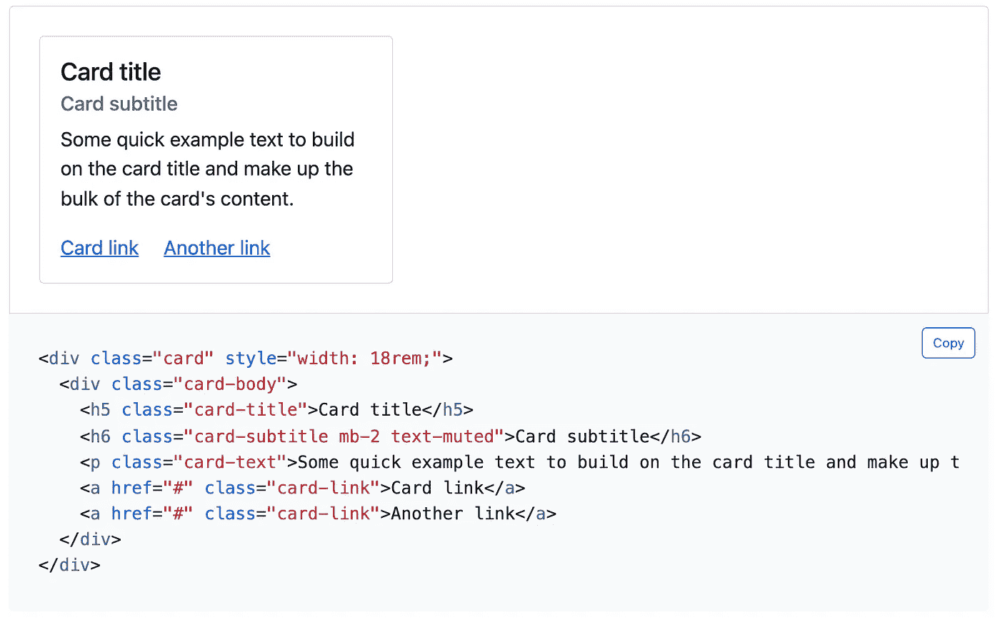
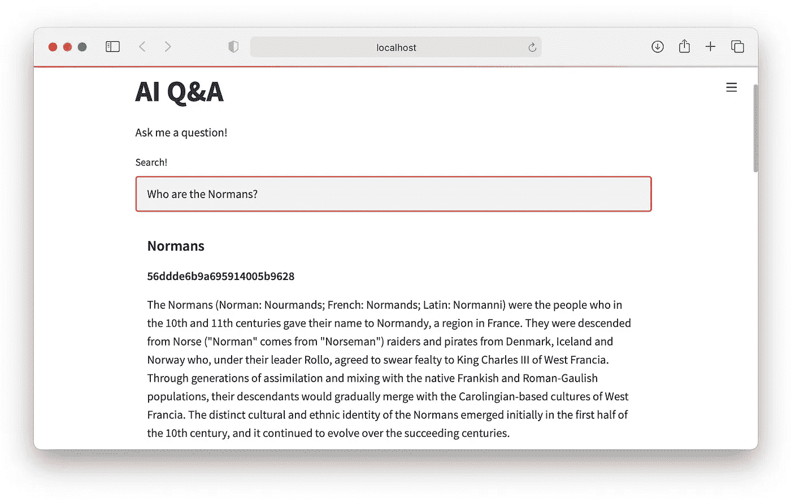
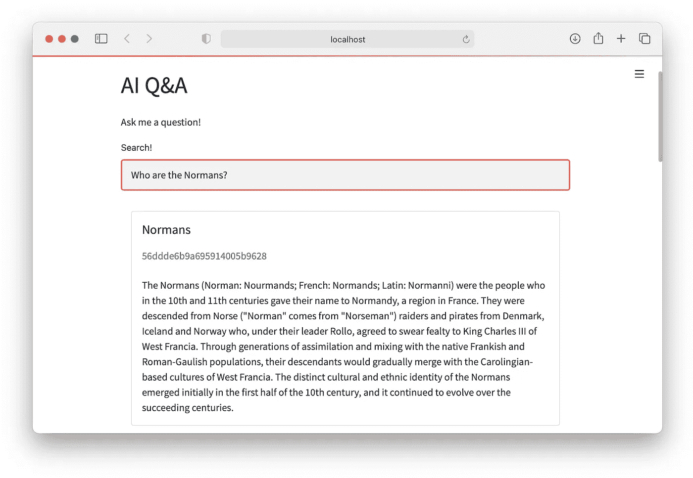

# NLP 的 Streamlit 入门

> 原文：<https://towardsdatascience.com/getting-started-with-streamlit-for-nlp-75fe463821ec>

## 轻松构建生产就绪的 NLP 应用



背景由 [Fakurian 设计](https://unsplash.com/@fakurian?utm_source=medium&utm_medium=referral)于 [Unsplash](https://unsplash.com?utm_source=medium&utm_medium=referral) 上，由作者编辑。

Streamlit 已经证明了自己是一个非常受欢迎的工具，可以快速组装高质量的面向 ML 的 web 应用程序。最近，它在生产环境中被越来越大的组织广泛采用。

所有这些都意味着现在是利用 Streamlit 获取经验的最佳时机。幸运的是，Streamlit 的基础非常容易学习，对于大多数工具来说，这将比您需要的更多！

在本文中，我们将通过构建一个通用知识问答界面来介绍 Streamlit。我们将了解关键的 Streamlit 组件，如`write`、`text_input`、`container`。如何使用 Bootstrap 之类的外部库快速创建新的 app 组件？并使用缓存来加速我们的应用程序。

# 简化设置

开始时，我们需要打开一个终端窗口并编写`pip install streamlit`。我们可以检查所有安装了`streamlit hello`的东西，它应该显示这样一条信息:



在(希望)打开一个新的浏览器窗口之前。


如果您已经做到这一步，Streamlit 现在已经成功安装，我们可以继续使用 Streamlit 构建一些东西。

# 智能搜索框

我们将建立一个智能语义搜索工具，由句子转换器和松果的矢量数据库在幕后驱动。

在初始化这两个组件之前，我们将创建一个搜索组件的“模型”。首先，我们为我们的应用程序创建一个新目录，并添加一个包含我们应用程序核心的文件`app.py`。

在`app.py`中，我们可以添加标题、描述和搜索栏。

为了了解这是怎么回事，我们打开一个终端窗口，导航到包含`app.py`的目录，然后编写`streamlit run app.py`。



如果我们在浏览器中输入上述地址之一，我们应该会看到类似这样的内容:



超级简单，我们在这里所做的就是以 markdown 格式写一个标题和段落文本，然后 Streamlit 将它转换成一个格式良好的网页。

```
# Q&A AppAsk me a question!
```

现在我们需要一个输入框，这样我们的用户可以问一个问题。和以前一样，这是超级容易做到的。

然后我们使用文本输入框 Streamlit 组件`st.text_input`。我们将文本输入提示设置为`"Search!"`，默认值为空字符串`""`。

我们在输入框中输入的任何内容都将存储在`query`变量中。因此，我们可以通过再次使用`st.write`并写入`query`的内容来检查这一点。



每当我们输入新的内容并按下 *Enter* 时，`Query = '<something>'`就会用我们的新查询进行更新。这个更新过程表明了 Streamlit 的执行逻辑。当 Streamlit 发现应用程序中的某些内容发生变化时，会从头到尾重新运行完整的脚本。

在我们向我们的应用程序添加任何东西之前，我们将删除`Query = '<something>'`行，并添加 Q &检索器和松果矢量数据库组件。

# 聪明的部分

我们已经准备好了大部分的 Streamlit 接口。那么，让我们来看看应用程序的 NLP 组件。

我们的目标是给定一个文本数据语料库(在这种情况下，我们使用维基百科文章)，我们希望能够提出一个问题，并返回一段相关的文本(一个*上下文*)。

NLP 部分是利用一种自然语言问答的风格，叫做[***O****pen****D****domain****Q****uestion-****A****nswering*(ODQA)](https://www.pinecone.io/learn/question-answering/)。一个完整的实现需要三个组件；向量数据库、检索器和阅读器。

对于我们当前的范围，我们将重点关注前两个组件:

*   **MPNet 检索器模型**，它将把我们现有的段落(上下文)*和*查询编码成向量。
*   **松果向量数据库**，它存储我们的上下文向量，并允许在给定查询向量的情况下搜索这些向量。

首先，我们需要创建上下文向量，并将它们推送到向量数据库中。我们不会深入细节，但是可以在这里找到代码。

在此代码中，我们:

1.  使用 HuggingFace *数据集*从 SQuAD v2 数据集下载我们的上下文。
2.  使用`pinecone/mpnet-retriever-squad2`检索器模型对它们进行编码以创建*上下文向量*。
3.  通过`upsert`将上下文向量推送到松果向量数据库(这需要[一个免费的 API 密钥](https://app.pinecone.io))。

完成后，我们继续在应用程序中集成检索功能。代码与上面类似，但是这次我们不是下载上下文，也不是初始化一个新的向量数据库索引。

这一次，我们需要做的就是初始化检索器，并初始化到`qa-index`松果索引的连接。

实现了 ODQA 管道的前两个组件后，我们的`app.py`脚本如下所示:

回到我们的浏览器，我们现在应该能够问一个问题并返回五个相关段落或*上下文*。



这是我们应用的核心。让我们继续改进它的性能以及如何显示结果。

# 表演

当我们将句子转换器和松果组件添加到应用程序中时，整个应用程序变慢了。这样做的原因是，正如我们前面提到的，每当*发生任何变化*时，Streamlit 都会重新加载整个脚本。

幸运的是，Streamlit 通过在应用程序重新加载之间缓存应用程序的部分内容，提供了避免重新加载应用程序的方法。

要做到这一点，我们需要将我们想要缓存的进程放在函数内部。然后我们用`@st.experimental_singleton`来修饰这些函数，如下所示:

现在，当我们第一次加载我们的应用程序时，可能需要一些时间来加载检索器模型并初始化我们与松果的连接。但是一旦我们开始搜索，Streamlit 就再也不会重新加载这些组件，使得搜索速度快得令人难以置信。

# 让结果看起来不错

为了让我们的结果看起来更好，我们将使用来自 Bootstrap 框架的预构建组件。这些非常容易使用，我们所做的就是找到我们想要使用的组件，例如[这些卡](https://getbootstrap.com/docs/5.1/components/card/)，然后将 HTML 代码复制到我们的应用程序中。



我们用 Python 变量替换了代码的相关部分，添加了返回的上下文、标题和 ID。这些是在我们迭代松果调用返回的每个结果时生成的。



我们的卡看起来不像我们看到的引导卡。这是因为我们没有设置任何引导 CSS 样式。如果我们回头看卡片 HTML，我们可以看到几个`class="something"`参数。这些控件控制卡片的外观，但是它们依赖于一个外部 CSS 文件。

要将这些引导 CSS 类添加到我们的应用程序中，我们需要做的就是在脚本的顶部添加一行 HTML 代码:

这一行拉入一个`bootstrap.min.css`文件，允许我们使用所有的引导 CSS 类。如果我们回到我们的浏览器窗口，我们会看到我们光滑的新卡片。



在此基础上，我们使用 Streamlit、句子转换器和 Pinecone 设计了一个开放领域 QA web 应用程序的核心组件。

当然，对于这种支持 ML 的 web 应用，我们还可以做更多的*——这是我们很快就会探索的事情。*

*同时，你可以通过[这个链接](https://jamescalam.medium.com/subscribe)获得最新的文章。我还在 YouTube 上上传 ML 和 NLP 的每周视频。*

*感谢阅读！*

*🎁[面向语义搜索的 NLP 免费课程](https://www.pinecone.io/learn/nlp)*

*🤖[带变形金刚课程的 NLP 70%折扣](https://bit.ly/nlp-transformers)*

*[文章笔记本脚本](https://github.com/jamescalam/dhivehi_nlp/blob/main/examples/00_create_dv_base/01_tokenizer_components.ipynb)*

***所有图片均由作者提供，除非另有说明**