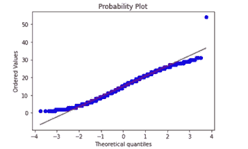
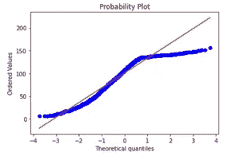

# 文本/自然语言处理可视化入门

> 原文：<https://towardsdatascience.com/getting-started-with-text-nlp-visualization-9dcb54bc91dd>

## 了解如何可视化文本数据来传达您的故事


来自[像素](https://www.pexels.com/ko-kr/photo/1714208/)的免费使用照片

# 介绍

自然语言处理(NLP)有多种定义，但我经常引用的一个定义如下:

> *NLP 致力于建造能够理解和响应文本或语音数据的机器，并用它们自己的文本或语音做出响应，就像人类做的一样。[1]*

由于在众多应用程序、平台和机构中生成的文本数据量不断增加，NLP 市场正在快速增长。因此，知道如何从文本数据中传达有意义和有趣的故事是至关重要的。为此，你需要视觉化。在这篇文章中，让我们学习如何开始可视化文本数据。更先进的预处理和可视化文本数据的方法将在另一篇文章中介绍！

# 文本基本概要统计的可视化分布

表格数据的“汇总统计”概念同样适用于文本数据。汇总统计帮助我们描述数据的特征。在文本数据的上下文中，此类统计数据可以是组成每个文本的字数，以及统计数据在整个语料库中的分布情况。为了观察分布，我们可以使用可视化方法，包括核密度估计(KDE)图和直方图等。但是为了介绍哪些统计数据可以被可视化。hist()函数用在所有的代码片段中。

假设我们有一个评论数据集，其中包含一个名为“description”的变量，该变量中有文本描述。

## **【1】每段文字的长度**

```
reviews[‘description’].str.len().hist()
```

## **【2】****每篇文字字数**

```
# .str.split( ) returns a list of words split by the specified delimiter
# .map(lambda x: len(x)) applied on .str.split( ) will return the number of split words in each textreviews[‘description’].str.split().map(lambda x: len(x)).hist()
```

另一种方法是:

```
reviews[‘description’].apply(lambda x: len(str(x).split())).hist()
```

## **[3]每个文本中唯一的字数**

```
reviews[‘description’].apply(lambda x: len(set(str(x).split()))).hist()
```

## **[4]每个文本中的平均单词长度**

```
reviews[‘description’].str.split().apply(lambda x : [len(i) for i in x]).map(lambda x: np.mean(x)).hist()
```

另一种方法是:

```
reviews[‘description’].apply(lambda x: np.mean([len(w) for w in str(x).split()])).hist()
```

## **[5]每个文本中的中值单词长度(分布)**

```
reviews[‘description’].apply(lambda x: np.median([len(w) for w in str(x).split()])).hist()
```

## **【6】停止字数统计**

NLP 上下文中的停用词指的是频繁出现在语料库中但对理解文本的各个方面(包括情感和极性)没有添加太多意义的一组词。例如代词(例如他、她)和冠词(例如 the)。

检索停用词主要有两种方法。一种方法是使用 NLTK 包，另一种方法是使用 wordcloud 包。在这里，我使用 wordcloud 包，因为它已经在一个名为“停用词”的子模块中预定义了一整套英语停用词。

```
from wordcloud import STOPWORDS### Other way to retrieve stopwords# import nltk# nltk.download(‘stopwords’)# stopwords =set(stopwords.words(‘english’)) reviews[‘description’].apply(lambda x: len([w for w in str(x).lower().split() if w in STOPWORDS])).hist()
```

## **【7】字符数**

```
reviews[‘description’].apply(lambda x: len(str(x))).hist()
```

## **【8】标点数**

```
reviews[‘description’].apply(lambda x: len([c for c in str(x) if c in string.punctuation])).hist()
```

## 额外收获:检查常态

对于新创建的统计变量(如平均单词长度)，您可能希望检查它们是否满足某些条件，例如，某些模型或回归算法要求变量符合某些分布。一种这样的检查是通过查看概率图来检查变量的分布是否足够接近正态分布。

```
**from** scipy **import** stats
**import** statsmodels.api **as** smstats.probplot(reviews['char_length'], plot=plt)
```



接近正态分布的分布示例



不接近正态分布的分布示例。

# **可视化顶部 N-Grams**

什么是 n-gram？根据斯坦福大学的语音和语言处理课程材料，一个“n-gram 是一个文本句子中 n 个单词的序列 n-gram。”[2]

例如，句子“我很酷”的二元模型(n-gram，n=2)将是:

```
[ (‘I’, ‘am”), (‘am’, ‘cool’)]
```

为了可视化最频繁出现的顶部 N 元文法，我们需要首先将我们的词汇表表示成某种数字矩阵形式。为此，我们使用了*计数矢量器。*根据 Python 的 scikit-learn 包文档，“Countvectorizer 是一种将文本文档集合转换为令牌计数矩阵的方法。”[3]

下面的函数首先将文本矢量化成某种适当的矩阵形式，其中包含记号(这里是 n 元文法)的计数。请注意，可以指定参数 stop_words，以便在进行计数时忽略指定语言的停用词。

```
**def** ngrams_top(corpus, ngram_range, n=None): *### What this function does: List the top n words in a vocabulary according to occurrence in a text corpus.* vec = CountVectorizer(stop_words = ‘english’, ngram_range=ngram_range).fit(corpus) bag_of_words = vec.transform(corpus) sum_words = bag_of_words.sum(axis=0) words_freq = [(word, sum_words[0, idx]) for word, idx **in** vec.vocabulary_.items()] words_freq =sorted(words_freq, key = lambda x: x[1], reverse=True) total_list=words_freq[:n] df = pd.DataFrame(total_list, columns=[‘text’,’count’]) **return** df
```

下面的函数将 ngram_range 指定为(1，1)，所以我们只对基本上只是单个单词的单字元感兴趣。这里 n=10 意味着我们有兴趣查看描述语料库中的前 10 个单字。

```
unigram_df = ngrams_top(reviews[‘description’], (1,1), n=10)
```

然后，我们可以使用 seaborn 将其可视化为一个水平条形图。

```
# seaborn barplotsns.barplot(x=’count’, y=’text’) #horizontal barplot
```

如果你想使用稍微花哨一点的交互式可视化形式，我推荐 plotly express，它的语法非常简单，但能让你用几行代码创建交互式可视化。

```
# fancier interactive plot using plotly express**import** plotly.express **as** pxfig = px.bar(unigram_df, x='unigram', y='count', title=’Counts of top unigrams', template='plotly_white', labels={'ngram;: ‘Unigram’, ‘count’: ‘Count’})fig.show()
```

更先进的预处理和可视化文本数据的方法将在另一篇文章中介绍！

# 关于作者

*数据科学家。加州大学欧文分校信息学博士生。*

*密歇根大学刑事司法行政记录系统(CJARS)经济学实验室的前研究领域专家，致力于统计报告生成、自动化数据质量审查、构建数据管道和数据标准化&协调。Spotify 前数据科学实习生。Inc .(纽约市)。*

他喜欢运动、健身、烹饪美味的亚洲食物、看 kdramas 和制作/表演音乐，最重要的是崇拜我们的主耶稣基督。结账他的 [*网站*](http://seungjun-data-science.github.io) *！*

# 参考

【1】什么是自然语言处理？、IBM 云、[https://realpython.com/python-assert-statement/](https://www.ibm.com/cloud/learn/natural-language-processing)

[2]朱拉夫斯基和马丁。语音和语言处理(2021 年 12 月最后更新)。https://web.stanford.edu/~jurafsky/slp3/3.pdf

[3] Scikit 学习文档。[https://sci kit-learn . org/stable/modules/generated/sk learn . feature _ extraction . text . count vectorizer . html](https://scikit-learn.org/stable/modules/generated/sklearn.feature_extraction.text.CountVectorizer.html)