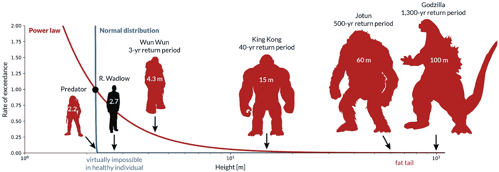
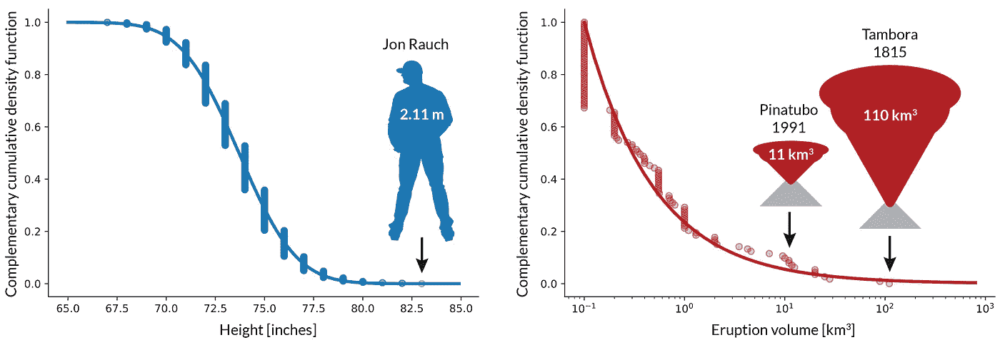
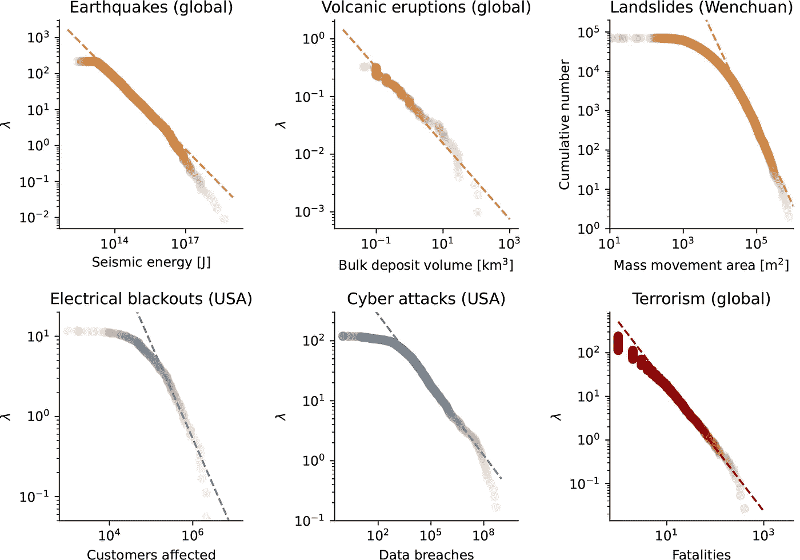

# 两个概率分布故事中的巨人

> 原文：<https://towardsdatascience.com/giants-in-a-tale-of-2-probability-distributions-38e968dda10e>



米格南的“灾难性巨人”比喻(2022)。

## **用灾难性的巨大隐喻理解正态分布和幂律分布尾部之间的差异(Python 代码)**

从前有正态分布，这种分布描述了日常生活的“正常”过程:人的身高、智商测试结果、股票市场的每日波动。但是在看似平常的一天，地震发生了，一颗陨石从天而降，股票市场崩溃了。**极端事件比看起来更频繁地发生。这里出现了自然本身的幂律，它代表了复杂系统的正常行为，使得正态分布几乎成为一个误称。数学家伯努瓦·曼德尔布罗早就通过分形的概念对此进行了诊断。如今，一个令人惊讶的负面结果的常见隐喻是黑天鹅，它统治着纳西姆·塔勒布的“极端斯坦”省，远离平静的“中等斯坦”。不要再向均值回归，再也没有均值了！"*如果你在处理来自极端地区的数量，你将很难计算出任何样本的平均值，因为它在很大程度上取决于一次观察。这个想法并不比那个*(Taleb，2007:34)更难。**

这是一个关于两种概率分布*的故事，也是一个**练习，旨在通过使用每天观察到的量，即个人身高，来理解罕见事件(遵循幂律)的频率。**

冠军的巨人还没有出现，但是很快就会来拜访我们。正态分布定义为


在互补累积密度函数(CCDF)的情况下，具有平均值和σ标准差。例如，对于美国职业棒球大联盟运动员的身高分布(图 1，左侧)，我们得到的平均值为 1 米 87，标准偏差为 6 厘米。利用 68–95–99.7 规则，仅考虑上尾部，我们得到 Pr(> + 3σ = 2m 05) = 0.0015。乔恩·劳奇身高 2 米 11，是美国职业棒球大联盟历史上最高的球员。他是我们正态分布中的尾部事件，是一个“4-sigma 事件”(注意，美国成年男性的平均值是 69 英寸或 1 米 75；Fryar 等人，2021 年:表 12)。



**图 1 |** 左:美国职业棒球大联盟球员身高的正态分布，均值 73.7 英寸，标准差 2.3 英寸。右图:幂指数为 1.63 的火山喷发规模的幂律分布(数据来源—左图:[统计在线计算资源(SOCR)1035 条记录的数据集](http://wiki.stat.ucla.edu/socr/index.php/SOCR_Data_MLB_HeightsWeights) [，](http://wiki.stat.ucla.edu/socr/index.php/SOCR_Data_MLB_HeightsWeights,)右图:来自全球大规模爆炸性火山喷发数据库 LaMEVE 的 1000 年至 2011 年期间的喷发；Crosweller 等人，2012 年)。图转载自米格南(2022)。

至于 CCDF 幂律，它最简单的函数形式是


其中，α是幂指数，x0 是最小阈值。幂指数的最大似然估计为


以火山爆发的大小分布为例(图 1，右)，我们得到α = 1.63。大多数其他危险，自然的和人为的，也可以用幂律分布来描述:从地震到恐怖主义，通过山体滑坡，停电和网络攻击(图 2)。



**图 2 |** 以年费率λ或累计数定义的各种风险的幂律大小分布。数据来源:地震:1900-2012 年国际地震中心-全球地震模型(ISC-GEM)全球仪器地震目录(Storchak 等人，2013 年)。火山爆发:1000–2014 年全球大规模爆炸性火山爆发数据库(LaMEVE) (Crosweller 等人，2012 年)。滑坡:2008 年中国汶川地震引发的事件清单(徐等，2014)。停电:美国 1984 年至 2002 年间受停电影响的客户数量数据集(Clauset 等人，2009 年)。网络攻击:2005–2018[隐私权利信息交换机构(PRC)分类黑客/恶意软件目录](https://privacyrights.org/data-breaches)。《恐怖主义:1968 年 2 月至 2006 年 6 月全球恐怖袭击数据集》(Clauset 等人，2009 年)。图转载自米格南(2022)。

为了便于说明，假设棒球运动员的身高分布代表了世界人口，我们可以通过将 CCDF 乘以世界人口(约 80 亿)来估计身高 X 或更高的人口比例。对于 X = 2m 21，我们得到 31 个个体，这非常接近来自不同国家的 27 ' [个最高的活着的人](https://en.wikipedia.org/wiki/List_of_tallest_people#Tallest_living_people_from_various_nations)，具有相同的 X 阈值。顺便说一下，2 米 21 是扮演丘巴卡的彼得·梅靥和扮演捕食者的凯文·彼得·豪尔的身高。对于 X = 2m 25，我们得到 0.4，尽管考虑了 21。注意分布对标准偏差微小变化的敏感性。如果我们使用 sigma = 6 cm 而不是拟合结果 5.86 cm，我们将获得略多于一个的个体。增加到 6.5 厘米，我们得到 25 个人。在我们的一生中，看到一个高于 2 米 30 的男人的几率下降到 0.001–0.2，为 5.86 < σ < 6.50 cm。罗伯特·瓦德洛(1918-1940)，也被称为奥尔顿巨人，是有记录以来最高的人，身高 2 米 72，离圣经中的巨人歌利亚(2 米 97)不远。然而，他是一个明显的异数，在我们有生之年看到他的机会是 6x10^(–38)–2.6x10^(–29).考虑到所有曾经踏上地球的人类对结果的改变很小，因为累积的世界人口估计约为 1000 亿。这表明，过早死亡的极高的人不在健康的人类生理范围之内。事实上，罗伯特·瓦德洛和历史上的其他破纪录者都患有肢端肥大症。

我们注意到，对于健康人群来说，这种可能性下降得有多快。观察 80 亿人口，我们观察(并模拟)了大约 30 个个体，大小和食肉动物凯文·彼得·豪尔差不多(2 米 21)。再增加几厘米，那么大的体型几乎不可能出现。在正常情况下，在我们的日常习惯中，钟形曲线决定了我们的感知。**但是如果高度遵循与自然和人为灾难相同的分布呢？比方说，我们多久能看到一个 3 米的巨人？10 米高的巨人怎么样？？这是一个重要的思想实验，因为**这样的隐喻巨人实际上不时以灾难的形式拜访我们**。有时，它们会让人大吃一惊(例如，塔勒布的“埃斯特雷米斯坦”省的黑天鹅)。**

我们的思想实验相当简单，定义如下。

(1)我们进入巨人领域的锚点将是 X0 = 2m 21 处的捕食者，单位时间内的发生率固定为 1(为方便起见，我们将采用年发生率)。每年，一个 X0 大小的巨人都会出现在世界上的某个地方，然后再次消失在某个藏身之处。“小巨人”造成了严重的破坏，但没有什么是像阿诺德·施瓦辛格这样的英雄所不能控制的。同样，按照正常的高度分布，几乎不可能看到更大的东西(例如，塔勒布平静的“中等王国”)。

(2)火山爆发规模的幂律分布将通过定义灾难的“高度”提供一种连接到正态分布的方法——我们的巨人！—作为喷发体积 V 的球体的直径(回想一下图 1 的右图，我们也将使用相同的幂指数)。为了简单起见，我们在这里将绕过所有的异速生长规则。我们还将假设事件“高度”和释放的破坏性能量之间的比例关系。同样，这个练习的目的是通过使用每天观察到的量，即个体的身高，来理解罕见事件(遵循幂定律)的频率。

因此，如果一年观察到一次捕食者，身高遵循幂律分布，那么《权力的游戏》的 Wun Weg Wun Dar Wun(4.3 米)可能每 3 年拜访我们一次，金刚(15 米)每 40 年一次，佐敦(巨魔猎人中的 60 米)每 500 年一次，哥斯拉(100 米)每 1300 年一次。不像正态分布那样几乎不可能！这如图 3 所示。尽管幂律分布的概率 Pr(≥X)在线性 y 轴图上似乎趋于零，但与正态分布相比，概率衰减足够慢，极端事件并非不可能发生。


**图 3 |** “灾难性巨人”比喻——幂律与正态分布，以及占据幂律胖尾的巨人。图转载自米格南(2022)。

使用正态分布而不是幂律分布的错误可能会对人们的钱包产生直接影响。事实上，使用现代投资组合理论(假设回报遵循高斯分布)，我们可以预测 1987 年黑色星期一类型的事件在 5.2 亿年中发生一次！(索尔内特，2003 年:16)。经验观察提供证据表明，这种崩溃可能每几十年发生一次，符合幂律。那次坠机是不是 Wun Wun 事件？一个金刚事件？人们现在可以想象未来可能出现的“巨人”的大小类别。

*-“两个分布的故事”(如哈里森，1981 年)及其双关语“两个分布的尾巴”指的是查尔斯·狄更斯 1859 年的小说“双城记”，其中“最好的时代”是正态分布，“最坏的时代”是管理灾难大小分布的幂律。

## Python 代码片段

```
# complementary CDF for normal distribution
def CCDF_norm(x, mu, sd):
    return .5 * scipy.special.erfc((x - mu) / (sd * numpy.sqrt(2)))# complementary CDF for power-law distribution
def CCDF_pow(x, xmin, alpha):
    return (x / xmin)**(-(alpha - 1))# power exponent from maximum likelihood estimation method
def get_alpha(x, xmin):
    ind = x >= xmin
    alpha = 1 + len(x[ind]) / numpy.sum(numpy.log(x[ind] / xmin))
    return alpha# import data
X = ... a 1D numpy array of a given quantity ...# empirical CCDF
X = numpy.sort(X)
CCDF_X = 1 - numpy.linspace(0, 1, len(X))# for function plotting: for linear or log x-axis
Xi_lin = numpy.arange(xmin, xmax, xbin_lin)
Xi_log = 10 ** numpy.arange(numpy.log10(xmin), \
                            numpy.log10(xmax), xbin_log)# Normal distribution scenario
mu = X.mean()
sig = X.std()
CCDFi_norm = CCDF_norm(Xi_lin, mu, sig)# Power-law distribution scenario
Xmin = numpy.min(X)
alpha = get_alpha(X, Xmin)
CCDFi_pow = CCDF_pow(Xi_log, Xmin, alpha)
```

## 参考

Clauset A，Shalizi CR，Newman M (2009)，经验数据中的幂律分布。*暹罗评论*，51(4)，661–703

Crosweller 等人(2012 年)，全球大规模爆炸性火山爆发数据库(LaMEVE)。*应用火山学杂志*，1，4

Fryar CD，Carroll MD，Gu Q，Afful J，Ogden CL (2021)，儿童和成人的人体测量参考数据:美国，2015–2018。【https://www.cdc.gov/nchs/data/series/sr_03/sr03-046-508.pdf 国家卫生统计中心，生命健康统计，3(46)——

哈里森 A (1981)，收益的大小:两次分配的故事。*经济研究评论*，XLVIII，621–631 页。

米格南 A (2022)，*巨灾风险建模介绍*。准备中的教科书。

Sornette D (2003)，关键市场崩溃。*物理报告*，378，1–98。

Storchak 等人(2013 年)，公开发布的 ISC-GEM 全球仪器地震目录(1900-2009 年)。*地震研究快报*，84，810–815。

塔勒布·N(2007)，*《黑天鹅:极不可能事件的影响*。美国纽约市兰登书屋。

徐 C，徐 X，姚 X，戴 F (2014)，2008 年 5 月 12 日汶川 7.9 级地震诱发滑坡的三次(近)完整清查及其空间分布统计分析。*山体滑坡*，11，441–461。

## 关于作者

A.米格南是灾难风险建模副教授，发表了 70 多篇同行评议文章，并在机器学习和灾难风险的 TDS 上发表了几篇文章。他在 2021 年在他的课程'*巨灾风险建模介绍*'(教材编写中，截至 2022 年 5 月)中首次引入了巨灾的比喻。