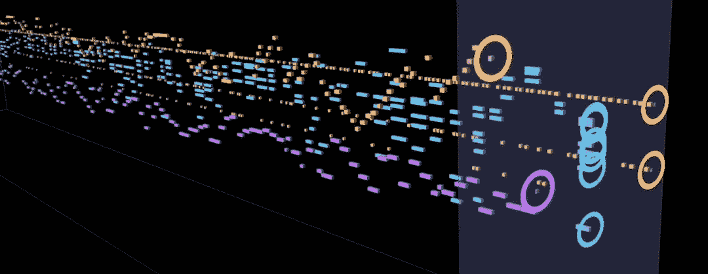
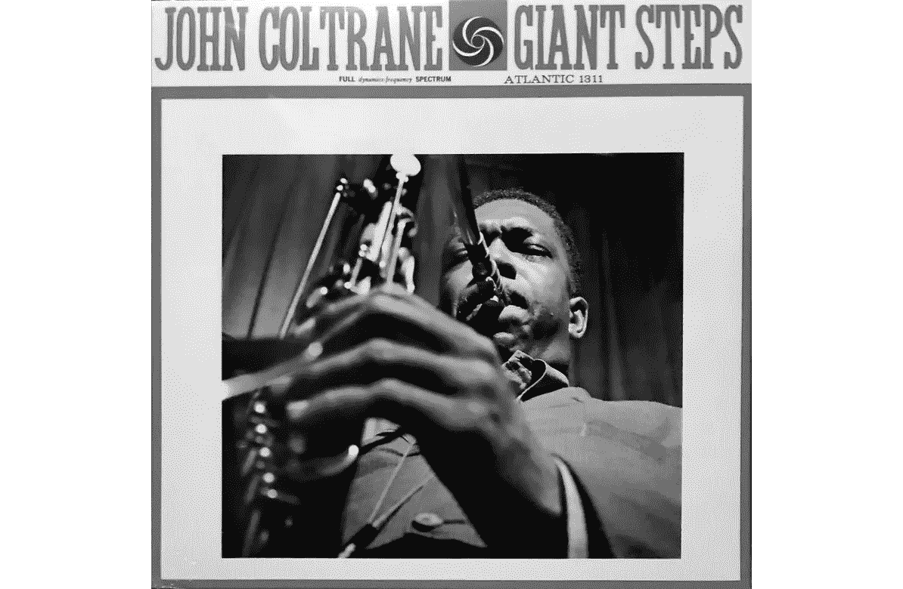
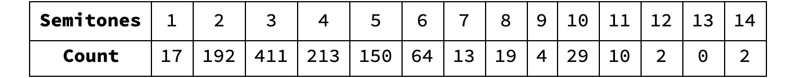
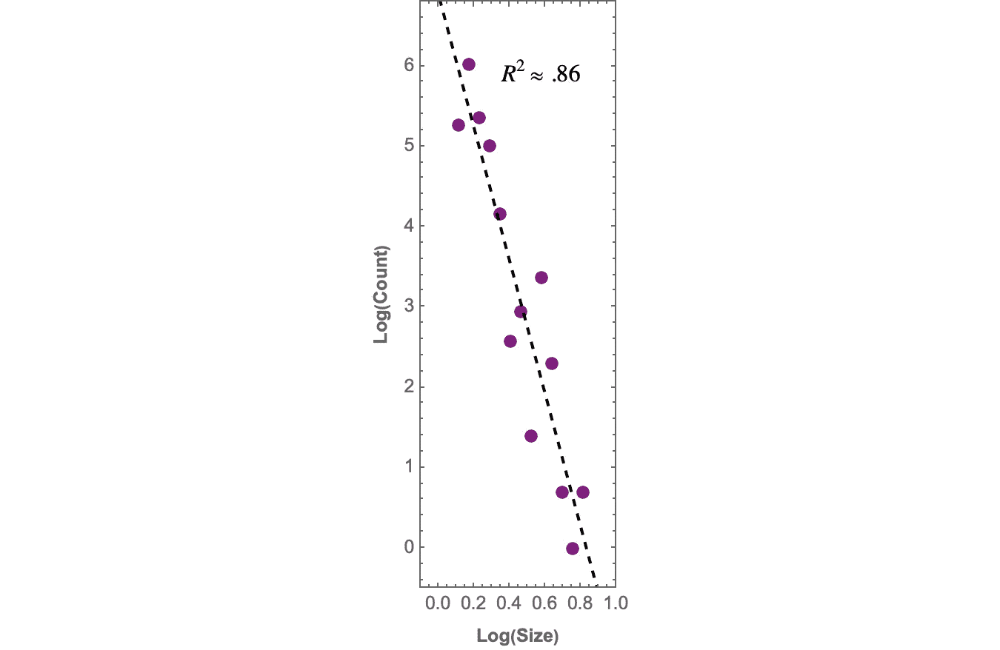
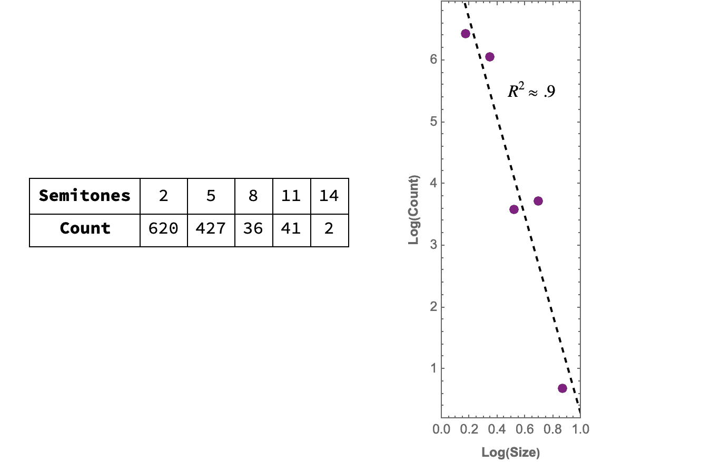
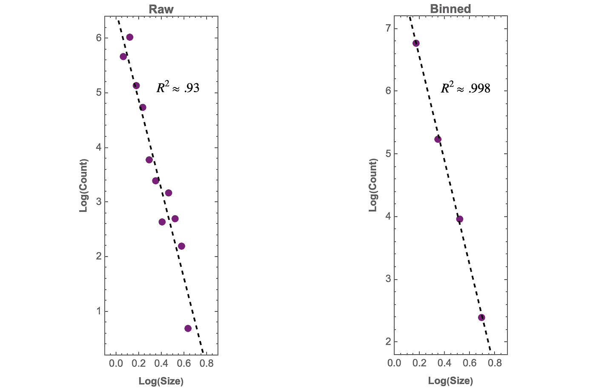

# 巨人的脚步:约翰·科尔特兰标志性独奏的分形结构

> 原文：<https://towardsdatascience.com/giants-steps-the-fractal-structure-of-coltranes-iconic-solo-706ee8c8e79e>

## 音乐作为数据系列

## 在 Coltrane 著名的独奏中，音程相关数据的分布是幂律在起作用的一个极好的例子

巨型台阶动画中的一帧(图片由作者提供)

当你开始看到音乐的可能性时，你会渴望为人们做些好事，帮助人类从困境中解脱出来。

—约翰·科尔特兰(1926 年至 1967 年)

约翰·柯川在他的作品《巨大的台阶》中的即兴创作，最早录制于 1959 年，是爵士乐历史上开创性的唱片之一。在一首 16 小节的歌曲中有 26 个和弦变化。在这段相对较短的时间里，音调中心在三个键(B、G 和 Eb)之间总共变化了 10 次。加上大约每分钟 291 拍的快速节奏，平稳即兴创作的能力被广泛认为是顶级爵士乐手与其他人区分的基准。

约翰·科尔特兰 1960 年发行的专辑《大踏步》。(灰度，原始图像由 [Ged Carroll](https://www.flickr.com/photos/renaissancechambara/) ，CC 由 4.0)

事实是，Coltrane 的独奏旋律优美，措辞流畅。对于区间相关数据的分布，它也是幂律关系的一种极好的表现。下面是一个动画，提供了一个进入独奏结构的动态窗口。每个乐器的数据表示为时间序列，其高度对应于音符值，长度对应于音符持续时间。为了视觉上的清晰，每个仪器相对于彼此的范围的基线被调整。

观看动画时，通过观察橙色萨克斯管音符之间的垂直间距分布，可以直观地了解我们想要测量的结构。总的来说，小型跳跃多，中型跳跃少。这些都被相对较少的大跳跃打断。数量和大小之间的这种关系可以用幂律精确地描述。

## 幂律

幂律是研究分形几何的一个基本属性。它们描述了两个变量之间的关系，即一个变量与另一个变量的幂成比例。例如，动物代谢率的异速生长可以通过关系式*代谢率* = *k* ⋅(weight)^(3/4).来确定从星系分布到财富分布，幂律是自然科学和社会科学中各种现象的基础。

它们也可能出现在音乐的许多特征中，如音高、音程、持续时间、节奏变化，以及一种称为*动力音阶*的分形结构形式，其中旋律或节奏主题在不同的时间音阶中同时重复【1】*。*

## 分形音乐

快速搜索术语*分形音乐*会得到一大堆描述。在大多数情况下，结果只是指通过将分形图像映射到音高、持续时间、力度和乐器声音的某种组合而生成的音乐。这种类型的音乐可能会引人注目，但只是将像素映射到音乐声音并不能确保结果具有分形特征。任何这样的假设都类似于期待亨利·沃兹沃斯·朗费罗的一首诗翻译成希腊语时押韵。

伯努瓦·曼德尔布罗有一种强烈的直觉，认为音乐在某种可测量的意义上可以是分形的。鉴于分形几何学首先是几何学，我们有理由将术语*分形音乐*保留给拥有一些明显可测量的缩放属性的音乐。

需要注意的是，分形音乐并不是现代创作。至少在五个世纪前，随着法国-佛兰德作曲家 Josquin des Prez 的作品，动音阶出现。我们现在可以认识到，这部作品是已知的最早的分形音乐作品之一。

和巨步的情况一样，音乐的分形特征往往表现为统计上的自相似分布。在这种情况下，我们在[异质](https://statisticsbyjim.com/basics/heterogeneity/)元素集合的上下文中寻找幂律。这意味着无论我们放大到什么地方，我们都会发现大致相同的尺寸分布。

## 如何发现幂定律

对于大小不一的异质系列旋律音程，{ *s* ₁ *，s* ₂ *，s* ₃ *，* …}，我们可以统计出每种大小音程的个数{ *N* ₁， *N* ₂， *N* ₃，…}，其中 *Nₖ* 对应大小 *sₖ* 。如果当我们绘制出 *Nₖ* 对 *sₖ* 的双对数图时，这些点落在一条直线上，那么这个序列具有旋律音程标度。假设拟合相当好，则该线的斜率可以解释为该组元素的尺寸 *d* 。这是因为取幂律关系的对数将其转换为线性方程:

等式 1

在方程 1 中，如果我们让*y*= Log(N)*x*= Log(1/*s*，那么我们得到的就是一条线的方程，*y*=*MX*+*b*，其中 *d* = *m* 和 *b* =0。有关这种类型的分析及其在音乐中的应用的详细信息，请参见[1，2]。

## 数据

对于萨克斯独奏，我使用了 Jazzomat 研究项目的音高数据。以下是音程的分布，对于一个 *k* 半音的音程，每个音程的大小等于 2^( *k* /12 ):

表 1。约翰·科尔特兰独奏曲《大台阶》的音程分布。对于一个 *k* 半音的音程，每个音程的大小等于 2^( *k* /12)。

数值 2^( *k* /12)来源于西方音乐常用的[等音律](https://www.wikiwand.com/en/12_equal_temperament)音阶的物理学。下面是区间数据图。它产生的尺寸为 *d* ≈8.3:

Coltrane's Giant Steps solo 区间数据的双对数图，表明 d≈8.3。

我们可以使用一种叫做 [*宁滨*](https://www.geeksforgeeks.org/binning-in-data-mining/) 的数据平滑技术，在某种意义上，放松我们的注意力，在这种情况下，获得稍微更好的拟合。我们将把间隔放入大小相等的容器中，每个容器包含大小大致相同的间隔。通常使用最低值、最高值或平均值来分配箱的代表性大小，该选择一致地应用于所有箱。明确地说，虽然宁滨可以帮助揭示幂律的存在，但它不能在不存在幂律的地方产生幂律。

这里是每个仓为三个半音宽的区间分布，以及产生维度为 *d* ≈8 的数据图:

左边是分段间隔数据的分布，以及 d≈8 的数据的双对数图。

R 的值稍微好一点，按照一般的科学标准，肯定是值得尊敬的。然而，我们可以看到，大小和计数之间的关系强度仍然不像我们希望的那样一致，正如代表性大小为 8 和 11 的箱中的计数所证明的那样。这些数字大致相等，事实上，增加而不是减少。

另一方面，当我们观察音程变化的方式时，情况就更清楚了。我们将音程之间的差异称为*旋律瞬间。*如果音程是音高的第一差，那么旋律瞬间就是第二差。下面是原始力矩数据的分布:

表 2

注意，最小的矩大小是 0 个半音，这对应于两个连续音程具有相同大小的情况。以下是原始数据和面元宽度为 3 个半音的面元数据的曲线图:

原始和分段矩数据的双对数图。

原始数据和分级数据显示出与各自的分形维数 *d* ≈8.1 和 *d* ≈8.3 的良好一致性。随着 R 值分别为 0 . 930 和 0 . 998，旋律力矩分布显示了分形结构的明确证据。

## 结束语

当以这种方式分析音乐时，重要的是要记住，一般来说，按照科学标准，我们正在探索的数据集很小。因此，我们在这样一个假设下工作，即在一个旋律的特征和它潜在的音程分布之间有很强的联系。例如，音阶旋律听起来与包含大跳跃的旋律非常不同。从这个意义上说，在音程音阶存在的地方，我们可以断言，一个以相同旋律方式延续的作品也将在几个音阶中继续表现出自相似的元素分布。

几个世纪以来，似乎最伟大的音乐都有一种透明感和永恒感，无论是巴赫还是披头士。我当然不是唯一一个认为约翰·科尔特兰的音乐拥有这些相同品质的人。在某种程度上，他的音乐也反映了他周围的世界，在某种意义上，它表达了他所经历的世界的分形性质，这并不奇怪。

## 参考

[1]伯努瓦·曼德尔布罗 [*中的“分形音乐的本质”:多维度的生活*](https://www.worldscientific.com/worldscibooks/10.1142/8238)【2】[巴赫大提琴组曲中的音程音阶](https://www.researchgate.net/publication/52005995_Intervallic_Scaling_in_the_Bach_Cello_Suites)
【3】[贾佐马研究项目](https://jazzomat.hfm-weimar.de/index.html)

*感谢您的阅读！如果你还没有，你可以考虑成为一名订阅会员，这样你就可以无限制地阅读 Medium 上所有精彩的文章。如果你* [*使用此链接*](https://medium.com/@harlan.j.brothers/membership) *注册，你也可以支持我作为一个作家、研究者、创作者:*

<https://medium.com/@harlan.j.brothers/membership> 