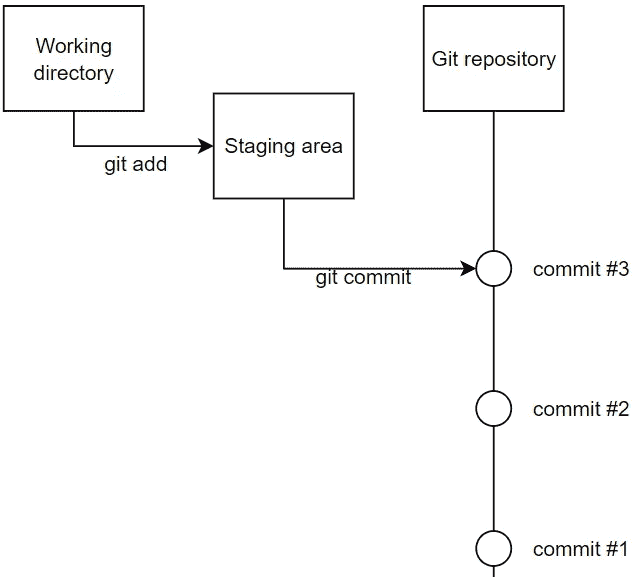
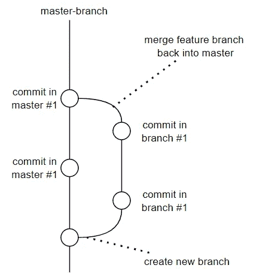

# 绝对初学者的 Git:借助视频游戏理解 Git

> 原文：<https://towardsdatascience.com/git-for-absolute-beginners-understanding-git-with-the-help-of-a-video-game-88826054459a>

## 以一个经典的 RPG 作为类比，获得如何使用 git 的直觉


可以用一个游戏来解释 Git 吗？(图片由[卢卡斯·桑托斯](https://unsplash.com/@_staticvoid)在 [Unsplash](https://unsplash.com/photos/XIIsv6AshJY) 上拍摄)

对于初学者来说，Git 可能有点吓人。有所有这些术语(拉、取、提交、推、远程、起源)，可怕的合并冲突，以及一直存在的对键入错误命令和破坏所有代码的恐惧。

本文的目标是*而不是*列出如何使用 Git 命令的详细解释；有许多文章已经这样做了，还有 Git 文档。**我们的目标是对 Git 最重要的功能有一个直觉，这样你就能以正确的方式管理你的代码。**

为此，我们将浏览最重要的 git 命令，展示一个定义和一个命令，然后用一个几乎每个人都理解的类比来解释它:一个 RPG 视频游戏。

*既然本文会列出一些 git 命令；如果你不熟悉终端的使用，请查看本文* *。*

# 基础知识

让我们首先深入 git 的绝对基础:如何设置它，以及使用最基本的命令。



添加并提交到我们的存储库中(图片由作者提供)

## 1.贮藏室ˌ仓库

当您在包含代码的文件夹中初始化 git 时，会创建一个名为`.git`的(隐藏)文件夹。Git 跟踪并保存对 git 项目文件夹中的任何文件所做的所有更改的历史，保存在`.git`文件夹中。存储库可以存在于您的笔记本电脑上，也可以存在于 GitHub 这样的托管互联网环境中。
`git init`

游戏:把仓库想象成一种特殊类型的保存文件，你角色的每一个动作都可以保存在里面。例如:`lose 5 gold gambling`、`shoots 1 arrow`、`puts on iron helmet`。这很像一个银行账户:不是只存储一个数字(你的余额)，而是存储每笔交易。这样你就可以在每次交易后计算你的余额。在接下来的部分中，我们将检查哪些动作被存储。

## 2.犯罪

创建项目状态的快照。在这里，我们获取对代码所做的所有更改，并在存储库中创建一个条目。添加提供保存状态摘要的提交消息。
`git commit -m "my commit message"`

**游戏**:提交代码就像写一个保存的游戏。如果我们执行前一部分的 3 个动作(`lose 5 gold gambling`、`shoots 1 arrow`、`puts on iron helmet`)，然后退出游戏，这些动作就会丢失。一旦我们将它们保存到我们的保存文件中，它们就是“最终的”。与游戏的不同之处在于我们不会覆盖一个保存文件；我们在旧的基础上创建一个新的。这就是 git 如何跟踪项目中代码的历史记录。

## 3.增加

git commit 命令从临时区域获取所有更改并提交它们。使用 git add，您可以挑选想要添加到临时区域的变更。
`git add filename1.py filename2.txt`或`git add .`

想象一下，在我们保存(提交)我们的游戏(代码)之前，你可以选择哪些动作你想保留，哪些不想保留。在我们的 GitGame 中，我们可以选择我们希望在保存游戏中包含的动作。我们可以`git add shoot_1_arrow put_on_helmet`，忽略`lose 5 gold gambling`。我们将这些动作添加到一个等待区，然后使用`git commit`从这个等待区提取所有动作，并将它们提交到我们的保存文件中

## 4.状态

状态向您展示了您的项目的状态:哪些文件是新的，哪些已经是`added`的，哪些已经提交了。


**游戏**:像统计菜单一样。您将会看到与上次保存相比的统计数据(`collected 55 gold`、`walked 15km`)。此外，它还会显示您希望将这些操作中的哪些保存到下一个保存文件中(这是添加的)。


分支时间(图片由 [Ron Whitaker](https://unsplash.com/@ronwhitaker) 在 [Unsplash](https://unsplash.com/photos/jH_-L1C_o6Q) 上拍摄)

# 分支

有了分支，你(或其他人)可以安全地向你的代码中添加新的特性，并将它们合并回“主游戏”中。



创建和合并分支(作者图片)

## 5.树枝

分支是从主线中分离出来的一条发展线。下面的命令创建一个新的分支并自动切换到那个分支:


**游戏**:在你的游戏中，有一个你一直在尝试却无法完成的支线任务。解决方法是用 u 盘把你的保存文件给你的朋友，这样他就可以完成任务了。与此同时，你继续你的主要任务。你的朋友现在“工作”在你的保存文件的一个新的分支上！

## 6.合并

当你合并时，你将把另一个分支的内容带入当前分支。
`git merge somebranch`

游戏:在之前的例子中，你分支了你的保存文件，这样你的朋友就可以帮你完成那个困难的支线任务。现在，他来拜访您，并带来了包含他的保存文件“分支”的 USB。当我们合并我们的保存文件时，它们被合并成一个文件，所以我们的保存文件现在“包含”了新完成的副业。然而，冲突可能会出现..

## 7.合并冲突

有时，当您合并两个文件时，两个更改会发生冲突。我们不能合并；哪种改变是正确的？

**游戏**:合并前一个例子中的保存文件会导致冲突。当你的角色戴着蓝色头盔，而你朋友的存档中的角色戴着红色头盔；会是哪一个？我们必须通过手动选择来解决合并冲突。IDE 对这个过程有很大的帮助。


让我们合作吧！(图片由[瑞恩·华莱士](https://unsplash.com/@accrualbowtie)在 [Unsplash](https://unsplash.com/photos/0DwCuFqQoKU) 上拍摄)

# 介绍多人游戏

在前面的部分中，我们已经开始在一个项目上合作，但是使用 u 盘不是一个好办法。在这一部分中，我们将了解 Git 如何使团队中的代码协作变得容易，同时保持代码的可访问性并添加版本控制。

游戏:在这一部分我们会学到很多东西。游戏的比喻是这样的:你把你的保存文件放在一个网站上(远程)。你的四个朋友下载(克隆)这个保存文件，每个人完成一个任务(在一个新的分支)。他们上传(推送)他们个人的保存文件。然后我们在网站上将它们合并在一起(拉请求)。

## 8.遥远的

远程:托管在互联网上的公共存储库。想象你上传(见“推送”)到一个“存在”在网站上的存储库中。优点是不同的人使用这个存储库来下载和上传变更。在 GitHub 上，你可以免费存储仓库。

**游戏**:你把你保存的游戏放到一个网站上。人们可以通过下载来访问这个保存文件。人们也可以添加到运动的进展(见下一部分)。

## 9.起源

起源是你的笔记本如何呼叫某个遥控器。它只不过是一个别名。当您在存储库中注册一个远程时，默认情况下 git 会用‘origin’作为它的别名。您可以用其他名称注册多个。

您可以使用`git remote -v`显示您当前的遥控器；通常这会显示一个 GitHub 存储库的 URL，例如:

```
c:\some\folder\cythonbuilder>git remote -v
origin  [https://github.com/mike-huls/cythonbuilder.git](https://github.com/mike-huls/cythonbuilder.git) (fetch)
origin  [https://github.com/mike-huls/cythonbuilder.git](https://github.com/mike-huls/cythonbuilder.git) (push)
```

正如你在上面看到的,“origin”只是 url 的别名。Git 将`git push origin master`翻译成`git push [githuburl] [branchname]`。

## 10.克隆

如果您克隆一个存储库，您会将整个存储库下载到您的笔记本电脑上。`git clone url_to_remote`

## 11.拉

当您提取代码时，您将本地存储库(在您的笔记本电脑上)的状态与远程存储库同步。换句话说:它会下载你笔记本上没有的所有修改。
`git pull`

## 12.推

这会将您在本地所做的更改推送到遥控器。这包含您创建的任何分支。
`git push`

## 13.拉取请求

拉请求:拉请求只不过是合并两个分支的请求。您可以(也应该)添加评审员，他们可以在合并之前检查您的代码并指出错误。好的一面是，如果您在您的分支中修复代码，提交并推送它，拉请求会自动更新。
最终(希望)每个审核者都会批准拉取请求，我们可以将分支合并到目标分支中(例如主分支)


让我们退出游戏，开始 git(图片由[克里斯托弗·保罗·海](https://unsplash.com/@christopherphigh)在 [Unsplash](https://unsplash.com/photos/y7Qq9IrgpOA) 上提供)

# 结论

我希望我已经阐明了 Git 这个奇妙的工具以及它所提供的所有令人惊叹的特性。如果您有建议/澄清，请评论，以便我可以做出改进。同时，请查看我的 [**关于各种编程相关主题的其他文章**](http://mikehuls.com/articles) ，例如:

*   [适合绝对初学者的 Docker](https://mikehuls.medium.com/docker-for-absolute-beginners-what-is-docker-and-how-to-use-it-examples-3d3b11efd830)
*   将你的代码变成一个真正的程序:使用 Docker 打包、运行和分发脚本
*   [用 FastAPI 用 5 行代码创建一个快速自动记录、可维护且易于使用的 Python API](https://mikehuls.medium.com/create-a-fast-auto-documented-maintainable-and-easy-to-use-python-api-in-5-lines-of-code-with-4e574c00f70e)
*   [Python 为什么慢，如何加速](https://mikehuls.medium.com/why-is-python-so-slow-and-how-to-speed-it-up-485b5a84154e)
*   [Python 中的高级多任务处理:应用线程池和进程池并进行基准测试](https://mikehuls.medium.com/advanced-multi-tasking-in-python-applying-and-benchmarking-threadpools-and-processpools-90452e0f7d40)
*   【Cython 入门:如何在 Python 中执行>每秒 17 亿次计算
*   [5 个真正方便的 python 装饰器，用于分析/调试你的代码](https://mikehuls.medium.com/5-real-handy-python-decorators-for-analyzing-debugging-your-code-c22067318d47)

编码快乐！

—迈克

页（page 的缩写）学生:比如我正在做的事情？[跟我来](https://mikehuls.medium.com/membership)！

<https://mikehuls.medium.com/membership> 