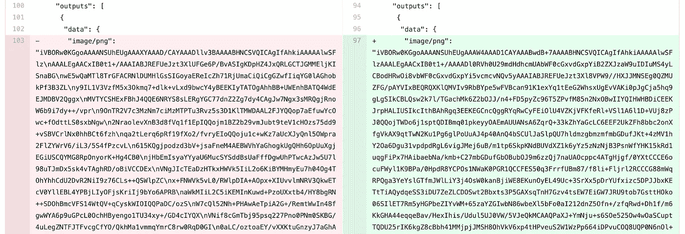
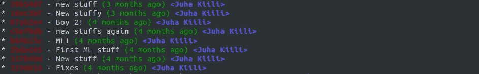
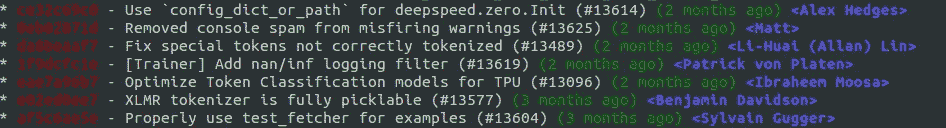
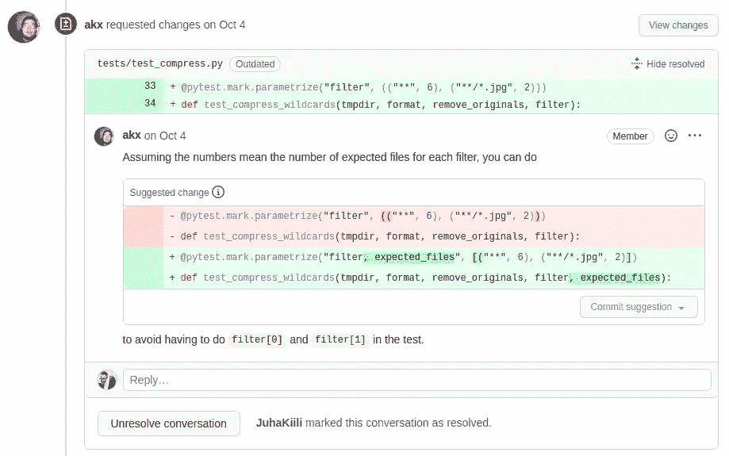

# 数据科学 Git

> 原文：<https://towardsdatascience.com/git-for-data-science-36f092d2bdd>

## 每个数据科学家应该了解的关于 Git 的知识


作者图片

# Git 是什么？

Git 是一个版本控制系统，旨在跟踪源代码随时间的变化。

当许多人在没有版本控制系统的情况下从事同一个项目时，这是完全混乱的。解决最终的冲突变得不可能，因为没有人跟踪它们的变化，很难将它们合并成一个单一的中心事实。Git 和构建在它之上的更高级别的服务(比如 Github)提供了克服这个问题的工具。

通常，有一个单独的中央存储库(称为“源”或“远程”)，单个用户将把它克隆到他们的本地机器上(称为“本地”或“克隆”)。一旦用户保存了有意义的工作(称为“提交”)，他们将把它发送回中央存储库(“推送”和“合并”)。

# Git 和 GitHub 有什么区别？

Git 是一种底层技术，它的命令行客户端(CLI)用于跟踪和合并源代码中的变更。

GitHub 是一个建立在 git 技术之上的 web 平台，目的是让它变得更简单。它还提供了额外的功能，如用户管理，拉请求，自动化。其他的选择有 GitLab 和 Sourcetree。

# 术语

*   **存储库**“数据库”的所有分支和单个项目的提交
*   **分支**存储库的可选状态或开发路线。
*   **合并**将两个(或更多)分支合并成一个分支，单个真理。
*   **克隆**创建远程仓库的本地副本。
*   **Origin** 创建本地克隆的远程存储库的通用别名
*   **主** / **主**俗名为根分支，是真理的中心来源。
*   **Stage** 选择哪些文件将成为新提交的一部分
*   **提交**对存储库中的文件所做的阶段性更改的已保存快照。
*   当前提交的简写你的本地存储库当前所在的位置。
*   推送推送意味着将您的更改发送到远程存储库，让每个人都能看到
*   **拉**拉意味着把其他人的变更放到你的本地存储库中
*   **拉请求**机制审核&批准您的更改，然后合并到主/主控

# 不要推送数据集


作者图片

Git 是一个版本控制系统，旨在为软件开发者服务。它有很好的工具来处理源代码和其他相关内容，如配置、依赖项和文档。它不是用于训练数据的。句号。Git 仅用于代码。

在软件开发中，代码为王，其他一切都为代码服务。在数据科学中，情况不再如此，数据和代码之间存在二元性。代码依赖数据没有任何意义，正如数据依赖代码没有任何意义一样。它们应该分离，这就是以代码为中心的软件开发模型让你失望的地方。 **Git 不应该是数据科学项目的核心要点。**

像 LFS 这样的扩展引用了 git 存储库中的外部数据集。虽然它们服务于一个目的并且解决了一些技术限制(大小、速度)，但是它们没有解决根植于 git 的以代码为中心的软件开发思维的核心问题。

尽管如此，您的本地目录中总会有数据集浮动。如果你不小心，很容易不小心上演和犯下这些错误。确保使用 git 不需要担心数据集的正确方法是使用`.gitignore`配置文件。将您的数据集或数据文件夹添加到配置中，永远不要回头看。

示例:

```
# ignore archives
*.zip
*.tar
*.tar.gz
*.rar

# ignore dataset folder and subfolders
datasets/
```

# 不要泄露秘密


作者图片

这应该是显而易见的，然而现实世界中不断出现的错误向我们证明事实并非如此。存储库是否是私有的也没有关系。在任何情况下，任何人都不应该将任何用户名、密码、API 令牌、密钥代码、TLS 证书或任何其他敏感数据提交给 git。

甚至私有存储库也可以被多个帐户访问，并且被克隆到多个本地机器上。这给了假想攻击者指数级更多的目标。请记住，私有存储库也可能在某个时候变成公共的。

将您的秘密从代码中分离出来，并使用环境来传递它们。对于 Python，您可以使用保存环境变量的通用`.env`文件，以及确保`.env`文件不会被推送到远程 git 存储库的`.gitignore`文件。还提供`.env.template`是个好主意，这样其他人就知道系统期望什么样的环境变量。

**。环境**

`API_TOKEN=98789fsda789a89sdafsa9f87sda98f7sda89f7`

**.env.template**

`API_TOKEN=`

**。gitignore**

`.env`

**hello.py**

```
from dotenv import load_dotenv
load_dotenv()
api_token = os.getenv('API_TOKEN')
```

对于第一次克隆存储库的人来说，这仍然需要一些手动的复制粘贴。对于更高级的设置，有加密的、访问受限的工具可以通过环境共享机密，例如 Vault。

注意:如果您已经将您的秘密推送到远程存储库，不要试图通过简单地删除它们来修复这种情况。为时已晚，因为 git 被设计成不可变的。一旦秘密泄露，唯一有效的策略就是更改密码或禁用令牌。

# 不要推动笔记本输出


作者图片

笔记本很酷，因为它们不仅能让你存储代码，还能存储图像、图表和表格等单元格输出。当您提交并将笔记本及其输出推送到 git 时，问题就出现了。

笔记本序列化所有图像、图表和表格的方式并不美观。它不是单独的文件，而是将所有东西都编码成 JSON 乱码，放入`.ipynb`文件中。这让 git 很困惑。

Git 认为 JSON 的胡言乱语和你的代码一样重要。您更改的三行代码与 JSON 乱码中更改的三千行代码混在一起。由于额外的噪音，试图比较这两个版本变得毫无意义。



如果在生成输出后更改了一些代码，情况会变得更加混乱。现在，存储在版本控制中的代码和输出不再匹配。

你有两种选择。

1.  在创建 git 提交之前，您可以从主菜单中手动清除输出(单元格->所有输出->清除)。
2.  您可以为 git 设置一个自动清除输出的[预提交挂钩](https://zhauniarovich.com/post/2020/2020-06-clearing-jupyter-output/)

我们强烈建议投资选项 2，因为你需要记住的手动步骤最终注定会失败。

# 不要使用—力


作者图片

有时，当您尝试推送到远程存储库时，git 会告诉您有问题并中止。错误信息可能会给你一个“使用原力”(即`-f`或`--force`)的选项。不要这样做！即使错误信息召唤你的内心绝地，也不要去做。这是黑暗面。

显然，`--force`的存在是有原因的，它在某些情况下是有用途的。这些论点都不适用于你年轻的学徒。无论是哪种情况，请阅读错误消息，尝试找出问题所在，如果需要，请其他人帮助您，并修复潜在的问题。

# 用清晰的描述做小的提交


作者图片

没有经验的用户经常会陷入用无意义的描述进行大规模提交的陷阱。对于任何一个 git 提交，一个很好的经验法则是它应该只做一件事。修复一个错误，而不是三个。解决一个问题，而不是十二个。请记住，问题通常也可以分成更小的块。越小越好。

您使用版本控制的原因是其他人可以了解过去发生了什么。如果你的提交修复了 12 个 bug，而描述上写着“模型修复”，那么两个月后就接近于零值了。提交应该只做一件事，而且只做一件事。描述应该传达事情是这样的。如果犯的事很少，就不需要写长篇小说了。事实上，提交消息的长描述意味着提交太大了，您应该将它分成更小的块！

**例子#1:一个坏的存储库**



**例子#2:一个好的存储库**



在现实生活中，您经常在您的本地机器上做各种各样的特别的事情并以第一种情况结束。如果您还没有将任何内容推送到公共遥控器，您仍然可以修复这种情况。我们建议学习如何使用交互式 rebase。

只需使用:

`git rebase -i origin/main`

交互模式提供了许多不同的选项来调整历史记录、改写提交消息，甚至改变顺序。从[这里](https://git-scm.com/book/en/v2/Git-Tools-Rewriting-History)了解更多关于交互式 rebase 的信息。

# 不要害怕分支和拉取请求


作者图片

分支和特别是拉请求稍微高级一些，不是每个人都喜欢，但是如果您的数据科学项目已经成熟，处于生产阶段，并且不断被许多不同的人接触，拉请求可能就是您的过程中缺少的东西。

当您创建一个新的 git 存储库时，它将从一个名为 main(或 master)的分支开始。主分支被认为是“中心真理”。分支意味着您将暂时分支以创建一个新的特性或者修复一个旧的特性。与此同时，其他人可以在他们自己的分支上并行工作。这通常被称为特征分支工作流。


作者图片

分支的想法是最终合并回`main`分支，并更新“中心事实”。这就是拉取请求发挥作用的地方。世界上的其他人不关心你在你自己的分支中的提交，但是合并到`main`是你的分支成为最新真相的地方。这时就该提出拉取请求了。



作者图片

拉请求不是 git 概念，而是 GitHub 概念。它们是让你的分支成为新的中心真理的请求。使用 pull 请求，其他用户将检查您的更改，然后才允许它们成为新的中心事实。GitHub 提供了很棒的工具来进行评论，提出修改建议，发出批准信号，最后自动应用合并。