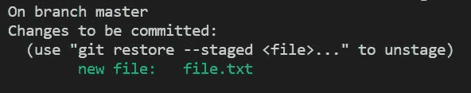
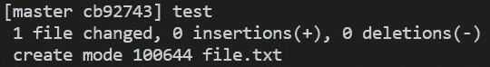
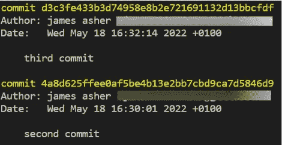
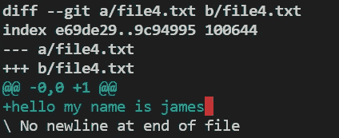

# 4 分钟后出发

> 原文：<https://towardsdatascience.com/git-in-4-minutes-f0252332e68e>

## Git 的简明介绍


EKATERINA BOLOVTSOVA 的照片:[https://www . pexels . com/photo/person-holding-silver-macbook-on-brown-wood-table-7445340/](https://www.pexels.com/photo/person-holding-silver-macbook-on-brown-wooden-table-7445340/)

很多关于 Git 的介绍都非常复杂。这实际上是一个非常简单的技术，只要你理解了它。你根本不需要在这上面花太多时间，所以这里有一个 4 分钟的非常基本的介绍——绝对没有华夫饼。

## Git 是什么？

Git 是一个跟踪文件变化的工具。您可以使用它在特定的时间拍摄代码的快照，然后在需要时随时重新访问它们。

这对版本控制和测试新事物非常有用。

## 建立

首先，你需要[下载](https://git-scm.com/downloads)它。或者你也可以用 Anaconda Navigator 来完成。

然后你会想要检查你正在使用的版本。

```
git --version
```

然后，您会想要配置一些东西，使生活变得更加轻松。

```
git config --global.user.name "<insert your username here>"
git config --global.user.email "<insert your email here>"
git config --global core.editor "<insert editor of choice here>"
```

例如，我的答案是:

```
git config --global.user.name "<James Asher>"
git config --global.user.email "<james@fakemail.com>"
git config --global core.editor "<code>"
```

如果您有 GitHub 帐户，请使用相同的电子邮件地址。我最喜欢的代码编辑器是 VScode，所以我输入了“code ”,但是你可以使用任何代码。

## 初始化

确保您位于项目的根目录中，然后键入。

```
git init
```

## 添加文件

现在您有了一个 git 存储库，您可以使用以下命令向其中添加文件:

```
git add file.txt
```

添加文件后，您可以通过以下方式检查文件的状态

```
git status
```



由作者创建

这意味着临时区域中有一个新文件。这实际上是一个装货区。文件会一直放在这里，直到你“提交”它们。

然后，您可以通过键入以下命令提交该文件

```
git commit -m "<any message you want that describes your commit>"
```



由作者创建

## Git 日志

一旦我们完成了一些提交，我们可以通过键入以下命令来检查它们的日志。

```
git log
```



由作者创建

## 检查更改

您可以使用以下命令来检查当前实时文件和已暂存文件之间的差异:

```
git diff <optional name of file>
```



如您所见，它会告诉您哪些文件发生了更改，以及您添加或删除了哪些内容。您还可以通过使用不同版本的唯一提交号的前七个字母来检查不同版本之间的差异。

如果你意识到你犯了一个错误，你可以从暂存区拿走东西:

```
git reset <file>
```

## 回头参考以前的版本

您也可以使用更新工作树中的文件，以匹配索引或指定树中的版本。Git 中的 head 是最近提交的，所以我们可以从 HEAD 开始倒数任何数字来访问那个版本。因此，回到 2 个版本之前的头部，我们可以做如下。

```
git checkout HEAD~2 <file>
```

回到头部，我们可以简单地做

```
git checkout HEAD
```

这应该是你对 Git 的基本理解和个人使用所需要的。当然还有很多要做的，但不是我能在 4 分钟内完成的。

```
If I’ve inspired you to join medium I would be really grateful if you did it through this [link](https://jamesasher4994.medium.com/membership) — it will help to support me to write better content in the future.If you want to learn more about data science, become a certified data scientist, or land a job in data science, then checkout [365 data science](https://365datascience.pxf.io/c/3458822/791349/11148) through my [affiliate link.](https://365datascience.pxf.io/c/3458822/791349/11148)
```

这是我写的其他一些东西:

[](/econometrics-is-the-original-data-science-6725d3f0d843) 