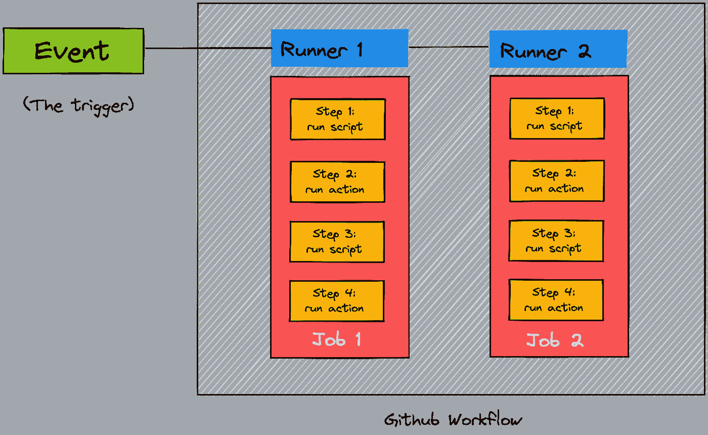
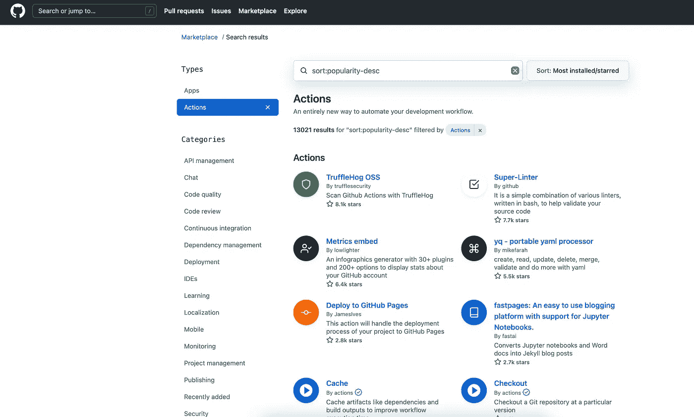
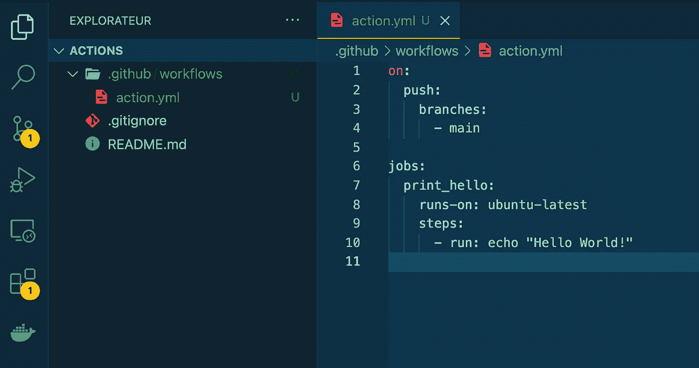
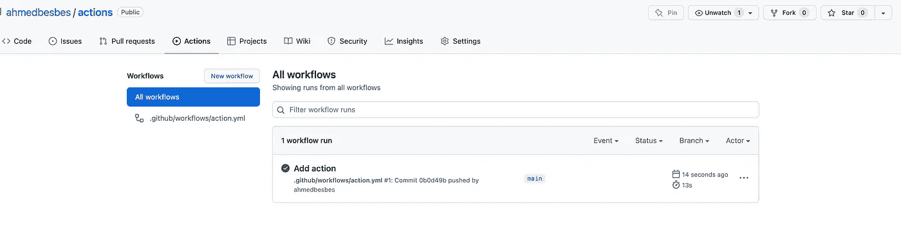
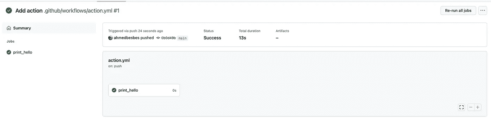
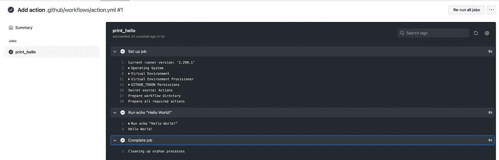

# github Actions——入门所需的一切

> 原文：<https://towardsdatascience.com/github-actions-everything-you-need-to-know-to-get-started-537f1dffa0ed>

## 一个被我忽略了很久的疯狂的 Github 功能

安迪·赫尔曼万在 Unsplash[上的照片](https://unsplash.com?utm_source=medium&utm_medium=referral)

你可能对 Github 很熟悉。这是一个构建软件、与队友协作以及为开源项目做贡献的令人惊叹的平台。

Github 提供了许多[功能](/a-tour-of-10-useful-github-features-d92dde0bf412)，让你的开发者生活更加轻松。

在这篇文章中，我想介绍一个非常强大但不为公众所知的 Github 杀手级产品: **Github Actions** 。

> 我们将了解什么是 Github 动作，它们做什么，以及如何将它们集成到您的项目中，以自动化许多任务。

事不宜迟，让我们来看看🔎

# Github 行动 101 —它们是什么？

Github Actions 是一个自动化软件构建、测试和部署的平台。但是它并不止于此:它还允许您在特定事件发生时在存储库上运行任意代码。

要全面了解 Github Actions 是什么，将它分解成几个组件是有帮助的:

**→事件** 事件是 Github 存储库中可能发生的任何事情。这从推送代码，创建分支，打开拉取请求，甚至评论一个问题。
触发器的列表要长得多:你可以在 这里查看 [*。*](https://docs.github.com/en/actions/learn-github-actions/events-that-trigger-workflows#webhook-events)

**→工作流** 工作流是一个由一系列作业组成的自动化过程，当它被一个事件触发时就会被执行。
工作流在 YAML 文件中定义，并存储在存储库根目录下的`.github/workflows`目录中。一个存储库也可以有多个工作流。

**→作业** 作业是工作流中由事件触发执行的一系列任务。每一步要么是脚本，要么是 Github 动作。
一个工作流可以有多个并行运行的作业。

**→运行者** 运行者是服务器上的进程，当工作流被触发时，它运行工作流。每个运行者负责执行一个给定的任务。
runner 托管在云中，但是它们也可以[自托管](https://docs.github.com/en/actions/hosting-your-own-runners)在定制的云环境中。

这里有一个代表 Github 工作流程的图表，概述了前面提到的组件。

作者制作的图片 Github 工作流

**→动作** 动作是单独的任务:它们在作业内部被调用。操作用于执行复杂的任务，您可能会多次调用这些任务并将其导入到工作流中。一些动作的例子是:将 Python 包发布到 PyPi，发送通知电子邮件，在运行脚本之前将 Python 设置为特定版本，等等。

您可以构建自己的操作，也可以重用 Github [marketplace](https://github.com/marketplace?type=actions) 中的一些开源操作，并在它们满足您的需求时直接添加到您的工作流程中。

作者截图— Github Marketplace

# 为什么 Github 动作有用？(非常)常见的情况

添加 Github 动作的目标基本上是自动化您希望在每个事件中重复运行的任务。

让我们举个例子:想象一下，每次你推出一个新代码，你都想在一台有特定配置的 Ubuntu 机器上对它执行一系列单元测试。

太好了。你会怎么做？

**冗长的回答👉:**您将代码推送到 Github，连接到您已经创建的服务器，获取新版本的代码，运行测试，并等待最终输出。不用说，这是一个冗长乏味的过程。
相信我，我做过那种**，很多，**过去并不好玩。

**简答**👉 **:** 你创建了一个工作流，它在每次推送时都会被执行，并执行相同的一系列动作:启动机器、提取代码、运行一系列测试，并在控制台上显示结果。

## 你如何定义这样一个工作流程？在 YAML 的档案里

工作流位于存储库中一个名为`.github/workflows/`的特殊文件夹中。

# 构建您的第一个“Hello World”工作流

作者图片——一个简单的 Github 操作

每个工作流都在`workflows`文件夹中的 YAML 文件中定义。

语法呢？

> *👉要添加触发器，你必须使用* `***on***` *部分。*

在`**on**`部分中，您必须添加事件(`**push**`、`**pull_request**`等)。)作为小节。然后，每个事件链接到一个特定的分支(`**main**`、`**dev**`、**、**等)。)

> *👉然后在与* `***on***` *部分处于同一级别的* `***job***` *部分(下称* `*steps*` *)中定义任务。*

现在，如果您将这个简单的工作流程添加到您的回购中

并在`**main**`分支上推送您的代码，您可以检查到在`Actions`选项卡下已经添加了一个工作流。

作者截图

如果您单击工作流运行，您将看到一些详细信息，如提交、状态、持续时间以及已运行的作业。

在我们这里，只有一个工作叫做`print_hello`。

作者截图

通过点击`**print_hello**`，我们可以查看一些关于设置作业和完成作业的摘要日志，但最重要的是，我们可以在`**Run echo “Hello World!”**` 下看到作业的实际输出。

作者截图

这个例子非常简单，但它应该让我们感受到 Github 动作提供的无限可能性:事实上，您在远程虚拟机上手动启动的任何命令序列都可以在一个工作流中启动:这可以是一系列的单元测试、一组 Docker 构建步骤、一个 API 的部署等等。

简而言之，你能想象到的任何东西都可以被触发并自动运行。

你可以在这里了解更多关于语法的知识，但是你不应该忘记:

*   `on`:触发工作流的事件
*   `runs-on`:每项工作应该运行的**机器**(例如 ubuntu-latest)
*   `jobs`:构成**工作流程**的作业列表
*   `steps`:在每个作业内部运行的一系列**任务**
*   `run`:被执行的命令

关于 Github 动作，还有很多内容是本文不能讨论的。如果你想了解更多，我推荐你去看看 Github 的官方[教程](https://docs.github.com/en/actions):它们很容易理解，而且让你练习。

# 一些有用的工作流程和操作示例

既然您已经理解了 Github 动作是什么以及它们为什么有用，那么让我们在这里变得更实际一点，并浏览一些利用动作和工作流的典型用例。

PS:以下示例脚本借用了 starter-workflow [repo](https://github.com/actions/starter-workflows) 的内容。它们并不意味着在你的特定回购上开箱即用，而是应该让你很快开始。

**1 —运行单元测试和代码质量检查**

当您考虑 Github 动作时，最常见的用例是在代码库添加变更时自动执行单元测试和代码质量检查(代码林挺)。

→下面的工作流程首先检出存储库，用 Python 3.10 设置环境，安装项目需求(通常列在 requirements.txt 中)，用 [Flake8](https://flake8.pycqa.org/en/latest/) 运行林挺，用 [pytest](https://docs.pytest.org/en/7.1.x/) 进行单元测试。

你也可以想象添加类型检查器(比如 mypy)和代码格式化器(比如 PEP8，Black)。

**2 —构建 Docker 映像**

如果您正在使用 Docker 构建一个容器化的应用程序，您可以使用 Github Actions 在每次代码修改被推送到 repo 时自动重建映像。

→以下工作流程首先检出 repo，然后启动引用 Docker 文件的 Docker 命令，构建映像并对其进行重命名。

您可以扩展这个工作流，但是将 Docker 映像推送到 Docker [hub](https://hub.docker.com/) 并引用您的凭证作为 Github 机密。

**3 —构建 Python 包，发布到** [**PyPi**](https://pypi.org/)

如果您维护一个在 PyPi 上发布的开源项目，那么您可以在每次发布新版本时自动上传(是的，这也是一个触发器)。

→发布版本时会触发以下工作流程。它首先检查 repo，将 Python 版本设置为 3，安装依赖项，构建包，最后使用 Github secrets 中引用的`PYPI_API_TOKEN`标记将其发布到 PyPi。

请注意，将 Python 环境设置为特定版本或将 Python 包发布到 PyPi 等复杂任务是使用市场中的操作来执行的。

**4 —运行 makefile**

您可以使用 Github 动作来触发 Makefile 不同阶段的执行。

当然，你可以用 Github 动作做更多的事情，比如自动生成你的 Python 库的文档，自动部署 API，生成工件等等。

如果你对你能做什么感到好奇，你可以查看下面的资源。

# 资源

如果您对自动化项目的工作流程和集成 CI/CD 管道感兴趣，而不需要离开您的存储库，Github Actions 是一个不错的选择。

我花了相当多的时间学习它们。它们很容易集成，玩起来很有趣，而且非常有用。

像往常一样，这里是我浏览过的一些好资源的精选列表:

*   数据科学的自动化测试。一个[视频](https://youtu.be/bSXUJRnQPPo)教程 DVCorg Youtube 频道
*   将 Github 动作用于 MLOps 和数据科学:来自 GitHub 技术博客的一篇[文章](https://github.blog/2020-06-17-using-github-actions-for-mlops-data-science/)
*   在 Github 上使用的令人敬畏的行为的精选列表
*   促进 MLOps 的 GitHub 动作的[集合](https://github.com/machine-learning-apps/actions-ml-cicd)
*   [https://fast pages . fast . ai/actions/markdown/2020/03/06/fast pages-actions . html](https://fastpages.fast.ai/actions/markdown/2020/03/06/fastpages-actions.html)
*   [https://towards data science . com/introduction-to-github-actions-7 fcb 30d 0 f 959](/introduction-to-github-actions-7fcb30d0f959)

# 感谢阅读🙏

谢谢你坚持到最后！我希望你发现 Github 动作很有用，并准备在你的项目中使用它们。如果你已经有了一些和他们一起工作的经验，请随时告诉我(在评论中🔽)关于你用的一些有用的动作或者你知道的小技巧。

今天就这些了。直到下一次更多的编程技巧和教程。👋

# 新到中？您可以每月订阅 5 美元，并解锁各种主题的无限文章(技术、设计、创业……)您可以通过点击我的推荐链接[来支持我](https://ahmedbesbes.medium.com/membership)

  

由[卡斯滕·怀恩格特](https://unsplash.com/@karsten116?utm_source=unsplash&utm_medium=referral&utm_content=creditCopyText)在 [Unsplash](https://unsplash.com/@karsten116?utm_source=unsplash&utm_medium=referral&utm_content=creditCopyText) 上拍摄的照片