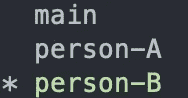
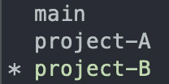

# 面向数据分析师的 GitHub 分析工作流

> 原文：<https://towardsdatascience.com/github-analytical-workflow-for-data-analysts-31a28035b563>

## 了解如何利用 Git 来提高数据分析团队内部的协作和透明度


[罗曼](https://unsplash.com/@synkevych)在 [Unsplash](https://unsplash.com/s/photos/github) 上拍照

H ello 世界！我正在写我的第一篇关于 Medium 的文章，并决定分享我是如何向我的数据团队介绍 GitHub 以促进协作的。

我将讨论为什么使用 GitHub 可以帮助一个团队(两个以上的数据人员)更有效地协作，以及如何将 GitHub 应用到日常的数据分析工作流程中。这将有助于你在团队中建立某种形式的合作框架。

在本文中，我将重点讨论以下主题:

# 目录:

1.  为什么选择 GitHub
2.  开始前你需要什么
3.  分支策略
4.  你还能补充什么

## 为什么选择 GitHub

如果您在数据领域工作，并且至少与一个其他团队成员一起工作过，那么您很可能会遇到协作问题，比如处理最新的代码版本，跟踪*谁*编辑了*什么*代码，或者令人沮丧地试图回忆这段代码是为了什么目的而编写的，而这段代码是在 XX 天前最后编辑的。

这些只是我从数据同事那里听到的一些棘手问题和我的个人经历。尽管我怀疑所有这些仅仅是冰山一角。

那么 GitHub 到底如何解决这些问题呢？

> 有了 GitHub ，分析师可以利用其版本控制系统(VCS)和 Git 一起处理同一个数据项目。对项目所做的任何变更都可以被其他分析师**更新、跟踪和审查**，并且任何早期版本的工作也可以被**恢复**。

虽然 GitHub 最常用于软件开发，但我们可以借鉴这本书，将其中的一些内容整合到数据分析工作流中。

## 开始前你需要什么

在向您的团队介绍 GitHub 之前，首先了解 GitHub 的基础知识很重要。知道如何添加、提交、推送文件和创建拉取请求。我不会深入这些基础知识，因为已经有大量的资源和文章提供了掌握这些基础知识的全面指南。以下是一些有用的快速链接:

[](/introduction-to-github-for-data-scientists-2cf8b9b25fba) [## 面向数据科学家的 Github 简介

### 掌握 Github 的基础知识

towardsdatascience.com](/introduction-to-github-for-data-scientists-2cf8b9b25fba) 

一旦您对 git 的工作原理有了基本的了解，接下来要决定的是您的团队要采用什么类型的分支策略。

## 分支策略和目录

到底什么是分支策略？它本质上是一种**策略**，通常被软件开发人员用来**在 Git 这样的 VCS 环境中编写、合并和发布代码**。选择一个合适的模型对于决定何时以及如何进行变更并提交回代码库是很重要的。

[](https://medium.com/@patrickporto/4-branching-workflows-for-git-30d0aaee7bf) [## Git 的 4 个分支工作流

### 在本文中，我们将介绍 Git 用户最流行的分支工作流，因此您可以决定哪种更适合…

medium.com](https://medium.com/@patrickporto/4-branching-workflows-for-git-30d0aaee7bf) 

**个人分支
).所有的个人分支都将并入`main`。当团队很小(< 3)，并且所涉及的工作很少复杂时(即，新项目的频率很低)，这种方法是有效的。**

随着项目规模的扩大，这种方法可能不足以处理各种提交，并可能导致混乱。

这是它的一个片段。

首先，创建一个新的存储库:

```
## git template for creating a new repository on the command line
echo "# playground" >> README.md
git init
git add README.md
git commit -m "first commit"
git branch -M main
git remote add origin <git url>
git push -u origin main
```

现在您有了一个从“origin”跟踪远程分支“main”的`main`分支，您和您的团队可以从`main`创建新的分支。

```
# new branches for each teammate
git checkout -b "person-A"
git checkout -b "person-B"
git branch
```



砰。现在你有两个分支，每个用户分别处理他们的项目，一旦他们的部分或整个项目完成，这些分支将被推送到`main`。

**基于项目的分支** 一种更高效且轻量级的方法是采用基于项目的分支模型，这本质上是 Git 流程的简化模型。`main`分支作为代码库的主要来源，项目分支用于开发将被合并到`main`中的新项目。

```
git checkout -b 'project-A'
git checkout -b 'project-B'
git branch
```



如果有多个用户在同一个项目上工作，那么可以从主项目分支中创建更多的下游分支。如`project-A/person-A`、`project-A/person-B`。

双砰。

**工作原理** 以基于项目的分支为例，让我们来看看团队成员 *Dave* 如何进行变更。

以下是将存在的一些分支:

*   主要的
*   分析 101
*   analytics101/dave *(仅在一人以上参与同一项目时出现)*
*   等等。

一旦 Dave 完成了分支`analytics101`中的一部分或项目本身，他希望将所有的变更提交给`main`分支，以便其他人参考。

```
git add -A # staging all the changesgit commit -m "Commit for Project A"git push
```

然后，他可以为这个提交创建一个拉请求，并将其合并到`main`分支。

**目录结构** 需要注意的是，分支并不等同于目录。您的 git 存储库中的目录应该以对团队有意义的方式设置，类似于文件如何存储在不同类别的文件夹和不同的级别中，无论是在本地还是在共享的企业云上。

然而，我建议每个新项目都有一个文件夹，这样不会使事情复杂化，每个文件夹都有一个`README.md`来描述项目文件夹。

## 你还能补充什么

一旦有了 GitHub 和分支策略，您就可以添加更多的工具来帮助团队进一步协作！

**环境** 数据分析师常用的编程工具是 [python](https://www.python.org/) ，这是一种面向对象的语言，在数据争论、可视化和机器学习等方面很有效。大多数分析师将通过 [Jupyter Notebook](https://jupyter.org/) 与 python 交互，要么在 Conda 环境本身上，要么通过 ide，如 [Visual Studio Code](https://code.visualstudio.com/) 。与众多队友协作时，使用 python 和 notebooks 的一个问题是，由于使用了不同的版本，存在依赖性破裂的风险。

这就是环境和 git 派上用场的地方。对于每个新项目，只需启动并激活一个新环境，并将所有依赖项存储到一个文件中(`requirements.txt`)。任何人都可以简单地访问项目子目录，激活一个新环境并安装所需的依赖项来成功运行代码。

**插入凭证**

如果您发现自己必须在本地机器中查询数据，您可能面临的一个问题是必须手动将凭证插入引擎。虽然有许多方法可以绕过这一点，但一个例子是通过 [python-dotenv](https://pypi.org/project/python-dotenv/) 包利用环境变量。

将这种方法与 Git 结合使用变得很方便，因为您可以简单地将`.env`文件添加到`.gitignore`中，包含您所有凭证的文件将安全地存储在您的本地机器上。

[](https://medium.com/developer-secrets/storing-credentials-the-right-way-78074ae21727) [## 以正确的方式存储凭据！

### 有没有想过应该将您的凭据安全地存储在哪里，而不暴露给公众？学习如何去做…

medium.com](https://medium.com/developer-secrets/storing-credentials-the-right-way-78074ae21727) 

一旦您将凭证存储在一个`.env`文件中，您就可以加载变量了。

```
# load env variables import os
%load_ext dotenv 
%dotenvUSERNAME = os.getenv("USERNAME") 
PASSWORD = os.getenv("PASSWORD")
```

既然您已经将凭证作为变量加载，那么您可以简单地将它们插入到 SQL 引擎中，以提取相关的数据。

三次爆炸。

希望有了这些，任何人都可以开始使用 Git，并将它们整合到他们的数据分析工作流中。

请留下评论💬如果有更多要添加的，我会很高兴将它们编辑在一起！

感谢阅读！:)