# GL CMS——你的 ML 武器库的一个伟大的工具

> 原文：<https://towardsdatascience.com/glcms-a-great-tool-for-your-ml-arsenal-7a59f1e45b65>

# GL CMS——你的 ML 武器库的一个伟大的工具

## 灰度共生矩阵理论(GLCMs)和一个实际应用(带代码！)

*   *什么是灰度共生矩阵？*
*   *它们有什么用？*
*   我们如何应用它们？

这些是我将在本文中回答的问题。在这一点上相信我，我认为 GLCMs 很酷，我希望到最后你也会这么想。它们可以用来从图像中提取**纹理特征，这将在本文的最后一节中完成。我假设你对什么是图像有一个大致的概念，并且对数学有一些基本的理解。**

使用的代码(稍后)可以在下面的 git repo 中找到:

 [## 用于卫星图像分类的 GitHub - GLCMs

github.com](https://github.com/MartimChaves/glcm_sat_img) 

# 所以，我们先从**什么是 GLCMs** 说起。

为此，我们需要一个**图像**和一个**位置操作符**——现在不用担心后者。

让我们看一个简单的图像，图像的像素值可以是 0、1 或 2。是的，这不是一个特别令人兴奋的形象。它似乎也不包含任何相关的信息，但是为了解释这一点，它可以做到，所以请原谅我。

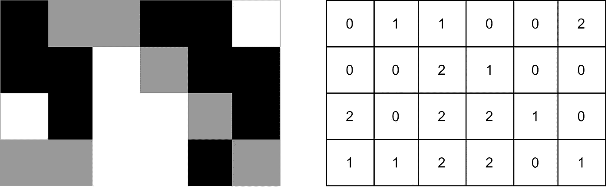

作者提供的示例图像(3 种可能的像素值— 0、1 和 2，从黑到白)

现在，假设你想知道对于一个给定的像素，它下面的像素有多长时间有相同的值。你相信这会让你对这张图片的结构有所了解。一旦你对此进行评估，也许会有明显的重复模式——谁知道呢？

为此，首先创建一个非常简单的表格，有一行三列。在第一个单元格中，你输入**的值是**的多少倍一个**值为 0 的**像素**和一个**值为 0 的**像素**。在第二个单元格中，您执行相同的操作，但值为 1，在第三个单元格中值为 2。对于我们的图像，该过程如下所示:

由作者构建一个简单的初步表格

我猜你可以说，也许，这张图片有很多**暗点和亮点**。毕竟，可以说是**经常是**最低*或最高*值“一起出现”。也不存在中间值低于其自身的相同值的任何情况。

但现在你好奇了！而不是想知道多长时间，对于一个给定的像素，它下面的像素有相同的值，你想有一个****视角*** 。*

*你想知道，对于**每个可能的像素值**，通常比它低一个像素的值**是什么？**所有值为 0 的像素是否都在同样保持值为 0 的像素之下？当然，我们知道事实并非如此，否则，图像中会出现可识别的黑色竖线。即便如此，也许你可以开始获得**的直觉**，为什么**像素值**之间的**空间关系**可能是相关的。*

*所以，要做到这一点，你创建一个**矩阵**，矩阵 ***C*** 。该矩阵具有**三行和三列**，一列和一行用于每个可能的像素值(0，1，2)。考虑到其中的表示法，对于***【C(I，j)*** ， ***i*** 是行， ***j*** 是列，***【C(0，0)*** 将保存值为**的多少倍**，对于一个**像素**其**值为 0** ，则 ***C(0，1)*** 将值保存多少次，对于值为 0 的像素，下面的像素为 1， ***C(0，2)*** 也是如此。所以 ***i*** 算是我们的“起始值”，而 ***j*** 就是我们的“目标值”。 ***C(1，2)*** 将保存值 2 低于值 1 的次数。一旦你这样做了，这就是你得到的:*

*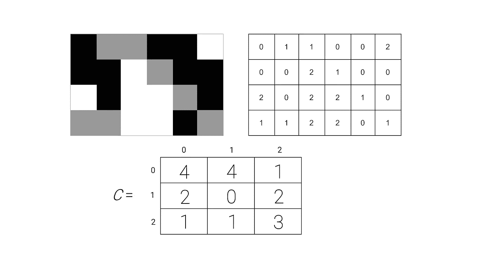*

*作者计算 GLCM 的中间阶段*

*看我们的矩阵 ***C*** ，我们的下一步是**规格化**矩阵。首先，你**对矩阵**的值求和，得到**对总数**。之后，你用**除以**C*的每个值——这样你就有了一个**归一化矩阵**。所以现在你有了 ***概率*** ，一个**特定值对**出现在给定图像中的概率，**遵循特定位置关系**。**

*****C *是* a GLCM*** —恭喜你成功了！**

**这里有一个简短的视频演示最后的过程:**

**作者计算 GLCM 的最后一步**

**现在，也许你会奇怪，为什么我要特别注意像素**和它下面的像素之间的**关系**？**也许，你会更有兴趣知道这些像素的值如何与它们右边的像素进行比较。或者在他们的左边，或者在他们的右下方的一个像素，所以是对角线，或者任何你想到的…**

**这是**位置符决定**的，位置符是 ***由你决定*** 。**

**把图像看作一个矩阵本身，matrix ***I*** ，其中 ***i*** 是行， ***j*** 是列。你可以把**位置运算符**写成**对数字**，比如 **(1，0)** 。对于每个像素 ***I(i，j)*** ，你会看着像素 ***I(i+1，j+0)*** 的值，来填入你的矩阵***【C】***。**

**比如上图，考虑像素 ***I(1，2)*** —你可以看到它**保存的是值 2** 。它下面的**像素**，**， *I(2，2)*** ，也是**保存值 2** 。所以，你会**在单元格 *C(2，2)*** 的**值上加+1** ，因为**起始像素值是 2** ，而目标像素的**值，也就是原始像素**下面的那个**，**也是** **2** 。****

**本质上，你只需**将位置运算符**的值加到原始像素的**坐标上，就可以得到你需要考虑**填入*C*的**值**。为了*完全*填充 ***C*** ，你必须对*图像的每一个*像素都这样做。******

**也许，只是也许，你想做些疯狂的事。你想要**捕捉**一个**像素和它下面 8 个单位和左边 3 个单位的像素**之间的**关系**。是啊，太疯狂了。为此，**你的位置操作符应该是(8，-3)** 。现在，也许这不是最好的位置运算符。这种空间关系对于我们理解一幅图像的内容来说并不常见。然而，这里的信息是 ***你是你的位置操作符*** 的老板。**

# **那么，现在进入下一个问题— **你能用它做什么？GLCMs 有什么用？****

**本质上，你可以分析 ***C*** —想象你想了解**是否**一个图像 ***I*** 是否 ***同质。*****

**让我们看看使用 **(0，1)位置运算符**的 ***I*** 的 **GLCM** 。如果*非常**，那么*C 的**最大值就会出现在**主对角线上，即***【C(0，0)******【C(1，1)******(C)这只是因为这将意味着**通常**两个相邻像素***具有**相同的值**。这反过来意味着很可能会有具有**相同值**的**大区域**——这是一个**同质图像**。**********

**如果 ***C*** 的最高值出现在右上**或左下**单元格中，则**与**相对。这意味着**更常见的是**具有**非常不同的**值，这意味着 ***I*** 是一个具有大量 ***对比*** 的图像！我们可以用更**量化的方式**反映这些想法。**

**例如，我们可以使用下面的**等式来计算同质性**:**

**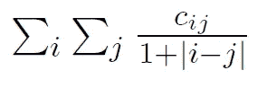**

**齐次方程**

**如果在其**主对角线**中找到 *C* 的**较大值，则从该等式得出的**均匀性值**只会是**大**。对于主对角线之外的值， **|i-j|表达式**将保证**离**主对角线越远，****那些值就越不重要**。******

****对比度**可使用以下等式计算:**

**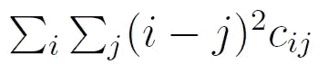**

**对比方程**

**在这种情况下，我们有对面的**，离*的**主对角线**越远的**，赋予这些值的**重要性**越高，因为它们被乘以 ***(i-j)* 表达式**。*******

**还有其他一些有用的公式可以用来分析 GLCMs。它们*的操作方式与*之前的操作方式相似。**

**例如 ***熵*** :**

**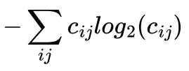**

**熵方程**

**与， ***相关*** :**

**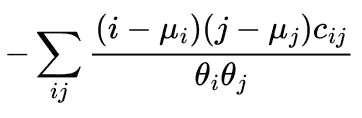**

**相关方程**

**其中:**

**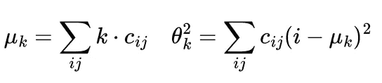**

**相关方程元素的方程**

****同质性、对比度、熵、**等等都是可能的**特征**用于机器学习的例子。例如，你也可以使用 **GLCM 本身**，作为卷积神经网络的**输入**。**

**GLCMs 通常与 ***纹理*** 联系在一起。 ***纹理*** 可以看作是**视觉模式**的一种重复。使用**适当的位置操作符**，GLCMs 可以用于**提取关于**纹理**的信息**出现在**图像**中。毕竟，视觉模式的**重复可以被视为具有特定方向的值组合的**重复**。****

**这是 GLCMs 专业版**的一个例子——它对纹理来说**很棒！GLCMs** 的一个**缺点是它们**在计算上有些昂贵**、*尤其是*，如果你打算在*上使用几个位置操作符*。这将需要*计算几个矩阵*。要记住的另一个**重要的缺点**是，如果你只使用**一个位置操作符**，产生的 GLCM **将不会对特征旋转或比例变化保持不变。********

**这里有一个非常简单的**算法**来获得一个图像的 **GLCM(在 python 中 git repo 的链接在一开始就共享了，这个在文件 *my_glcm/my_glcm.py* 中):****

**作者计算 GLCM 的算法(出于可见性目的显示了 GLCM 的日志)**

**或者，您可以使用来自“**skimage**”python 库的“ **graycomatrix** ”!你可以在这里看文档:**

*   **要计算 GLCM:**

** [## 模块:feature . texture-skim age v 0 . 7 . 0 docs

### 表征图像纹理的方法。skim age . feature . texture . greycorops(P，prop='contrast ')计算纹理…

scikit-image.org](https://scikit-image.org/docs/0.7.0/api/skimage.feature.texture.html#skimage.feature.texture.greycomatrix) 

*   要计算 GLCM 的属性(图像特征):

 [## 模块:feature . texture-skim age v 0 . 7 . 0 docs

### 表征图像纹理的方法。skim age . feature . texture . greycorops(P，prop='contrast ')计算纹理…

scikit-image.org](https://scikit-image.org/docs/0.7.0/api/skimage.feature.texture.html#skimage.feature.texture.greycoprops) 

请注意，它们使用不同系统的**钻头——位置操作符**由角度**和距离**决定，但基本原理如前所述。****

出于好奇，我们来看看两幅不同图像的 GLCM 的**对数:**

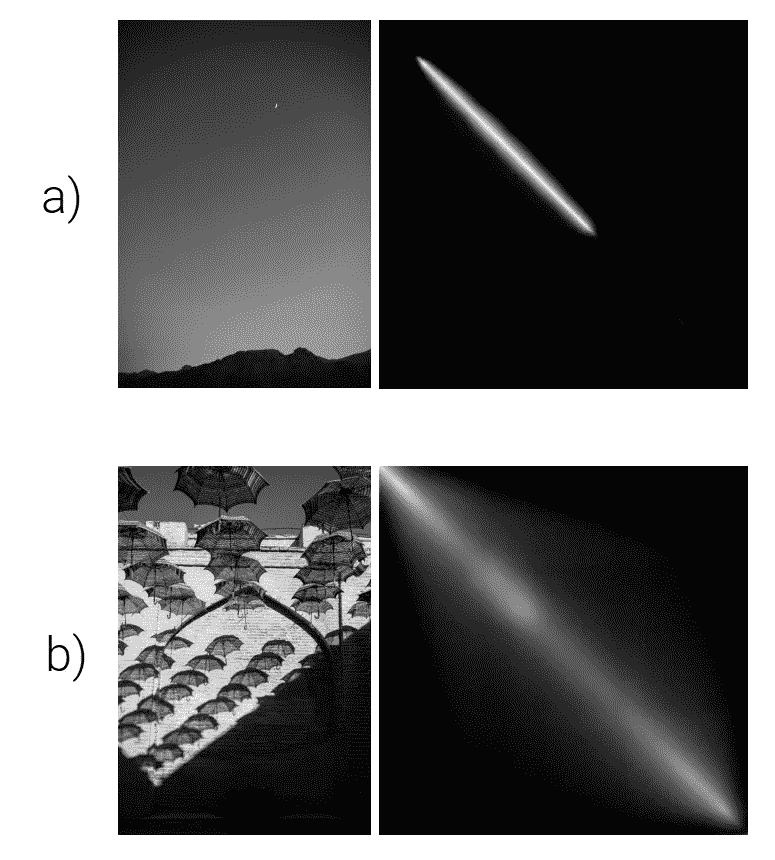

Kate Palitava 的左图，在作者的左图的右日志(GLCM)上；b)左图为 Parviz Besharat Pur，右图为作者。注意，对数只是用来提高*可见度*。

对于图像 a)，GLCM 的最高值似乎集中在主对角线周围。这并不奇怪，因为图像没有任何明显的变化。它大多是天空的图片，值的强度平滑地变化。你可以说这个图像非常均匀。

当你比较 a)的 GLCM 和 b)的 GLCM 时，你可以注意到明显的不同。b)的 GLCM 值更加分散，这是有意义的。雨伞对着砖墙的阴影，以及砖墙本身，引入一些**的对比。希望到目前为止，GLCMs 对您来说相当直观。**

# 最后， ***我们如何应用它们呢？***

让我们实际上**使用 GLCMs 进行一个可能的真实世界应用** — **分类**不管**卫星图像是否包含一个油棕榈种植园**！

我认为卫星图像将很好地展示 GLCMs 可以做什么。毕竟，比如山和海洋的**图像**的**纹理**之间的**差异**就是**明显的**。经过一番搜索，我在 Kaggle 上找到了这个数据集，上面有油棕榈种植园的**卫星图像**。这与 2019 年数据科学(WiDS)妇女(Women in Data Science，WiDS)数据大会有关，我决定试一试。如果你感兴趣，这里有链接:

 [## WiDS Datathon 2019

### 参加 2019 年数据科学女性(WiDS)数据大会

www.kaggle.com](https://www.kaggle.com/c/widsdatathon2019/data) 

我从一点点**探索性数据分析** (EDA)开始。为此，我查看了属于**每个职业**的**随机图像**，以了解主要区别。油棕种植园的图像似乎清晰地包含了**明显的黄色线条**。我猜想，这些可能是通往不同地块的道路。

## 图片示例**无** 油棕榈种植园:

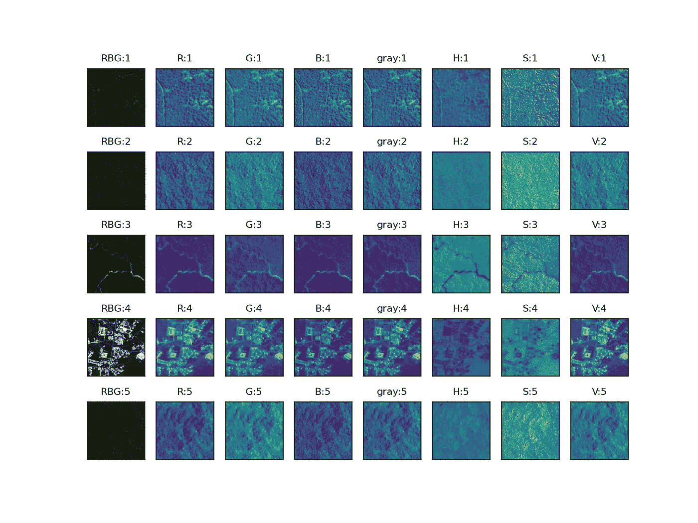

不同渠道的图像没有油棕种植园的作者

## 带有*油棕榈种植园的图片示例:

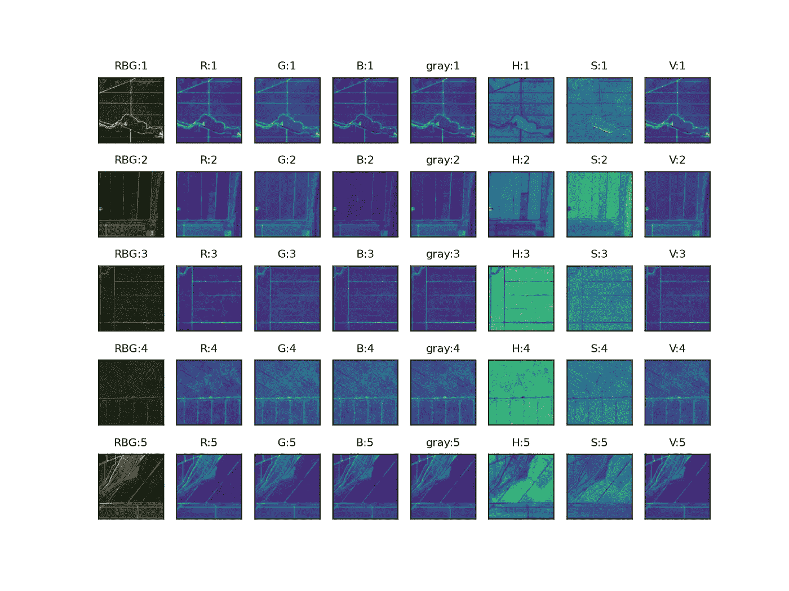

不同渠道的图像与油棕种植园的作者

为了进一步**确认**这一点，我查看了**平均图像**，以及**第一张**的**每一类**的“本征图像”。这些图像都显示，的确，油棕种植园的 **sat 图像**包含了与常规 sat 图像**不同的**纹理**。这种纹理也许可以描述为穿过图像的清晰细线，通常平行于图像的轴。**

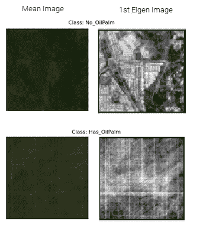

平均和本征图像为每类作者

然后，是时候**提取**图像**的**纹理**的**部分**特征**了！为此，首先，图像被**分离**到它们的 **RGB** 和 **HSV** **通道**。

该数据集的图像是 RGB 图像。这意味着图像是三维数组。除了宽度和高度，还有第三维，这是由于**三个不同的颜色通道**，红色，绿色和蓝色(RGB)。这三个原色通道**重叠**，产生了我们在图像中看到的许多不同的颜色。然而，有不同的系统(或*颜色空间*)来表示彩色图像。代表**色调、饱和度和值**的 **HSV 色彩空间**就是其中之一。色相是纯色，饱和度是那个颜色有多丰富，值是那个颜色有多强烈(强度越低越暗)。请看下图。

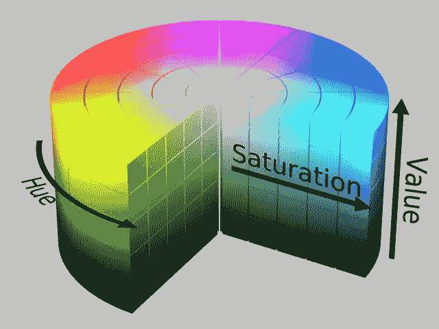

迈克尔霍瓦特的 HSV 色彩空间。未进行任何更改。在 GNU 自由文档许可证 1.2 下使用，可以在这里找到:【https://www.gnu.org/licenses/old-licenses/fdl-1.2.en.html】T2

这个系统经常用于计算机视觉，因为它被设计成类似于人类解读颜色的方式。在某些情况下，将实际颜色与其明暗程度分开，可以增加**的鲁棒性**。例如，想象一个数据集，其中一些图像有阴影，而另一些没有。如果图像中的实际颜色(色调)是重要的信息，那么使用 HSV 是有意义的。最终，这是一种不同的表示颜色信息的方式，它可能有用也可能没用，这取决于应用程序。

在这种情况下，查看不同类别的随机卫星图像，似乎使用 HSV 颜色空间也是有意义的。请注意，这两个类别之间的饱和通道似乎总是不同的。对于没有油棕种植园的类，饱和度似乎具有**明显的纹理。**我认为，色调和价值通道可能还包含一些相关信息，但这些信息并不明显。由于这些原因，HSV 颜色空间也被使用。

对 RGB 通道进行平均，同时计算出**灰度**。

其次，使用 **(1，0)位置运算符**计算这些**二维数组**的 **GLCMs** ，不同的 RGB 和 HSV 通道，以及灰度。

我认为这个位置操作符还不错，因为**水平线**是在油棕榈种植园卫星图像中常见的**。然而，请注意，这可能是**脆弱的**，因为这将意味着特征依赖于图像**的**方向。如果方向改变了，那就意味着这个位置操作符的有效性降低了。考虑到这一点，建议使用**更多的位置运算符**。对于本文，为了简单起见，只使用了一个，以减少计算时间。**

最后，为每个 GLCM 计算**的**均匀性、对比度、能量和相关性**。考虑到这一点，对于每个图像，有 ***28 个特征*** ， *7 个 GLCMs 乘以所用的 4 个“度量”*。**

28 个功能不一定很多，但还是有必要**去掉**那些**不需要的**。这是考虑到**维数灾难，以及无用信息**。为此，最初计算了和**特征**之间的**相关性** **。其次，*只有一个* ***特征*** *被保留*，从**对** **特征**高度相关。**

这个**将**的功能池减少了不少，只有 **14 个功能**。为了进一步减少这个数字，因为*也有助于计算时间*，计算了**剩余特征**和**标签**之间的**相关性**。只有与**和*至少有一点相关性的特征*和**被保留。最后，只剩下 **8 个特征**——这些特征将用于训练模型。

他们是:

*   **红色**通道的**同质性**
*   **红色**和**饱和度**通道的**对比度**
*   绿色通道**和红色通道**的**能量**
*   **红色**、**色相**和**饱和度**通道的**相关性**

下面你可以找到一个与标签相关性最高的 5 个特征的**对图。下划线前的第一个字母代表频道。**

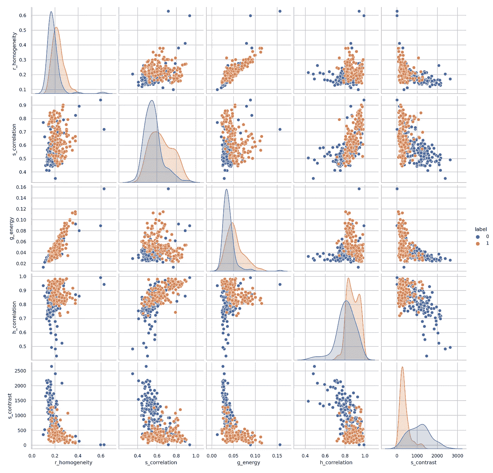

与作者标签相关性最高的五个特征的配对图

选好了我们的**特色**，是时候将它们传递给**车型**和**列车**了。在移除测试集的 **10%数据后，剩余的**数据**被**分割**成 **4 个分层褶皱**——这是一个高度**不平衡的数据集**。这些折叠然后与 **5 个不同的分类器**一起使用，以确定哪一个是最好的。使用的分类器有:**

*   随机森林
*   逻辑回归
*   梯度推进
*   SVM
*   KNN

为了确定哪个分类器是最好的，计算了三个**指标**:**平衡准确度、AUC 和 F1 分数**。最终，*想到一个可能的现实世界应用*，我决定选择具有最佳 F1 分数的分类器**。**

我在这里的想法是**的**后果**不是**检测油棕种植园**并不严重**(比如*不像在医学领域*)。同时，最好丢弃大部分阴性样品，也就是那些没有种植园的样品。这将意味着一个模型， ***当它检测到一个油棕榈种植园时，它很可能是一个***——这就是 *F1 分数的全部内容*。

下面你可以找到每个分类器的结果图。每个点对应不同褶皱的**平均值**和**误差条为标准偏差**。被选中的型号是 ***KNN*** 。

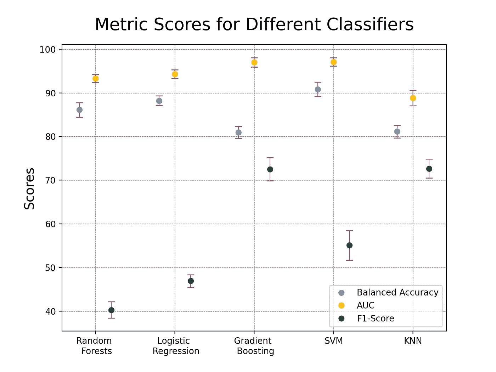

按作者列出的不同分类器的结果

然而，这似乎*值得商榷*。你怎么想呢?好奇想知道！

这些结果是使用**和 **sklearn** 设置的默认超参数**得到的。好奇的想知道他们是否有显著的不同，对三个超参数进行了**随机网格搜索**。

他们是:

*   要考虑的**邻居数量**(3 或 5)
*   使用的**重量**功能(“均匀”或“距离”)
*   如何计算**距离**(‘曼哈顿’或‘欧几里德’)。

结果表明，优化后的分类器比默认的分类器好 **2.6 个百分点(F1-score)** ，最终**验证**集 **F1-score** 为**的 75.09%** 。

**理想参数**为 ***5 个邻居*** ，使用与**欧几里德距离**相关的**权重**。**根据**距离**的权重**不是统一的，意味着**更近的邻居**对于最终预测**有更大的**影响**。**

最后，剩下要做的就是**在**测试台上**评估模型的性能。**结果**结果**如下:

*   平衡精度:80.01%
*   AUC: 85.61%
*   F1 分数:71.88%

你可以在下面找到测试集的**混淆矩阵和 **ROC** 。**

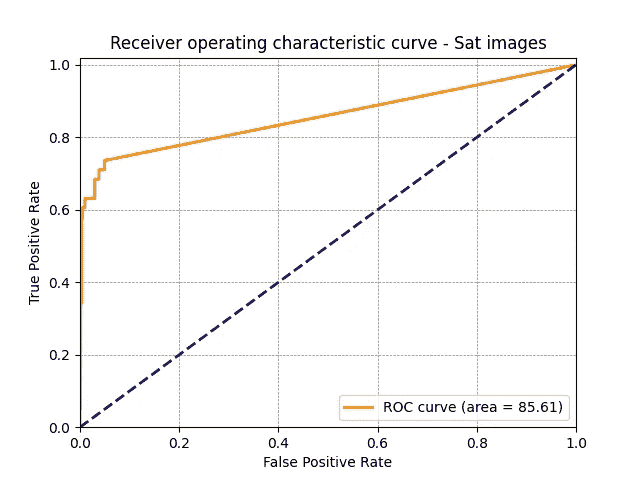

作者为 KNN 的中华民国

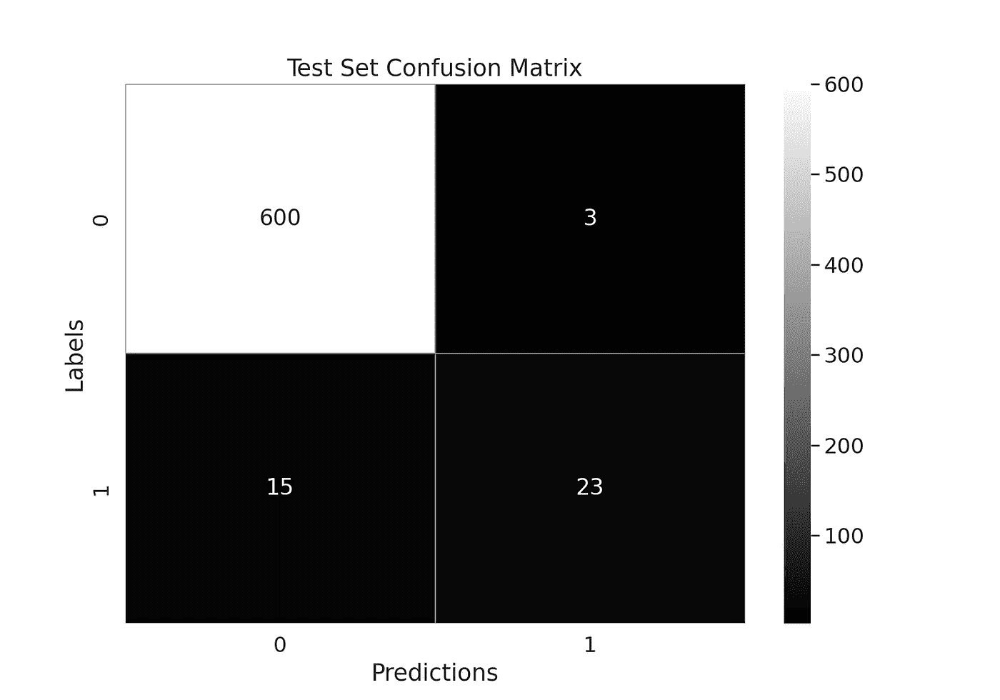

作者使用 KNN 的测试集的混淆矩阵

对于这些结果该说些什么？嗯， ***他们并不惊艳*** ，但我确实觉得很**不可思议**8 个数字怎么能把**的信息在一张图像**中表现得那么好！

**目标也是**不是得到最好的结果**，而是更多地向**展示**在你的**机器学习武库**中 **GLCMs** 是**有价值的工具**。**

**为此，我们:**

*   **查看了 GLCMs 的计算方式及其原因**
*   **如何将它们定量转化为信息**
*   **在实际场景中使用它们**

**我希望我证明了我的观点！你怎么想呢?**

**我希望你喜欢我的第一篇博文！如果您有任何问题，请随时在[*mgrc99@gmail.com*](mailto:mgrc99@gmail.com)*提问。***

***你也可以在 LinkedIn 上联系我:*[https://www.linkedin.com/in/martim-chaves-081796186/](https://www.linkedin.com/in/martim-chaves-081796186/)**

***非常感谢您的阅读:)***

***PS:我倾向于用百分比来衡量——这只是个人偏好*****