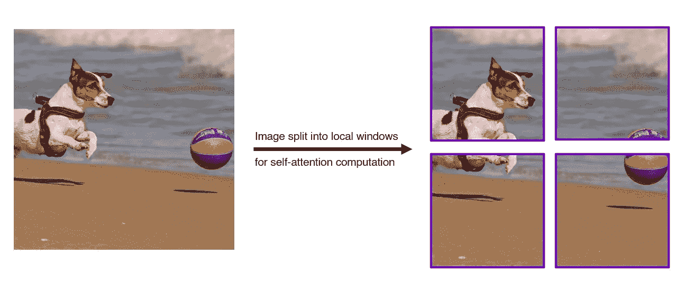
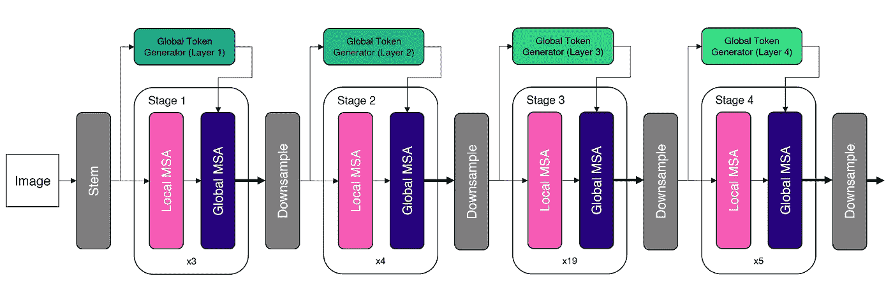
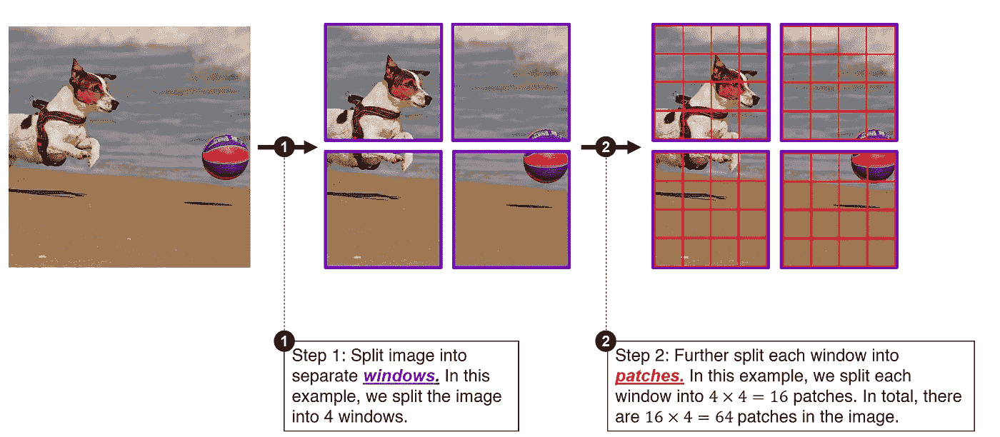
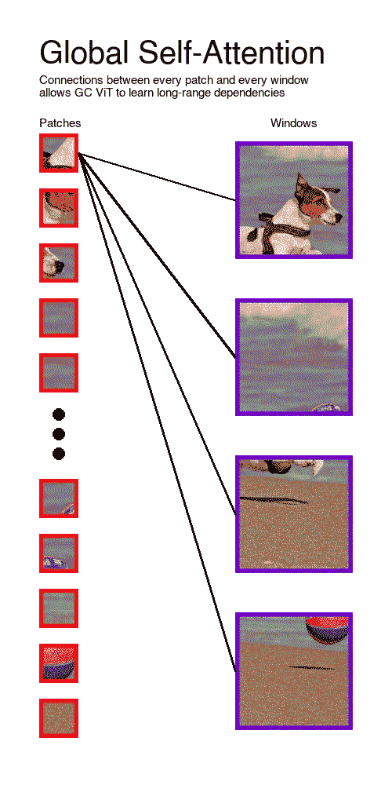
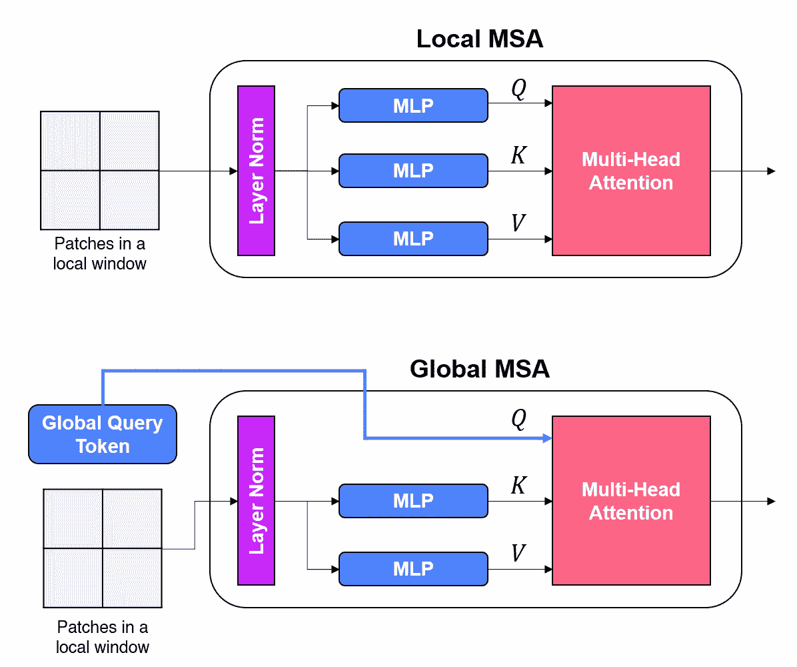
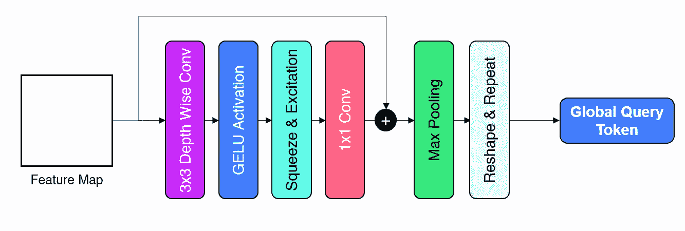
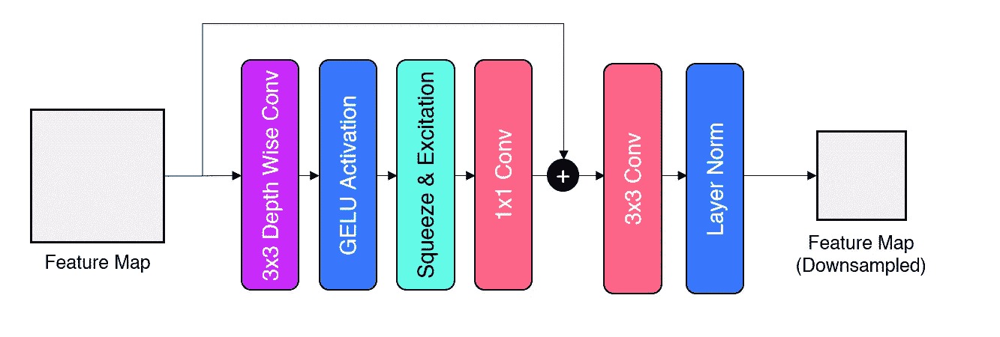
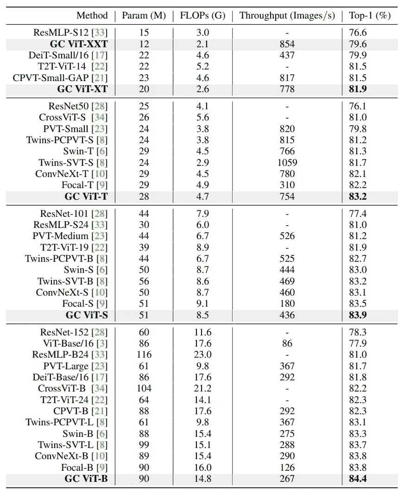

# 全球背景视觉变形金刚(GC ViT)——Nvidia 的新 SOTA 图像模型

> 原文：<https://towardsdatascience.com/global-context-vision-transformers-nvidias-new-sota-image-model-2923bdaf438e>

## 深入的解释和可视化

免费使用来自[像素](https://www.pexels.com/photo/silhouette-of-woman-3862601/)的图像

# 介绍

Nvidia 最近发布了一款新的视觉转换器，名为全球情境视觉转换器( **GC ViT** ) ( [Hatamizadeh 等人，2022](https://arxiv.org/abs/2206.09959) )。GC ViT 引入了一种新的架构，它利用了全局注意力*和*局部注意力，允许它模拟短程和远程空间交互。

Nvidia 研究人员使用的巧妙技术使 GC ViT 能够模拟全球注意力，同时避免昂贵的计算。GC ViT 在 ImageNet-1K 数据集上取得了最先进的(SOTA)结果，远远超过了 Swin Transformer。

在本文中，我们将更深入地了解 GC ViT 的内部工作方式，以及使它能够实现这种结果的技术。

# **GC ViT —改进 Swin 变压器**

自 Swin Transformer ( [刘等人，2021](https://arxiv.org/abs/2103.14030) )于 2021 年发表以来，它已成为最重要的基于 Transformer 的视觉模型之一。

Swin Transformer 引入了重要的技术，如分层特征映射和基于窗口的注意力，这使它能够实现与传统卷积神经网络相比具有竞争力的性能。如今，Swin 变压器被用作各种视觉任务的主干架构，包括图像分类和物体检测。

> [注意:如果你需要复习 Swin 变压器，我在这里写了一个全面的指南，解释了 Swin 变压器的基本原理。](/a-comprehensive-guide-to-swin-transformer-64965f89d14c)

尽管有所进步，Swin 变压器仍有某些缺点。最值得注意的是，Swin Transformer 中使用的基于窗口的注意力将交互的计算限制在每个窗口内，并限制跨窗口的交互。

在 Swin Transformer 中，注意力的计算被限制在局部窗口内。图像来自[像素](https://www.pexels.com/photo/cute-purebred-dog-playing-with-ball-on-sandy-beach-3857521/)。作者创建的图表。

上图显示了 Swin Transformer 中使用的基于窗口的注意力的局限性的示例。输入图像被分割成单独的窗口，然后只在每个窗口内计算自我注意。这限制了全局图像中不同对象之间的长距离相互作用的计算。例如，狗和球被分割到不同的窗口中，模型被限制学习两个对象之间的交互。缺乏跨窗口连接限制了模型捕捉长程相关性的能力，而长程相关性对于精确表示建模至关重要。

Swin 转换器试图通过使用基于移位窗口的注意力来引入*一些*跨窗口连接。然而，这在计算上是昂贵的，并且它没有从根本上解决缺乏**全球连接**的问题。正如我们将在后面看到的，GC ViT 通过在单个架构中提供本地和全局连接对此进行了改进。

# GC ViT 的体系结构

GC ViT 的总体架构。改编自 [Hatamizadeh 等人，2022](https://arxiv.org/abs/2206.09959) 。点击此处查看更高分辨率的图像。

GC ViT 的整体架构如上图所示。正如我们所看到的，GC ViT 由 4 个不同的阶段组成，每个阶段由局部和全局多头自我关注(MSA)层的交替块组成。本地 MSA 提取本地的短程信息，而全球 MSA 提取全球的远程信息。这使得 GC ViT 可以灵活地处理短期和长期依赖关系。在两个阶段之间，GC ViT 使用下采样块来创建类似于 Swin 转换器的分层特征图。

GC ViT 的主要贡献是**全局令牌生成器**和**全局 MSA 层**。在下一节中，我们将更详细地研究它们。

# 全球自我关注

全局自我关注的首要原则是在图像的每个区域之间建立全局联系。为了做到这一点，让我们来理解自我关注是如何将一幅图像分割成不同的碎片的。

为了计算自我注意，图像被分成窗口和小块

从上图中，我们看到每个图像被分割成独立的窗口(显示为紫色)。每个窗口被进一步分割成小块(以红色显示)。在局部自我注意中，小块之间的注意计算被限制在每个局部窗口内。换句话说，不同窗口中的补丁之间没有交叉连接，这限制了网络的建模能力。

全局自我关注旨在通过引入补丁和窗口之间的连接来解决这一问题，如下图动画所示。修补程序和窗口之间的这些全局连接允许 GC ViT 关注图像中的全局位置，有效地模拟长程相关性。

全局自我关注在每个补丁和每个窗口之间建立了联系

在局部 MSA(多头自关注)中，*查询*、*键*和*值*向量从局部窗口中的小块中导出，并且仅在每个局部窗口内计算关注度。相比之下，在全局 MSA 中，只有*键*和*值*向量是从局部窗口中的补丁中导出的。*查询*向量是从所有窗口导出的**全局查询令牌**。下图说明了本地 MSA 和全球 MSA 之间的区别。

本地管理服务协议与全球管理服务协议的比较

全局查询令牌由全局查询生成器在网络的每个阶段生成，全局查询生成器将特征地图作为输入，并提取全局特征作为全局查询令牌。全局查询令牌包含整个输入要素地图的信息，用于与本地键和值向量进行交互。

全局查询生成器由一系列操作组成，如下图所示。

全局查询生成器中的操作

全局查询令牌与本地键和值向量的交互允许计算全局注意力。这有效地扩大了感受野，并允许模型关注特征图中的各个区域。

# 向下采样

GC ViT 还引入了一种新颖的方法，在创建分层特征图的阶段之间对特征图进行下采样。有趣的是，GC ViT 使用卷积层进行下采样。作者认为，使用卷积进行下采样为网络提供了所需的属性，如位置偏差和跨通道交互。下采样块中使用的操作如下图所示。

下采样块内的操作

注意前 4 个操作与全局查询生成器的操作相似。事实上，作者将前 4 个操作称为“Fused-MBConv”块，它的灵感来自 EfficientNetV2。

# 结果

GC ViT 在 ImageNet-1K 数据集上进行图像分类训练。下表比较了 GC ViT 在 ImageNet-1K 数据集上与其他 CNN 和 ViT(包括 Swin Transformer)的性能。正如我们所看到的，GC ViT 达到了一个新的最先进的基准。此外，就 FLOPs 的数量而言，GC ViT 模型具有更好或相当的计算效率。

ImageNet-1K 数据集上的图像分类基准。来自 [Hatamizadeh 等人，2022](https://arxiv.org/abs/2206.09959) 。

与 Swin Transformer 相比，GC ViT 以更少的 FLOPs 实现了更好的性能，展示了结合局部和全局自我关注的好处。但是，请注意，Swin 转换器具有无卷积架构，而 GC ViT 使用卷积运算来计算全局注意力和下采样。

# 结论

GC ViT 引入了一种结合局部自我关注和全局自我关注的新型架构，允许网络对短期和长期交互进行建模。通过删除其他 ViT 中所需的复杂而昂贵的操作和掩码，GC ViT 在 ImageNet-1K 数据集上实现了新的 SOTA，同时计算效率更高。

不过，应当注意，与 Swin 变压器不同，GC ViT 不是无卷积架构，其部分性能可能源自卷积的电感偏置。

# 喜欢这篇文章？

感谢您的阅读！我希望这篇文章对你有用。如果您想订阅中级会员，请考虑使用[我的链接](https://medium.com/@jamesloyys/membership)。这有助于我继续创建对社区有用的内容！😄