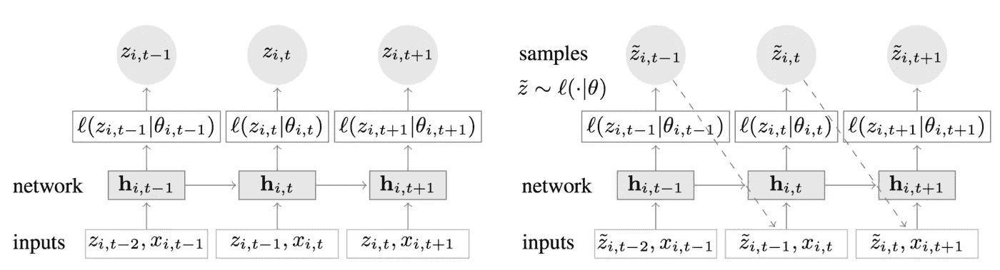
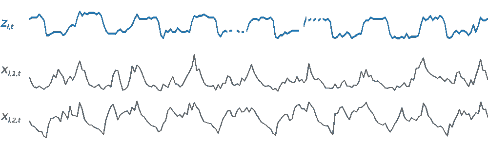
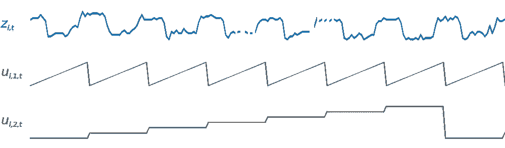
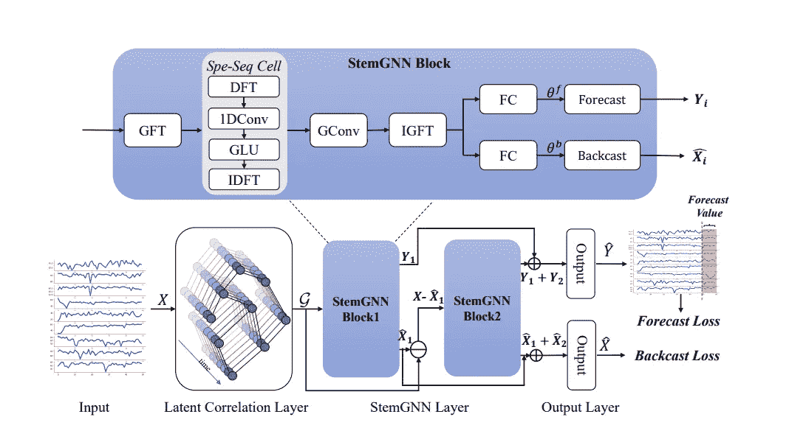
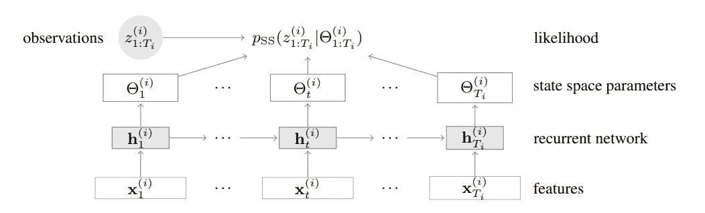
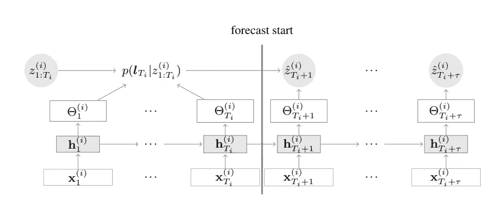
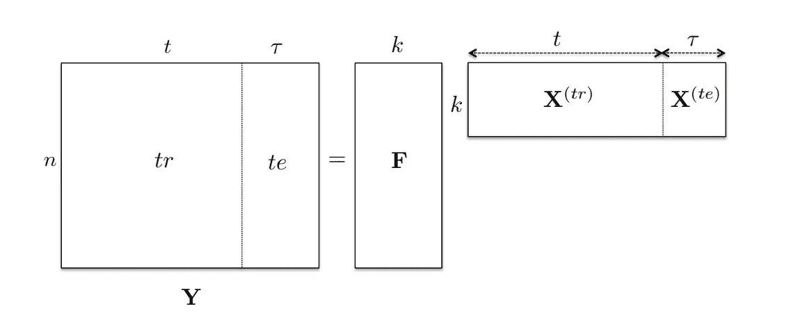
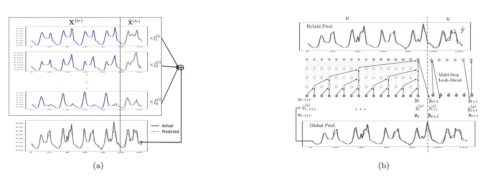

# 用于联合时间序列预测的全局深度学习

> 原文：<https://towardsdatascience.com/global-deep-learning-for-joint-time-series-forecasting-4b03bef42321>

## 简单介绍一下这个领域最热门的模特

照片由[维姆·范因德](https://unsplash.com/@wimvanteinde?utm_source=medium&utm_medium=referral)在 [Unsplash](https://unsplash.com?utm_source=medium&utm_medium=referral) 拍摄

机器学习是一个众所周知的复杂领域，学术界和工业界都在实践，不断改进其基准，产生有趣的想法和解决问题的方法。

在解释其工作原理的适当理论形成之前，它已经在许多不同领域的无数实际应用中成功部署。

由于这个原因，有时很难跟上最新的架构；在这篇文章中，我们正在探索时间序列预测领域的最新成就，这是一类由于时间维度而具有其特殊地位的预测问题。

更准确地说，我们将考虑所谓的**全局模型**:被构建来一次检测许多相关时间序列的模式的架构，学习能够单独解释和预测每个序列的单一表示。

# 所有的事情，所有的地方，所有的时间

当预测模型在许多不同的数据集上训练时，它被称为**全局**，每个数据集都是其自身随机过程的随机结果。

这种模型每天都变得越来越常见，利用我们今天在许多领域拥有的大量数据，解决我们需要对单个小规模数据集进行具体预测的问题；然而，以前我们只能希望在更高的总体水平上进行预测。

这种方法的一个明显优势是，模型将受益于更多的训练数据，这在这个大数据*时代*可以相当于许多数量级的增长。

此外，如果我们希望学习的通用模式只存在于数据集中的一个子集，而在其他一些数据集中它还没有发生，全局模型可以学习将其归因于所有数据集。

另一方面，如果数据集来自不同的生成过程，根据定义，它们的结构和模式至少会有一些差异，因此，对于一个模型来说，忽略这些并均匀地预测一切并不总是可取的。

例如，来自同一家公司的不同商店的销售数据可以被认为是相似的，因为许多有助于数据生成过程的变量都是相同的(相同的产品、价格、营销……)。

尽管如此，许多其他变量(位置、当地客户习惯……)以一种模型难以检测的方式区分每个系列，这就是为什么我们需要将这些变量编码为其输入。

出于这个原因，全球模型倾向于处理关于数据集如何相似以及它们如何彼此不同的信息。我们通常通过给数据集附加标签来传达这一信息，每个标签对应一个我们想要追踪的特征；其他时候，我们只是指示模型相应地自动聚类数据集。

这里的问题是，生成过程，以及由此产生的结果，必须共享足够的信息，以便模型能够利用它们的交叉学习。

选择哪些数据集被认为是相关的可能有些随意，因为我们通常事先不知道我们是否能够实现这种交叉学习的优势，并且将太多不同的数据聚集在一起可能会引入太多的差异和噪声，从而造成损害。

总而言之，在尝试训练全球模型时，最重要的先决条件有两个:

*   要预测许多相关的数据集，这些数据集都来自相似的过程并显示相似的模式；
*   对它们有更多的了解，特别是它们的相似之处和不同之处。

# 几个有趣的模型

时间序列预测是一个特别适合全球模型的问题[1][2]，因为有许多相关的时间序列并不罕见，通常是在一个固定的关系结构中:来自公司客户的数据，系统网络中的传感器，不同位置的交通流量…

与此同时，神经网络已被证明是理想的全球模型，因为它们能够处理任何类型的协变量特征，并且它们对巨大复杂数据集的总体偏好。

因此，深度学习、时间序列预测和大数据的结合近年来在学术和行业研究中找到了如此肥沃的土壤也就不足为奇了。

没有完整性的伪装，这里是这个星体结合的一些更有趣的结果。

请注意，这些模型的结果和基准可以在参考文献中找到；我们对这方面不太感兴趣，而是对其中任何一种方法的新颖性和巧妙性感兴趣。

## 迪帕尔

DeepAR [3]是一个基于递归网络的深度学习模型，致力于学习目标时间序列的一个**自回归表示**。

更具体地，它是 LSTM 细胞的多层网络，具有编码器-解码器结构，用于在每个训练步骤总结细胞过去的信息输出(称为调节范围)，并使其可用于预测其未来(预测范围)。

它是一个概率模型，这意味着在给定相同参数的情况下，它输出表示预测值分布概率的似然函数的参数(其形状可由用户指定)。

预测可能性是一个聪明的技巧，具有很大的灵活性:从这样的函数中，我们可以抽取样本，生成分位数预测，置信区间，甚至可以选择 bootstrap Monte Carlo 样本，这些样本可以到达未来的任何步骤。

DeepAR [3]中训练(左)和推理(右)的图式。

DeepAR 当然配备了动态协变量，如日历特性和静态协变量:如果我们想训练一个单一的全球模型，这些正是我们必须附加到每个系列的标签。

目标系列和协变量[3]。

关于这个模型的内部工作的更多细节，例如它处理具有不同尺度的系列的巧妙方式，我们可以参考原始论文[3]。

## StemGNN

光谱时间图神经网络[4]是一种创新和聪明的设计，用于联合学习系列间和系列内相关性的全局模型。

简而言之，该想法是在两个维度上、跨时间和跨序列使用**傅立叶变换**，以便获得可以被其他神经网络块(如卷积和顺序模块)学习的表示。

虽然在时域中对一个序列执行傅里叶变换是一种经典而简单的技术，但我们需要理解在固定时间对所有序列执行傅里叶变换意味着什么。

事实上，StemGNN 的第一层，称为*潜在相关层*，获取整个数据集并返回一个图，其中节点是时间序列，加权边是层本身推断的它们之间的相关关系。

这一层由一个[GRU](https://d2l.ai/chapter_recurrent-modern/gru.html)【9】和一个自我关注机制组成，但是如果领域知识建议使用一个特定的图形表示来代替，它也可以被删除；例如，可以使用将作为静态协变量传递给其他模型的相同标签来链接系列。

在这之后，该模型将几个相同的块依次应用于数据集在每个序列(其是图中的节点)的图形域( [GFT](https://en.wikipedia.org/wiki/Graph_Fourier_transform#:~:text=In%20mathematics%2C%20the%20graph%20Fourier,as%20a%20graph%20Fourier%20basis.) )和时域( [DFT](https://en.wikipedia.org/wiki/Discrete_Fourier_transform) )中的图形表示；除此之外，卷积块在反转这些变换以返回原始域之前，会学习这些变换所暴露的信息。

StemGNN 的结构相当复杂[4]。

这些块是这种架构的主要新颖部分，它们被恰当地称为 StemGNN 块。它们的内部工作实际上是非常复杂的，因此我们可以参考文献[4]来了解细节。

为了我们的目的，可以说在 DFT 和 GFT 之后应用谱图卷积允许我们共同学习出现在每个序列的谱表示以及相关图的谱矩阵表示中的模式。

最后，StemGNN 块以一种[剩余](https://d2l.ai/chapter_convolutional-modern/resnet.html?highlight=residual)的方式被应用，这样每个块可以更深入到前一个块留下的模式中。这是一个强大的技术，也是[4]中突出使用的技术。

## DSSM

深度状态空间模型[5]是一个结合了深度学习和**状态空间模型**的新想法，以利用两种方法的优势。

状态空间模型(SSMs)[7][8]是一系列用于预测的经典统计模型，包括臭名昭著的 ARIMA 和指数平滑方法。

由于可以在模型中做出结构性假设，并通过选择模型的组成部分和特征来精心制作模型，因此当时间序列特征明确时，这些方法尤其适用。

然而，这种量身定制的方法有其问题，因为它需要有足够历史的知名剧集，并且它很难扩展到我们现在经常拥有的剧集数量。此外，作为一个系列的方法，它根本不能跨系列转移学习。

DSSM 的作者的想法是，然后通过递归神经网络摄取所有系列及其协变量来联合学习 SSM 参数:这里的术语“联合”是指这样的事实，尽管每个系列都有不同的 SSM 及其自己的参数，但神经网络的元参数在整个训练过程中是共享的。

换句话说，作为一项*元学习*任务，在所有系列中训练的单个 RNN 正在学习给每个系列分配不同的 SSM 参数。

像这样的模型，结合了机器学习和经典统计技术，在这种情况下被称为**混合模型**。

在操作上，在训练时，一个 [LSTM](https://d2l.ai/chapter_recurrent-modern/lstm.html) 型网络输出 SSM 参数，这些参数被馈送给一个似然函数，该函数取决于该系列的特定 SSM 模型以及已知的观测值；然后最大化可能性以更新 LSTM 参数。

在 DSSM 培训[5]。

类似地，在推断时，DSSM 通过使用序列的已知值和训练集中的学习参数，计算在最后训练步骤的 SSM 状态的概率分布；这个概率既代表了知识，也代表了模型对我们所处状态的最佳估计。通过使用该概率，该模型然后在蒙特卡罗方法中展开任意数量的预测，通过递归地使用 SSM 和 RNN 在推断时给出的参数。

DSSM 的推论[5]。

## DeepGLO

最后，另一个有趣的混合模型:DeepGLO [6]，正如作者所说，是“*一个深度预测模型，它从全球角度思考，从本地角度行动*”。

它是一个经典的 [**矩阵分解**](https://d2l.ai/chapter_recommender-systems/mf.html) **模型**的组合，一个用于正则化它的卷积网络(TCN)和另一个独立的本地 TCN 作用于每个系列和第一个模型的输出。

DeepGLO 区别于许多竞争对手的特点是不仅在训练中而且在推理中一起使用所有时间序列。

再次引用作者的话，“*例如，在股票市场预测中，在预测苹果的股票价格时，查看 Alphabet 以及亚马逊股票价格的过去值可能是有益的。同样，在零售需求预测中，可以利用类似商品的过去值来预测某个商品的未来*。

该算法的经典部分，即矩阵分解模型，包括将所有时间序列视为单个矩阵，并将其分解为两个矩阵的乘积，称为*因子*。

矩阵乘积的工作方式使得每个因子将共享原始矩阵的一个维度:如果我们将此表示为形状为(n，t + tau)的 Y(出于训练和测试的目的，我们已经对时间维度进行了分割)，则因子 F 和 X 将分别为(n，k)和(k，t + tau)，k 是通常比 n 小得多的某个数。

分解维度的更清晰描述见下图。

矩阵分解:在这个示意性例子中，我们有 n 个长度为 t+τ的时间序列，其中 t 是训练集周期。整体来看，得到的分解是 Y = FX [6]。

实际上，X 可以被视为在 k 个*基序列*中编码全局信息，k 个基序列与原始基序列一样长，F 包含将原始基序列作为基序列的线性组合的系数。

这个模型与卷积网络的混合是相当复杂的，对于那些对细节感兴趣的人，我们遵从[6];简而言之，网络被用作正则化器，这意味着它鼓励因子分解过程给出接近网络预测的基序列。

在因子分解模型(a)中，基序列如何组合以形成实际目标的预测，以及来自该模型的全局预测如何与模型的最终 TCN 层中的局部序列组合[6]。

因子分解和卷积网络在交替步骤中被联合训练；在推断时，网络通过从因式分解给出的值开始预测基序列的未来值，并将它们与系数矩阵相乘给出最终的全局预测。

最后，另一个局部每序列神经网络通过将序列的过去值、来自先前模型的全局预测和局部协变量序列作为输入来起作用。

# 结论

毫无疑问，全球模型将在预测领域占据越来越大的份额，因为我们正在目睹数据、神经网络知识和商业应用的增长，而且这种增长似乎不会很快结束。

正如你所看到的，当涉及到它们时，有令人难以置信的多样性，特别是在预测方面:尽管它们都以神经网络为核心，但每个都有自己的*锦囊妙计*，主要专注于捕捉有趣的信息并将其暴露给网络本身。

特别值得一提的是混合模型，它不仅管理两个学习引擎的共存，还管理它们有利的相互依赖性，以获得大于其各部分之和的结果。

关于哪一个从根本上更好，存在争议:全局与局部[1][2]，经典与混合与纯深度学习[10][11][12]。

可以说，这完全取决于我们所拥有的关于数据生成过程及其实际实现(时间序列)的信息；第一个应该指导我们为问题选择最好的函数类，即算法，第二个应该帮助它在类中找到最好的函数(训练结果)。

通常，先验信息的数量和质量应该与模型的复杂性和特异性相关联。

[1] H. Hewamalage 等人，[时间序列预测的全球模型:模拟研究](https://arxiv.org/pdf/2012.12485.pdf) (2021)。

[2] P. Montero-Manso 等，[时间序列组预测的原理和算法:局部性和整体性](https://arxiv.org/pdf/2008.00444.pdf) (2021)。

[3] D. Salinas 等人， [DeepAR:用自回归递归网络进行概率预测](https://arxiv.org/pdf/1704.04110.pdf) (2019)。

[4] D .曹等，[多变量时间序列预测的谱时态图神经网络](https://papers.nips.cc/paper/2020/file/cdf6581cb7aca4b7e19ef136c6e601a5-Paper.pdf) (2020)。

[5] D. Rangapuram 等人，[时间序列预测的深态空间模型](https://proceedings.neurips.cc/paper/2018/file/5cf68969fb67aa6082363a6d4e6468e2-Paper.pdf) (2018)。

[6] R. Sen 等，[全球思考，局部行动:高维时间序列预测的深度神经网络方法](https://arxiv.org/pdf/1905.03806.pdf) (2019)。

[7] R. J. Hyndman 等人，[用指数平滑法预测:状态空间法](https://robjhyndman.com/expsmooth/) (2008)。

[8] M. Aoki，[时间序列的状态空间建模](https://link.springer.com/book/10.1007/978-3-642-75883-6) (1990)。

[9] A .张等，[潜入深度学习](https://d2l.ai/index.html) (2020)。

[10] S. Makridakis 等人，[统计和机器学习预测方法:关注点和前进方向](https://journals.plos.org/plosone/article?id=10.1371/journal.pone.0194889) (2018)。

[11] B. N. Oreshkin 等人， [N-BEATS:用于可解释时间序列预测的神经基础扩展分析](https://arxiv.org/abs/1905.10437) (2019)。

[12] K. Benidis 等人，[用于时间序列预测的深度学习:教程和文献调查](https://www.amazon.science/publications/deep-learning-for-time-series-forecasting-tutorial-and-literature-survey) (2018)。