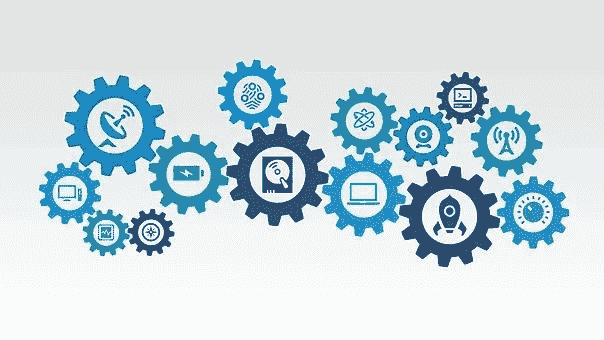

# 全球化趋势和数据科学

> 原文：<https://towardsdatascience.com/globalizing-trends-and-data-science-a-promising-relationship-16509902fdb1>

## **近距离观察一段充满希望的关系**

皮沙贝

# 介绍

“全球”一词已被广泛用于研究当代现实的许多细微差别。然而，鉴于世界各地发生的广泛变化，有必要更好地理解这些转变的动力。因此，全球研究领域诞生了，以更多地了解全球化影响自然世界的各种方式。

我们今天正在经历的变化无疑正在改变我们用来组织我们对世界的知识的地图。由于前所未有的数据访问，学习也发生了深刻的转变。换句话说，我们正在目睹两个而不是一个深刻的转变。我们试图在地图上描绘的“领土”变化的一部分是各国在社会、政治和经济上日益增长的相互依赖。尽管如此，我们可以用来创建这样一幅地图的数据量还是呈指数级增长。本体论和认识论的转变是同时发生的。结果，现实的本质和我们收集信息的方式同时被改变了。基于数据科学的方法工具及其对全球研究的潜在影响将在本文中从这个角度进行研究。

本世纪最重大的转变是数据的指数增长，这为分析我们周围世界的新方法打开了大门。近年来，我们已经看到大数据等颠覆性技术的兴起，这些技术对社会的许多方面产生了重大影响。自本世纪初以来，信息变得越来越稀缺、昂贵和难以获得。如果所提供的信息达到足够高的标准，就可以得出合理的结论。由于收集和存储的大量数据，我们感知现实的方式正在发生变化。这一事实要求我们彻底改变看待世界的方式。信息的价值不再在于具体的数据，而在于海量数据集之间的关联，以发现以前未知的模式。因此，通过计算分析，海量数据可以提供关于模式、趋势和隐藏关联的更精确信息。

这表明我们目前正处于一场数据革命之中。新技术正在推动可用数据的数量和类型呈指数级增长，创造了以前无法想象的报告可能性。因此，今天的数据比以往任何时候都更重要、更快速、更详细，并重塑了社会秩序。

迄今为止，大数据分析已经应用于科学研究的各个领域，以解决复杂的问题。这包括教育、卫生、交通、媒体和娱乐、国家安全以及生物医学和环境等领域的研究。使用数据提取技术来提高或预测就业能力的项目在这些项目中脱颖而出。植物生长数据、温室气体测量和气候变化对作物的影响都被用于在农业中使用数据科学来提高农业生产率。因此，大数据技术有望在精准医疗和疾病治疗与预防的未来发展中发挥重要作用。大数据有广泛的应用，包括开发癌症基因组图谱以支持癌症研究；用计算和认知方法研究语言和非语言交流；分析多种蛋白质序列，以确定进化联系和预测分子结构；发展城市区域情报系统，这有助于改善城市居民的生活。

全球研究最近才开始深入分析大量数据的主题。全球研究中的一个重要争论是数据科学提供的方法可能性和局限性是否能帮助我们更好地理解当今全球化世界的复杂性和多样性。

这是通过将它分成 3 个部分来实现的。在第一部分中，讨论了数据科学的理论方面。

第二部分将理解数据科学可用于进行全球研究。

最后，我们将讨论将大数据纳入全球研究的理论和方法上的影响。

# 1.数据科学的概念框架

由于互联网对社会如何生成和消费信息的影响，如果不考虑这项技术，就不可能将数据科学概念化。互联网是用于交换数据的互联计算机的通用网络。在这种情况下，连接许多设备(如计算机、文件服务器和摄像机)的网络被称为“复杂网络”。在包括技术领域在内的全球霸权竞争中，美国和苏联在冷战期间开发了这项技术。使用这种方法，苏联在 1957 年发射了人造卫星。高级研究计划局(ARPA)就是为了应对这一威胁而成立的。最后，这个组织为互联网的出现奠定了基础。Paul Baran 在 1962 年提出了一种防止外部攻击的通信系统，使用连接到分散网络的计算机。

这种通信系统是通过整合大学网站的虚拟网络发展而来的；后来，商业平台将被整合，社交网络将被开发，一系列应用将被产生，例如地理参考。这种虚拟的联系产生了一个连续的和不断增长的信息体。可以说，打个比喻，我们从模拟个体变成了数字个体，这意味着我们现在几乎随时都可以通过不同的设备永久连接。得益于日益强大的计算机的进步，这产生了大量可以获取、分类和分析的数据。

最初，大量信息的产生被专门从事互联网站点管理的公司用来在该数据集中寻找机会以增加他们的利润。然而，这种以产生大量信息为特征的新环境已经让位于建立一个以知识为基础的社会，在这种社会中，一种新的职业脱颖而出，即知识工作者，他们拥有技能、能力和技术，能够处理持续的信息流动。这种知识工作者已经发展成为一种新的员工形象，现在被称为数据科学家。该专业人员将统计、数学、编程和解决问题的技能与数据捕获相结合，能够执行适当的数据清理、准备和集成活动，以定位数据中的模式。

***现在，数据科学由三个领域组成:***

1.大数据，用于处理数据。

2.数据挖掘，其目的是发现模式，即使它们不是以前想象的？

3.数据的可视化，其目的是便于清晰地理解信息，促进其社会化。

为了大致了解海量数据的含义，可以指出，自 2018 年 3 月以来，脸书社交网络已注册 22 亿月活跃用户和 14.5 亿日活跃用户，这一数字比上一年增加了 13%；同样，据估计，WhatsApp 的月活跃用户有 15 亿；此外，Twitter 平台上每天发送约 5 亿条推文，这意味着在过去六年中增加了十倍；最后，据估计，每天在谷歌搜索引擎中有超过 7，000 万次查询。

从这个意义上说，社会科学家必须考虑与大数据现象相关的三个挑战:

1.与日益增长的数据量的存储、安全和分析相关的技术问题。

2.商业价值是通过产生更有效的感知来增加的另一种方式。

3.社会影响，特别是使用数据保护个人隐私的影响。

因此，鉴于每天产生的数据量巨大，根据术语物联网(IoE)提出一个参考框架来确定信息生成过程，旨在对互联网上的所有可用数据进行分类。因此，建立了三个类别。第一个是内容互联网(IoC ),它代表了人们寻求增加特定主题知识所产生的信息；这些信息的例子有文章和博客、维基百科这样的百科全书、YouTube 这样的视频平台和 Google Books 这样的电子书。第二，人民互联网(IoP)，包括社会互动产生的信息；例如，电子邮件、社交网络和虚拟论坛。第三类包括物联网(IoT)，其包括由连接到网络的物体产生的信息；它是关于所有的事物，这些事物都有一个独特的标识，并且存在于一个类似互联网的结构中。从这个意义上说，事物可以有互联网连接或被网络标记。最后，还有地点互联网(IoL)，其中包括因采用移动设备而产生的具有空间维度的信息；例如，智能手机生成越来越多具有地理空间属性的事件。

关于大数据的第二个领域，即数据挖掘，将其视为对观察到的数据集(通常数量巨大)的分析，旨在发现变量之间的新关系，以及以可理解和有用的方式对所述数据集进行正确总结，数据挖掘是智能数据分析的科学和艺术，从中产生感兴趣的知识。另一方面，数据挖掘被认为是发现信息模式或知识发现的基本步骤。这被理解为寻找有效的、相关的、潜在有用的模式的过程，试图使它们变得可理解。

由于数据挖掘是一个提取信息的过程，它使用的方法和模型允许定义以前未知的变量之间的关系或模式。现在，他们使用的模型有两种类型:描述性的，试图找出允许他们总结和解释数据行为的模式；和预测模型，它们试图根据感兴趣的变量的历史行为来估计该变量的未来值。因此，数据挖掘过程包括数据描述、估计、预测、分类、聚类和关联。

将这些模型中使用的技术分为有监督的和无监督的。监督技术用于建立模型，这些模型用于进行预测。这些包括开发通用算法、神经网络、决策树和回归分析。无监督技术或知识发现算法通常用于从大量数据中提取有用的信息。这种类型的例子有聚类、链接分析和频率分析。

数据科学的最后一个要素是可视化。这种技术允许我们使用不同的方法和技术，在图表或表示的帮助下，检查大量数据并识别模式或趋势。虽然信息的可视化在人类的发展中确实存在，但只是在最近，由于处理能力更强的软件和能够方便绘图和表示的所谓库的发展，它的使用才得到扩展。

显然，数据科学的每个组成部分都在不断发展。毫无疑问，这一事实影响了科学研究的开展方式，并影响了不同的知识领域。因此，下一节将分析全球研究和数据科学之间良好关系的可能性。

# 2.全球研究和数据科学:一种有前途的关系？

虽然全球化现象并不是当代生活的一个独特趋势，但全球化研究是一个相对较新的科学学科，因为社会科学家只是在最近才开始从历史角度和当代方法系统地分析跨国和全球体系的网络、流动、过程、意识形态和表现。此外，全球研究这一学术领域是在当前日益全球化的背景下出现的，目的是为了更好地理解近几十年来加剧的变化，这些变化在全球范围内增加了政治、经济和社会的相互联系。自从 20 世纪 90 年代第一批全球研究学术项目和研究中心在北美、欧洲和亚洲建立以来，这一学科得到了广泛的发展。目前，据估计，全世界大约有 200 个研究中心从不同角度研究这一全球现象。

然而，当从全球研究的角度出发时，需要考虑到这一学科并不仅仅意味着分析全球化。在这方面，Nederveen (2013)提出了全球研究与全球化研究明显不同的三个方面。首先，他认为全球化研究产生于一股浪潮，这种浪潮在性质上不同于推动全球化分析的浪潮，这种全球化分析来自于已经有着悠久知识传统的特定学科。全球研究不涉及与特定学科相关的问题，这些学科将全球作为一个研究主题，就像全球政治经济、全球文化或全球传播一样。在这个意义上，他提出全球趋势首先加剧；后来，全球化开始从已经建立的知识领域进行研究；最后，今天，我们正处于第三阶段，在这个阶段中，全球研究学科作为一种分析全球化的不同方式出现。基于跨学科的方法，这种接近全球的方式超越了特定学科所包含的知识的传统界限。第二，他警告说，从知识的角度来看，全球研究仍然是一个新兴的学科，他称之为无屋顶的脚手架。第三，它肯定了全球研究可以增加传统全球研究之外的价值，因为它们渴望建立一个多中心的知识结构，它不仅将西方世界作为知识和历史经验的中心，而且从多层次的角度出发，其中地方、国家和全球具有同等的重要性。

在定义全球研究时，可以强调以下基本特征。此外，它们是跨国的，因为它们侧重于在内容和范围上分析跨国界和跨文化现象。最重要的是，他们本质上是跨学科的，因为他们研究的现象从经济到政治到社会到文化到宗教到意识形态到环境和生物。同样，全球研究既是历史的，也是当代的，因为有必要考察历史先例，以充分理解当前的全球模式。最后，它们通常是批判性的和后殖民主义的。一般来说，在西方形成的经济、政治和文化全球化模式不会被全球研究领域不加批判地接受。因此，他们认识到，根据社会和经济地位的不同，对全球问题、动态和趋势的看法在世界不同地区和同一国家或地区会有所不同。因此，全球研究表明，根据其社会和经济地位，全球各地甚至同一国家或地区的人们以不同的方式看待全球动态和趋势。因此，来自世界各地的研究表明，根据他们的社会和经济地位，世界各地甚至同一国家或地区的人们可以以不同的方式感知全球动态和趋势。这就是为什么全球研究提倡使用“多重全球化”这一术语，它承认没有一种主导范式或观点比另一种更有价值。

分析视角的根本转变是必需的，这需要对每一个学科的主导分析模式进行彻底的修正，因为各种学科集体转向理解全球化及其带来的问题。因为它们受到支持和反映它们产生的时间和地点的传统理论和方法规范的限制，例如，完全在已经建立的学科范围内进行的关于全球化的研究将产生这些方法是不全面的。另一方面，全球研究旨在克服这些限制，并纳入关于历史上被排除在学科叙事之外的群体的多种见解。

由于主题的复杂性，全球研究是社会科学和人文科学中的一个独特学科。这是因为目前的范式无法在其概念框架内理解全球的动态和趋势。这种根本性的无能源于我们对知识的先存观念，以及我们用来验证我们自认为知道的东西的准确性的方法。作为一门新的科学学科，全球研究可能意味着我们当前的本体论和认识论范式都是不充分的。

由于这种矛盾的无力调和两种范式，我们有机会探索概念化研究对象的新方法，我们称之为全球，以及旨在更好地理解和解释这一现象的新的方法论建议。典型残疾为我们提供了一个机会，去想象获取、分析和解释我们目前无法获得的信息的新方法。我们可以研究数据科学是否能为全球研究学科提供新的东西，以及它是否能丰富或补充传统上分析全球化及其后果的主要方法。

也有可能提出一个智力问题，即基于数据科学的新方法会在多大程度上改变我们对全球的本体论基础的理解。当涉及到研究全球趋势时，我们将如何能够在地方或国家层面，甚至在全球层面上微调我们对大数据的搜索和关联？我们对世界的看法会改变吗，或者我们只是简单地“扩展”我们现有的知识？数据科学将揭示什么样的全球化模式及其影响，或者它将代表一种新的以欧洲为中心的学术知识形式，限制其他非西方知识的声音，这是全球研究试图夺回的？下一节将考察数据科学对全球研究可能的方法论意义，试图提供一些答案。

# 3.数据科学对全球研究的理论方法论意义

今天，“指纹”可以用来在难以想象的规模上检查人类活动，让我们更好地理解人类行为及其许多方面。大数据催生了一个全新的研究领域，而计算机科学提供了生成和收集数据的新方法，以及新的分析和统计方法以及可视化和呈现数据的方法。这些新技术和信息来源可能会彻底改变社会科学方法论。数据科学中出现了一些方法，这些方法正在改变知识的对象，同时产生了关于社会互动和人类环境的新叙事。换句话说，如果我们能够改进我们的估计所基于的先验信息的结构，我们就能够减少我们所获得的知识的不确定性。

另一方面，方法论工具或方法只是拼图中的一块，它可以帮助我们理解趋势，建立关系，得出结论，并建立合理的解释，从而有助于我们理解我们周围的世界，通过提供我们周围环境的背景和意义，给我们一个“世界的科学图像”。根据这一定义，数据科学像任何其他科学方法一样，在科学知识的发展和发现“世界的科学图像”方面发挥着关键作用。此外，每种方法都受到植根于过去和现在的国家传统和跨国影响的影响。任何科学研究方法的固有局限性都源于它们产生的特定环境，这与数据的大量使用以及与数据收集和解释相关的研究技术不无关系。

作为一种社会研究方法，数据科学可以为全球研究带来新的见解。尽管如此，它也有缺点，比如难以获得大量数据，难以建立更严格的相关性和模式。事实上，算法越来越多地被用于调解社会进程、商业交易和政府决策。如果我们不对算法设计和实现的伦理含义采取批判性的立场，将会给个人、团体和整个社会带来严重的后果。

我们需要问的基本问题是，海量数据的分析究竟能为我们获取世界全球化趋势信息的传统方法做出什么贡献？因此，这种收集和分析数据的方法丰富了全球研究作为一门科学学科的贡献。也就是说，如何通过使用大规模数据分析来丰富区分全球研究的跨学科方法、多中心光学和多层次视角。

另一方面，大数据分析使我们能够看到以前未观察到的趋势，这些趋势不是基于我们以前的思维模式。与传统的社会科学方法不同，数据科学研究从一张白纸开始，必须从海量数据中筛选出他们想要的答案。这种方法依赖于从完善的理论中得出的概括，以指导经验证据的搜索。它更像是一张巨大的网，在没有进行彻底调查的情况下就被扔进了大海。海量数据分析旨在收集尽可能多的数据，这与传统的定量或定性方法不同，传统的定量或定性方法之前已经决定了要寻找的数据。在短时间内处理大量数据的能力使得人们发现了数据之间以前未知的联系。在全球研究领域，移民可以作为一个例子来说明这种情况。人们提出了许多理论来解释为什么人们在世界各地迁移。然而，如果我们可以通过手机跟踪移民的数据消费，那么对于移民、停留、消费、期望和决策会有什么新的解释呢？通过如此大规模地比较这些数据集，我们能推断出什么？什么样的连接是可能的？马格里布人和中美洲人有一些相似之处，但他们在全球移民方面也有一些重大差异。有哪些共性？有什么区别？

识别大规模数据集中的模式使我们能够更好地理解局部现象，这是第二个贡献。由于数据收集和处理历来是繁重的任务，大多数数据是在国家一级提出的。由于不可能比较多个案例和多个变量，案例研究被视为一种理想的方法，而不是了解特定地区或场所动态的方法。然而，可以建立地方模式，并与国家和跨国模式进行比较。重要的是要记住，大部分的海量数据是社会的。作为讨论的一个例子，有可能在全球范围内审查与当地具体情况相联系的文化消费模式。因此，有可能探讨以下问题:Twitter 讨论的当前趋势是什么？特定的国家或全球趋势在哪里影响特定的位置？这两者之间有很强的联系吗？换句话说，一旦这些发现被做出，它们属于什么社会群体？全球南方是否同时影响着全球的讨论趋势，或者仅仅是全球北方？如果是的话，有没有什么模式可以用来解释这一点？

因此，可以生成多个建模变量，数据的大量使用克服了简约原则。这证明，在同样的情况下，最简单的解释通常是正确的。在某种程度上，可以理解的是，在时间、成本和空间等约束条件下，倾向于更简单并故意拒绝复杂性的模型将被采用，这些约束条件传统上限制了可以分析的信息量。随着技术革命的进展，处理数据将变得更加简单。具有多个变量的复杂模型可以在地方、国家和跨国范围内进行研究，以建立更复杂的相互关系模式。

换句话说，学术文献已经广泛研究了全球范围的社会运动和争取人权的斗争。另一方面，从网络活动家的角度来看，数据科学有可能帮助挪用和捍卫这些事业。从那些使用社交网络倡导人权的人的个人资料中，我们还能了解到什么？还有哪些网络行为最能说明网络激进分子是如何将他们的本地环境与全球需求联系起来的，这有待讨论。这些行为产生的相互关系和反应模式…这两者之间有什么联系？在这方面，值得注意的是，有大量文献专门研究社会运动和全球争取人权的斗争。换句话说，学术文献已经广泛研究了全球范围的社会运动和争取人权的斗争。大量文献致力于研究全球社会运动和争取基本人权的斗争。

对大量数据的实时分析使得放弃线性成为可能。这允许获得连续的信息流，打破了预先确定的时间链。例如，关于生产活动和人口普查的统计由于这种实用性而暂时中断。然而，由于数据分析和收集的进步以及能够提取和说明大规模模式的算法，可以考虑新的时间截止点。由于信息的不断流动和实时分析的能力，研究人员现在可以在他们选择的任何时间长度内研究一个主题。例如，使用来自世界各地的数千份医疗记录，跟踪感染爆发的出现和传播如何帮助我们更好地理解全球和地方是如何联系的？如疫情的不寻常和意想不到的增长。这个事件和其他事件所涉及的变量之间有关联吗？如果患者和卫生专业人员的运动可以用来生成地理参考数据，它可能会提供什么新的见解？

另一方面，使用大量数据并不是理解我们社会当前全球化动态的灵丹妙药。大数据分析的非关键用途至少存在四大风险。强调经验主义认识论，回归实证主义作为一种更高形式的知识。当涉及到获取准确信息时，即使打算彻底收集数据并提供所研究现象的全面情况，由于用于获取数据的技术平台、数据模型和监管框架，采样偏差也是不可避免的。第三，低聚的世界观可以在所有数据中找到:来自特定观点和特定工具的观点。没有任何自然元素可以从表面上看作为绝对真理；相反，数据是在一个复杂的集合中创建的，这个集合积极地塑造了它们的构成，而不是以客观和中立的方式从世界中抽象出来。

第二个危险是成为预测科学的牺牲品，该科学假设人类的行为模式是可预测的。根据这些假设，可以使用基于先前记录的模式的适当算法来发现预测的人类行为。换句话说，分析的数据越多，预测就越准确。自由意志和结构决定论之间的争论可能会促进人们对人类行为规律的兴趣的复苏。也就是说；人们相信，随着算法越来越擅长预测天气等自然现象，它们也将能够更好地预测特定情况下的人类行为。全球安全领域的例子包括声称“通过预测‘下一次恐怖袭击’和在犯罪分子实施攻击前将其逮捕，承诺保护未来”的基于数据科学的预测分析已经实现。我们可能会错误地得出结论，认为对海量数据的分析最终可以建立明确的模式，解释地方、国家和全球层面的社会行为；我们可能会进一步提出，这个算法将确定我们做什么，以及我们应该做什么。使用预先存在的信息模式可能会缩短我们的决策范围。根据一项警告，新分析中使用的算法可能会在不自动提问的情况下发现见解。尽管如此，它们在特定的背景下经过了科学的检验，而这些背景不一定是普遍的。

当谈到理解当今世界时，数据科学可能会导致因果关系和相关性之间的错误选择。存在这样一种风险，即解释结构的一个方面优于另一个方面，偏向于相关的倾向，这种倾向阻止了基于因果关系的解释的建立。然而，这些数字并不能说明全部情况。从相关性中推断因果关系是不正确的。然而，大规模数据分析可以检测大量数据源之间的相关性，但它不能确定相关性是否足够显著。

此外，当寻找变量之间的相关性时，统计显著性检验被期望仅基于偶然发现虚假的相关性。必须使用叙述和上下文来理解数据，并赋予其形式和意义。这些数据必须作为更大的解释或意义构建过程的一部分被调动起来，以使其有意义。然而，价值论中立并不意味着科学不受哲学和政治的考虑。不中立的叙事结构显然反映了这些目标。最终，数据科学只是众多故事中的一个。

最后，在信息技术时代，我们通过数字互动产生了大量信息流，将真实的东西还原为这些信息流所表达的东西，这增加了制造虚假现实图像的可能性。或者我们花钱的方式。请记住，当今世界的排斥动态创造了一种新的被丢弃类型:被丢弃的数字，其稀疏或不存在的数据“足迹”在云中。如果我们过于强调数据驱动的不可见性，它是可能的。作为一种新形式的隐形、排斥和隔离，这种风险比数字文盲更大。

根据上述讨论，数据科学可能会给全球化带来风险。尽管如此，它也为企业和劳动力市场提供了许多好处和机会。