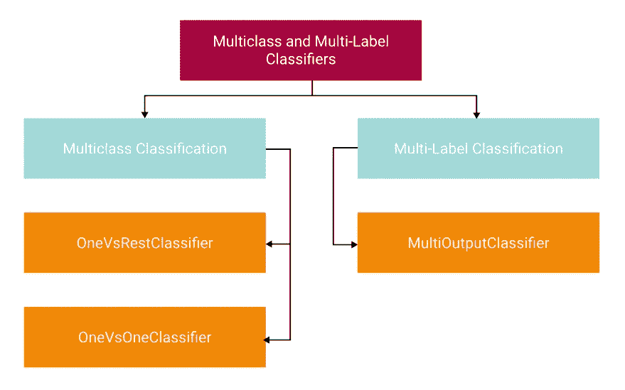
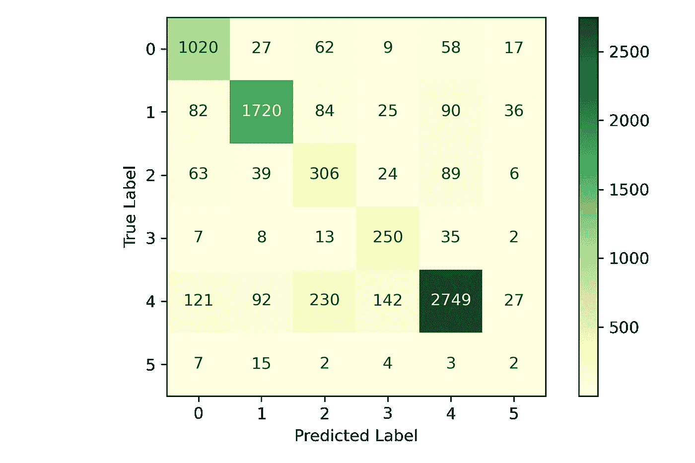

# 使用多类和多标签模型超越二元分类

> 原文：<https://towardsdatascience.com/go-beyond-binary-classification-with-multi-class-and-multi-label-models-6ce91ca08264>

## 此外，了解多类的不同策略，以提高性能


照片由[朱迪思·吉拉德-马克扎克](https://unsplash.com/@judithgirardmarczak?utm_source=medium&utm_medium=referral)在 [Unsplash](https://unsplash.com?utm_source=medium&utm_medium=referral) 拍摄

# 什么是多类多标签分类？

通常当你开始学习机器学习中的分类问题时，你会从[二元分类](/everything-you-need-to-know-to-build-an-amazing-binary-classifier-590de3482aad)或者只有两种可能结果的地方开始，比如*垃圾*或者*非垃圾*、*欺诈*或者*非欺诈*等等。除此之外，我们还有**多级**和**多标签**分类。让我们从解释每一个开始。

**多类别分类**是指目标变量(`y`)中有两个以上的类别。例如，你可以有*小型*、*中型*、*大型*和*大型*，或者你可以有一个基于一到五颗星的评级系统。这些级别中的每一个都可以被认为是一个类。该策略的目标是**从可用类别中预测出一个类别**。

**多标签分类**略有不同。这里你也有两个以上的类别可用，但是不是只选择一个类别，这个策略的目标是**在适用的时候预测多个类别**。当您有多个相互关联的类别时，这种策略非常有用。我见过的最好的例子之一是当它被用在标签系统中时。例如，中型文章可以有多个与之相关联的标签。这篇特定的文章可能有`machine learning`、`data science`和`python`作为标签。

在开始之前，如果你想深入了解二进制分类，可以看看我的文章:[构建一个惊人的二进制分类器所需要知道的一切](/everything-you-need-to-know-to-build-an-amazing-binary-classifier-590de3482aad)。

现在，让我们深入研究多类策略。

# 多类策略

策略是你如何指导分类器处理两个以上的类，这可能会影响性能**泛化**或计算资源。泛化指的是分类器在未来对看不见的数据工作得有多好；这与*过拟合*相反。查看 Scikit-Learn [文档](https://scikit-learn.org/stable/modules/multiclass.html#ovr-classification)了解更多信息。

**一个对其余的**或(OVR)，也称为**一个对所有的** (OVA)策略，适用于每个类别的单个分类器，该分类器适用于所有其他类别。OVR 本质上是把多类问题分裂成一组二元分类问题。OVR 往往表现良好，因为有`n`类的`n`分类器。OVR 是最常见的策略，你可以从这里开始你的旅程。这实际上是这样的:

*   **分类器 1:** 小型 vs(中型、大型、xlarge)
*   **分类器 2:** 中型 vs(小型、大型、xlarge)
*   **分类器 3:** 大型 vs(小型、中型、xlarge)
*   **分类器 4:** xlarge vs(小、中、大)

如果你有非常多的班级，OVR 倾向于**不能很好地扩展。一对一可能更好。接下来我们来谈谈这个。**

一对一 (OVO)策略适合每对类别的单个分类器。看起来是这样的:

*   **分类器 1:** 小型与中型
*   **分类器 2:** 小与大
*   **分类器 3:** 小与大
*   **分类器 4:** 中型与大型
*   **分类器 5:** 中型与大型
*   **分类器 6:** 大与 x 大

虽然[的计算复杂度](https://en.wikipedia.org/wiki/Big_O_notation)高于 OVR 策略，但当您有大量的类时，这可能是有利的，因为每个分类器适合数据的较小子集，而 OVR 策略适合每个分类器的整个数据集。

最后，对于**多标签**分类，还有`MultiOutputClassifier`。类似于 **OVR** ，这适合每个类的分类器。然而，与单个预测输出相反，如果适用，这可以为**单个预测**输出**多个类别**。

**注意:**专门针对 Scikit-Learn 库，所有分类器都支持多类。你可以使用这些策略来进一步完善他们的表现。



作者图片

# 实践中的多级分类

我们开始吧！现在，我们已经了解了一些术语，让我们来实施一些策略。对于这个例子，我们将使用 Kaggle 上的[女装电子商务服装评论](https://www.kaggle.com/nicapotato/womens-ecommerce-clothing-reviews)数据集，它可以在 [CC0:公共领域](https://creativecommons.org/publicdomain/zero/1.0/)下使用。这是一组评论文本、评级、部门名称和每个项目的类别。我们将构建一个分类器，它可以根据评论文本预测部门名称。

首先，我喜欢使用[管道](https://www.dataknowsall.com/sklearnpipelines.html)来确保过程的可重复性。管道允许你将数据转换成适合机器学习的格式。我们有两个特征需要改变。我们向数据集添加了*评论文本*和*文本长度*特征。审查文本将利用 [TF-IDF](https://www.dataknowsall.com/bowtfidf.html) 进行矢量化，第二个将使用`MinMaxScaler`对数字数据进行标准化。

**注意**:流程中遗漏了很多步骤。像导入数据、[、文本清理](https://www.dataknowsall.com/textcleaning.html)等等。滚动到末尾，在 GitHub 上获得该笔记本的链接。

```
def create_pipe(clf):

    column_trans = ColumnTransformer(
            [('Text', TfidfVectorizer(), 'Text_Processed'),
             ('Text Length', MinMaxScaler(), ['text_len'])],
            remainder='drop') 

    pipeline = Pipeline([('prep',column_trans),
                         ('clf', clf)])

    return pipeline
```

接下来，我们需要将我们的数据分成用于学习的`X`数据和目标变量`y`，这是模型将如何学习适当的类。

```
X = df[['Text_Processed', 'text_len']]
y = df['Department Name']
y.value_counts()
```

```
Tops        10048
Dresses      6145
Bottoms      3660
Intimate     1651
Jackets      1002
Trend         118
Name: Department Name, dtype: int64
```

通过检查目标的`value_counts()`，我们可以看到我们正在处理不平衡的数据。对最低的几类，尤其是*趋势*的观察数量，比*最高的*类少得多。我们将使用一个支持不平衡数据的分类器，但是要深入研究不平衡数据，请参见我的另一篇文章:[在构建 ML 模型时不要陷入不平衡数据的陷阱](/working-with-imbalanced-data-efbd96b3e655)。

接下来，您应该用`LabelEncoder`对您的目标变量进行编码。虽然 Sklearn 倾向于很好地处理基于文本的类名，但最好在训练之前将所有内容都转换成数字形式。

```
le = LabelEncoder()
y = le.fit_transform(y)
le.classes_
```

```
array(['Bottoms', 'Dresses', 'Intimate', 'Jackets', 'Tops', 'Trend'], dtype=object)
```

通过打印出`classes_`，我们可以看到哪些类是根据列表的顺序编码的。

当然，在训练我们的模型时，我们需要将数据集分成**训练**和**测试分区**，允许我们训练我们的模型，并在测试集上验证它，看看它的表现如何。

```
# Make training and test sets 
X_train, X_test, y_train, y_test = train_test_split(X, 
                                                    y, 
                                                    test_size=0.33, 
                                                    random_state=53)
```

接下来是打印分类报告和混淆矩阵的功能。查看我关于如何最好地评估分类模型的文章以获得更多信息:[停止使用准确性来评估你的分类模型](/evaluating-ml-models-with-a-confusion-matrix-3fd9c3ab07dd)。

```
def fit_and_print(pipeline):

    pipeline.fit(X_train, y_train)
    y_pred = pipeline.predict(X_test)

    print(metrics.classification_report(y_test, y_pred, digits=3))

    ConfusionMatrixDisplay.from_predictions(y_test, 
                                            y_pred, 
                                            cmap=plt.cm.YlGn)

    plt.tight_layout()
    plt.ylabel('True label')
    plt.xlabel('Predicted Label')
    plt.tight_layout()
```

在这里，我们创建分类器的实例，对其进行拟合和评估。我们使用的是`LogisticRegression`，它本质上是一个二元分类器。Sklearn 已经直接实现了 multi-class 作为分类器的参数，但是为了演示 One-vs-Rest 如何工作，我将使用包装器。为了实现这一点，你用我上面谈到的`OneVsRestClassifier()`策略包装你的分类器。这个包装器指示分类器如何处理多类。我们也可以以同样的方式使用`OneVsOneClassifier`策略。继续尝试这两种方法并比较结果。

```
clf = OneVsRestClassifier(LogisticRegression(random_state=42, 
                                             class_weight='balanced'))
pipeline = create_pipe(clf)
fit_and_print(pipeline)
```

```
precision    recall  f1-score   support

           0      0.785     0.855     0.818      1193
           1      0.905     0.844     0.874      2037
           2      0.439     0.581     0.500       527
           3      0.551     0.794     0.650       315
           4      0.909     0.818     0.861      3361
           5      0.022     0.061     0.033        33

    accuracy                          0.810      7466
   macro avg      0.602     0.659     0.623      7466
weighted avg      0.836     0.810     0.820      7466
```



作者图片

我们可以看到，该模型列出了六个类以及每个类的相对性能。人数较多的班级表现得相当好，而人数较少的班级表现较差。用这么少的观察来概括`5`类是不可能的。在现实生活中训练模型之前，您可能需要收集更多的数据。

# 多标签分类

接下来，我们将看一个**多标签**分类问题。我们将使用与之前相同的数据集，但这次我们将使用**类名**作为目标变量，并将**评论文本**和**部门名**的组合作为我们学习的特征。我们首先创建我们的`X`和`y`数据。

我们需要对**类名**进行记号化，以确保当我们二进制化文本时，我们不会将单词分割成单独的字母，而是将整个单词作为一个整体来维护。

```
# Tokenize the words
df['Class Name'] = df['Class Name'].apply(word_tokenize)
X = df[['Text_Processed', 'Department Name']]
y = df['Class Name']
```

要创建多标签分类器，需要将目标二进制化为多标签格式。在上面的例子中，我们使用了`LabelEncoder`，它只是在这里将目标类名转换为整数；我们将使用`MultiLabelBinarizer.`如果我们在二进制化拟合后打印`y`，我们可以看到它产生一个 0 和 1 的矩阵。任何时候你将一个**矩阵** ( *n 维数组* y)传递给一个分类器(相对于一个矢量， *1d 数组*，它将*自动*成为一个多标签问题。

```
mlb = MultiLabelBinarizer()
y = mlb.fit_transform(y)
print(y)
```

```
[[0 0 0 ... 0 0 0]
 [0 1 0 ... 0 0 0]
 [0 1 0 ... 0 0 0]
 ...
 [0 1 0 ... 0 0 0]
 [0 1 0 ... 0 0 0]
 [0 1 0 ... 0 0 0]]
```

打印这些课程

```
print(mlb.classes_)
```

```
array(['Blouses', 'Dresses', 'Fine', 'Intimates', 'Jackets', 'Jeans', 'Knits', 'Layering', 'Legwear', 'Lounge', 'Outerwear', 'Pants', 'Shorts', 'Skirts', 'Sleep', 'Sweaters', 'Swim', 'Trend', 'gauge'], dtype=object)
```

我们可以看到**类**的数量比上面的六个**部门名称**要多。接下来，我们将创建一个类似于前面的管道——但是，这次我们需要以不同的方式处理部门名称。我们将使用`OneHotEncoder`，它在 DataFrame 中为每个类名创建一个新列。这个过程用`0`或`1`标记每个观察值，这取决于类名是否在该行中。

```
def create_pipe(clf):

    # Create the column transfomer
    column_trans = ColumnTransformer(
            [('Text', TfidfVectorizer(), 'Text_Processed'),
             ('Categories', OneHotEncoder(handle_unknown="ignore"), 
              ['Department Name'])],
            remainder='drop') 

    # Build the pipeline
    pipeline = Pipeline([('prep',column_trans),
                         ('clf', clf)])

    return pipeline
```

与上面类似，我们将包装我们的分类器。这次我们将使用`MultiOutputClassifier`来指示分类器如何处理多个标签。剩下的过程是一样的。

```
clf = MultiOutputClassifier(LogisticRegression(max_iter=500, 
                                               random_state=42))

pipeline = create_pipe(clf)

pipeline.fit(X_train, y_train)
y_pred = pipeline.predict(X_test)
score = metrics.f1_score(y_test, 
                         y_pred, 
                         average='macro', 
                         zero_division=0)

print(metrics.classification_report(y_test, 
                                    y_pred, 
                                    digits=3, 
                                    zero_division=0))
```

```
precision    recall  f1-score   support

           0      0.691     0.420     0.523       973
           1      1.000     1.000     1.000      1996
           2      0.544     0.087     0.150       355
           3      1.000     0.019     0.036        54
           4      0.784     0.969     0.867       229
           5      0.943     0.676     0.788       340
           6      0.712     0.662     0.686      1562
           7      0.500     0.022     0.042        46
           8      1.000     0.174     0.296        46
           9      0.708     0.568     0.630       213
          10      0.875     0.393     0.542       107
          11      0.847     0.683     0.756       463
          12      0.765     0.263     0.391        99
          13      1.000     0.808     0.894       312
          14      1.000     0.039     0.076        76
          15      0.711     0.404     0.516       445
          16      0.958     0.590     0.730       117
          17      1.000     1.000     1.000        33
          18      0.544     0.087     0.150       355

   micro avg      0.844     0.640     0.728      7821
   macro avg      0.820     0.467     0.530      7821
weighted avg      0.812     0.640     0.688      7821
 samples avg      0.658     0.666     0.661      7821
```

与上面类似，每节课观察次数少的学生成绩不会很好，但是观察次数足够多的学生往往表现很好。让我们看看分类器预测了什么。

我们将通过获取预测的类名，然后使用之前我们*拟合的`MultiLabelBinarizer`中的`inverse_transform`方法，向我们的测试数据帧添加一列。我们可以直接将它添加为一个列。为了更好地展示本例的结果，我们将只过滤那些具有多个标签的观察值的数据帧。*

```
# Retreive the text labels from the MultiLabelBinarizer
pred_labels = mlb.inverse_transform(y_pred)
# Append them to the DataFrame
X_test['Predicted Labels'] = pred_labels

filter = X_test['Predicted Labels'].apply(lambda x: len(x) > 1)
df_mo = X_test[filter]
df_mo.sample(10, random_state=24)
```

```
Text_Processed Department Name         Predicted Labels
cute summer blous top...            Tops         (Blouses, Knits)
awesom poncho back ev...            Tops            (Fine, gauge)
great sweater true fo...            Tops  (Fine, Sweaters, gauge)
love top love fabric ...            Tops         (Blouses, Knits)
love alway pilcro pan...         Bottoms           (Jeans, Pants)
love shirt perfect fi...            Tops         (Blouses, Knits)
simpl stylish top jea...            Tops         (Blouses, Knits)
tri youll love beauti...            Tops  (Fine, Sweaters, gauge)
qualiti sweater beaut...            Tops  (Fine, Sweaters, gauge)
cute top got top mail...            Tops         (Blouses, Knits)
```

厉害！您可以看到一些文本和部门名称以及预测的标签。如果你浏览一下结果，它们似乎对什么样的职业可能属于*顶端*和*底端*很有意义！

# 结论

你有它！超越二元分类需要一点额外的知识来理解幕后发生的事情。编码分类快乐！我跳过了很多步骤，但是我已经在 GitHub 上为你准备好了所有的步骤

如果你喜欢阅读这样的故事，并想支持我成为一名作家，考虑注册成为一名媒体会员。一个月 5 美元，让你可以无限制地访问成千上万篇文章。如果您使用 [*【我的链接】*](https://medium.com/@broepke/membership) *注册，我会为您赚取一小笔佣金，无需额外费用。*