# 超越 CSV:熊猫的数据摄取

> 原文：<https://towardsdatascience.com/go-beyond-csv-data-ingestion-with-pandas-4c1a0dd4f2e2>

## CSV 中的数据不会总是出现在你面前


熊猫 read_csv()方法。图片由作者提供。

如果你是一个完全的初学者，或者认为自己是数据工程或数据科学的初学者，那么你完全熟悉 Jupyter 笔记本和下面的命令。

```
**#importing dataset**

df = pd.read_csv(“path/filename.extension”)
```

这样你就知道如何在 [CSV(逗号分隔值)](https://docs.fileformat.com/spreadsheet/csv/)中采集数据了。毕竟，在你能够分析数据之前，你首先要获得它。

从我的经验和大部分的教程/资源来看，它们都是用工作 CSV 文件编写的。所以，当你去一家公司工作，有人给你 SQL 和/或 JSON 格式的数据时，你会开始恐慌，并产生一种*的自我形象，“哦，这将会很艰难。”*

但是，如果你关注这个博客，你可以很容易地在 jupyter 笔记本上处理任何类型的数据。

> **记住:**在你分析数据之前，你首先要获取数据。

让我们开始吧。数据摄取是从各种来源将数据提取到您的系统中的过程，目的是方便地探索、维护和使用数据供您自己使用。今天，您将学习如何使用各种 Pandas 方法(下面突出显示为 *read_csv()* )将 Excel、HTML、SQL 和 JSON 等各种格式的数据传输到 Pandas dataframe 对象中。

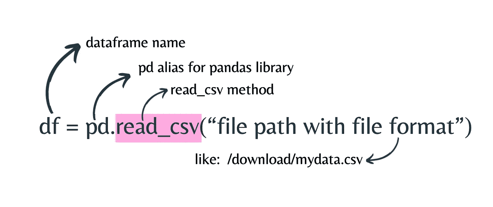

熊猫 read_csv()方法。图片由作者提供。

## 涉及的步骤

为了将这种数据格式转换成 Python DataFrame 对象，采取以下步骤:

1.  了解从哪里以及如何提取数据。

除非你知道你的数据在哪里，以什么格式，否则你永远不会把它作为 DataFrame 对象。之后，如果您的数据驻留在服务器上，那么您将需要文件的路径和 URL。

2.*使用熊猫的****read _ x****方法*

要将 CSV 数据加载并转换为 DataFrame 对象，使用 *read_csv()。你需要将 **x** 换成另一个。*

3.使用 DataFrame 对象验证数据。

接下来，您需要验证转换是否顺利。

## 对于 Excel

[Excel 表格(电子表格)](https://docs.fileformat.com/spreadsheet/)至今仍广泛应用于各种领域。Excel 被广泛使用，从制定预算策略到跟踪每天的学生出勤。

*   方法: *read_excel()*
*   扩展名/格式:*。xlsx* 或*。xls*

目前，您将使用来自 [OpenDataNepal](https://opendatanepal.com/) 的[尼泊尔 2021 年全国人口和住房普查的初步数据](https://opendatanepal.com/dataset/preliminary-data-of-national-population-and-housing-census-2021)数据集。我已经将这个数据集保存为 n *epalcensusdata.xlsx*

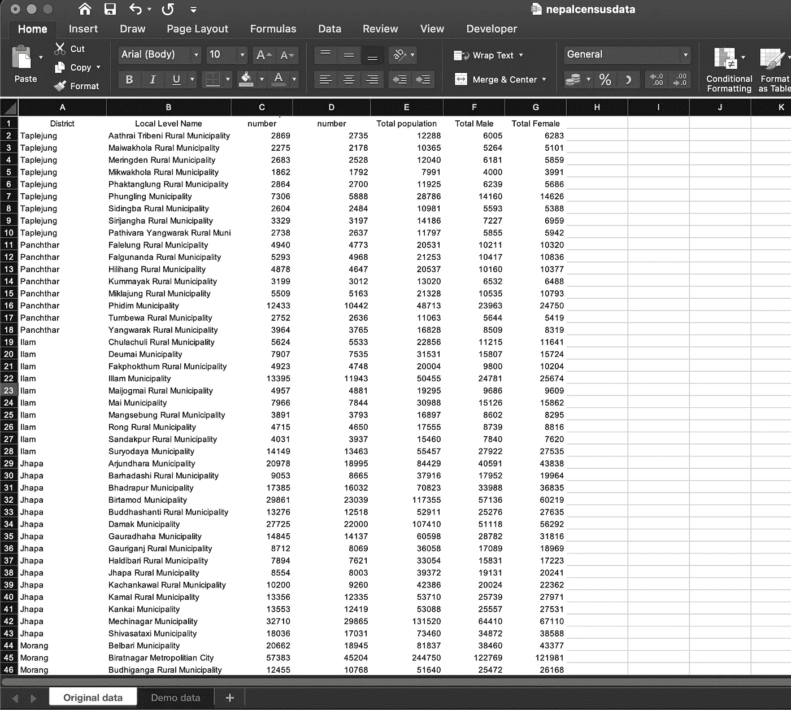

Excel 数据集的快照。图片由作者提供。[尼泊尔 2021 年全国人口和住房普查初步数据](https://opendatanepal.com/dataset/preliminary-data-of-national-population-and-housing-census-2021)数据集来自 [OpenDataNepal](https://opendatanepal.com/) 。

```
 **#import the Pandas library** import pandas**#import excel data and store as data_excel dataframe (no need to do df always)** data_excel = pd.read_excel("n*epalcensusdata.xlsx*")**#view the dataset as pandas dataframe object** data_excel.head()
```

输出:

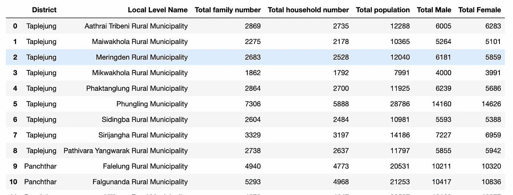

从 data_excel.head()获得的输出为 Pandas dataframe。图片由作者提供。

如果您的工作簿中有多个工作表，则需要一个名为 *sheet_name* 的附加参数。

```
data_excel = pd.read_excel("nepalcensusdata.xlsx",sheet_name = 0)
data_excel.head()
```

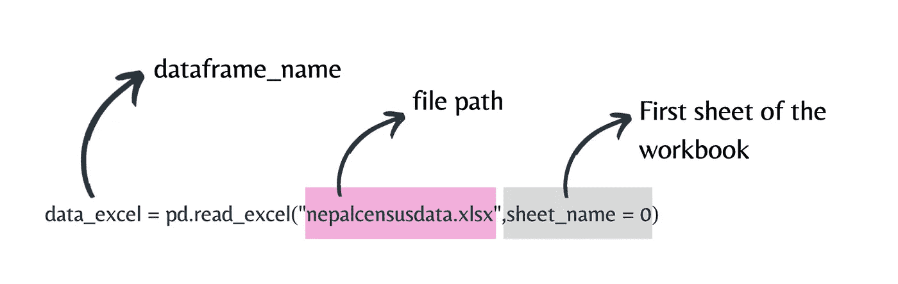

熊猫 read_excel()方法。图片由作者提供。

在我们的例子中，我们正在导入第一张表，因此它被赋予 0。图纸编号从 0 开始。

## 对于 HTML

如果你对数据刮痧(网页刮痧)比较熟悉，那么[美汤](https://pypi.org/project/beautifulsoup4/)、[硒](https://www.selenium.dev/)、[刺儿头](https://scrapy.org/)你都比较熟悉。你检查网站的 HTML 结构并提取数据。如果你觉得这有时很耗时或者很忙乱，你可以使用 *read_html()* 方法很容易地做到这一点。

*   方法: *read_html()*
*   扩展:*。html*

我们将从维基百科中摘录一张 ***金钱大劫案*** (西班牙语: ***Casa de Papel)*** 系列关于[网飞](https://www.netflix.com/np/Title/80192098)的表格从以下网址:[https://en.wikipedia.org/wiki/Money_Heist](https://en.wikipedia.org/wiki/Money_Heist)

我们将提取奖项和提名表。

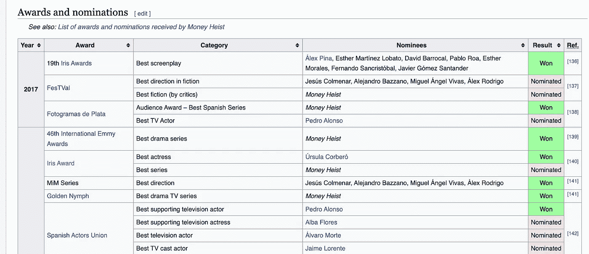

从维基百科[获得的金钱抢劫奖项和提名表的快照](https://en.wikipedia.org/wiki/Money_Heist)。图片由作者提供。

```
**#import the Pandas library**
import pandas**#import html data and store as data_html dataframe** data_html = pd.read_html("[https://en.wikipedia.org/wiki/Money_Heist](https://en.wikipedia.org/wiki/Money_Heist)")[1]**#view the dataset as pandas dataframe object**
data_html.head()
```

输出:

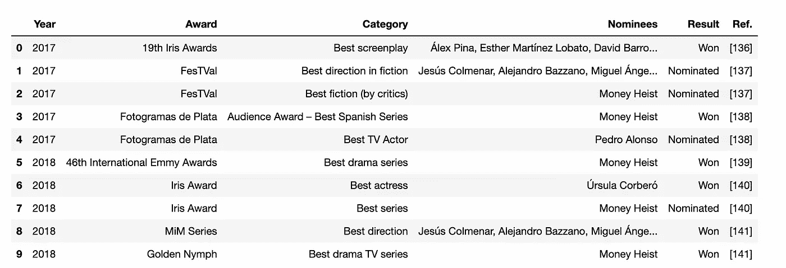

从 data_html.head()获得的关于[网飞系列金钱大劫案](https://en.wikipedia.org/wiki/Money_Heist)作为熊猫 dataframe 的奖项和提名的输出。图片作者。

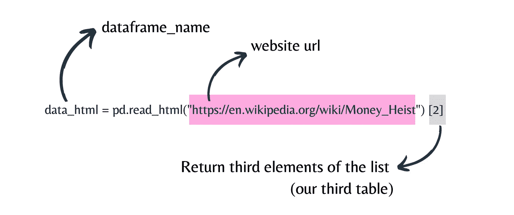

熊猫 read_html()方法。图片由作者提供。

这里， *read_html()* 方法的初始输出是一个列表，要将该列表转换成 dataframe，必须在末尾使用[0]。所以，这里您使用了[2],因为在维基百科页面上，您想要提取奖项和提名表。在这张桌子之前，还有两张桌子。一个名为“信息框”，另一个名为“剧集”，要提取信息框，您需要使用[0]和剧集表[1]。

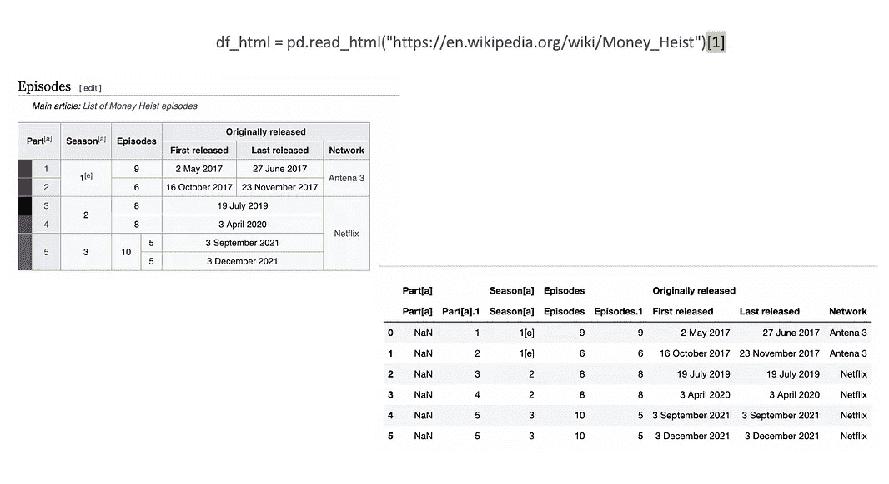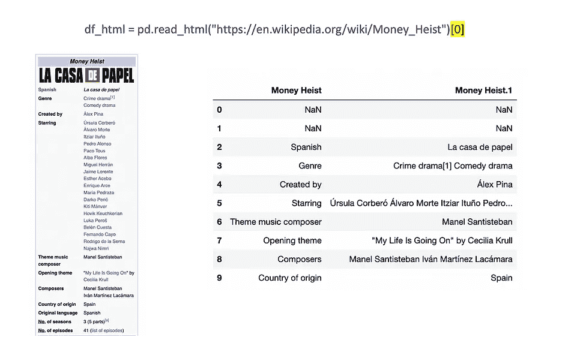

Pandas read_html()方法，用于摄取不同的表。图片由作者提供。

记住使用 *read_html()* 并不是一件简单的任务。为了得到你正在看的精确的表格，你需要毫无挫败感地玩你的初始结果。

> *请务必点击* [*订阅此处*](https://medium.com/@maladeep.upadhaya/membership) *千万不要错过另一篇关于数据科学指南、技巧和提示、生活经验等的文章！*

## 对于 SQL

[结构化查询语言(SQL)](https://en.wikipedia.org/wiki/SQL) 是一种在数据库中存储、操作和检索数据的标准语言。从数据库中读取数据是一个两步过程。您首先创建一个连接到数据库的方法，然后用 SQL 和 Pandas 查询它。在 Python 中，要连接到 SQL 服务器，您需要有 [SQLAlchemy connectabl](https://docs.sqlalchemy.org/en/14/core/connections.html) e 或 [sqlite3](https://sqlite.org/index.html) 。

*   方法: *read_sql_query()*
*   延伸:*。db*

与其他格式不同，对于 SQL，您必须多写几行代码。首先与数据库建立连接。然后，您将使用 Pandas 的 *read_sql_query()* 函数将输出转换为 dataframe，并编写一个 sql 查询从数据库导入所有列。

现在，演示 *my_aquarium.db* 是用一个名为“fish”的表创建的，该表包含以下几列: *name，species，tank_number。*

```
**#import the required libraries** import sqlite3
import pandas**#prepare a connection object and Pass the Database name as a parameter** connection = sqlite3.connect("*aquarium.db*")**#use read_sql_query method and Pass SELECT query and connection object as parameter** data_Sql = pd.read_sql_query("SELECT * FROM fish", connection)**#****view the dataset as pandas dataframe object** print(data_Sql)**#close the connection object** connection.close()
```

输出:

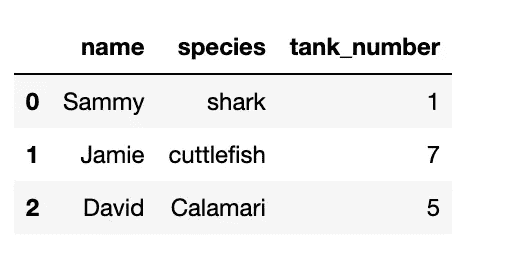

从`read_sql_query`()获得的输出，鱼表为熊猫数据帧。图片由作者提供。

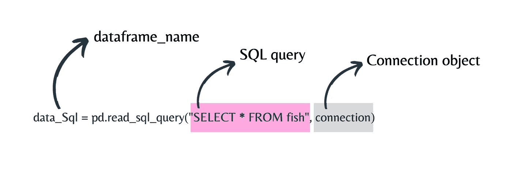

熊猫 read_sql_query()方法。图片由作者提供。

记得每次打开数据库连接时都要关闭它。

# 对于 JSON

[JavaScript Object Notation(JSON)](https://www.json.org/json-en.html)是 web 开发人员和数据工程师最常用的文件格式。它在互联网上被广泛应用于你将要访问的几乎每一个 API。

*   方法: *read_json()*
*   分机:。 *json*

您将使用来自 Kaggle 的[海贼王动画的数据，存储为 *openPiece.json*](https://www.kaggle.com/datasets/aditya2803/one-piece-anime)

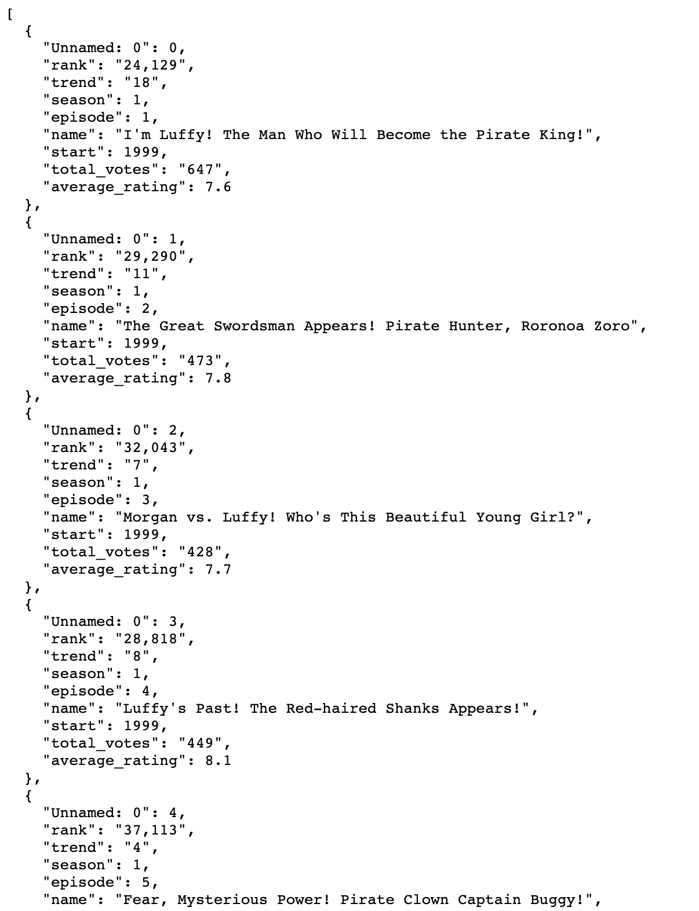

来自 Kaggle 的[海贼王动漫截图。](https://www.kaggle.com/datasets/aditya2803/one-piece-anime)图片作者。

```
**#import the Pandas library**
import pandas**#import html data and store as data_json dataframe** data_json = pd.read_json("opnePiece.json")**#view the dataset as pandas dataframe object**
data_json.head()
```

输出:

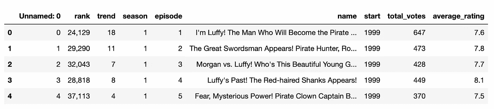

从`read_json`()获得的输出为熊猫数据帧。图片由作者提供。

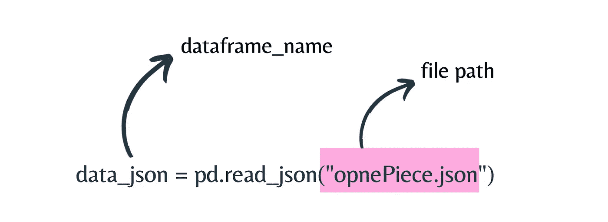

熊猫 read_json()方法。图片由作者提供。

通过这种方式，您可以获得各种格式的数据。

> 记住:获取数据只是开始。

当然，获取数据只是开始。在此之后，你需要探索数据，并在深入数据科学项目之前玩数据。但是如果你想知道下一步该怎么走，请阅读我的博客[探索性数据分析](https://medium.com/analytics-vidhya/exploratory-data-analysis-for-beginner-7488d587f1ec)。

[](https://medium.com/analytics-vidhya/exploratory-data-analysis-for-beginner-7488d587f1ec)  

PS:我能够更深入地研究这个问题，是因为尼泊尔的[代码](https://codefornepal.org/)提供了[数据研究](https://codefornepal.org/data-fellowship/)机会。我想感谢 Code for Nepal 为尼泊尔社区提供了一个绝佳的机会，也感谢 [DataCamp 团队](https://medium.com/u/e18542fdcc02?source=post_page-----4c1a0dd4f2e2--------------------------------)对 Code for Nepal 的信任。

> 嘿👋
> 
> 喜欢这篇文章吗？成为一个中等会员继续学习，没有限制。如果你使用 [**下面的**](https://medium.com/@maladeep.upadhaya/membership) 链接，我会收到你的一部分会员费，不需要你额外付费。

*如果你对这篇文章有任何疑问，或者想在你的下一个数据工程或数据科学项目上合作，请在*[***LinkedIn***](https://www.linkedin.com/in/maladeep/)*上 ping 我。*

还有，做 [**订阅**](https://medium.com/subscribe/@maladeep.upadhaya) 在我发布的时候得到通知。

## 这里有更多的文章，你可能会喜欢❤

[](https://medium.com/nightingale/how-to-apply-gestalt-psychology-principles-in-data-visualization-6242f4f1a3de)  [](/knowing-these-5-hcis-principles-will-make-your-data-visualization-look-amazing-efbf22f05ab8)  [](https://medium.com/@maladeep.upadhaya/how-datacamp-and-code-for-nepal-helped-me-learn-data-engineering-for-free-7983ea2ae24a)  [](/little-known-ways-to-make-your-data-visualization-awesome-890d71b6e365)  [](/surprisingly-effective-way-to-name-matching-in-python-1a67328e670e) 