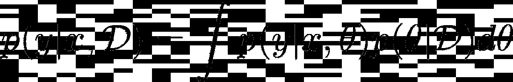
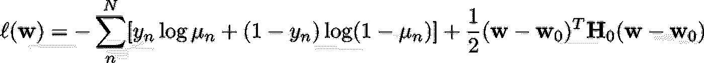
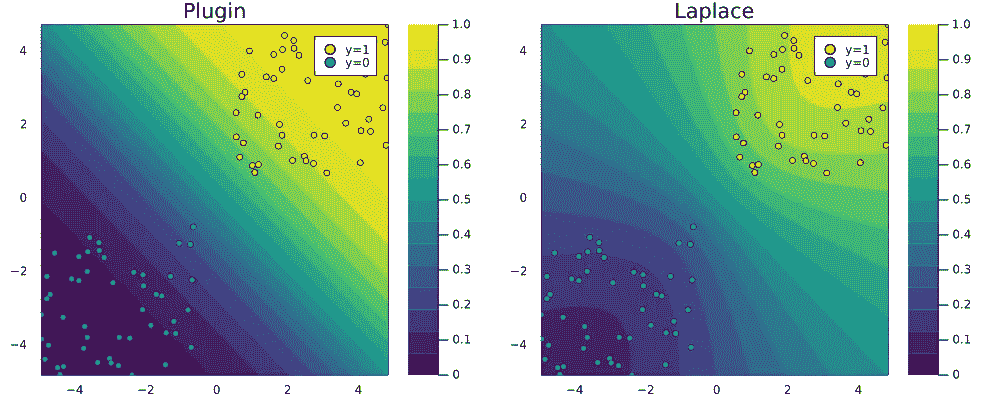
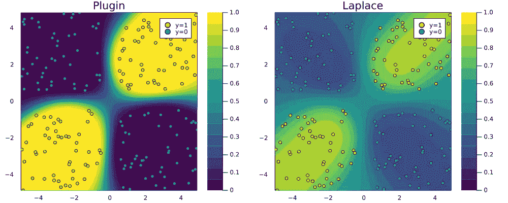
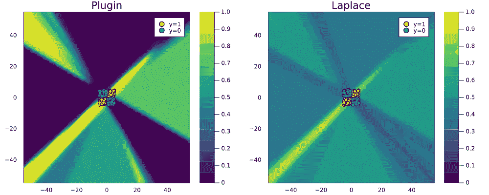

# 深入，但也…去贝叶斯！

> 原文：<https://towardsdatascience.com/go-deep-but-also-go-bayesian-ab25efa6f7b>

## Julia 中真正轻松的贝叶斯深度学习

贝叶斯神经网络后验预测的更新。图片作者。

近年来，深度学习一直主导着人工智能研究——但它真的有多大希望？这是一场持续不断且越来越两极化的辩论，你可以在 Twitter 上进行现场直播。一方面，你有像 OpenAI 首席科学家 Ilya Sutskever 这样的乐观主义者，他认为大型深度神经网络可能已经有轻微的意识——这是“可能”和“轻微”，只有当你足够深入？另一方面，你有像朱迪亚·珀尔这样的著名怀疑论者，他长期以来一直认为深度学习仍然可以归结为曲线拟合——纯粹是联想的，甚至一点也不聪明(珀尔和麦肯齐，2018 年)。

# 贝叶斯深度学习的案例

无论你发现自己站在这场有趣的 twitter 争议的哪一边，现实是深度学习系统已经在学术界和工业界大规模部署。因此，围绕这些现有系统的可信度展开了更为紧迫的辩论。他们有多强，他们是如何做出影响我们每一个人的决定的？强健的深度神经网络通常涉及某种形式的对抗性训练，这种训练成本高昂，可能会损害泛化能力(Raghunathan 等人，2019 年)，并且最终不能保证稳定性(Bastounis、Hansen 和 Vlač，2021 年)。关于可解释性，像莱姆和 SHAP 这样的代理解释器是最受欢迎的工具，但它们也缺乏鲁棒性(Slack et al. 2020)。

到底为什么深度神经网络是不稳定和不透明的？首先要注意的是，自由参数的数量通常是巨大的(如果你问 Sutskever 先生，它可能真的不够大！).仅此一点就使得监测和解释深度学习算法的内部工作非常困难。也许更重要的是，相对于数据大小的参数数量*通常是巨大的:*

> *[……]深度神经网络通常很少被可用数据指定，并且[……]参数[因此]对应于数据的各种令人信服的解释。(威尔逊 2020)*

换句话说，训练单个深度神经网络可能(并且通常确实)导致非常适合底层数据的一个随机参数规范。但是很有可能有许多其他规格也非常适合这些数据。这既是深度学习的优势，也是其弱点:这是一个优势，因为它通常允许我们通过随机优化轻松地为数据找到一个这样的“令人信服的解释”；这是一个弱点，因为人们不得不怀疑:

> 如果一个解释与许多其他同样令人信服，但可能非常不同的解释竞争，那么这个解释到底有多令人信服？

像这样的场景非常需要从概率上对待深度学习模型的预测(Wilson 2020)。形式上，我们感兴趣的是将后验预测分布估计为以下贝叶斯模型平均值(BMA):

这个积分意味着我们基本上需要从模型的许多不同规格中得到许多预测。不幸的是，这意味着我们或者说我们的计算机要做更多的工作。然而幸运的是，近年来研究人员提出了许多巧妙的方法来逼近上述方程:Gal 和 Ghahramani (2016)提出在测试时使用辍学，而 Lakshminarayanan 等人(2016)表明，对仅五个模型进行平均似乎可以达到目的。然而，尽管这些方法简单且有用，但与仅训练单个网络相比，它们涉及额外的计算成本。正如我们现在将看到的，另一种有希望的方法最近引起了人们的注意:**拉普拉斯近似** (LA)。

如果你读过我在[上一篇关于贝叶斯逻辑回归的文章](/bayesian-logistic-regression-53df017ba90f)，那么拉普拉斯这个术语你应该已经很熟悉了。事实上，我们将看到，上一篇文章中涉及的所有概念都可以自然地扩展到深度学习。虽然这些概念中的一些将在下面重新讨论，但我强烈建议你在阅读这里之前先看看以前的帖子。事不宜迟，现在让我们看看如何使用 LA 进行真正轻松的深度学习。

# 拉普拉斯近似

虽然 LA 在 18 世纪首次被提出，但它迄今为止并没有引起深度学习社区的重视，这主要是因为它涉及到可能很大的 Hessian 计算。Daxberger 等人(2021 年)的任务是改变 LA 在 DL 中没有用处的看法:在他们的 [NeurIPS 2021 论文](https://arxiv.org/pdf/2106.14806.pdf)中，他们从经验上证明了 LA 可用于生成贝叶斯模型平均值，该平均值在不确定性量化和非分布检测方面至少与现有方法不相上下，并且计算成本显著降低。他们表明，最近在自动微分方面的进步可以用来产生快速准确的 Hessian 近似，甚至提供一个成熟的 [Python 库](https://aleximmer.github.io/Laplace/)，可以用于任何预训练的 Torch 模型。在这篇文章中，我在 Julia 中建立了一个不太全面的、纯粹的等效包——[bayeslaplace . JL](https://www.paltmeyer.com/BayesLaplace.jl/dev/)可以与内置在 [Flux.jl](https://fluxml.ai/) 中的深度学习模型一起使用，这是 Julia 的主要 DL 库。正如上一篇关于贝叶斯逻辑回归的文章一样，我将依靠 Julia 代码片段而不是方程来传达基本的数学知识。如果你对数学感兴趣，NeurIPS 2021 论文提供了你需要的所有细节。你还可以在我的博客[上找到这篇文章的更详细的版本。](https://www.paltmeyer.com/blog/posts/effortsless-bayesian-dl/)

# 从贝叶斯逻辑回归…

让我们回顾一下:在逻辑回归的情况下，我们假设用于计算逻辑值的权重是零均值高斯先验，这些权重反过来被馈送到 sigmoid 函数以产生概率。我们看到，在这种假设下，解决逻辑回归问题对应于最小化以下可微损失函数:

作为我们迈向贝叶斯深度学习的第一步，我们观察到以下情况:上面的损失函数对应于具有 sigmoid 激活和权重衰减的单层人工神经网络所面临的目标。换句话说，正则化的逻辑回归等价于一个非常简单的神经网络体系结构，因此理论上可以以非常相同的方式应用基本概念也就不足为奇了。

因此，让我们快速回顾下一个核心概念:LA 依赖于这样一个事实，即在**最大后验概率** (MAP)估计下评估的损失函数的二阶泰勒展开相当于多变量高斯分布。特别是，高斯分布以 MAP 估计值为中心，协方差等于在该模式下评估的逆 Hessian 分布(Murphy 2022)。

这基本上就是故事的全部:如果我们对 Hessian 有一个好的估计，我们就有了一个关于参数的(近似)后验概率的解析表达式。所以让我们使用 [BayesLaplace.jl](https://www.paltmeyer.com/BayesLaplace.jl/dev/) 在 Julia 中实现这个方法。下面的代码生成了一些玩具数据，构建并训练了一个单层神经网络，并最终拟合了一个事后拉普拉斯近似:

下图显示了 2D 特征空间中的后验预测分布。为了比较，我也添加了相应的插件评估。请注意拉普拉斯近似法的预测概率如何呈扇形散开，这表明在缺少数据的区域可信度降低。

图 1:使用插件估计器(左)和拉普拉斯近似(右)的 2D 特征空间中逻辑回归的后验预测分布。图片作者。

# …到贝叶斯神经网络

现在让我们更上一层楼:我们将重复上面的练习，但这一次使用简单的 MLP 代替我们上面使用的单层神经网络来处理不可线性分离的数据。下面的代码几乎和上面的一样:

图 2 再次证明了拉普拉斯近似产生的后验预测分布比过分自信的插件估计更保守。

图 2:使用插件估计器(左)和拉普拉斯近似(右)的 2D 特征空间中 MLP 的后验预测分布。图片作者。

要了解为什么这是一个令人满意的结果，请考虑下面图 2 的缩小版本:插件估计器在完全缺乏任何数据的区域中进行完全有把握的分类。可以说拉普拉斯近似产生了更合理的图像，尽管它也可能通过微调我们的先验和神经网络结构来改进。

图 3:使用插件估计器(左)和拉普拉斯近似(右)的 2D 特征空间中 MLP 的后验预测分布。缩小。图片作者。

# 包扎

最近关于神经信息处理的最新研究表明，贝叶斯深度学习可以毫不费力:深度神经网络的拉普拉斯近似似乎非常有效，并且它以最小的计算成本做到了这一点(Daxberger 等人，2021)。这是一个好消息，因为转向贝叶斯的理由很充分:社会越来越依赖复杂的自动化决策系统，这些系统需要值得信赖。越来越多的这些系统涉及深度学习，这本身并不值得信赖。我们已经看到，通常存在深度神经网络的各种可行的参数化，每一种都有其自己独特的和令人信服的对手头数据的解释。当面临许多可行的选择时，不要孤注一掷。换句话说，去贝叶斯！

# 资源

为了开始贝叶斯深度学习，我在网上找到了许多有用的免费资源，其中一些列在下面:

*   `[Turing.jl](https://turing.ml/dev/tutorials/03-bayesian-neural-network/)` [教程](https://turing.ml/dev/tutorials/03-bayesian-neural-network/)关于 Julia 中贝叶斯深度学习。
*   各种 RStudio AI 博客帖子，包括[这个](https://blogs.rstudio.com/ai/posts/2018-11-12-uncertainty_estimates_dropout/)和[这个](https://blogs.rstudio.com/ai/posts/2019-06-05-uncertainty-estimates-tfprobability/)。
*   [TensorFlow 关于概率层回归的博文](https://medium.com/tensorflow/regression-with-probabilistic-layers-in-tensorflow-probability-e46ff5d37baf)。
*   凯文·墨菲的[草稿教科书](https://probml.github.io/pml-book/book1.html)，现在也有印刷版本。

# 参考

巴斯图尼斯、亚历山大、安德斯·汉森和韦尔纳·弗拉契奇。2021.“人工智能中对抗性攻击的数学——尽管存在稳定的神经网络，但深度学习为什么不稳定。” *arXiv 预印本 arXiv:2109.06098* 。

Daxberger，Erik，Agustinus Kristiadi，Alexander Immer，Runa Eschenhagen，Matthias Bauer 和 Philipp Hennig。2021.“拉普拉斯 Redux——毫不费力的贝叶斯深度学习。”*神经信息处理系统的进展* 34。

加尔，亚林和邹斌·格拉马尼。2016."作为贝叶斯近似的辍学:表示深度学习中的模型不确定性."在*机器学习国际会议上*，1050–59。PMLR。

拉克什米纳拉亚南、巴拉吉、亚历山大·普里策尔和查尔斯·布伦德尔。2016."使用深度集成的简单和可扩展的预测不确定性估计." *arXiv 预印本 arXiv:1612.01474* 。

凯文·墨菲，第 2022 页。*概率机器学习:简介*。麻省理工出版社。

珀尔朱迪亚和丹娜麦肯齐。2018.*原因之书:因果的新科学*。基础书籍。

Raghunathan、Aditi、Sang Michael Xie、、John C Duchi 和 Percy Liang。2019."对抗性训练会损害概括能力." *arXiv 预印本 arXiv:1906.06032* 。

斯莱克、迪伦、索菲·西尔格德、艾米丽·贾、萨米尔·辛格和希马宾杜·拉卡茹。2020."愚弄莱姆和夏普:对事后解释方法的对抗性攻击."在*AAAI/ACM 关于人工智能、伦理和社会的会议记录中*，180–86 页。

安德鲁·戈登·威尔逊。2020.“贝叶斯深度学习的案例。”arXiv 预印本 arXiv:2001.10995 。

*原载于 2022 年 2 月 18 日 https://www.paltmeyer.com***。**