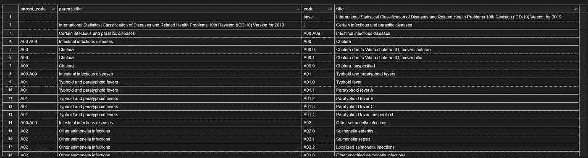

# 使用递归查询分层 API

> 原文：<https://towardsdatascience.com/going-down-the-rabbit-hole-querying-hierarchical-apis-with-recursion-6d48fe40f591>

## 编写从 ICD API 中提取关系的递归函数的指南


Brannon Naito 在 [Unsplash](https://unsplash.com?utm_source=medium&utm_medium=referral) 上拍摄的照片

递归是强大的，但我总是被它吓倒。最近，我需要从 API 中提取层次数据，我意识到递归很有意义，所以我不得不面对自己的恐惧。如果你也不喜欢递归，并且希望看到一个实际的例子，那么这篇指南可能会有所帮助。

## ICD——国际疾病分类

首先，我将解释 ICD-10 诊断代码以及它们是如何存储在 ICD API([icd.who.int/icdapi](http://icd.who.int/icdapi))中的。当患者寻求医疗保健服务时，医疗保健提供者会提供 ICD 诊断代码，以便付款人可以了解就诊原因和他们接受治疗的目的。ICD 诊断代码有三个或三个以上的字符，以字母开头，后跟数字。例如，如果提供者诊断患者患有额叶脑癌，他们可以使用代码 C711，即“额叶恶性肿瘤”(尽管他们可以选择使用未指明的代码，如 C719，即“脑恶性肿瘤，未指明”，例如，如果它存在于多个位置)。如果我们想分析脑癌患者，我们可能不关心肿瘤的确切位置，所以我们需要一种方法来分组所有脑癌代码。

在 ICD-10 分级体系中，以 C71 开头的编码都是“脑恶性肿瘤”的编码，C71 编码属于 C69-C72 的更广泛类别，即“眼、脑和中枢神经系统其他部分的恶性肿瘤”。我们可以到 C00-D49 的另一个层次，它代表所有肿瘤的编码。这就是我们想要提取的层次结构。

这种结构很有帮助——因为它允许我们在不同的粒度级别上分析数据。我们可能希望通过广泛的疾病类别进行分析，如癌症、呼吸系统疾病、消化道疾病、感染等。或者，我们可能希望通过分析更具体的疾病，如皮肤癌或志贺氏菌感染，进行更深入的研究。如果我们可以简单地采用 ICD 代码的第一个 *n* 字符来获得不同的粒度级别，那就太好了，但是正如我们在脑癌例子中看到的，我们有一些以 C6 开头的代码与以 C7 开头的代码分组，并且不是所有的 C6 代码都在同一个组中。事实上，一些疾病组以 C6 开始(C60-C63 代表“男性生殖器官的恶性肿瘤”，C64-C68 代表“泌尿道的恶性肿瘤”，C69-C72 代表“眼、脑和中枢神经系统其他部分的恶性肿瘤”)。

icd10data.com 网站有助于将这种层级形象化。点击[页面](https://www.icd10data.com/ICD10CM/Codes)上的链接，您可以看到不同疾病类别是如何分组的，以及代码是如何随着深入而变得更加具体的。

## **ICD API**

icd.who.int/icdapi 的 ICD API()包含了这种有价值的层次结构信息。通过一些简单的 python 请求，我们可以提取层次结构中每一层包含的信息，并确定下一层是什么代码。首先，让我们做好准备。您需要创建一个帐户，并获得自己的客户 ID 和客户机密。我将凭据存储在我的凭据管理器(Windows)中，并使用密匙环包来访问它们。一旦有了凭证，就可以生成一个访问令牌。令牌的使用时间是有限的，稍后会详细介绍。

现在我们已经设置好了，我们可以编写一些函数来从 API 中提取数据，并将其作为 JSON 返回。每个请求都会返回一个名为“child”的元素，这就是递归的由来。我们将从层次结构的顶层开始，获取顶层 URI 的所有子节点，找到这些子节点的所有子节点，依此类推，直到我们遇到没有子节点的 URI。

这里有一个例子。我们从 https://id.who.int/icd/release/10 的 URI [开始，找到 http://id.who.int/icd/release/10/2019](https://id.who.int/icd/release/10)[的最新版本 URI。我们将其保存为变量 *uri_latest* 。从那里，我们可以使用函数 *get_contents* 来查找最新版本的所有子链接。之后，我们可以对每个孩子重复相同的过程，以捕获 ICD 诊断代码的层次结构。](http://id.who.int/icd/release/10/2019)

```
#Children links (corresponds to links on [https://www.icd10data.com/ICD10CM/Codes](https://www.icd10data.com/ICD10CM/Codes))In: get(uri_latest)
Out:{'@context': 'http://id.who.int/icd/contexts/contextForTopLevel.json',
 '@id': 'http://id.who.int/icd/release/10/2019',
 'title': {'@language': 'en',
  '@value': 'International Statistical Classification of Diseases and Related Health Problems 10th Revision (ICD-10) Version for 2019'},
 'releaseDate': '2020-02-01',
 'child': ['http://id.who.int/icd/release/10/2019/I',
  'http://id.who.int/icd/release/10/2019/II',
  'http://id.who.int/icd/release/10/2019/III',
  'http://id.who.int/icd/release/10/2019/IV',
  'http://id.who.int/icd/release/10/2019/V',
  'http://id.who.int/icd/release/10/2019/VI',
  'http://id.who.int/icd/release/10/2019/VII',
  'http://id.who.int/icd/release/10/2019/VIII',
  'http://id.who.int/icd/release/10/2019/IX',
  'http://id.who.int/icd/release/10/2019/X',
  'http://id.who.int/icd/release/10/2019/XI',
  'http://id.who.int/icd/release/10/2019/XII',
  'http://id.who.int/icd/release/10/2019/XIII',
  'http://id.who.int/icd/release/10/2019/XIV',
  'http://id.who.int/icd/release/10/2019/XV',
  'http://id.who.int/icd/release/10/2019/XVI',
  'http://id.who.int/icd/release/10/2019/XVII',
  'http://id.who.int/icd/release/10/2019/XVIII',
  'http://id.who.int/icd/release/10/2019/XIX',
  'http://id.who.int/icd/release/10/2019/XX',
  'http://id.who.int/icd/release/10/2019/XXI',
  'http://id.who.int/icd/release/10/2019/XXII'],
 'browserUrl': 'http://apps.who.int/classifications/icd10/browse/2019/en'}
```

## API 时间限制

当我开始这个过程的时候，事情看起来很好，运行良好。然而，大约一个小时后，递归过程失败了，我意识到这是因为我的访问令牌已经过期了。这意味着我需要一种方法来跟踪我使用令牌的时间，并在它过期之前更新它。要在递归函数中做到这一点，需要跟踪全局范围内的变量。由于函数一遍又一遍地调用自己，在局部范围内使用变量将是一件痛苦的事情。

下面是更新“get”函数中使用的令牌和头的两个函数。

## 递归

最后，我们需要一个地方来存储我们查询过的所有信息。同样，我们使用一个全局变量' *dfs* '，它是我们已经提取并将在最后组合的所有关系的列表。列表中的每个项目将包含父代码和父标题，以及子代码和子标题，从而创建一个树形结构。

我们的递归函数将需要使用 *get_contents* 函数找到一个 URI 的所有相关信息，将我们想要的存储在我们的全局变量 *dfs* 中，然后在 URI 的每个子节点上调用自己来继续这个过程。此时，它会在发出下一个请求之前检查令牌和报头是否需要更新。

显示数据框，我们从根节点(没有父节点)开始，找到它下面的所有关系，从“某些感染和寄生虫病”开始。然后，递归从“肠道传染病”开始，遍历“某些感染和寄生虫病”的所有子分类。接下来，从“霍乱”开始，它进入子类。在它收集了所有特定的霍乱诊断代码后，它会继续处理“伤寒和副伤寒”等。



作者创造的形象

在让这个函数在我的机器上运行了大约 4 个小时之后，我能够捕捉到 ICD 码和它们的层次结构之间的所有关系。需要进行一些清理，以便从树结构中将它组织成一个有用的表，但是一旦有了树结构，我就可以通过用层次结构中更高级别的代码替换原始诊断代码来改变分析的粒度。这让我可以更容易地比较类似情况的患者。

我希望这篇指南能启发你在有意义的地方使用递归。你可以在我的 GitHub[https://GitHub . com/patricknormile/examples/blob/main/ICD API _ recursion _ example . py](https://github.com/patricknormile/examples/blob/main/icdAPI_recursion_example.py)上找到完整的代码

感谢您的阅读！