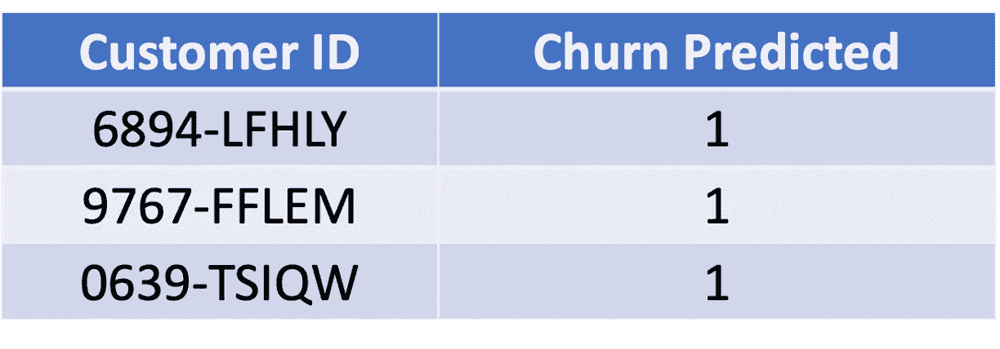
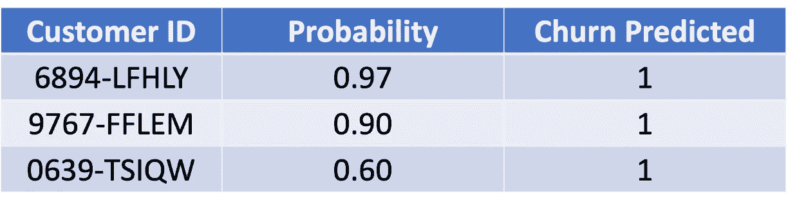
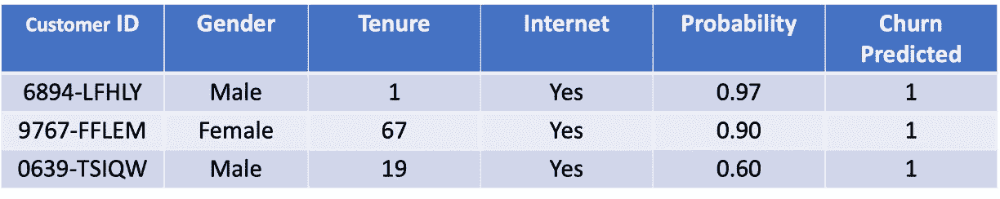
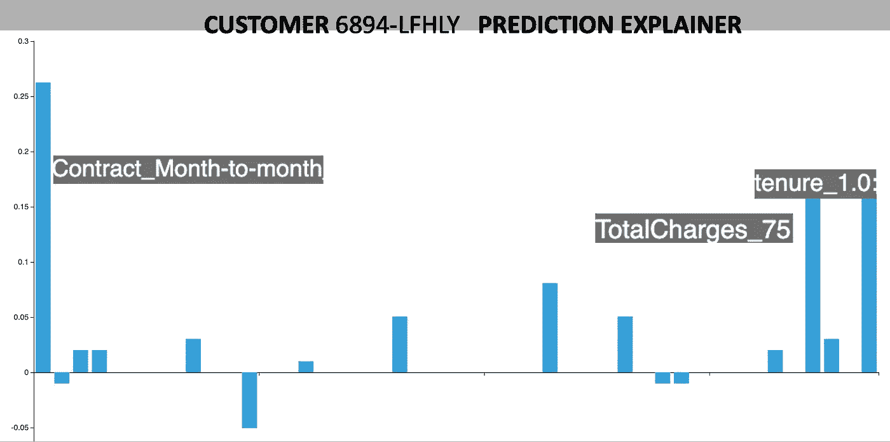

# 从预测模型到生产部署

> 原文：<https://towardsdatascience.com/going-from-a-predictive-model-to-productive-deployment-ec7b4e6280b0>

## 如何确保你的人工智能模型带来商业价值

丹尼尔·利维斯·佩鲁西在 [Unsplash](https://unsplash.com/s/photos/gear?utm_source=unsplash&utm_medium=referral&utm_content=creditCopyText) 上的照片

除非用于生产用途，否则准确的预测模型没有任何价值。为生产部署准备好预测模型需要什么？虽然有许多技术需求，但我将着重从业务角度来看需要什么。

让我们看一个电信公司客户流失预测的业务场景。为了给我们的故事添加一些行动，让我们假设数据科学家团队开发了一种尖端的机器学习模型，并显示出有希望的准确性。该模型现在用于列出预计会流失的客户，如下所示。

> 如下所示，这个列表非常适合 Kaggle 式的数据科学竞赛。然而，从商业角度来看，这是灾难性的。

客户 id 和流失预测(图片由作者提供)

以上列表的问题在于它不可操作。企业将不知道如何利用它以及如何使用它来减少客户流失。因此，让我们看看如何使模型结果更具可操作性。

# 增加概率有助于确定优先级

一个大企业可以有 1000 万到 1 亿客户。如果你取平均 5%的流失率，那么会流失的客户名单将会有数百万的客户。有了这么长的列表，业务用户需要一些方法来区分优先级。

增加概率有助于确定优先级。

添加优先级(按作者排列的图片)

在上面的例子中，需要优先联系客户 6894-LFHLY 和 9767-FFLEM，因为他们很有可能流失。这是一种使模型输出更具可操作性的优雅方式。

> 因此，在开发过程中，总是喜欢除了预测之外还能给出概率的模型。

# 与运营数据连接

为了使模型输出更具可操作性，进一步了解预计会流失的客户非常重要。这需要将预测与操作数据联系起来，如下所示。

连接运营数据(图片由作者提供)

现在，业务用户对预计会流失的客户有了更好的了解。这在联系客户时非常有用，可以防止客户流失。

> 将模型得分与运营数据相结合是部署的重要一步

# 解释预测和流失原因

企业现在准备联系客户，以防止客户流失。然而，有一样东西不见了，那就是预测解释。当联系客户以防止客户流失时，业务用户需要清楚地知道为什么会出现客户流失。这有助于更好地与客户谈判。

预测解释者(图片由作者提供)

上面的可视化是客户 6894-LFHLY 的预测解释器(使用 SHAP 算法)。向上的柱线是预测客户流失的原因。预测客户流失的最大原因是因为客户的月合同很短，总费用很高，而且一个月的任期很短。

从流失的原因来看，企业可以采取一种策略，例如将客户转化为长期合同，并在月费上提供一些折扣。

> 预测解释给出了如何对预测结果采取行动的方向

# 结论

制作准确的模型对于生产部署来说是不够的。为了使模型结果具有可操作性，需要增加概率，与操作数据相联系，以及有一个预测解释。

## 数据源引用

这篇博客中使用的数据集来自这里提供的电信数据集。****允许商业和非商业使用。****

** [## 电信客户流失(11.1.3+)

### 编辑描述

community.ibm.com](https://community.ibm.com/community/user/businessanalytics/blogs/steven-macko/2019/07/11/telco-customer-churn-1113) 

请**用我的推荐链接加入 Medium** 。

 [## 加入我的介绍链接-普拉内戴夫媒体

### 阅读 Pranay Dave(以及 Medium 上成千上万的其他作家)的每一个故事。您的会员费直接支持…

pranay-dave9.medium.com](https://pranay-dave9.medium.com/membership) 

请**订阅**每当我发布一个新的故事时，请保持通知。

[https://pranay-dave9.medium.com/subscribe](https://pranay-dave9.medium.com/subscribe)

# 额外资源

# 网站(全球资讯网的主机站)

你可以访问我的网站进行零编码分析。[**https://experiencedatascience.com**](https://experiencedatascience.com/)

***在网站上，您还可以参加即将举行的人工智能研讨会，体验有趣和创新的数据科学和人工智能。***

# Youtube 频道

这是我的 YouTube 频道
【https://www.youtube.com/c/DataScienceDemonstrated 的链接**