# 用 Python 告别枯燥的 PLAXIS 输出

> 原文：<https://towardsdatascience.com/goodbye-boring-plaxis-output-with-python-fc5c8b26cdb2>

## PLAXIS 自动化系列

## 逐步走向自动化的指南


米卡·鲍梅斯特在 [Unsplash](https://unsplash.com/s/photos/programming-number?utm_source=unsplash&utm_medium=referral&utm_content=creditCopyText) 上的照片

如果您像我一样经常使用 PLAXIS，您一定会问这样一个问题:我究竟为什么需要不断重复这个复制和粘贴操作来提取结果？

毫无疑问，PLAXIS 是一个强大的有限元软件。作为岩土工程师，我们希望专注于分析，在后处理上花费更少的时间。由于开源社区开发的模块，Python 为自动化输出提取和可视化提供了最广泛的可能性。一些常见模块包括:

*   熊猫
*   Xlsxwriter
*   Matplotlib
*   海生的

本教程的最终目标是向您展示如何使用 Python 脚本从 PLAXIS 2D 的结构元素中提取输出。这可以通过以下四个步骤来完成。

1.  使用 IDE 打开 PLAXIS 输出
2.  将外部模块安装到 PLAXIS 环境中
3.  从 PLAXIS 提取孔板结果
4.  导出为 excel 电子表格

本教程要求读者已经安装了 VS 代码和 PLAXIS 环境。如果您不熟悉这个页面，请按照下面文章中的说明进行操作。我们开始吧！

[](https://medium.com/@philip.studio11/start-using-python-to-automate-plaxis-35a5297321e7)  

# PLAXIS 示例模型

我用的是宾利官方网站发布的 PLAXIS 2D 车型，如下图所示。

在链接中，下载来自 V22.01 的命令日志文件。据作者所知，Python 命令从 V21 到 V22 有了显著的变化。因此，请确保安装了 PLAXIS V22 或更高版本(V22.01 和 V22.02)，以确保本教程中的 Python 脚本能够正常工作。

[](https://communities.bentley.com/products/geotech-analysis/w/wiki/45557/plaxis-2d-tutorial-03-submerged-construction-of-an-excavation)  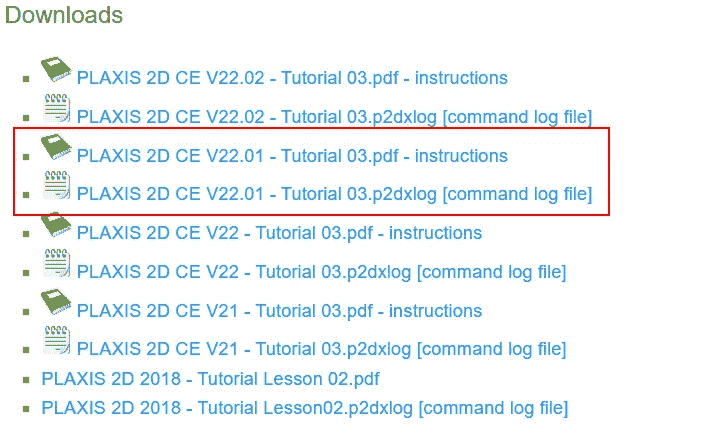

作者截图

使用“运行命令…”运行命令后，您应该能够看到以下几何图形。

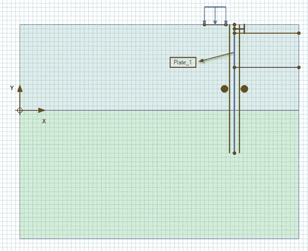

作者截图自 PLAXIS

本例模拟了由地下连续墙(板单元)组成的开挖结构。我们的目标是提取板元素的结果。

计算模型，我们准备使用 Python 提取结果。

# 步骤 1:使用 IDE 打开 PLAXIS 输出

与第一个教程不同，这次我们将打开一个刚刚下载的 PLAXIS 文件，因此启动服务器的代码需要稍微修改一下。您需要将计算出的模型保存在首选的工作目录中。

我的 PLAXIS 文件的位置:

c:\ Users \ phtsang \ Desktop \ Current _ Projects \ LinkedIn \ Blog _ 2 \ discovery

我将首先创建一个名为“open_output.py”的空 python 脚本。

之后，我们将下面的代码写入 python 文件。该代码与第一个教程中的代码非常相似，但这次我们将打开一个现有的 PLAXIS 文件。为此，我们进行了以下三项更改:

1.  由于这次我们需要打开一个 PLAXIS 文件，因此需要指定文件的工作目录，该目录存储为“FILE_PATH”。
2.  然后，我们使用 PLAXIS 命令“s_i.open(FILE_PATH)”打开文件。
3.  为了打开 PLAXIS 输出，我们编写“g_i.view(g_i.Phases[1])”，这允许我们查看 Phase_1 的计算结果。

```
from plxscrpting.easy import *
import subprocess, time
import os

###############################################
PLAXIS_PATH = r'C:\Program Files\Bentley\Geotechnical\PLAXIS 2D CONNECT Edition V22\\Plaxis2DXInput.exe'  # Specify PLAXIS path on server.
FILE_PATH = r'C:\Users\phtsang\Desktop\Current_Projects\LinkedIn\Blog_2\\Excavation'  # Specify PLAXIS file location and name
PORT_i = 10000  # Define a port number.
PORT_o = 10001
PASSWORD = 'SxDBR<TYKRAX834~'  # Define a password.

subprocess.Popen([PLAXIS_PATH, f'--AppServerPassword={PASSWORD}', f'--AppServerPort={PORT_i}'], shell=False)  # Start the PLAXIS remote scripting service.
time.sleep(5)  # Wait for PLAXIS to boot before sending commands to the scripting service.

# Start the scripting server.
# global g_i, s_i
s_i, g_i = new_server('localhost', PORT_i, password=PASSWORD)
s_o, g_o = new_server('localhost', PORT_o, password=PASSWORD)

s_i.open(FILE_PATH)

g_i.gotostages()
g_i.view(g_i.Phases[1])
```

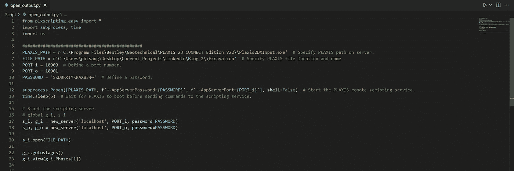

作者截图自 VS 代码

为了测试上面的代码是否正常工作，我们将在终端中运行“open_output.py ”,如下所示。输入“python open_output.py ”,然后单击输入。

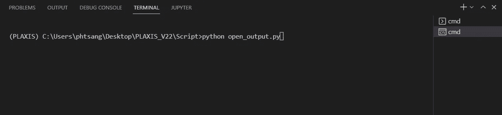

作者截图自 VS 代码

PLAXIS 2D 输入和输出应用程序应自动打开。从输出应用程序中，您应该看到“服务器在端口 10001 上活动”。


作者截图自 PLAXIS

现在我们已经连接了 PLAXIS API，我们准备进入下一步。

# 步骤 2:将外部模块安装到 PLAXIS 环境中

当使用 PLAXIS 脚本环境时，通常使用 Python 模块来扩展 Python 脚本的功能。因为我们的目标是从 PLAXIS 提取结果并导出到 excel 电子表格，所以我们需要两个外部模块:

*   熊猫
*   Xlsxwriter

这些模块可以通过 PLAXIS 命令提示符窗口安装，如下所示。在继续之前，确保您已经在 PLAXIS 输入打开的情况下完成了步骤 1。

进入菜单选项*专家> Python >命令提示符。*这将打开 Windows 命令提示符，并将 PLAXIS 设置为当前环境。

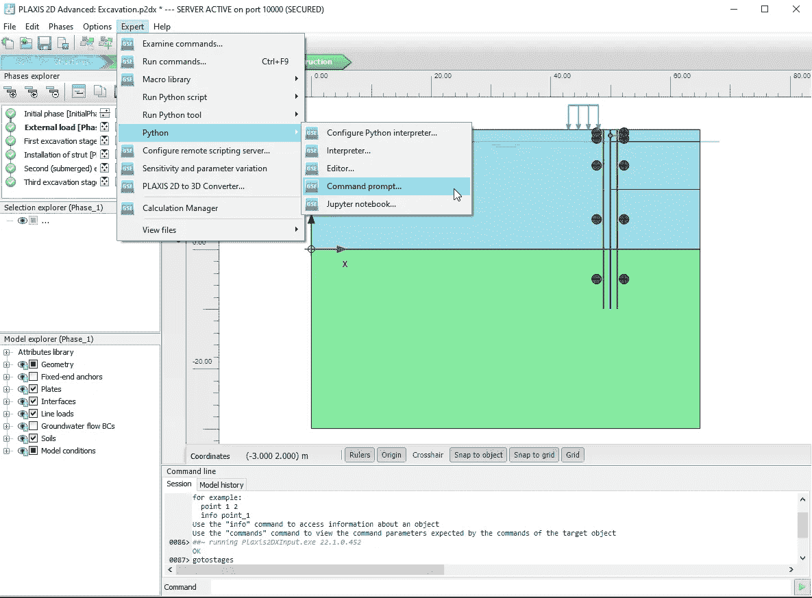

作者截图自 PLAXIS

将目录切换到 PLAXIS Python 分发文件夹。这可以通过以下命令完成:

```
pushd C:\ProgramData\Bentley\Geotechnical\PLAXIS Python Distribution V2\python\Lib\site-packages
```

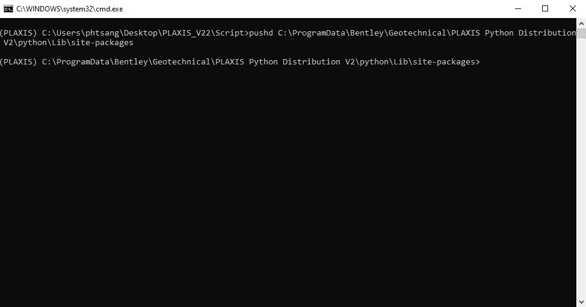

作者截图自 PLAXIS

在命令提示符下，您现在可以使用下面示例中显示的命令安装任何新的 Python 模块。

例如，如果你想安装*熊猫*模块:

```
python -m pip install pandas
```

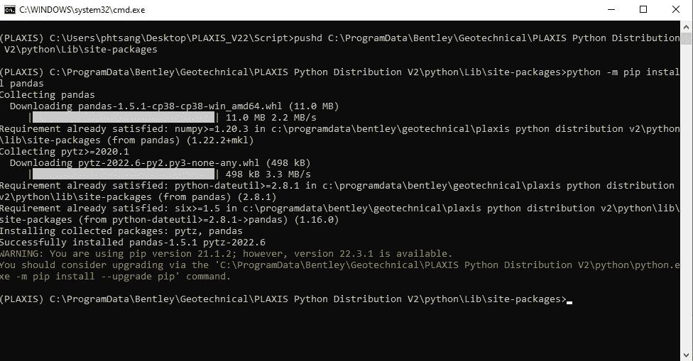

作者截图自 PLAXIS

另外，安装 *xlsxwriter* 模块:

```
python -m pip install xlsxwriter
```

现在我们已经安装了所有需要的模块。然后，我们可以使用 Python 脚本从 PLAXIS 中提取结果。

# 步骤 3:从 PLAXIS 中提取平板结果

我们的主要目标步骤 3 是在最后阶段(第三挖掘阶段[阶段 5])提取板单元(地下连续墙)的四种结果类型。我们将提取的结果类型有:

*   y 坐标
*   剪(羊毛)
*   弯矩
*   轴向力

在第 4 步中，我们将把结果导出到 excel 电子表格中，表格中的列如下所示。

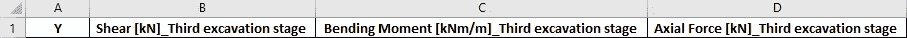

作者截图自 excel

首先，我们创建一个空的 python 文件，并将其命名为“output_plate.py”。

## 导入模块和战略服务器

我们需要确保 API 已连接，并导入我们之前安装的模块。

```
from plxscripting.easy import *
import subprocess, time
import math
import pandas as pd
import os
import xlsxwriter

###############################################
PORT_i = 10000  # Define a port number.
PORT_o = 10001
PASSWORD = 'SxDBR<TYKRAX834~'  # Define a password.

# Start the scripting server.
s_i, g_i = new_server('localhost', PORT_i, password=PASSWORD)
s_o, g_o = new_server('localhost', PORT_o, password=PASSWORD)
```

## 定义文件名

因为我们需要将结果导出到 excel，所以我们需要指定导出文件的位置及其名称。

文件位置:确保工作目录后有双斜杠(\\)

文件名:可以是您想要的任何名称

```
EXCEL_PATH=r'C:\Users\phtsang\Desktop\PLAXIS_V22\Script\\'
EXCEL_NAME='plate_output.xlsx'

FILENAME=EXCEL_PATH+EXCEL_NAME
```

## 输入定义

之后，我们将输入我们想要提取的结构元素和相应的相位。在这种情况下:“板块 _1”和“第三挖掘阶段[阶段 _5]”。

下面的代码是查找模型中现有的板元素和阶段，并将它们存储为列表。

```
plate_input=['Plate_1'] # Input by user
phase_input=['Third excavation stage [Phase_5]'] # Input by user

###############################################
#Exisiting model element:

plate=[plt for plt in g_o.Plates[:]] # Loop through the plate object in existing model
phase=[p for p in g_o.Phases[:]] # Loop through all available phases
```

这里有两个重要的概念:

**For 循环**:查找 PLAXIS 中现有元素的动作需要 For 循环。这是编程中非常常见的命令。例如在“板块”中，我们有:

```
for plt in g_o.Plates[:]
```

这一行意味着我们正在遍历“g_o.Plates[:]”中的所有 plate 元素(这是 PLAXIS 存储对象的方式)，并将其命名为“plt”。

**列表**:正如在第一个教程中提到的，在一个用方括号[ ]表示的列表中存储值是很常见的。与第一个教程相比，语法略有变化，因为它被简化了。

这一行:

```
plate=[plt for plt in g_o.Plates[:]]
```

可以扩展为:

```
plate=[]

for plt in g_o.Plates[:]

   plate.append(plt) 
```

两个代码会给出相同的结果，但是第一个代码更简洁，这是 Python 中常用的。

到目前为止，您的脚本应该是这样的:

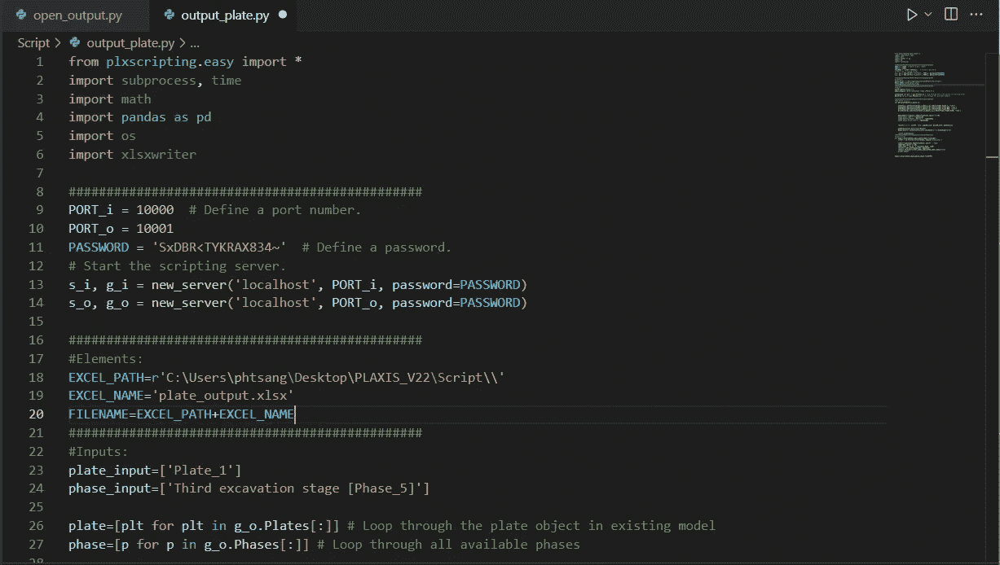

作者截图自 VS 代码

# 结果提取

经过上述预处理后，我们可以开始提取车牌结果。为此，我们将定义一个函数来提取结果，调用的是“get_plate()”。这里有几个要点:

y 坐标=结果类型。盘子。Y

剪切=结果类型。板材. Q2D

弯矩=结果类型。Plate.M2D

轴向力=结果类型。Plate.Nx2D

*   接下来的几行将创建目标电子表格中指定的列名。
*   然后结果被存储为“结果”。这里我介绍一种新的数据类型，在 Python 中称为**字典**，用花括号{ }表示。当您想要创建一个表时，Dictionary 特别有用，它包含一个键-值对。例如:

“y”是字典的**键**

plateY 是字典的**值**。值的数组可以存储到指定的键中。

*   一旦创建了字典，下一行将把字典转换成数据帧。Dataframe 是我们在 Python 中最常用的数据结构之一。可以解释为 excel 中的表格。这是通过运行命令:" pd。数据框架(结果)”
*   我还使用 Y 坐标以降序对结果进行排序

确保缩进是正确的，如下图所示。

```
def get_plate(plate_o,phase_o):

    plateY=g_o.getresults(plate_o,phase_o,g_o.ResultTypes.Plate.Y, "node")
    plateQ=g_o.getresults(plate_o,phase_o,g_o.ResultTypes.Plate.Q2D, "node")
    plateM=g_o.getresults(plate_o,phase_o,g_o.ResultTypes.Plate.M2D, "node")
    plateAxial=g_o.getresults(plate_o,phase_o,g_o.ResultTypes.Plate.Nx2D, "node")    

    phasename=str(phase_o.Identification).split('[')[0]
    col1='Shear [kN]'+'_'+phasename
    col2='Bending Moment [kNm/m]'+'_'+phasename
    col3='Axial Force [kN]'+'_'+phasename

    results = {'Y': plateY, col1: plateQ,col2: plateM,col3: plateAxial}

    plateresults=pd.DataFrame(results)
    plateresults = plateresults.sort_values(by=['Y'],ascending=False)

    return plateresults
```

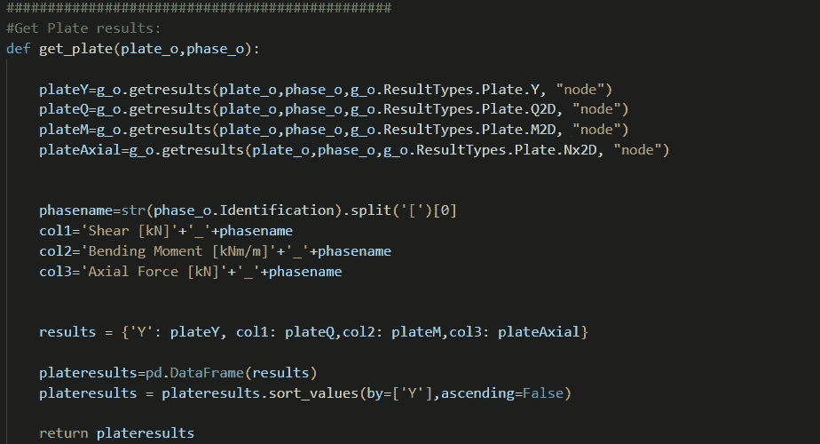

作者截图自 VS 代码

# 步骤 4:导出为 Excel 电子表格

最后，我们将把创建的数据框架导出到 excel。

我们创建一个函数，叫它“export_excel()”。

*   writer 是使用我们安装的 xlsxwriter 模块导出 excel
*   名称& sheet_name 是我创建格式为“Plate_1_Phase 5”的工作表名称的位置。
*   然后，我使用我们在前面创建的函数“get_plate()”来生成数据帧并存储为“结果”。它应该是一个数据帧，然后可以使用 pandas 命令“results.to_excel()”导出到 excel。

```
def export_excel(plate_input,phase_input,filename):
    writer = pd.ExcelWriter(filename, engine='xlsxwriter')

    name=str(phase[5].Identification).split(' [')[1]
    name=name.split(']')[0]
    sheet_name = "%s_%s" % (plate[0].Name, name)
    results = get_plate(plate[0], phase[5])
    results.to_excel(writer,sheet_name=sheet_name,index=False)
    writer.save()

export_excel(plate_input,phase_input,FILENAME)
```

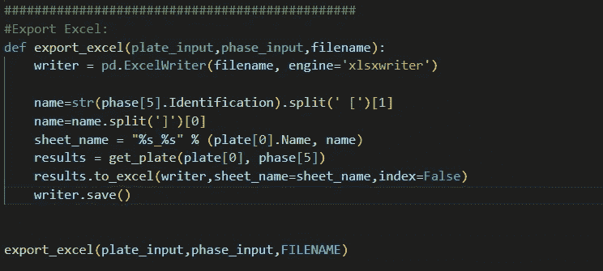

作者截图自 VS 代码

使用以下命令运行脚本。

```
(PLAXIS) C:\Users\phtsang\Desktop\PLAXIS_V22\Script>python output_plate.py
```

您将看到我们寻找的结果已经自动提取出来，如命令窗口所示。

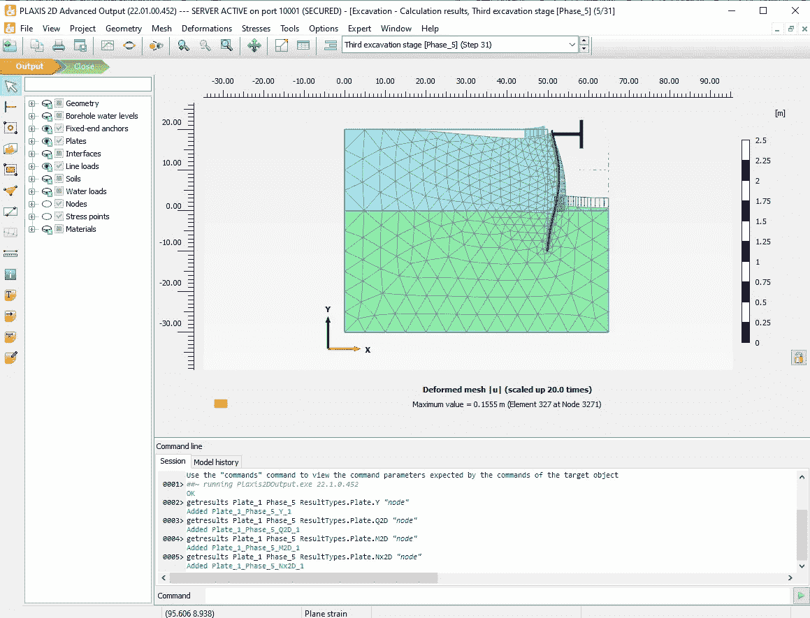

作者截图自 PLAXIS

现在，如果您在之前指定的位置打开 excel 电子表格，您可以看到我们已经提取了所需的 Y 坐标、剪力、弯矩和轴向力。

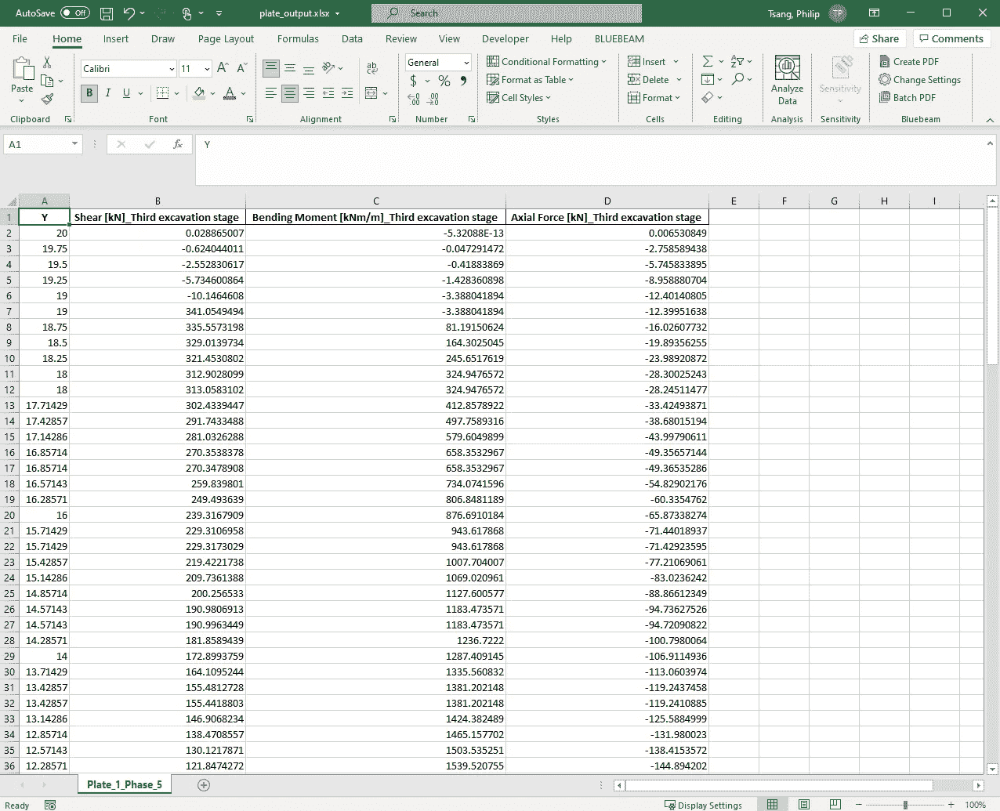

作者截图自 excel

干得好！您刚刚使用 Python 脚本从 PLAXIS 中提取了结果。

# 结论

这就是关于使用 Python 提取 PLAXIS 输出的第二个教程的全部内容。现在，您应该能够从 PLAXIS 中提取单个结构元素的输出。在以后的教程中，我将展示如何提取多个结构元素和不同结构类型(如界面和嵌入梁)的结果。

如果你喜欢阅读这类内容，请随时关注我的页面。我将继续发布这一系列关于用 Python 自动化 PLAXIS 的教程。除此之外，我还热衷于分享关于如何使用 Python 来自动化工程中的工作流的知识。