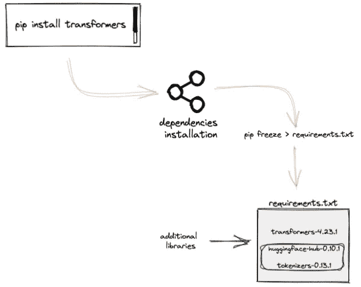
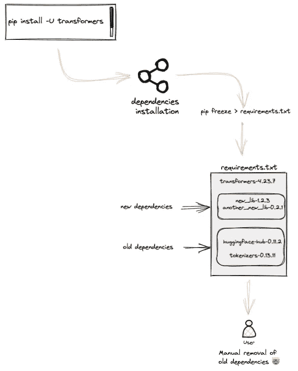
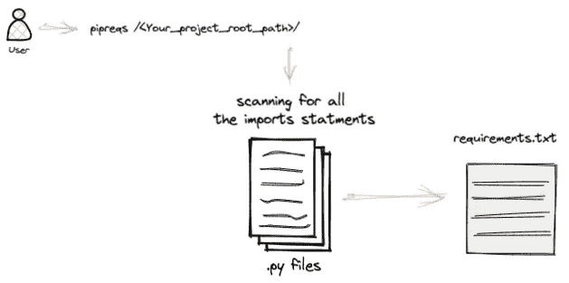

# 避免使用“pip 冻结”，而是使用“pipreqs”

> 原文：<https://towardsdatascience.com/goodbye-pip-freeze-welcome-pipreqs-258d2e7a5a62>

## 您的项目依赖关系很重要—有效地管理它们


图像由[安赫塞娜蒙](https://unsplash.com/@ankhesenamunnn)在 [Unsplash](https://unsplash.com/photos/L1GO3yAV_U8) 上拍摄

# 动机

包管理是软件开发工作流的最佳实践之一，因为它促进了软件交付的自动化。

如今，大多数数据科学家和机器学习工程师已经在他们的管道自动化中采用了这种最佳实践。即使这个过程被认为是一个好的实践，大多数从业者采用的方法可能并不总是有效的:使用`[pip freeze](https://pip.pypa.io/en/stable/cli/pip_freeze/).`

在这篇概念博客中，你会明白有一个比使用`pip freeze.`更好的选择

# 这就是为什么你不应该使用画中画冻结

假设您正在处理一个需要 5 个依赖项的项目:`dep1`、`dep2`、`dep3`、`dep4`和`dep5`。大多数人在生成依赖文件时的反应是使用下面这个神奇的命令:

```
pip freeze > requirements.txt
```

> 但是这怎么会是一个问题呢？

大多数库的安装需要其他自动安装的库。下面是一个插图。

```
# Install the **transformers** library
pip install transformers
```

`transformers`库的安装会生成以下消息:

```
Successfully installed huggingface-hub-0.10.1 tokenizers-0.13.1 transformers-4.23.1
```

这意味着这两个额外的库`huggingface-hub-0.10.1` `tokenizers-0.13.1`已经和 transformer 库一起安装了，并且这两个库将自动包含在 requirement.txt 文件中。



pip 冻结命令的图示(图片由作者提供)

> 但我还是不觉得有什么问题！不要担心，我们会成功的…

现在，想象一下变形金刚库被升级并需要不同的库`**new_lib-1.2.3**`和`**another_new_lib-0.2.1**`。这意味着先前的依赖关系`huggingface-hub-0.10.1` `tokenizers-0.13.1`不再相关，对吗？至少对❌.项目来说是这样

**问题来了👇🏽**

生成 requirements.txt 文件的新版本除了包含新的依赖项之外，还将包含旧的依赖项；如果您只想保留相关的依赖项，您将不得不手动删除旧的依赖项。然后想象一下处理一个需要 20、30 或 50 个库的项目！这很快就会成为一个令人头疼的问题🤯。



**pip 冻结**保留以前安装的不再需要的旧包(图片由作者提供)

总之，`pip freeze`不够聪明，无法有效地管理依赖关系，以下是一些原因:

→ `**pip freeze**` **仅用于“pip 安装”**:它仅知道使用`pip install`命令安装的软件包。这意味着任何使用不同方法安装的软件包，如`peotry`、`setuptools`、`conda`等。不会包含在最终的 requirements.txt 文件中。


pip 冻结仅考虑使用 pip 命令安装的库(图片由作者提供)

→ `**pip freeze**` **不考虑依赖版本冲突:****项目生命周期是迭代的，因此可能需要现有库的全新或升级版本。使用`pip freeze`保存环境中的所有包，包括那些与项目无关的包。**

**→ `**pip freeze**` **抓取一切:**如果你没有使用虚拟环境，`pip freeze`生成包含所有库的需求文件，包括你的项目范围之外的库。**

> **那么，我能做些什么来解决这些问题呢？
> 好问题！**

**答案是通过使用`pipreqs`🎉**

# **Pipreqs —更好的选择**

**`[pipreqs](https://pypi.org/project/pipreqs/)`首先扫描所有的 python 文件(。py)，然后基于项目的每个 python 文件中的`import`语句生成 requirements.txt 文件。此外，它解决了使用`pip freeze`时面临的所有问题。**

****

**pireqs 扫描过程(图片由作者提供)**

**使用下面的`pip`命令，安装非常简单。**

```
pip install pipreqs
```

**一旦您安装了库，您只需要提供项目的根位置，并运行这个命令来生成项目的 requirements.txt 文件。**

```
pipreqs /<your_project_root_path>/
```

**有时您可能想要更新需求文件。在这种情况下，您需要使用`--force`选项来强制重新生成文件。**

```
pipreqs **--force** /<your_project_root_path>/
```

**假设您想要忽略特定子文件夹中的一些 python 文件的库。这可以通过在指定需要忽略的子文件夹之前使用`--ignore`选项来实现。**

```
pipreqs /<your_project_root_path>/ **--ignore** /<your_project_root_path>/folder_to_ignore/
```

# **结论**

**恭喜你！🎉🍾您刚刚了解了一种新的、有效的管理项目相关性的方法。**

**如果你喜欢阅读我的故事，并希望支持我的写作，考虑[成为一个媒体成员](https://zoumanakeita.medium.com/membership)。每月支付 5 美元，你就可以无限制地阅读媒体上的故事。**

**欢迎在[媒体](https://zoumanakeita.medium.com/)、[推特](https://twitter.com/zoumana_keita_)和 [YouTube](https://www.youtube.com/channel/UC9xKdy8cz6ZuJU5FTNtM_pQ) 上关注我，或者在 [LinkedIn](https://www.linkedin.com/in/zoumana-keita/) 上打招呼。讨论人工智能、人工智能、数据科学、自然语言处理和人工智能是一种乐趣！**