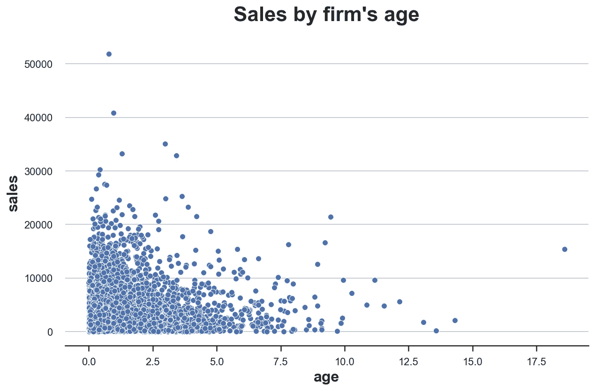
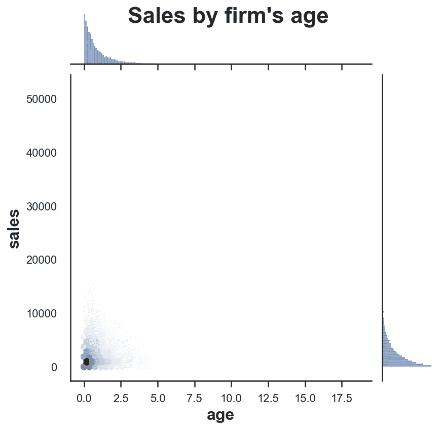
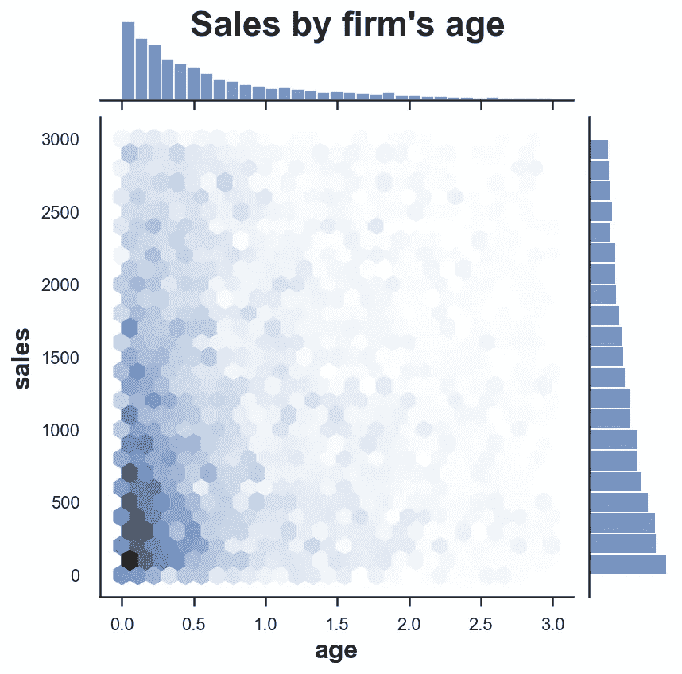
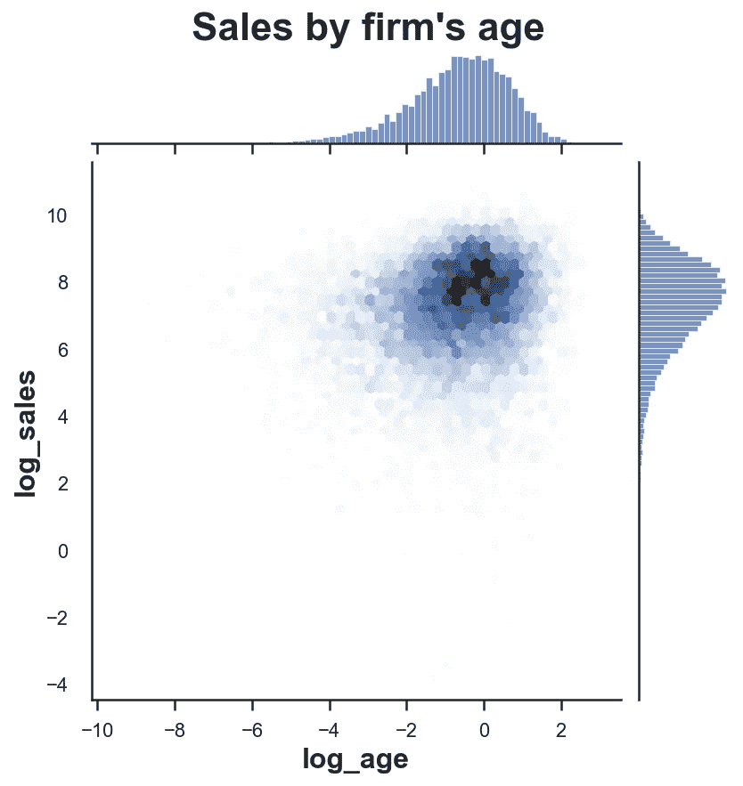
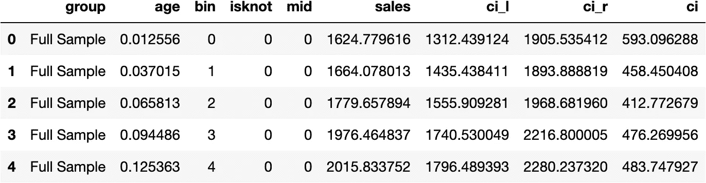
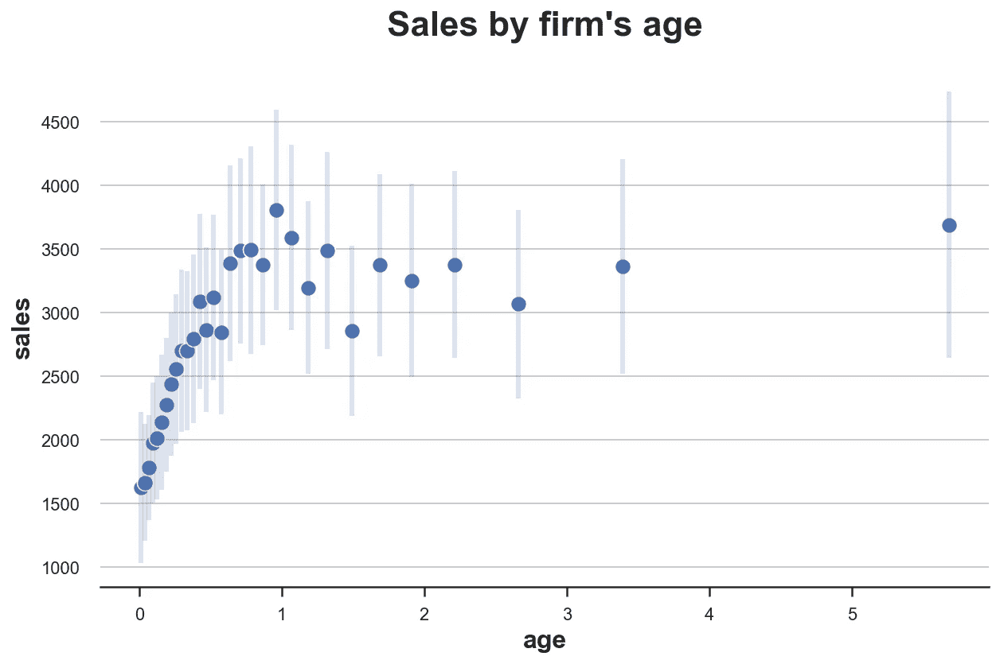
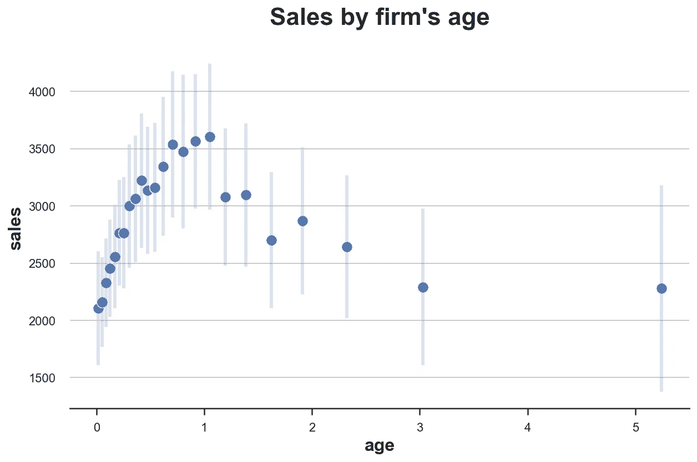
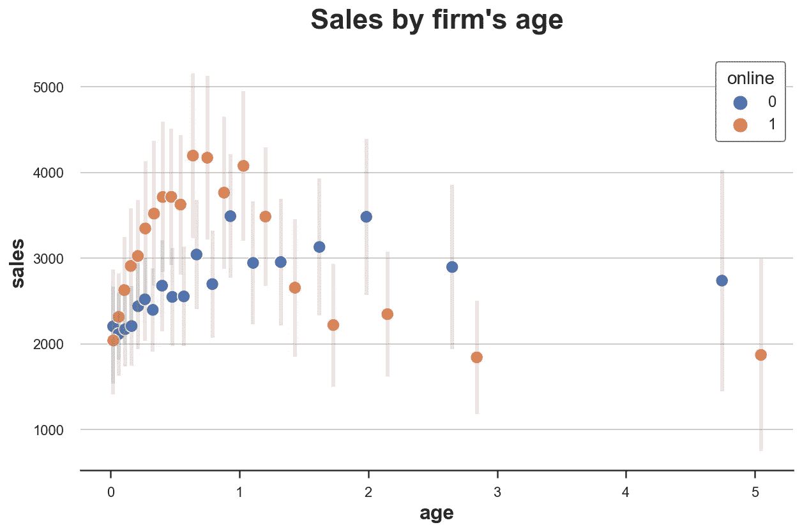

# 再见散点图，欢迎入库散点图

> 原文：<https://towardsdatascience.com/goodbye-scatterplot-welcome-binned-scatterplot-a928f67413e4>

## [因果数据科学](https://towardsdatascience.com/tagged/causal-data-science)

## 如何可视化并对条件手段进行推理


作者图片

当我们想要可视化两个连续变量之间的关系时，定位图就是**散点图**。这是一个非常直观的可视化工具，允许我们直接查看数据，无需任何操作。然而，当我们有大量数据和/或数据有偏差时，散点图可能噪声太大，无法提供信息。

在这篇博文中，我将回顾散点图的一个非常强大的替代方案，来可视化两个变量之间的相关性:装箱散点图。装箱散点图不仅是一个很好的可视化工具，而且还可以用来对条件均值进行推断，等等。

# 散点图

先说个例子。假设我们是一个网上市场，多家公司提供商品，消费者可以有效地浏览、比较和购买。我们的数据集包含了活跃在市场上的公司的快照。

让我们加载数据并查看一下。你可以在这里找到数据生成过程`dgp_marketplace` [的代码。我还从](https://github.com/matteocourthoud/Blog-Posts/blob/main/notebooks/src/dgp.py)`[utils](https://github.com/matteocourthoud/Blog-Posts/blob/main/notebooks/src/utils.py)`导入了一些代码来制作更好的图形。

```
from src.utils import *
from src.dgp import dgp_marketplace

df = dgp_marketplace().generate_data(N=10_000)
df.head()
```


作者图片

我们有 10000 家公司的信息。对于我们知道的每个公司:

*   `age`:公司的时代
*   `sales`:上月的月销售额
*   `online`:公司是否只在网上活动
*   `products`:公司提供的产品数量

假设我们有兴趣了解`age`和`sales`之间的关系。销售的生命周期是什么？

让我们从一个简单的`sales`对`age`的**散点图**开始。

```
sns.scatterplot(x='age', y='sales', data=df);
plt.title("Sales by firm's age");
```



作者图片

剧情极其**吵**。我们有许多观察结果，因此，很难将它们全部形象化。如果我们必须猜测，我们可以说这种关系看起来是负的(`sales`随`age`减少)，但这将是一个非常无知的猜测。

我们现在要探索一些合理的调整和替代方案。

# 散点图备选方案

当我们有一个非常密集的散点图时，我们能做什么？一种解决方案是绘制观测值的密度图，而不是观测值本身。

Python 中有多种解决方案来可视化二维分布的密度。很有用的一个就是[seaborn](https://seaborn.pydata.org/)joint plot。`jointplot`绘制两个变量的联合分布，以及沿轴的边际分布。默认选项是散点图，但也可以选择添加回归线(`reg`)，将图更改为直方图(`hist`)，六边形图(`hex`)，或[核密度估计值](https://en.wikipedia.org/wiki/Kernel_density_estimation) ( `kde`)。

让我们试试 **hexplot** ，它基本上是数据的直方图，其中的条柱是二维空间中的六边形。

```
s = sns.jointplot(x='age', y='sales', data=df, kind='hex', );
s.ax_joint.grid(False);
s.ax_marg_y.grid(False);
s.fig.suptitle("Sales by firm's age");
```



作者图片

没什么变化。看起来`age`和`sales`的分布都非常**偏斜**，因此，大部分动作都集中在非常小的子空间中。

也许我们可以移除**异常值**并放大大部分数据所在的区域。让我们放大左下角，有`age < 3`和`sales < 3000`的观察。

```
s = sns.jointplot(x='age', y='sales', data=df.query("age < 3 & sales < 3000"), kind="hex");
s.ax_joint.grid(False);
s.ax_marg_y.grid(False);
s.fig.suptitle("Sales by firm's age");
```



作者图片

现在空地少了很多，但看起来我们并没有走远。关节分布**还是太偏**。当数据遵循某种幂分布时就是这种情况，业务数据通常就是这种情况。

一种解决方案是通过取[](https://en.wikipedia.org/wiki/Natural_logarithm)****转换**变量。**

```
df['log_age'] = np.log(df['age'])
df['log_sales'] = np.log(df['sales'])
```

**我们现在可以画出`age`和`sales`的对数之间的关系。**

```
s = sns.jointplot(x='log_age', y='log_sales', data=df, kind='hex');
s.ax_joint.grid(False);
s.ax_marg_y.grid(False);
s.fig.suptitle("Sales by firm's age", y=1.02);
```

****

**作者图片**

**对数绝对有帮助。现在，数据在空间上更加分散，这意味着可视化提供了更多信息。此外，看起来这两个变量之间没有关系。**

**不过还是有**噪音太大**。也许光靠数据可视化不足以得出结论。**

**让我们换一种更结构化的方法: [**线性回归**](https://en.wikipedia.org/wiki/Linear_regression) 。让我们在`log_age`上线性回归`log_sales`。**

```
smf.ols('log_sales ~ log_age', df).fit().summary().tables[1]
```

****

**作者图片**

**`log_age`的回归系数为**正**且具有统计显著性(即不同于零)。似乎所有以前的想象都非常误导。从上面的图表中，我们没有一个能猜到如此强的正相关关系。**

**然而，也许这种关系对于`online`-仅仅是公司和样本中的其他公司是不同的。我们需要控制这个变量，以避免[辛普森悖论](https://en.wikipedia.org/wiki/Simpson's_paradox)以及更普遍的偏见。**

**通过线性回归，我们可以**对协变量**进行条件分析。让我们添加二进制指标为`online`-只有公司和变量计数的数量`products`回归。**

```
smf.ols('log_sales ~ log_age + online + products', df).fit().summary().tables[1]
```

****

**作者图片**

**`log_age`的系数仍然是正的，并且在统计上是显著的，但是它的**大小**已经减半。**

**我们应该得出什么结论？平均来说，似乎随着年龄的增长而增加。然而，这种模式可能是非常非线性的。**

**在线性回归框架内，一种方法可以是**添加额外的项**，例如多项式(`age^2`)或分类特征(例如`age < 2`)。然而，如果有一种更灵活的方法可以告诉我们公司`age`和`sales`之间的关系，那就太棒了。**

**要是……**

# **装箱散点图**

****装箱散点图**是一个非常强大的工具，它提供了一种**灵活**和**简约**的方式来可视化和总结大型数据集中的条件均值(不仅仅是)。**

**面元散点图背后的**思想**是将条件变量`age`分成**个大小相等的面元或分位数**，然后在每个面元内绘制因变量`sales`的条件均值。**

## **细节**

**[Cattaneo，Crump，Farrell，Feng (2021)](https://arxiv.org/abs/1902.09608) 在 R， [binsreg](https://cran.r-project.org/web/packages/binsreg/index.html) 中构建了一个非常好的分箱散点图包。而且，他们已经把包移植到 Python 上了。我们可以使用`pip install binsreg`直接从 pip 安装`binsreg`。你可以在这里找到关于 Python 包[的更多信息，而原始和详细的 R 包文档可以在这里](https://pypi.org/project/binsreg/)找到[。](https://www.rdocumentation.org/packages/binsreg/versions/0.7/topics/binsreg)**

**构建面元散点图时最重要的选择是**面元数量**。这个权衡就是通常的 [**偏差-方差权衡**](https://en.wikipedia.org/wiki/Bias%E2%80%93variance_tradeoff) 。通过选择更多数量的箱，我们在图中有更多的点。在极端情况下，我们最终得到一个标准的**散点图**(假设条件变量是连续的)。另一方面，通过减少箱的数量，情节将更加稳定。然而，在极端情况下，我们将有一个代表样本平均值的单点**。****

**[Cattaneo，Crump，Farrell，Feng (2021)](https://arxiv.org/abs/1902.09608) 证明，在基本分格散点图中，最小化均方误差的分格数与*、*成正比，其中 *n* 为观察次数。因此，一般来说，更多的观察导致更多的箱。**

**[斯塔尔和戈德法布(2020)](https://onlinelibrary.wiley.com/doi/abs/10.1002/smj.3199) 增加以下考虑因素:**

> ***然而其他元素也很重要。例如，保持 x 的分布不变，x 和 y 之间的真实关系曲线越多，算法将选择越多的箱(否则均方误差将增加)。这意味着即使有大的 n，也将为相对平坦的关系选择很少的箱。因此，计算基本分箱散点图中的最佳箱数时，考虑了可用于识别 x 和 y 之间关系的数据的变化量和位置。”***

***强烈建议使用默认的最佳箱数。然而，用户也可以使用`nbins`选项通过`binsreg`设置定制的箱数。***

***然而，分格散点图不仅仅计算最优选择区间的条件均值，还可以为这些均值提供**推断**。特别是，我们可以围绕每个数据点建立**置信区间**。在`binsreg`包中，选项`ci`将置信区间添加到估计结果中。该选项将一组参数`(p, s)`作为输入，并使用带有`s`平滑度约束的`p`次分段多项式来构建置信区间。默认情况下，置信区间不包含在图中。关于`p`和`s`的选择，[包文档](https://www.rdocumentation.org/packages/binsreg/versions/0.7/topics/binsreg)报告:***

> ****"* 推荐的规格是`ci=c(3,3)`，它将基于感兴趣的回归函数的三次 B 样条估计的置信区间添加到装箱散点图中。"***

## ***宾斯雷格***

***这个包的 Python 版本的一个问题是它不太像 Python。因此，我将`binsreg`包包装到一个函数`binscatter`中，该函数负责清理和格式化可读性良好的 [Pandas](https://pandas.pydata.org/) DataFrame 中的输出。***

***我们现在可以进行**估计**和**可视化**基于`sales`的`age`的分级散点图。***

```
*# Estimate binsreg
df_est = binscatter(x='age', y='sales', data=df, ci=(3,3))
df_est.head()*
```

******

***作者图片***

***`binscatter`函数输出一个数据集，其中，对于条件变量`age`的每个箱，我们有结果变量`sales`的值和置信区间。***

***我们现在可以画出估计值。***

```
*# Plot binned scatterplot
sns.scatterplot(x='age', y='sales', data=df_est);
plt.errorbar('age', 'sales', yerr='ci', data=df_est, ls='', lw=2, alpha=0.2);
plt.title("Sales by firm's age");*
```

******

***作者图片***

***情节相当暴露。现在，这种关系看起来非常的**非线性**，在一个公司生命周期的开始`sales`急剧增加，然后是一个平台期。***

***此外，该图还告诉我们关于`age`和`sales`分布的信息。其实左边的地块更密集，这里集中了`age`的分布。此外，左边的置信区间更小，这里是大多数条件分布的所在地。***

***正如我们在上一节已经讨论过的，控制其他变量可能很重要。例如，`products`的数字，因为销售更多产品的公司可能在市场上生存得更久，并且也销售得更多。***

***通过`w`选项，`binsreg`允许**限制**对任意数量变量的分析。***

```
*# Estimate binsreg
df_est = binscatter(x='age', y='sales', w=['products'], data=df, ci=(3,3))

# Plot binned scatterplot
sns.scatterplot(x='age', y='sales', data=df_est);
plt.errorbar('age', 'sales', yerr='ci', data=df_est, ls='', lw=2, alpha=0.2);
plt.title("Sales by firm's age");*
```

******

***作者图片***

***根据`products`的数量，`sales`生命周期的形状会进一步改变。现在，在最初的销售增长后，我们观察到随着时间的推移逐渐下降。***

***相对于混合的线上-线下企业，只有`online`企业有不同的`sales`生命周期吗？我们可以使用选项`by`按组生成不同的分级散点图**。*****

```
*# Estimate binsreg
df_est = binscatter(x='age', y='sales', by='online', w=['products'], data=df, ci=(3,3))

# Plot binned scatterplot
sns.scatterplot(x='age', y='sales', data=df_est, hue='online');
plt.errorbar('age', 'sales', yerr='ci', data=df_est.query("online==0"), ls='', lw=2, alpha=0.2);
plt.errorbar('age', 'sales', yerr='ci', data=df_est.query("online==1"), ls='', lw=2, alpha=0.2);
plt.title("Sales by firm's age");*
```

******

***作者图片***

***从分箱散点图中，我们可以看到`online`产品的平均寿命更短，在`sales`中有一个更高的初始峰值，随后是更急剧的下降。***

# ***结论***

***在这篇博文中，我们分析了一个非常强大的数据可视化工具:**装箱散点图**。特别是，我们已经看到了如何使用`binsreg`包来自动挑选最佳数量的箱，并对条件均值执行非参数推断。然而，`binsreg`套件提供的远不止这些，我强烈建议更深入地查看[的手册。](https://cran.r-project.org/web/packages/binsreg/binsreg.pdf)***

## ***参考***

***[1]E . Starr，B . goldf ARB，[分箱散点图:使研究更容易和更好的简单工具](https://onlinelibrary.wiley.com/doi/abs/10.1002/smj.3199) (2020)，战略管理杂志。***

***[2] M. D. Cattaneo，R. K. Crump，M. H. Farrell，Y. Feng， [On Binscatter](https://arxiv.org/abs/1902.09608) (2021)，工作文件。***

***[3]p·戈德史密斯-平克姆，[第六讲。线性回归 II:半参数和可视化](https://www.youtube.com/watch?v=fg9T2gPZCIs)，应用计量学博士课程。***

## ***密码***

***你可以在这里找到 Jupyter 的原版笔记本。***

***[](https://github.com/matteocourthoud/Blog-Posts/blob/main/notebooks/binscatter.ipynb) [## Blog-Posts/bin scatter . ipynb at main matter courthoud/Blog-Posts

### 我博客文章的代码和笔记本。通过在…上创建帐户，为 matteocourthoud/Blog-Posts 的发展做出贡献

github.com](https://github.com/matteocourthoud/Blog-Posts/blob/main/notebooks/binscatter.ipynb)*** 

## ***感谢您的阅读！***

***非常感谢！🤗*如果你喜欢这个帖子并且想看更多，可以考虑* [***关注我***](https://medium.com/@matteo.courthoud) *。我每周发布一次与因果推断和数据分析相关的主题。我尽量让我的帖子简单而精确，总是提供代码、例子和模拟。****

****还有，一个小小的* ***免责声明*** *:我写作是为了学习所以错误是家常便饭，尽管我尽了最大努力。当你发现他们的时候，请告诉我。也很欣赏新话题的建议！****