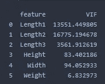
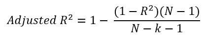
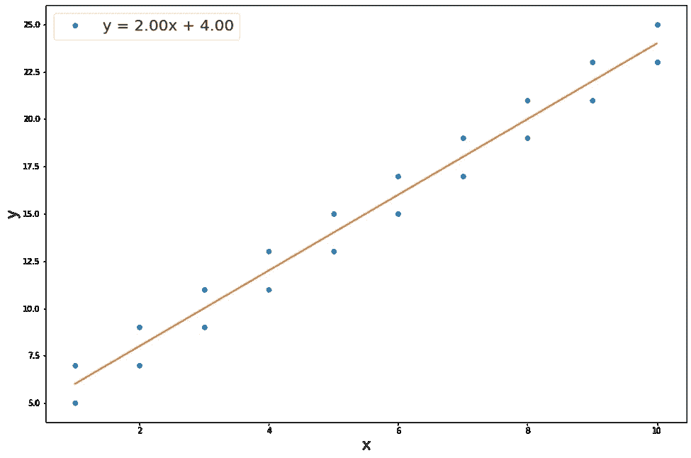
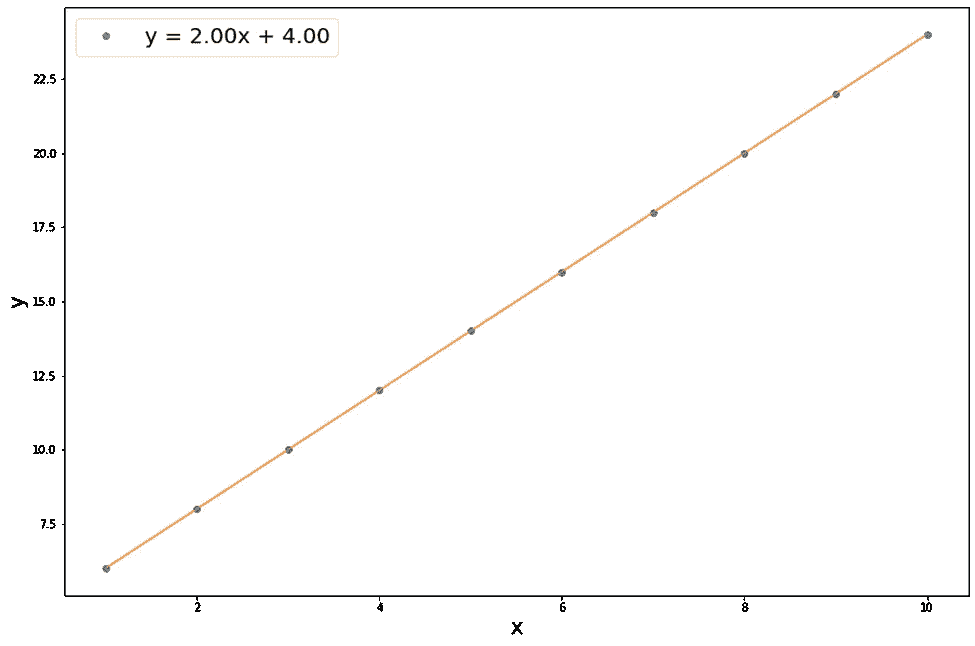

# 拟合优度:调整的 R 和 Bootstrapping 确定回归系数的标准误差

> 原文：<https://towardsdatascience.com/goodness-of-fit-adjusted-r%C2%B2-and-bootstrapping-to-determine-standard-error-of-regression-4897cb4bb811>

## 多元线性回归分析

图片来自 [Unsplash](https://unsplash.com/photos/FzrlPh20l7Q)

> **简介**

当执行线性回归时，我们需要评估回归模型。第一个也是最重要的策略是查看 R 平方值，它表明自变量可以解释因变量的多少变化。然而，这对于简单的线性回归是正确的。当我们执行多元线性回归时，调整的 R-square 是回归模型评估的更可靠的度量。

自举是简单的替换采样技术。当我们有大量人口时，通常会对数据进行抽样以预测人口统计数据。Bootstrapping 是一种非常有效的技术，可以根据采样数据确定标准误差和建立置信区间。这是降低重采样成本的简单而有效的策略。

> **R**

r 平方是回归分析中拟合优度的度量。这是可变性的一种度量。它也被称为决定系数。当我们有一个单独的自变量和另一个单独的响应变量时，R 的值指定了可由自变量解释的响应变量的可变性的百分比。

我们经常需要执行多元线性回归，最终得到数据集中的几个独立变量。通过在分析中包含更多的独立变量，我们允许更多的参数变化。因此，添加更多的变量会对因变量的可变性产生影响，不管这种影响有多小，这是有意义的。这就是为什么总是期望在回归分析中增加更多的变量会增加 R 值，这并不坏。当这些变量相关时，问题就出现了。这种多重共线性问题产生了一个不太稳健的模型，其中系数的估计变得系统性错误。

> **调整后的 R**

如上所述，在回归分析中增加更多的独立变量有助于增加 R 值。然而，分析变量的系数是否有很大价值也很重要。当两个变量相关时，我们可以去掉一个，利用其他不相关的变量。检查共线性的一种方法是检查方差膨胀因子(VIF)。通常，大于 5 的 VIF 值表示可能存在多重共线性。本文解释了获取 VIF 值的过程。

</assumptions-of-multiple-linear-regression-d16f2eb8a2e7>  

统计软件在进行回归分析时，会计算 R 和调整后的 R。调整后的 R 会减少添加更多独立变量的影响，并保持 R 值来自最重要变量的可变性。这就是为什么调整后的 R 值总是等于或小于常规的 R 值。

> **调整后的 R 在动作中**

让我们以 GPL 2.0 许可下的[“鱼”数据集](https://www.kaggle.com/aungpyaeap/fish-market)为例。有 5 个独立变量和一个响应变量。在一次添加一个独立变量后，观察到 R 值从 0.84 增加到 0.89，虽然很小，但潜在地证明了多重共线性的存在，从 VIF 值可以明显看出这一点。

鱼类数据集中的 VIF

由于观察到多重共线性，我们必须获得调整的 R，因为常规 R 是误导性的。

这里 N =观察值的总数，k =分析中考虑的独立变量的总数。当 k=5 时，调整后的 R 值变为 0.88，这是一个非常小的下降。

> **为什么自举计算标准误差**

当我们进行线性回归分析时，有时我们可能对回归系数的估计不是很有信心，因为我们只处理样本。当无法了解全貌时，样本估计值可能会远离实际数据。

让我们看看下面的两个图表，它们在数据点上有相同的线性拟合线。

线性拟合线 1(图片由作者提供)

线性拟合线 2(图片由作者提供)

当我们想从第一个图中计算人口统计数据时，样本将产生具有不同斜率的不同线，而第二个图中的任何样本(大小为 2 或更大)将提供具有相同斜率的相同线。如果第一个数字样本的系数变化不大，我们将对估计值有信心，另一方面，如果系数变化很大，我们将对估计值缺乏信心。这就是为什么在处理样本时，引导数据点、拟合数据点并确定拟合系数非常重要。

从这两个图中观察到的另一个有趣的事情是，虽然两个图中的线性拟合方程是相同的，但 R 是不同的。在第二幅图中，R 为 1，这表明了完美的拟合，而第一幅图中的 R 小于 1，因为存在残余误差。

> **结论**

本文解释了 R 和调整后 R 的概念。执行多元线性回归时，调整后的 R 是正确的决定系数。对于简单的线性回归，R 和调整后的 R 都非常接近。同样，为了对样本估计值有信心，我们可以执行 bootstrapping 并确定回归系数的标准误差，这将告诉我们多个样本的值如何变化。

<https://mdsohel-mahmood.medium.com/membership>  <https://mdsohel-mahmood.medium.com/subscribe> 