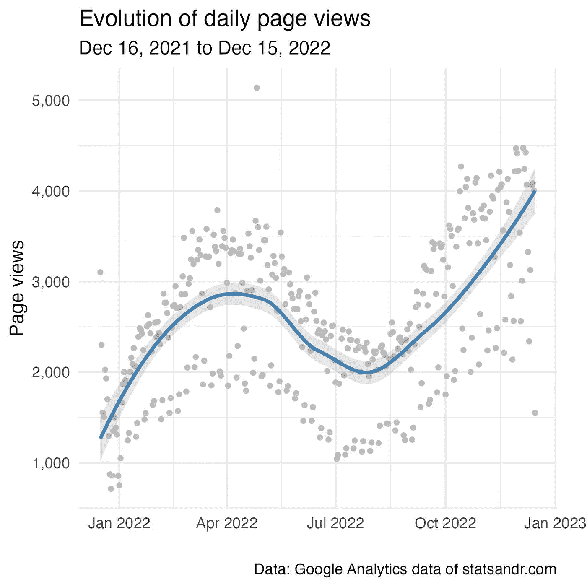
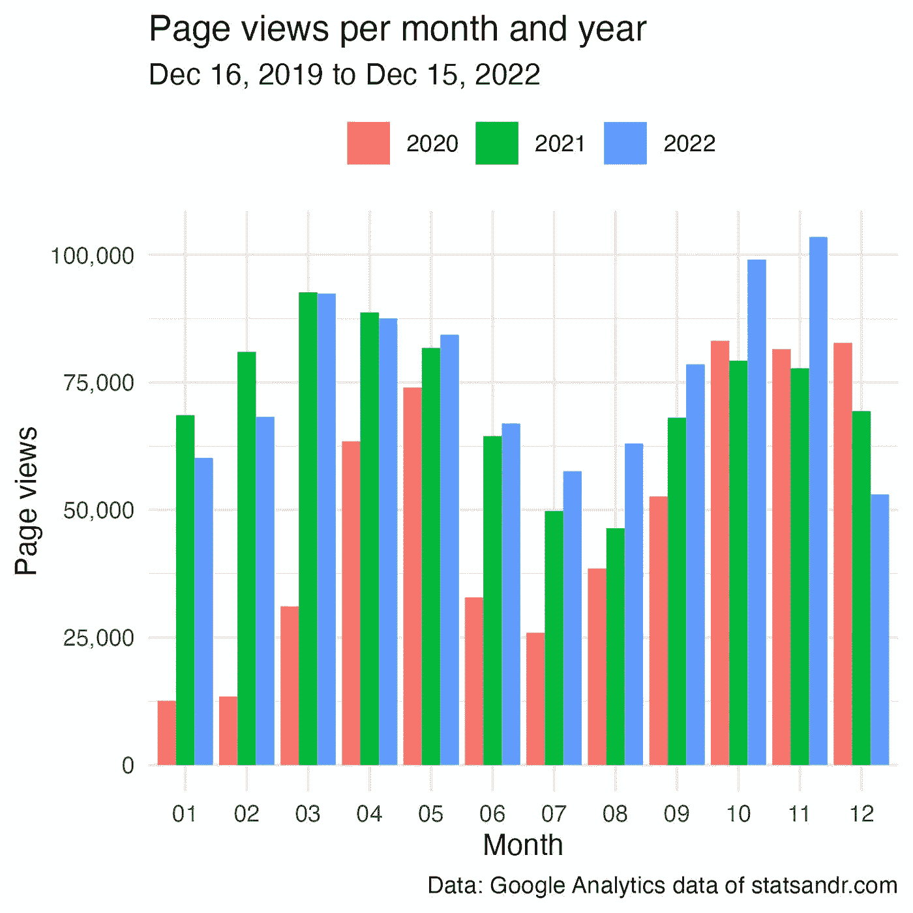
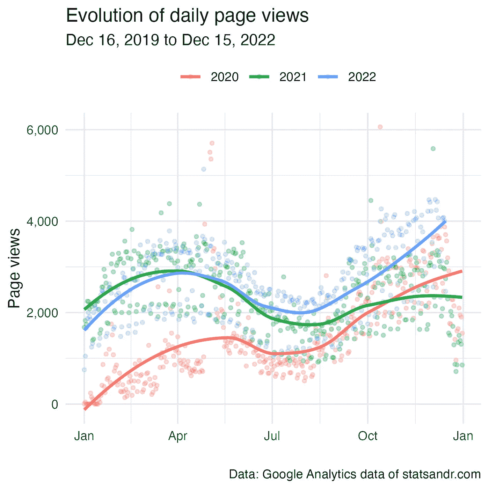
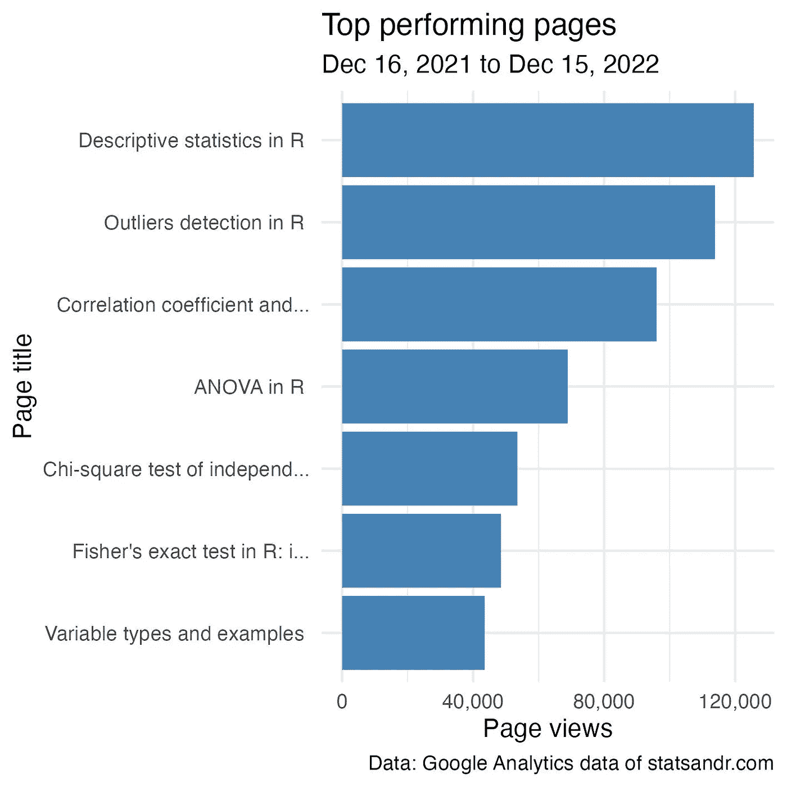
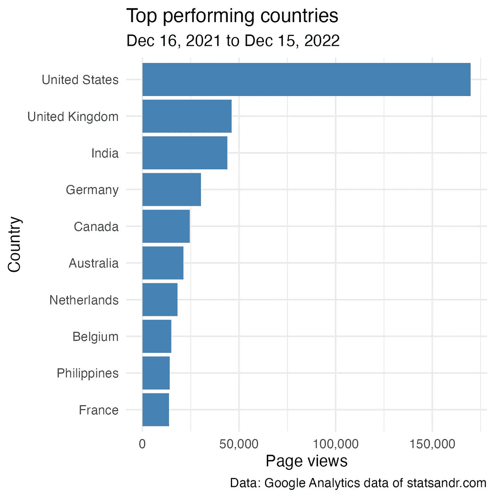
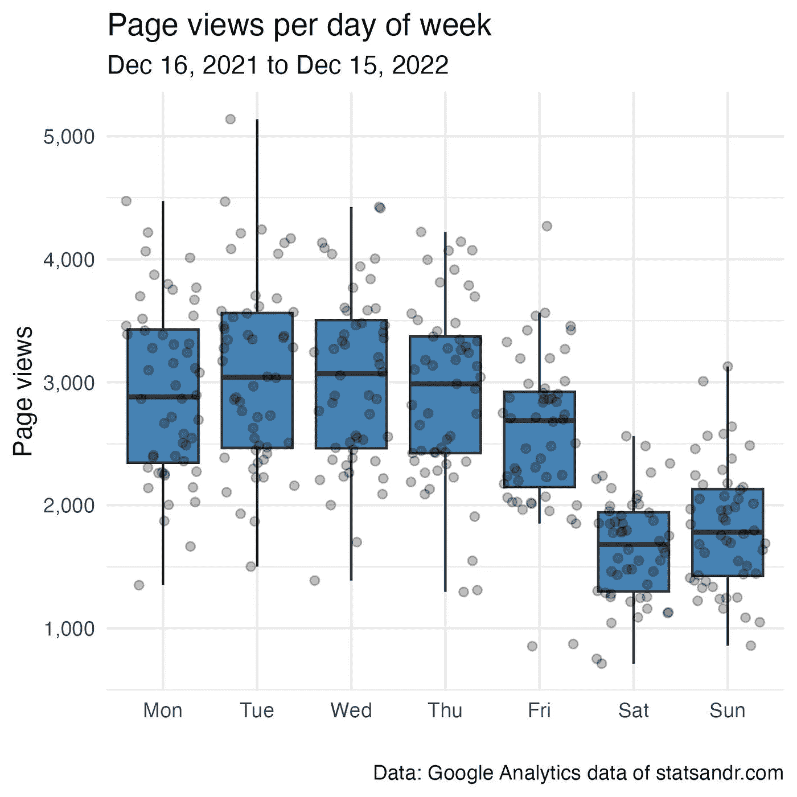

# 谷歌分析:2022 年回顾

> 原文：<https://towardsdatascience.com/google-analytics-in-r-review-of-2022-52d6bf4c1bb7>

## 了解如何通过 R 中的 googleAnalyticsR 包为您的博客或网站分析和可视化通用分析(UA)和 Google 分析 4 (GA4)数据


照片由[帕韦尔·切尔文斯基](https://unsplash.com/@pawel_czerwinski?utm_source=medium&utm_medium=referral)拍摄

# 介绍

It 快到年底了，这意味着是时候做一个统计和 R 的回顾，回顾过去的一年。

今年的回顾会比往年短得多，因为在那些[以前的回顾](https://statsandr.com/tags/review/)中已经有很多例子了。

请注意，2022 年 9 月初，我从通用分析(被称为 UA)转移到谷歌分析 4(被称为 GA4)。你可能知道如果你经常使用谷歌分析；2023 年 7 月 1 日，标准通用分析属性将停止处理新的点击。这意味着，如果您想在此日期后继续使用它，您将需要转移到 GA4。

今年，我将简要介绍不同的指标以及如何分析您的 Google Analytics (GA)数据。然而，这篇文章也许会对那些已经迁移到(或将迁移到)GA4 并且仍然想从 UA 和 GA4 分析 GA 数据的人有所帮助。

我不得不承认，将两者的数据结合起来是相当耗时的，特别是因为 UA 和 GA4 的度量和维度是不同的。所以如果你还没有搬家，我建议你在一年的年底或年初搬家。这将避免您必须从两个 GA IDs 获取数据，然后必须在 r 中组合这两个数据。

像往常一样，我在 R 中分析我的 GA 数据，这要感谢来自 [Mark Edmondson](https://code.markedmondson.me/googleAnalyticsR/) 的惊人的`{googleAnalyticsR}`包。

请注意，下面给出的实际数字对您来说不是很有用。每个博客和网站都不一样，所以每个受众都不一样。这篇帖子更多的是说明在 R 中分析 GA 数据的过程(今年，也是为了说明合并来自两个 GA IDs 的 GA 数据的过程)，而不是展示我的数字。

# 先决条件

首先，您必须指定要分析数据的 GA ID。我的如下:

```
ga_id <- c("208126346", "250795226")
```

您将在 GA 帐户的管理部分找到您的。

# 分析学

在这一节中，我将展示一些在分析 GA 数据时可能有用的可视化工具。如果你使用了其他有趣的可视化工具，请在文章末尾随意评论。

请注意，我在这篇文章中关注的是页面浏览量指标，但是您也可以编辑我的代码来显示其他指标。查看 UA 的可用指标[和 GA4](https://ga-dev-tools.web.app/dimensions-metrics-explorer/) 的可用指标[。](https://developers.google.com/analytics/devguides/reporting/data/v1/api-schema)

# 一段时间内的页面访问量

先说过去一年的浏览量演变，那么从 2021 年 12 月 16 日到 2022 年 12 月 15 日。

```
library(googleAnalyticsR)
```

```
# set date range
start_date <- as.Date("2021-12-16")
end_date <- as.Date("2022-12-15")# extract data from both IDs
dat1 <- google_analytics(ga_id[1],
  date_range = c(start_date, end_date),
  metrics = "pageviews",
  dimensions = "date",
  anti_sample = TRUE # avoid sampling
)dat2 <- ga_data(ga_id[2],
  date_range = c(start_date, end_date),
  metrics = "screenPageViews",
  dimensions = "date",
  limit = -1 # return all data (no limit)
)# combine data from both IDs
library(dplyr)
dat <- full_join(dat1, dat2, by = "date")
dat$page_views <- rowSums(select(dat, pageviews, screenPageViews),
  na.rm = TRUE
) # scatter plot with a trend line
library(ggplot2)
dat %>%
  ggplot(aes(x = date, y = page_views)) +
  geom_point(size = 1L, color = "gray") + # change size and color of points
  geom_smooth(color = "steelblue", alpha = 0.25) + # change color of smoothed line and transparency of confidence interval
  theme_minimal() +
  labs(
    y = "Page views",
    x = "",
    title = "Evolution of daily page views",
    subtitle = paste0(format(start_date, "%b %d, %Y"), " to ", format(end_date, "%b %d, %Y")),
    caption = "Data: Google Analytics data of statsandr.com"
  ) +
  theme(plot.margin = unit(c(5.5, 17.5, 5.5, 5.5), "pt")) + # to avoid the plot being cut on the right edge
  scale_y_continuous(labels = scales::comma) # better y labels
```



作者的情节

正如您在上面的代码中看到的，我们需要:

*   从两个不同的 id 中提取数据:这是用 UA 的`google_analytics()`和 GA4 的`ga_data()`完成的(每个函数都有自己的参数)
*   连接来自两个 id 的数据(用一个`full_join()`连接，因为即使在移动到 GA4 之后，UA 上仍然有一些点击，所以我需要保留全年来自两个 id 的数据)
*   合计两个 id 的度量(用`rowSums()`)

这个过程将对每个可视化重复进行。

从上面的图中，我们看到页面浏览量遵循一个周期性的演变过程(在夏季有所下降)。这一趋势遵循与去年相同的模式，但今年最后一个季度的增幅在 2022 年更大。

请注意，似乎总有一些日子的页面浏览量低于其他日子。这实际上是周末。在[部分](https://statsandr.com/blog/review-of-2022/#page-views-per-day-of-week)中可以看到更多相关信息。还要注意页面浏览量超过 5000 的异常值[的存在。那天没有发布任何帖子，所以它可能来自一个分享给大量观众的旧帖子。](https://statsandr.com/blog/outliers-detection-in-r/)

最后，将所有天数相加，总浏览量为 938，630。去年是 876280，所以 2022 年增长了 7.12%。

# 每月和每年的页面访问量

比较前几年每月的页面浏览量也是有用的。下面是两种不同类型的可视化。

```
# set new date range to include previous years
start_date_launch <- as.Date("2019-12-16")
```

```
# extract data from both IDs
dat1 <- google_analytics(ga_id[1],
  date_range = c(start_date_launch, end_date),
  metrics = "pageviews",
  dimensions = "date",
  anti_sample = TRUE # avoid sampling
)dat2 <- ga_data(ga_id[2],
  date_range = c(start_date_launch, end_date),
  metrics = "screenPageViews",
  dimensions = "date",
  limit = -1 # return all data (no limit)
)# combine data from both IDs
dat <- full_join(dat1, dat2, by = "date")
dat$page_views <- rowSums(select(dat, pageviews, screenPageViews),
  na.rm = TRUE
) # add year and month columns to dataframe
dat$month <- format(dat$date, "%m")
dat$year <- format(dat$date, "%Y")# page views by month by year using dplyr then graph using ggplot2 barplot
dat %>%
  filter(year != 2019) %>% # remove 2019 because there are data for December only
  group_by(year, month) %>%
  summarize(page_views = sum(page_views)) %>%
  ggplot(aes(x = month, y = page_views, fill = year)) +
  geom_bar(position = "dodge", stat = "identity") +
  theme_minimal() +
  labs(
    y = "Page views",
    x = "Month",
    title = "Page views per month and year",
    subtitle = paste0(format(start_date_launch, "%b %d, %Y"), " to ", format(end_date, "%b %d, %Y")),
    caption = "Data: Google Analytics data of statsandr.com",
    fill = "" # remove legend title
  ) +
  theme(legend.position = "top") + # change legend position
  scale_y_continuous(labels = scales::comma) # better y labels
```



作者的情节

另一种可能性如下:

```
dat2 <- dat
```

```
library(lubridate)
dat2$day <- day(dat2$date)
dat2$day_month <- as.Date(paste0(dat2$month, "-", dat2$day), format = "%m-%d")dat2 %>%
  filter(year != 2019 & page_views < 7500) %>% # remove 2019 and outliers
  ggplot(aes(x = day_month, y = page_views, color = year)) +
  geom_point(size = 1L, alpha = 0.25) + # change size and alpha of points
  geom_smooth(se = FALSE) + # remove confidence interval
  theme_minimal() +
  labs(
    y = "Page views",
    x = "",
    title = "Evolution of daily page views",
    subtitle = paste0(format(start_date_launch, "%b %d, %Y"), " to ", format(end_date, "%b %d, %Y")),
    caption = "Data: Google Analytics data of statsandr.com",
    color = "" # remove legend title
  ) +
  theme(legend.position = "top") + # change legend position
  scale_y_continuous(labels = scales::comma) + # better y labels
  scale_x_date(date_labels = "%b") # show only months
```



作者的情节

从上面的两个图中，我们看到，与 2020 年至 2021 年相比，该博客在页面浏览量方面的全球表现更好(除了 2021 年第一季度的表现更好)。

请注意，3 年之间的比较是好的，但如果用更多的年份来比较，这些图将很快变得不可读！

# 表现最佳的页面

如果您有兴趣了解表现最佳的页面(仍以页面浏览量计):

```
# extract data from both IDs
dat1 <- google_analytics(ga_id[1],
  date_range = c(start_date, end_date),
  metrics = "pageviews",
  dimensions = "pageTitle",
  anti_sample = TRUE # avoid sampling
)
```

```
dat2 <- ga_data(ga_id[2],
  date_range = c(start_date, end_date),
  metrics = "screenPageViews",
  dimensions = "pageTitle",
  limit = -1 # return all data (no limit)
)# combine data from both IDs
dat <- full_join(dat1, dat2, by = "pageTitle")
dat$page_views <- rowSums(select(dat, pageviews, screenPageViews),
  na.rm = TRUE
)## Create a table of the most viewed posts
library(lubridate)
library(reactable)
library(stringr) most_viewed_posts <- dat %>%
  mutate(Title = str_sub(pageTitle, start = 1, end = -nchar(" - Stats and R"))) %>% # remove blog site in pageTitle
  count(Title, wt = page_views, sort = TRUE) %>%
  mutate(Title = str_trunc(Title, width = 30)) # keep maximum 30 characters# plot
top_n(most_viewed_posts, n = 7, n) %>% # edit n for more or less pages to display
  ggplot(., aes(x = reorder(Title, n), y = n)) +
  geom_bar(stat = "identity", fill = "steelblue") +
  theme_minimal() +
  coord_flip() +
  labs(
    y = "Page views",
    x = "Page title",
    title = "Top performing pages",
    subtitle = paste0(format(start_date, "%b %d, %Y"), " to ", format(end_date, "%b %d, %Y")),
    caption = "Data: Google Analytics data of statsandr.com"
  ) +
  scale_y_continuous(labels = scales::comma) # better y labels
```



作者的情节

表现最佳的帖子与去年非常相似，即:

1.  [R 中的描述性统计](https://statsandr.com/blog/descriptive-statistics-in-r/)
2.  [R 中的离群点检测](https://statsandr.com/blog/outliers-detection-in-r/)
3.  [R 中的相关系数和相关检验](https://statsandr.com/blog/correlation-coefficient-and-correlation-test-in-r/)
4.  [R 中的方差分析](https://statsandr.com/blog/anova-in-r/)
5.  [R 中独立性的卡方检验](https://statsandr.com/blog/chi-square-test-of-independence-in-r/)

由于它们是几年来阅读量最大的帖子，我已经通过 [Gumroad](https://statsandr.gumroad.com/) 提供下载。

# 按国家列出的页面浏览量

了解你的读者来自哪个国家也很有用，特别是对于电子商务或者除了写文章以外还销售实体产品的博客。

```
# extract data from both IDs
dat1 <- google_analytics(ga_id[1],
  date_range = c(start_date, end_date),
  metrics = "pageviews",
  dimensions = "country",
  anti_sample = TRUE # avoid sampling
)
```

```
dat2 <- ga_data(ga_id[2],
  date_range = c(start_date, end_date),
  metrics = "screenPageViews",
  dimensions = "country",
  limit = -1 # return all data (no limit)
)# combine data from both IDs
dat <- full_join(dat1, dat2, by = "country")
dat$page_views <- rowSums(select(dat, pageviews, screenPageViews),
  na.rm = TRUE
)# table
countries <- dat %>%
  mutate(Country = str_trunc(country, width = 30)) %>% # keep maximum 30 characters
  count(Country, wt = pageviews, sort = TRUE)# plot
top_n(countries, n = 10, n) %>% # edit n for more or less countries to display
  ggplot(., aes(x = reorder(Country, n), y = n)) +
  geom_bar(stat = "identity", fill = "steelblue") +
  theme_minimal() +
  coord_flip() +
  labs(
    y = "Page views",
    x = "Country",
    title = "Top performing countries",
    subtitle = paste0(format(start_date, "%b %d, %Y"), " to ", format(end_date, "%b %d, %Y")),
    caption = "Data: Google Analytics data of statsandr.com"
  ) +
  scale_y_continuous(labels = scales::comma) + # better y labels
  theme(plot.margin = unit(c(5.5, 7.5, 5.5, 5.5), "pt")) # to avoid the plot being cut on the right edge
```



作者的情节

对于 Stats 和 R 来说，大多数读者来自美国，很大程度上是因为第二大国家(英国)在页面浏览量方面相差甚远。

这一趋势与去年相同，只是:

*   英国已经超过印度，而
*   比利时(曾在 2020 年和 2021 年分别排名第三和第六)现在仅列第八。由于我来自比利时，这表明这个博客这些年来吸引了越来越多的国际读者(而来自我的国家的读者相应地越来越少)。

# 每周每天的页面浏览量

正如在关于每日页面浏览量演变的章节中所讨论的(查看此[章节](https://statsandr.com/blog/review-of-2022/#page-views-over-time))，似乎有些日子的表现一直比其他日子差。

下面的情节将展示这些日子是什么:

```
# extract data from both IDs
dat1 <- google_analytics(ga_id[1],
  date_range = c(start_date, end_date),
  metrics = "pageviews",
  dimensions = c("date"),
  anti_sample = TRUE # avoid sampling
)
```

```
dat2 <- ga_data(ga_id[2],
  date_range = c(start_date, end_date),
  metrics = "screenPageViews",
  dimensions = c("date"),
  limit = -1 # return all data (no limit)
)# combine data from both IDs
dat <- full_join(dat1, dat2, by = "date")
dat$page_views <- rowSums(select(dat, pageviews, screenPageViews),
  na.rm = TRUE
)
# find day of week
dat$weekday <- wday(dat$date, label = TRUE, abbr = TRUE)## Reordering dat$weekday so Monday is first
dat$weekday <- factor(dat$weekday,
  levels = c("Mon", "Tue", "Wed", "Thu", "Fri", "Sat", "Sun")
)# boxplot
library(scales)
dat %>%
  ggplot(aes(x = weekday, y = page_views)) +
  geom_boxplot(fill = "steelblue", outlier.colour = alpha(0.25)) +
  geom_jitter(alpha = 0.25) + # adds transparency
  theme_minimal() +
  labs(
    y = "Page views",
    x = "",
    title = "Page views per day of week",
    subtitle = paste0(format(start_date, "%b %d, %Y"), " to ", format(end_date, "%b %d, %Y")),
    caption = "Data: Google Analytics data of statsandr.com"
  ) +
  scale_y_continuous(labels = scales::comma) # better y labels
```



作者的情节

正如一个技术博客所预期的那样，一周内的读者比周末多得多。

# 感谢信

感谢所有今年来到 Stats and R 的读者。你让这段旅程变得无比丰富。对于明年和未来的许多年，我将继续写我熟悉和感兴趣的话题。敬请关注！

感谢阅读。我希望这篇文章能帮助你在 R 中分析你的 Google Analytics 数据，或者帮助你结合你的 Universal Analytics 和 Google Analytics 4 数据。有关 R 中 GA 数据的可视化或汇总的更多示例，另请参见往年的[评论](https://statsandr.com/tags/review/)。

和往常一样，如果您有与本文主题相关的问题或建议，请将其添加为评论，以便其他读者可以从讨论中受益。

# 相关文章

*   [Stats 和 R 都 2 岁了！](https://statsandr.com/blog/statsandr-is-2-years-old/)
*   [如何跟踪你的博客在 R？](https://statsandr.com/blog/track-blog-performance-in-r/)
*   [如何让自己了解最新的 R 新闻？](https://statsandr.com/blog/how-to-keep-up-to-date-with-the-latest-r-news/)
*   [为什么我有一个数据科学博客？分享代码的 7 个好处](https://statsandr.com/blog/7-benefits-of-sharing-your-code-in-a-data-science-blog/)
*   [R 中的图形与 ggplot2](https://statsandr.com/blog/graphics-in-r-with-ggplot2/)

*原载于 2022 年 12 月 16 日 https://statsandr.com*<https://statsandr.com/blog/review-of-2022/>**。**