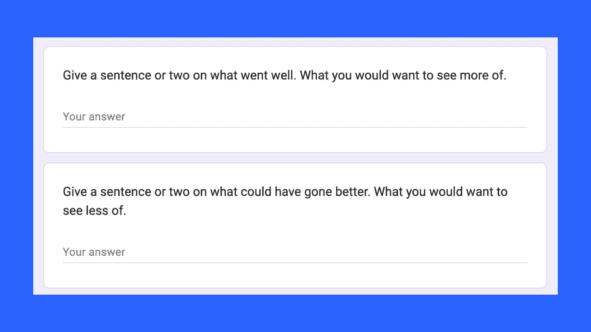

# 谷歌云实体+情感分析快速参考

> 原文：<https://towardsdatascience.com/google-cloud-entity-sentiment-analysis-quick-reference-2a4196546133>

## 为什么通过调查收集和分析开放式文本回答很有帮助(如果你也可以使用 NLP)

# 介绍

本文提供了一个关于使用 Google Cloud 的自然语言 API 作为工具的快速参考，可以帮助您快速分析反馈调查中的开放文本响应。

**反馈调查**通常采用问卷的形式，征求客户或员工对产品、服务或其他主题的反馈。调查可以是在线的，也可以是离线的，通常包括关于满意度的问题、对质量的意见以及改进的建议。客户或员工可以以文本响应的形式提供反馈，这可能难以手动分析。这就是谷歌云的自然语言 API 的用武之地:它可以帮助你快速轻松地从大量开放的文本数据中提取见解。

图片来源:Canva 的库存图片。

如果你还不知道，**自然语言处理** (NLP)是计算机科学和语言学的一个领域，处理计算机和人类语言之间的交互。它包括开发能够理解人类语言输入并以人类自然的方式做出反应的程序。NLP 应用程序可用于情感分析、文本分类和机器翻译等任务。

在阅读下面的内容之前，同样重要的是，NLP 技术至少可以在两个主要方面提供帮助。首先，NLP 可以**量化情绪**。第二，NLP 可以**识别实体**。

情感分析量化情感，它是识别和量化文本中表达的情感的过程。通常，情感分析用于确定文档或文档的一部分的总体情感。此外，该分析可以量化整个文档、段落、段落、句子或实体级别的情感。

自然语言处理中的实体分析是指对文本中的物、人、场所、对象等有形物体进行识别和分类。粗略地说，你可能认为实体是一个“名词”

# 收集非结构化的开放式回答，优势

首先，许多人可能会建议不要在调查中收集开放式的回答。避免这种非结构化的数据收集将减少与进行分析相关的技术挑战。的确，没有任何分析能够完全概括大量开放式文本回复中的所有细微差别。然而，包括 Fowler (2014)和 Heinrich (2005)在内的多位科学家记录了与开放式调查项目相关的方法优势和劣势。开放式问题有可能发现或“获得意想不到的答案”(Fowler，2014 年，第 88 页)。同样，这种开放式的回答可能揭示主题、思想、观点或“研究者未知的参考框架”(Heinrich，2005，第 559 页)。相关的、开放式的回答有助于“思维过程的检查”(Heinrich，2005，第 559 页)。

# 开放式文本收集，缺点

非结构化的开放式文本数据收集和相关分析策略的主要弱点之一是，来自不太感兴趣、注意力分散或没有响应动机的潜在回答者的数据可能较少。可能有帮助的替代策略包括涉及面对面互动的数据收集策略(访谈、焦点小组、电话或其他双向交流)。双向沟通的存在允许访问者或焦点小组主持人从研究参与者和回答者那里探索更多的细节。此外，研究人员可以考虑从受访者那里收集定量、序数和名义数据。这种定量的、有序的和名义上的数据可能有助于确定一项研究可能提出的其他开放式问题。具体而言，定量数据、序数数据和名词性数据可以帮助识别对回答者来说更有趣和更吸引人的开放式问题主题。理论上，问一些让受访者感兴趣的开放式问题，会让受访者在分心或缺乏动力的情况下更好地生存下来。

# 谷歌的云的自然语言 API 能有什么帮助

谷歌的云的自然语言 API 可以通过从大量开放的文本数据中提取见解来帮助分析调查响应。该 API 可用于快速、轻松地从大量开放文本数据中提取见解。这对于情感分析、文本分类和机器翻译等任务很有帮助。

请记住，机器学习输出的计算机审查可以帮助人类审查打开的文本。但是，没有什么可以替代对文本中讨论的主题有所了解的人的审查。

谷歌云的自然语言 API(或其他可以量化文档任何层次情感的工具)最强大的用途之一是，这样做有能力部分抽象调查响应提交的信息。例如，一些调查受访者可能会提交符合个人身份信息条件的信息。同样，受访者有时可能会提交令人不快的信息。通过提取实体，然后在响应或实体级别找到情感，该过程增加了一层，该层可以帮助限制限制性或攻击性响应的传播。

# 更多关于情绪

为了更深入地理解上面的内容，考虑一下“量化情感”意味着什么是有帮助的在一个最简单的例子中，情绪分数通常将快乐和高兴识别为积极的。否则它通常会将悲伤或愤怒识别为负面的。谷歌云实体情感分析 API 返回一个介于-1 和 1 之间的情感得分。通常，接近 0 的分数表示中性情绪，而接近-1 的分数表示消极情绪，接近 1 的分数表示积极情绪。([引用](https://cloud.google.com/natural-language/docs/basics#interpreting_sentiment_analysis_values))。

# 关于显著性的一个注记

突出度是谷歌云的自然语言 API 和其他 NLP 工具提供的另一个重要指标。“显著性分数”表示该实体对整个文档文本的重要性或相关性([引](https://cloud.google.com/natural-language/docs/basics#interpreting_sentiment_analysis_values))。具体来说，“这个分数可以通过区分显著实体的优先级来帮助信息检索和摘要。更接近 0.0 的分数不太重要，而更接近 1.0 的分数非常重要。”([引自](https://cloud.google.com/natural-language/docs/basics#interpreting_sentiment_analysis_values))。

# 结论

我撰写本指南是为了帮助分析师和其他人准备反馈调查，或任何可能涉及一个或多个要求开放式回答的问题的调查。在这种情况下，单端响应可能是这样的:

图片来源:作者使用调查软件和屏幕截图的插图。

我还希望本指南能为使用谷歌云的自然语言 API 帮助开放式调查反馈的情感分析提供快速参考。该 API 可用于从大量开放文本数据中提取见解，这有助于情感分析、文本分类和机器翻译等任务。此外，通过提取实体并在响应或实体级别发现情绪，API 可用于帮助限制受限或攻击性响应的传播。

将实体分析与情感评分相结合是一种强大的技术，每个拥有调查数据的人都应该考虑利用这种技术。通过提取实体，然后在响应或实体级别找到情感，我们可以获得对我们收到的响应的有价值的见解。这可以帮助我们更好地理解我们正在收集的数据，并识别数据的任何潜在问题。此外，这项技术可以帮助我们限制限制性或攻击性反应的传播。

# 感谢阅读

你准备好了解更多关于数据科学职业的信息了吗？我进行一对一的职业辅导，并有一份每周电子邮件列表，帮助专业求职者获取数据。联系我了解更多信息。

感谢阅读。把你的想法和主意发给我。你可以写信只是为了说声嗨。如果你真的需要告诉我是怎么错的，我期待着尽快和你聊天。推特:[@ adamrossnelson](https://twitter.com/adamrossnelson)LinkedIn:[亚当罗斯尼尔森](https://www.linkedin.com/in/arnelson/)。

## 参考资料:

F. J .福勒(2014 年)。*调查研究方法*(第 5 版。).千橡，加州:圣人出版社。

海因里希·h . a .(2005 年)。谁感知集体的过去，如何感知？对开放式问题的拒绝是实质性的回答吗？*质与量，39* (5)，559–579。