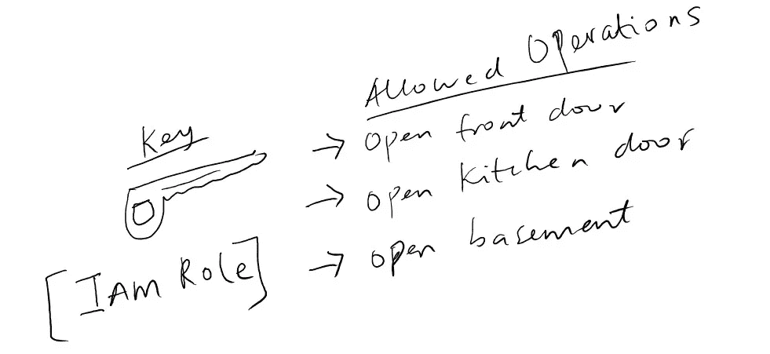
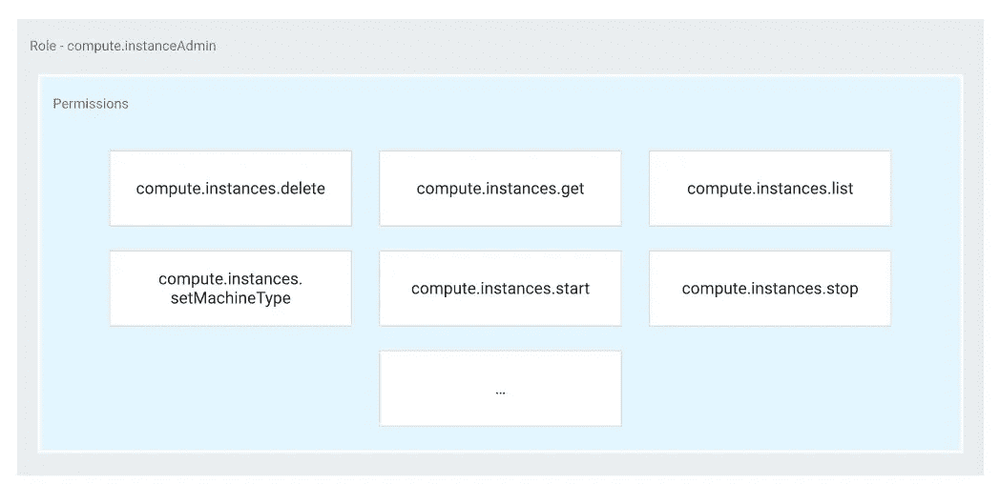
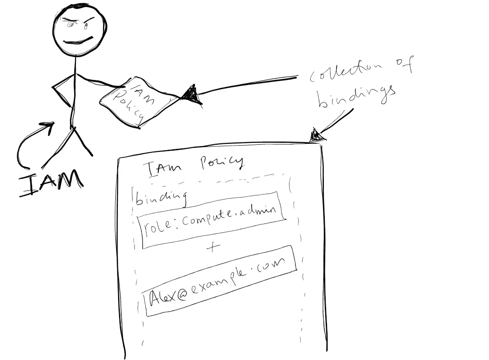

# 用简笔画理解谷歌云 IAM 概念

> 原文：<https://towardsdatascience.com/google-cloud-iam-with-stick-figures-cd5ce19c142b>

# 用简笔画理解谷歌云 IAM 概念

## 用涂鸦描述谷歌云平台上的 IAM 概念


IAM 概念插图-作者图片

用类比和例子解释新概念会很有帮助。在本文中，我将尝试使用涂鸦来解释 GCP 的 IAM(身份和访问管理)概念。GCP 的 IAM 并不特别难，尽管这样做很有趣，我希望我不那么复杂的涂鸦能帮助你多理解一点 IAM 的概念。

在我们开始之前，这里有一个我们将涉及的每个关键概念的地图，以便您可以跟随类比。

*   **人物**:在 GCP，这相当于一个`principal`或者`identity`。这可能是一个实际的用户帐户(alex@example.com)、一个服务帐户或其他[实体](https://cloud.google.com/iam/docs/overview#concepts_related_identity)。我将交替使用“主体”和“身份”。
*   **键**:相当于 GCP 的一个`role`。例如，alex@example.com 可以有一个云存储桶管理员角色。
*   **房子**:相当于 GCP 的一个`resource`。这可能是一个计算引擎实例或 BigQuery。

使用上面的图像作为指导，让我们想象简笔画用户(可能是任何 GCP `identity`)试图进入一所房子(可能是任何`resource`，像 GCP 的计算引擎实例)。需要进行一些验证，以确保我们的用户拥有正确的 ***权限*** 来访问特定的属性。用户需要被授予正确的权限才能继续。

> 在 IAM 中，访问资源的权限不是直接授予终端用户的。相反，权限被分组到*角色*中，角色被授予经过身份验证的*主体。*

## 那么什么是角色呢？

> 一个*角色*是权限的集合。权限决定了允许对资源进行哪些操作。当您将一个`role`授予一个`principal`时，您就授予了该角色包含的所有权限。

## 什么是权限？

> 权限决定了允许对资源进行哪些操作。例如，“调用”云功能是可以在云功能上执行的操作。在 IAM 世界中，权限以`service.resource.verb`的形式表示，例如`pubsub.subscriptions.consume`。

继续上图中的例子，图中的*键*将代表一个`*role*`，它可能被分配了以下虚拟权限:`living.house.openFrontDoor`、`living.house.openKitchenDoor`和`living.house.openBasement`



对密钥(即角色)的允许权限—按作者排列的图像

在 GCP，角色和权限的映射在概念上是这样的:



图片来源— [谷歌云平台](https://cloud.google.com/iam/docs/overview#roles)

既然我们已经为密钥分配了权限，流程的下一步就是将密钥分配给简笔画用户。我们还需要让房屋主人知道用户在物业中被允许做什么。要做到这一点，我们需要某种策略来概述授权用户并明确定义他们可以做什么。

为了在 GCP 实现这一点，每个资源被分配一个叫做 ***IAM 策略*** 的东西。

## IAM 策略

> 一个 *IAM 策略*定义并强制执行哪些角色被授予哪些身份。此策略附加到资源。如果我们有 20 个计算引擎实例，它们每个都有一个 IAM 策略。重要的是，如果您将策略分配给 GCP 项目，用户将获得整个项目的指定角色。

所以实际上，IAM 策略只是绑定的集合。绑定是将身份与角色联系起来的东西。以下是 GCP 实际的 IAM 政策。

```
{
  "bindings": [
    {
      "members": [
        "user:alex@example.com"
      ],
      "role": "roles/pubsub.subscriptions.consume"
    }
  ],
  "etag": "BwUjMhCsNvY=",
  "version": 1
}
```

IAM 策略可以是 JSON 或 YAML 格式。你可以在这里阅读更多关于 IAM 政策的信息。

最后，想象我们有一个叫做“IAM”的房子主人，在插图中的房产前站岗。当我们经过身份验证的用户试图访问这个房产(又名`resource`)时，IAM 会检查房子的策略，以确定用户试图执行的操作是否被允许。



IAM 政策说明—作者图片

如果根据预定义的策略允许该动作，则用户将被允许在房子上执行该动作(也称为`resource`)。

## 结论

我们已经看了 Google Cloud 中 IAM 的几个关键概念，我希望这些插图有助于更好地理解。IAM 允许您授予对特定 Google 云资源的细粒度访问权限，并帮助阻止对其他资源的访问。IAM 允许您采用最小特权的安全原则，即任何人都不应该拥有超过他们实际需要的权限。

继续在您的环境中尝试这些！

> 你可以[成为](https://medium.com/@tobisam/membership)的中等会员，享受更多这样的故事。

# 参考

*   IAM [政策](https://cloud.google.com/iam/docs/policies)
*   [https://cloud.google.com/iam/docs/overview](https://cloud.google.com/iam/docs/overview)