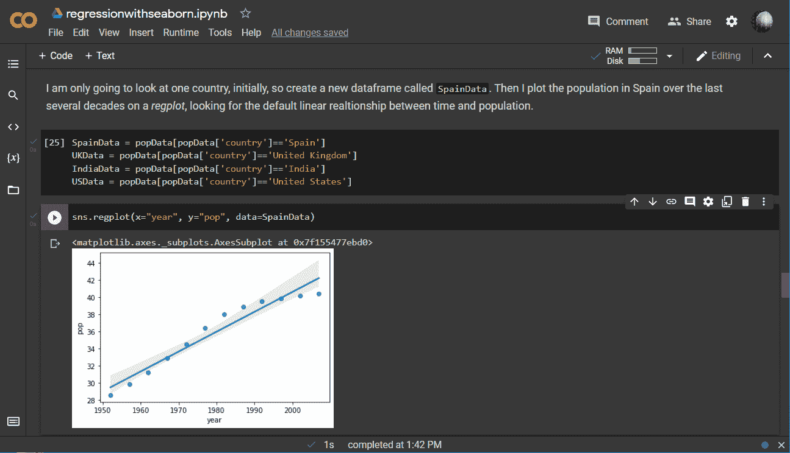
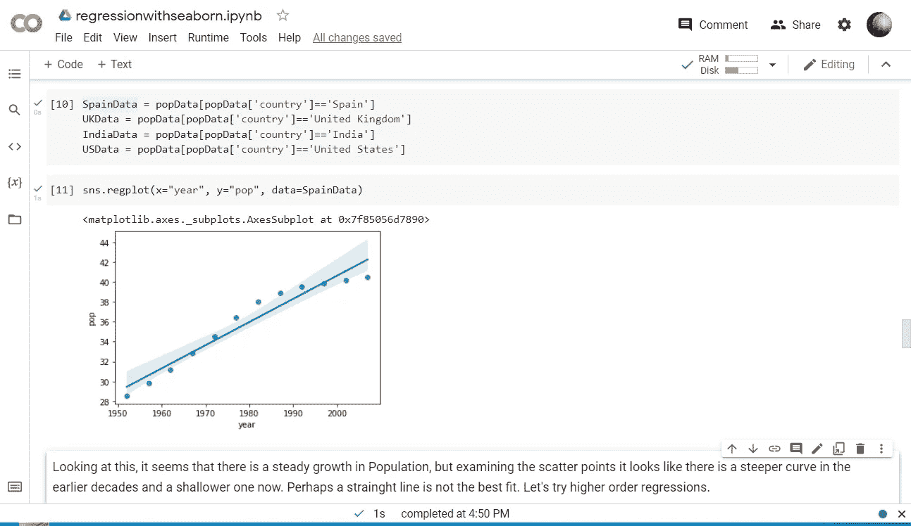
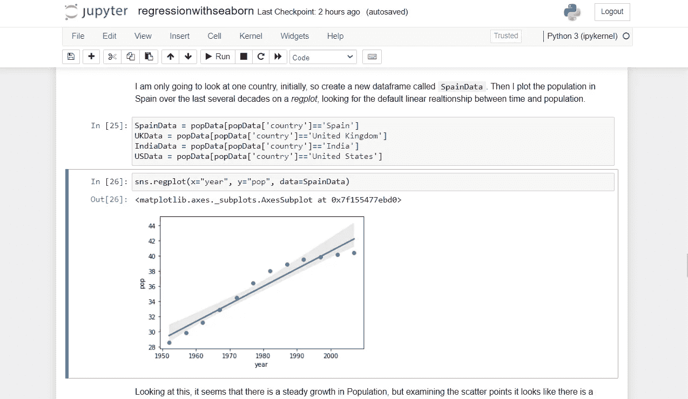
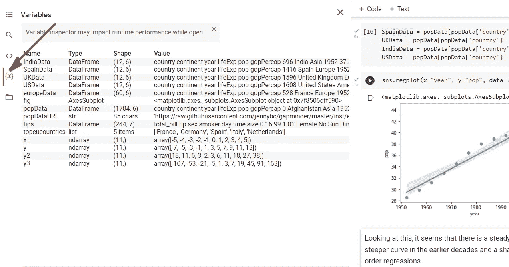
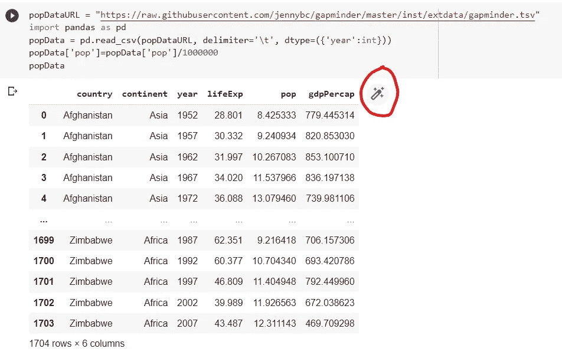
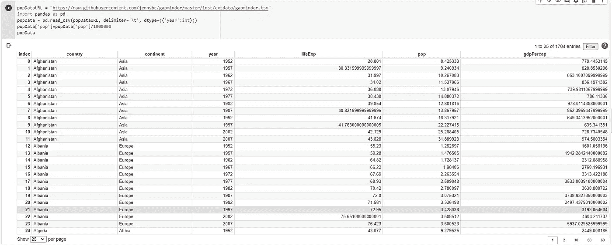

# Google Colab:你绝对应该试试的在线 Jupyter 笔记本

> 原文：<https://towardsdatascience.com/google-colab-an-online-jupyter-notebook-that-you-should-definitely-try-2572a3d4afb6>

## 谷歌的 Colab 允许任何人在任何地方在线编写和分享 Jupyter 笔记本



Google Colab 中的 Jupyter 笔记本——作者图片

谷歌 Colab 我用得挺多的。它曾经是我默认的 Jupyter 笔记本环境，也是我许多关于 Medium 的文章的起点(我现在也使用 VSCode，但那是另一个故事了)。

Colab 是谷歌的在线 Jupyter 笔记本环境。它可以做本地笔记本会做的一切(甚至更多)，但它在云中，所以没有软件安装是必要的，它可以从任何连接互联网的计算机上获得。

它看起来非常熟悉，类似于您可能已经安装在自己的 PC 上的 Jupyter 环境——我们稍后将研究一些差异。

它目前只运行 Python 3(尽管 R 和 Scala 被认为是未来可能的发展方向),并且已经安装了许多最流行的 Python 库。

如果你需要安装任何额外的软件包，你可以使用笔记本电脑中的 *pip* 来完成。

```
!pip install a-new-package
```

这将在您的会话期间保持加载状态。

## 一个谷歌账户

要使用 Colab，您需要一个 Google 帐户，否则，不需要设置，您创建的任何笔记本都将存储在与您的帐户关联的 Google Drive 中。如果您愿意，也可以将它们放在 Github 存储库中。

Google Colab 是在免费增值的基础上提供的。免费订阅层的资源有限，尽管我认为你需要做一些非常复杂的事情才能达到极限。如果您需要更多的内存或计算能力，您可以订阅更高的层。

如果您的本地机器上有笔记本，您可以将它们上传到 Colab，也可以下载 Colab 笔记本以将其存储在本地。

Colab 笔记本在虚拟机中执行，如果它闲置了一段时间，就会自动终止，尽管如果你在工作时不小心关闭了浏览器，你可能会发现当你再次打开它时，笔记本仍然在运行。你可以让一个虚拟机运行的最长时间是有限的，但谷歌建议这可以长达 12 小时。

所有这一切似乎意味着，出于各种意图和目的，Colab 对个人使用是免费的，但如果你需要将其用于商业目的，你可能需要每月支付几美元。

数据存储在你的谷歌硬盘上。提供了库来读写驱动器，当然，您可以使用常用的 Python 包从 web 加载数据。

Jupyter 笔记本电脑非常适合数据科学，Colab 也是如此，但此外，如果你想在 Tensorflow(当然包括)中运行 ML 代码，那么 Colab 提供了 GPU，以便更好地运行你的代码。

## 它看起来像什么

正如你从下面的图片中看到的，布局与标准的 Jupyter 笔记本非常相似。但是 Colab 有一些不同之处。



来自 Google Colab 的截图——图片由作者提供



Jupyter 笔记本截图——图片由作者提供

您可以看到的主要区别是 Colab 中缺少图标，但所有命令都可以从下拉菜单或每个单元格上方的图标栏中获得。


Colab 中的单元格图标栏—按作者排序的图像

Colab 中没有*内核*菜单，因为只有一个内核可供选择——重启内核是通过*运行时*菜单完成的。

## 检查数据

Colab 的一个非常有用的特性是*变量*面板，在这里你可以看到每个当前变量的类型和值。



“Colab 变量”面板—按作者分类的图像

更令人印象深刻的是，你可以把一个数据帧看作一个交互式的表格。当您从代码单元格显示数据帧时，如下面的单元格所示…



Colab 单元格中显示的数据框架—作者图片

您将看到一个淡蓝色的图标，单击该图标将调用交互式表格。



互动表格—作者图片

您不仅可以看到表中的数据和所有值，还可以通过各列中的值来过滤数据，并通过单击列标题来对数据进行排序。

## 尝试

正如我前面提到的，Colab 曾经是我的 go to Jupyter 编辑器，原因之一是我希望能够在不同的机器上从不同的地方运行和编辑我的代码。Colab 使这变得极其容易。

另一个优势是，在云中运行 Colab 笔记本的计算能力远远优于我用来编辑笔记本的通常很弱的硬件，这意味着它们会运行得更好更快。

我希望对 Google Colab 的简要介绍对您有所帮助，并且您可以尝试一下。

一如既往，感谢阅读。如果你愿意，你可以订阅我偶尔发布的免费时事通讯，Substack 上的[Technofile](https://technofile.substack.com/)——我在那里发布新文章。[这里](https://technofile.substack.com/p/streamlit-special)举例来说就是我写的一堆 [Streamlit 文章](https://technofile.substack.com/p/streamlit-special)的帖子。

[](https://alanjones2.github.io/) [## AlanJones:编码、科学和技术

### 关于数据可视化和类似主题的文章、教程和应用——大部分是 Python 语言，请参见一些示例…

alanjones2.github.io](https://alanjones2.github.io/)