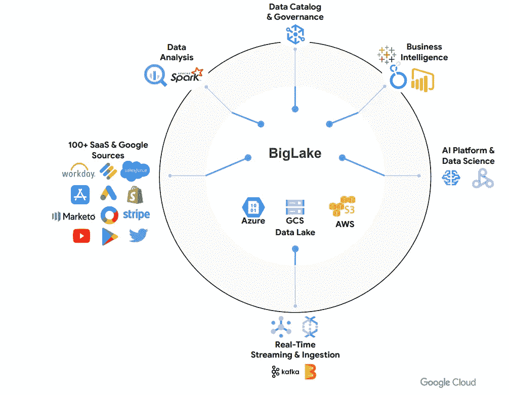
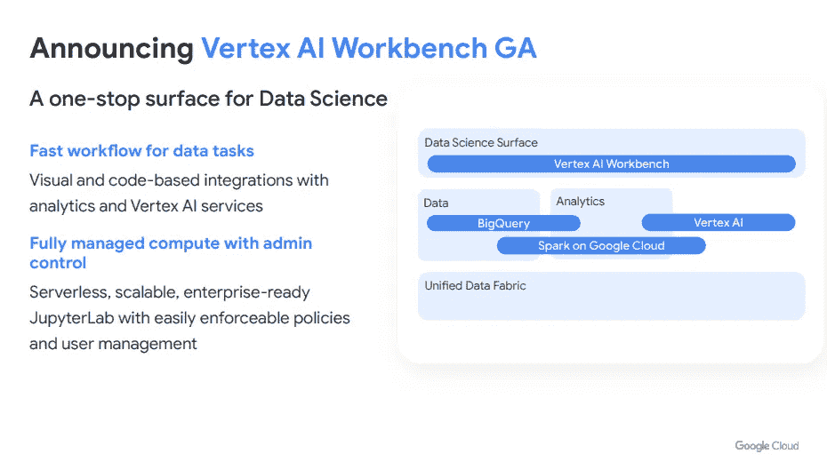
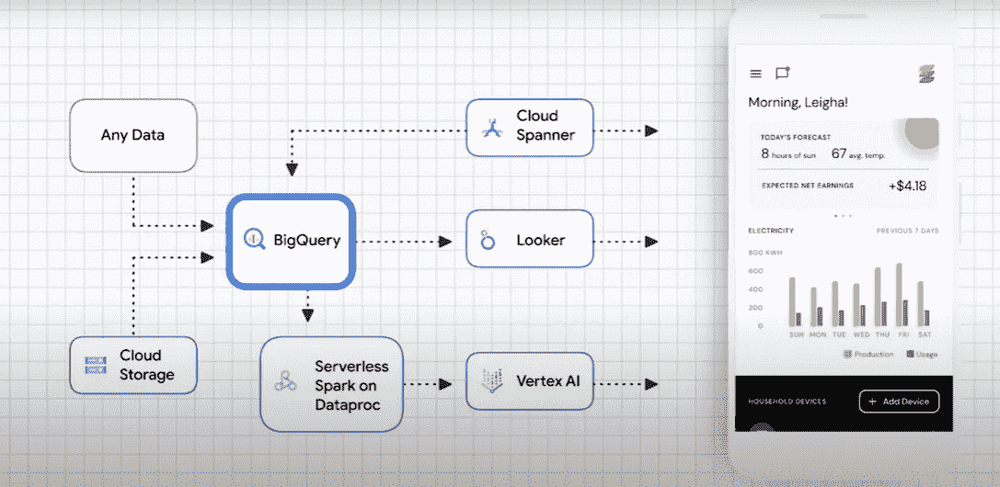

# 2022 年谷歌数据云峰会:回顾

> 原文：<https://towardsdatascience.com/google-data-cloud-summit-2022-recap-e1c6d5097ccd>

## 谷歌云平台的许多新更新概述

[活动发起人](https://unsplash.com/@campaign_creators?utm_source=unsplash&utm_medium=referral&utm_content=creditCopyText)在 [Unsplash](https://unsplash.com/s/photos/cloud-data?utm_source=unsplash&utm_medium=referral&utm_content=creditCopyText) 上的照片

“数据是无限的”这句话拉开了谷歌 2022 年云峰会的序幕，看起来这一思维过程将成为未来几年他们各种云产品的中心主题。我们做的每一件事所使用的数据量都有了巨大的增长，谷歌认为这种趋势不会很快停止。今年的云峰会是对基于云的数据技术的未来的一个很好的预览，所以让我们来看看谷歌云平台的未来。

**主题演讲 1:统一数据实现无限创新**

发言人 Gerrit Kazmaier 和 Anita Kibunguchy-Grant 首先概述了云数据解决方案的重要性。如此多的公司正在迅速转向在线的、以数据为中心的解决方案，对像数据工程师这样的角色的需求出现了巨大的增长。谷歌宣布，它自己的云数据工程证书被评为全球专业数据工程证书的第一名——如果你正在考虑学习数据工程，现在似乎是开始的好时机！

在概述之后，两位演讲者采访了沃达丰的首席信息官 Ignacio Garcia，他给出了一些谷歌产品的真实使用案例。他们的公司拥有数百万不同的用户，服务遍布整个欧洲，以下是他们使用 GCP 的三种主要方式:

*   **数据物流**

沃达丰有大量的数据存储在遍布欧洲大陆的众多孤岛中。为了将这些数据从这些遗留系统转移到云中，他们需要良好的、可扩展的管道。他们通过 Google Cloud 使用 Dynamo、DataFusion 和 DataPro 实现了这一目标。

*   **数据平台**

为了存储所有这些数据，沃达丰需要一个用于分析和查询的一体化中心。他们使用 BigQuery 监控一切，并为 BI 和分析创建报告。

*   **数据建模**

沃达丰希望使用机器学习来更快、更有效地解决客户的问题。通过使用 VertexAI，他们能够在谷歌云中建立 ML 模型，以做出数据驱动的决策。

这个演练很好地展示了如何将 Google 的一些云产品结合起来实现一个共同的目标。他们的公司现在对客户需求的响应能力大大提高，并且他们的存储解决方案的错误总数和总体成本显著下降。

**新产品发布**

沃达丰采访结束后，主题演讲以快速概述谷歌云的一些新产品结束。对一些现有应用程序进行了许多激动人心的更新，并发布了新的 GCP 产品！

**谷歌大湖(预览版)**

*   BigLake 将给开发者一个统一数据湖和数据仓库的平台。该功能将全面扩展 BigQueries 的功能，并允许用户跨云和使用开源引擎工作。
*   对于必须处理跨各种来源、云和格式存储的大量数据的工程师来说，这将是惊人的。

图片由[谷歌云](https://cloudonair.withgoogle.com/events/summit-data-cloud-2022)团队提供

**云扳手换流**

*   该应用程序将为用户提供实时复制数据库变化的能力。谷歌还将使 Spanner 的访问民主化，让更多用户看到这些变化。
*   对于云开发者来说，能够在云上测试应用程序并实时观察变化将是巨大的。

**谷歌云上的火花**

*   GCP 将拥有第一个自动扩展的无服务器 Spark 集成。这将简化整体开发体验，并允许分析师在大量不同的 GCP 平台上运行统一的工作负载。

**顶点人工智能工作台**

*   构建和训练模型的速度比传统笔记本电脑快 5 倍！我以前从未使用过 Vertex AI 笔记本，但现在我正在考虑使用它。

图片由[谷歌云](https://cloudonair.withgoogle.com/events/summit-data-cloud-2022)团队提供

**MySQL 云 SQL 洞察**

*   洞察将为理解和解决数据库性能提供更好的反馈。

**统一 BI**

*   集成了 Looker、Google Sheets 和 Data Studio，提供一体化的云 BI 体验。

对于 GCP 开发者来说，这绝对是一个激动人心的时刻，这些新的应用程序应该为所有用户提供更多的功能和更好的整体体验！

**产品路线图**

在主要基调之后，活动被分成几个小组，观众可以选择观看的区域。我决定观看谷歌的每一次产品路线图讨论，他们没有让人失望。查看每个演示文稿的幻灯片，以获得良好的概述:

*   **数据分析产品路线图** : [展示](https://file.smarteventscloud.com/fileDownload/F40DA37534609F06AE0149212FA244719DAA1D75F9BE728C49AF918E16A09C2F3F8B07DC94999EDA5C609E9A46EA059FEC59DE0CB617DDE5AB7B33F46FDE07BEAE5231B36A7638E08D3E3297AD03A8BEC3FDC60E07129C945E3306E32FEBFA762381B2630FF92F80EC84423C5403EDBD/633AC7203291F931EC0744B91C06C679A1405C5B8130459FCC4475A3B612EA8D39C362EDF7BFE44C2330A664128ADA20D3FF21E05C6357DC57F90836FC3C2364B6F7F73A46DC3747DB32B9A7CFF3B0215D454247E9EBFAC1BFE4B3DFEAA7AC80.pdf)

如果您想进一步了解他们的新分析产品，如 BigLake、Analytics Hub 和 Unified BI，本演示适合您。

*   **数据库战略和产品路线图** : [演示](https://file.smarteventscloud.com/fileDownload/F40DA37534609F06AE0149212FA24471929245C4F3E289A8C0EDC0A137EB0F6D3F8B07DC94999EDA5C609E9A46EA059FEC59DE0CB617DDE5AB7B33F46FDE07BEAE5231B36A7638E08D3E3297AD03A8BEC3FDC60E07129C945E3306E32FEBFA767380749E26912F549EA7C9CE8351F06B/35656935E1C7318D3C6EF97B28EF3E755B46467C525C5EAE7B852A21F45DE5B6C8647D12D8E32577DEF289C94662EDF643E2E9575A0745A947CB649A46A6CA2E.pdf)

谷歌的产品比以往任何时候都更加可靠，具有行业领先的 99.999%可用性，云 SQL 成为最大限度减少停机时间的行业领导者。如果你对谷歌如何提高其可用性、安全性和治理感兴趣，这个演示是为你准备的。

*   **AI/ML 战略和产品路线图** : [演示](https://file.smarteventscloud.com/fileDownload/F40DA37534609F06AE0149212FA244719D52D37857458B29BE6187AA4AAD2F043F8B07DC94999EDA5C609E9A46EA059FEC59DE0CB617DDE5AB7B33F46FDE07BEAE5231B36A7638E08D3E3297AD03A8BEC3FDC60E07129C945E3306E32FEBFA76026AD76C8483E4F41ADD54640AED62F6/B805BB8562F50B335779BDC7D4E172F1211D72195D777E53C08FD368B6EBD4033011CDC481722833037191F3D696A9BC8E939B8247545B1B4182A13EE23CB15A.pdf)

随着这些 GCP 新产品的发布，基于云的机器学习和无服务器人工智能正在成为现实。如果你有兴趣了解更多关于 Vertex AI 或 BigQuery 机器学习的知识，这个演示就是为你准备的。

**最后但同样重要的是，演示！**

2022 云数据峰会在最后一场会议上展示了他们的一些新产品。主要演示是对他们的云架构工具的概述，该工具允许用户构建交互式的基于云的应用程序。演示介绍了一家太阳能公司正在为其客户开发一款应用。使用云扳手，BigQuery，无服务器 Spark，Vertex AI，Looker，扳手。通过使用云架构工具进行设计，他们能够实时测试这款应用！

图片由[谷歌云](https://cloudonair.withgoogle.com/events/summit-data-cloud-2022)团队提供

演示非常有趣，云架构设计器似乎是创建和管理云应用程序的一个很好的工具。如果你想了解一下，这里有一个链接，可以链接到云架构演示以及其他一些来自 GCP 的有趣演示:

[云架构](https://googlecloudcheatsheet.withgoogle.com/architecture)

[未来工厂](https://showcase.withgoogle.com/renault/main) < — —我的最爱

[MLB x 谷歌云](https://showcase.withgoogle.com/mlb)

[使用谷歌云进行车队管理](https://showcase.withgoogle.com/smart-analytics/)

[如何选择合适的数据库](https://showcase.withgoogle.com/databases/)

**最终想法**

今年参加 Google 的云数据峰会，我学到了很多！演讲者很棒，视觉和演示做得很好，一些新的公告让云开发者看起来很快就会有令人惊讶的新东西。我从整个峰会中最大的收获是:

*   数据工程将成为 GCP 用户更需要的技能。
*   谷歌正在让所有人更容易获得整个云体验
*   基于云的机器学习和商业智能工具将会非常庞大，尤其是对于大型数据科学团队而言。
*   谷歌正在继续提高安全性和可靠性的门槛，在这一点上，在云上存储数据对我来说几乎是显而易见的！

我肯定会重新观看一些 2022 年峰会，以更好地了解一切，以及看看他们的一些新应用程序一旦发布！如果你读完这篇文章后也有兴趣了解更多，你可以在这里观看整个 2022 峰会[。](https://cloudonair.withgoogle.com/events/summit-data-cloud-2022)

感谢您的阅读！

**想从我这里得到更多？**

1.  [在媒体上跟随我](https://bench-5.medium.com/)
2.  通过使用[我的推荐链接](https://bench-5.medium.com/membership)注册媒体来支持我的写作
3.  在 [LinkedIn](https://www.linkedin.com/in/benchamblee/) 和 [Twitter](https://twitter.com/Bench__5) 上与我联系
4.  在[bench amble . blog](https://www.benchamblee.blog/)注册订阅我的时事通讯