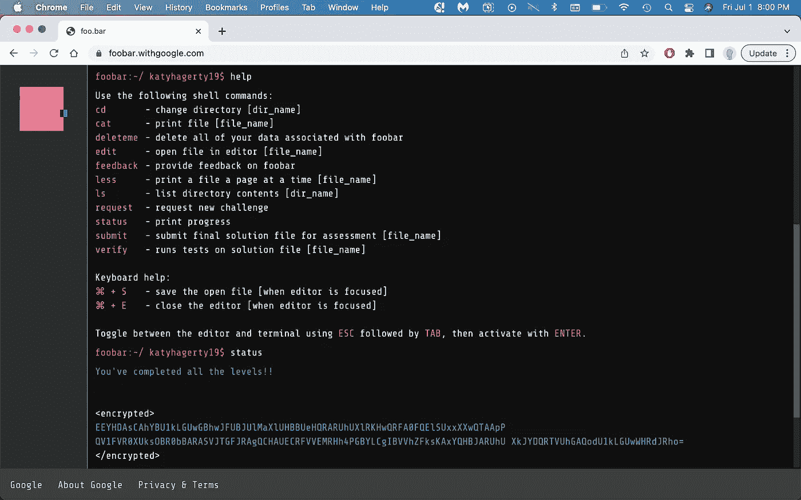

# 谷歌足球挑战赛:第一关

> 原文：<https://towardsdatascience.com/google-foobar-challenge-level-1-3487bb252780>

## 对秘密编码挑战和问题分解的介绍

照片由[米切尔罗](https://unsplash.com/@mitchel3uo?utm_source=medium&utm_medium=referral)在 [Unsplash](https://unsplash.com?utm_source=medium&utm_medium=referral)

# 什么是 Foobar 挑战？🧐

Foobar Challenge 是 Google 主办的一项编码挑战，可以用 Python 或 Java 完成。我用 Python 完成了挑战。挑战赛有自己的服务器，提供特定的终端式命令。

图片作者。

为了增加一些乐趣，它以太空为主题。邪恶的指挥官拉姆达绑架了太空兔子，你必须救出他们。每个问题都增加了背景故事的内容。这些问题有不同的难度，分为 5 个级别。每个问题都必须在一定的时间内解决。更多的时间是给更高的水平。

我个人发现 1、2、3 级题和 Leetcode 题差不多，无论是难度还是结构。问题很简单，很少需要优化代码来提高速度。另一方面，第 4 级和第 5 级更复杂，将多个概念整合成一个问题。

# 如何参加 Foobar 挑战赛？🙋‍♀️

有两种方式参与挑战:

1.  谷歌通过浏览器发出邀请。
2.  一位朋友向您发送了一个邀请码

我通过第一种方法遇到了挑战。我在谷歌上搜索“列表理解”寻找另一篇文章，我的浏览器打开了，显示出邀请。我以前从未听说过 Foobar 挑战，所以有点谨慎。在确认这是一个合法的挑战后，我接受了。

不用说，惊喜的元素激起了我对挑战的兴趣。更不用说，谷歌向我发出独家邀请，无疑给了我作为开发人员的信心。我把这看作是对冒险的召唤，并立即想把我所有的注意力都投入进去。

第二种方法，需要朋友给你发邀请码。完成第 2 级后，将获得一个邀请码。另一个是在完成四级后给出的。

**如果你有兴趣参加挑战，请告诉我**。我有一个未使用的推荐代码。

# 谷歌会用挑战来招聘员工吗？🤑

谷歌一度利用这一挑战来寻找新的人才。你会在网上找到很多人，他们在完成挑战后的一两天就让谷歌的招聘人员联系他们。然而，自 2020 年以来，谷歌似乎没有在招聘中使用这项挑战。

完成第 3 级后，Foobar 服务器会询问你是否愿意向 Google 招聘人员提供你的联系信息。我提供了我的信息，但是没有他们的消息。

尽管如此，我仍然相信这个挑战是值得的。它将让你接触到新的编码概念，提高你的技能，并最终使你成为一名更好的开发人员。

# 注意事项和其他提示💡

Google 提供了一个`constraints.txt`文件，但是它不是很详细。例如，它声明除了列出的几个例外，所有标准库都是允许的。然而，`math`和`numpy`是不允许的，即使它们是公共库。为了测试哪些库是允许的，我导入了这个库，返回了其中一个测试用例的答案，然后验证了这个解决方案。如果解决方案通过了一个测试用例，那么这个库是可以接受的。

此外，在验证代码之前，注释掉所有的 print 语句。任何打印语句都会导致测试用例失败。

输入和输出类型是非常特殊的挑战。如果问题陈述要求特定的输入或输出类型，请确保提供正确的类型。

最后，在这次挑战之前，我没有任何使用 Python 2.7 的经验。事实上，我在 Python 3 中测试了我的许多低级问题的解决方案。后来在挑战中这让我吃了一惊。具体来说，我不知道在 Python 2.7.13 中，如果输入是整数，`/`运算符会执行整数除法。举个例子，

然而，在 Python 3 中，`/`执行浮点除法。

# 问题和概念📚

## 警告——⛔️前方剧透

下面，我将问题分解，解释我的思考过程。我也提供解决方案。不过， ***我强烈推荐你先尝试一下问题*** 。挑战最好的部分是解决一个难以捉摸的问题的惊喜和满足感。

我考虑过不发布解决方案，只解释基本概念。然而，编码的一部分是学习如何排除故障，并确定代码失败的地方。因此，我决定发布解决方案，这样如果你陷入困境，你就可以准确地看到你的逻辑分歧在哪里。

## 第一级:问题 1 ⭐️

> 我爱 Lance & Janice
> = = = = = = = = = = = = = = = = = = = = =
> 
> 你已经抓到你的两个同伴在来回传递密码纸条——当他们在值班的时候！更糟糕的是，你很确定这与工作无关——他们都是太空肥皂剧《兰斯与珍妮丝》的超级粉丝。你知道 Lambda 指挥官有多讨厌浪费，所以如果你能证明这些奴才在浪费她的时间传递与工作无关的纸条，你就离升职更近了一步。
> 
> 幸运的是，奴才们并不完全是高级的密码学家。在他们的代码中，每个小写字母[a..z]被替换为[z]中相应的一个..a]，而其他所有字符(包括大写字母和标点符号)保持不变。也就是，' a '变成了' z '，' b '变成了' y '，' c '变成了' x '等等。例如，单词“vmxibkgrlm”在解码时会变成“encryption”。
> 
> 编写一个名为 solution(s)的函数，它接收一个字符串并返回解密后的字符串，这样您就可以向指挥官证明这些奴才在谈论“Lance & Janice”，而不是在做他们的工作。
> 
> 语言
> ========
> 
> 要提供 Python 解决方案，请编辑 solution.py
> 要提供 Java 解决方案，请编辑 solution.java
> 
> 测试用例
> =========
> 
> 输入:
> (string)s = " wrw blf hvv ozhg mrtsg ' h vkrhlwv？"
> 输出:
> (string)“昨晚那集你看了吗？”
> 
> 输入:
> (string) s = "Yvzs！我是 yvor vev Lzmxv olhg srh qly ZG gsv xlolmb！!"
> 输出:
> (字符串)“耶！我不敢相信兰斯丢了他在殖民地的工作！!"
> 
> 使用 verify [file]测试您的解决方案，看看效果如何。编辑完代码后，使用 submit [file]提交您的答案。如果您的解决方案通过了测试用例，它将从您的主文件夹中删除。

巧合的是，我最近开发了一个移位密码的应用程序，这个问题立刻提醒了我。点击此处了解更多关于移位密码的信息:

 [## 数据流中的移位密码

### 如何快速构建和部署用 Python 编写的可共享 web 应用程序

towardsdatascience.com](/shift-cipher-in-streamlit-525225667237) 

只有小写字符需要被破译。其他字符保持不变。首先，创建一个字典来存储编码的字符和它们被解码的对应字符。接下来，使用 for 循环遍历输入字符串中的每个字符。如果字符是小写的，从字典中取出它的解码值。如果没有，将该字符添加到答案字符串中。

在我看来，这个问题旨在测试参与者对`str`和`dict`数据类型及其内置方法的了解。

# 结论📌

我计划在以后的文章中继续描述我的 Foobar 之旅，并详细说明我是如何解决这些问题的。关注我，阅读更多关于挑战的信息。此外，欢迎所有反馈。我总是渴望学习新的或更好的做事方法。请随时留下您的评论或联系我 katyhagerty19@gmail.com。

 [## 加入我的介绍链接媒体-凯蒂哈格蒂

### 阅读凯蒂·哈格蒂(以及媒体上成千上万的其他作家)的每一个故事。您的会员费直接支持…

medium.com](https://medium.com/@katyhagerty19/membership)