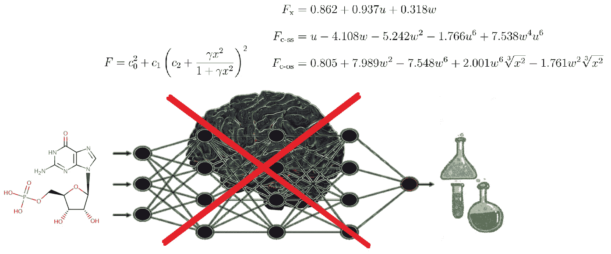

# 谷歌提出新方法来推导量子力学计算中术语的解析表达式

> 原文：<https://towardsdatascience.com/google-proposes-new-method-to-derive-analytical-expressions-for-terms-in-quantum-mechanics-d70fff6e1ef2>

## 符号回归的现实应用

## 新方法以符号形式导出精确的泛函(量子力学计算的元素)，因此人类可以理解，计算成本低廉，并且易于集成到现有的量子力学计算软件中。

巨头 Alphabet 通过 Google Research 和 Deepmind 等渠道对科学的 ML 应用进行了大量投资，这已经不是什么新闻了。虽然在化学和生物学领域, [AlphaFold](https://medium.com/@lucianosphere/guide-to-my-blog-articles-on-alphafold-39c10a7dad7f) 是其迄今为止最著名的项目，但 Deepmind 也进入了量子力学(QM)计算领域([我在这里的博客条目](/deepmind-strikes-back-now-tackling-quantum-mechanical-calculations-e1cae792e5d0))，谷歌研究也是如此。

QM 计算在化学中非常重要，因为它们提供了关于分子和材料中电子密度、分布和自旋状态的最高水平的细节，所有这些都是建模、理解和预测其化学反应性和物理化学性质所需的关键元素-其中没有一个是经典方法所能达到的。我在这里评论的新工作来自 Google Research，也提出了改进 QM 计算的方法。特别地，马等人发展了一种新的方法来推导 DFT 泛函的符号解析形式。

## 这都是什么？

从本质上讲，量子力学计算试图从第一原理，从电子的分布、状态和能量来描述分子和材料的电子性质。为此，QM 本质上需要求解相互作用电子的多体薛定谔方程。

今天，最广泛使用的方法进行量子力学计算是密度泛函理论(DFT)。DFT 要求模块以某种方式处理多个电子如何相互作用，这是通过特定的交换相关(XC)项实现的。这些术语在理论上应该是精确的，但在实践中却不是。因此，在大多数应用中，它们是以数值方式近似的，例如拟合参数的分析方程、根据数据训练的神经网络等。利用分子或材料属性的数据集。

大多数可用的 XC 泛函存在于包含少量拟合参数的方程中，其运行速度很快，但以结果质量为代价，或者存在于具有大量参数的复杂表达式中，甚至存在于黑盒神经网络中，其产生更精确的结果，但以计算速度和可解释性为代价。最重要的是，神经网络和其他不基于解析形式的 XC 项很难集成到 DFT 计算的软件包中。

马等人的工作兼顾了两个世界的优点:它使用基于符号回归的 ML 方法来建立解析方程，该解析方程表示基于初等数学指令的泛函和其他更小的、已经存在的泛函。该算法从一小群简单的参数、项和最终的小的现有泛函开始，创建一群候选解，并对它们进行世代进化，以得出将所有这些成分放在一起成为符号表达式的方程，该符号表达式再现用于训练的数据集。

由这种新方法产生的 XC 泛函的符号表示看起来就像 QM 软件中使用的常规 XC 泛函，因此它们集成到软件包中是简单的。

这种新方法不使用复杂的类似黑盒的神经网络，而是开发出计算 XC 项的显式解析公式。推导出的方程可以直接整合到质量管理程序中，它们的表现和现有的替代方案一样好，甚至更好，而且由于它们的形式简单，它们是人类可以理解的。由作家卢西亚诺·阿布利亚塔创作的人物。

## 应用程序

马等人将该过程命名为“符号泛函进化搜索”，因为它是这样做的:它进化出描述泛函的符号表达式，并在方程形式和参数的空间中搜索，以优化训练数据的再现效果。

作为第一个应用，作者证明了他们的方法可以从零开始重新发现简单的现有泛函，并且可以进一步获得从更简单的泛函发展而来的新的、更精确的泛函，但是保留了符号回归所允许的简单性。

然后，他们应用他们的方法开发了一个新的泛函，他们称之为“Google Accelerated Science 22”(gas 22)，它比最好的替代方案表现更好，表现出良好的数值稳定性，并可以无缝集成到现有的 QM 软件中。最重要的是，鉴于 GAS22 的简单性，它适用于通常应用于泛函的所有解释方法，以理解它们的工作原理和局限性。

性能更好的泛函对于提高质量管理计算的质量至关重要；而更快的执行允许访问更大的系统，即处理生物系统和材料碎片通常需要更大数量的原子。这种新方法以及谷歌研究的这一分支(当然还有学术界以及其他规模较小但成熟的公司)正在进行的其他发展，对于科学家花更少时间和金钱做实验的未来非常重要，因为他们可以更快更准确地预测他们的结果。

# 相关阅读

arXiv 中的预印本:

 [## 进化符号密度泛函

### 对科学家来说，精确密度泛函的系统发展已经是几十年的挑战。尽管…

arxiv.org](https://arxiv.org/abs/2203.02540) 

**更新:预印本在*科学进展* :** 通过同行评审

【https://www.science.org/doi/10.1126/sciadv.abq0279】T5[T6](https://www.science.org/doi/10.1126/sciadv.abq0279)

Deepmind 的相关工作:

 [## DeepMind 反击了，现在正在处理量子力学计算

### 这家与谷歌有关联的公司开发了一个新的框架，用高度精确的电子密度来训练神经网络…

towardsdatascience.com](/deepmind-strikes-back-now-tackling-quantum-mechanical-calculations-e1cae792e5d0) 

符号回归在科学中的其他应用示例:

 [## 符号回归的现实应用

### 不像常规神经网络那样是一个黑箱，它提供的模型不仅能预测数据，还能使数据合理化…

towardsdatascience.com](/real-world-applications-of-symbolic-regression-2025d17b88ef) 

[***www.lucianoabriata.com***](https://www.lucianoabriata.com/)*我写作并拍摄我广泛兴趣范围内的一切事物:自然、科学、技术、编程等等。* [***成为媒介会员***](https://lucianosphere.medium.com/membership) *访问其所有故事(我免费获得小收入的平台的附属链接)和* [***订阅通过电子邮件*** *获取我的新故事*](https://lucianosphere.medium.com/subscribe) ***。到* ***咨询关于小职位*** *查看我的* [***服务页面这里***](https://lucianoabriata.altervista.org/services/index.html) *。你可以在这里* [***联系我***](https://lucianoabriata.altervista.org/office/contact.html) ***。*****