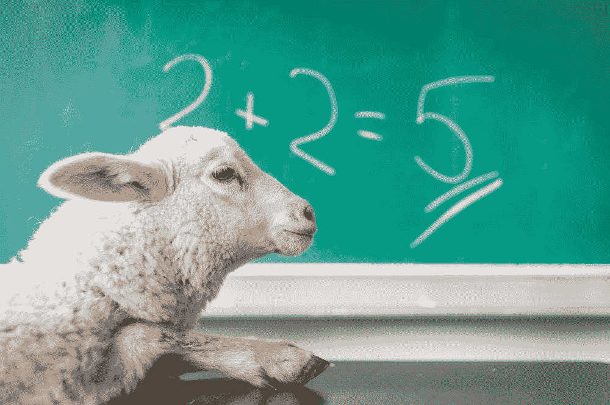
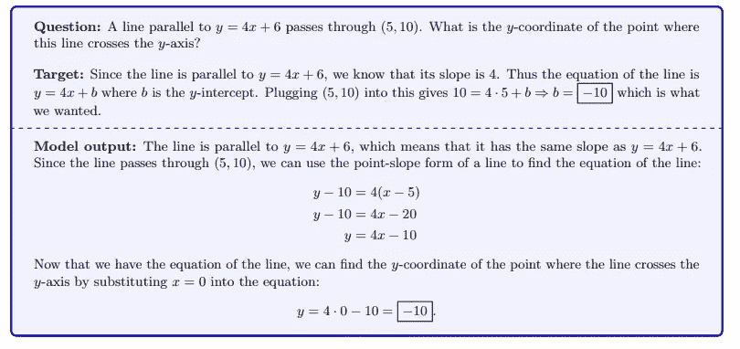
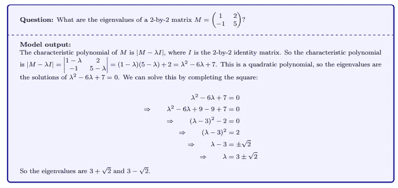
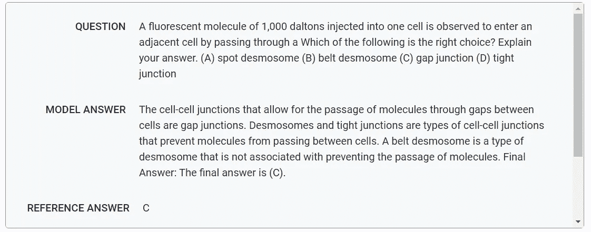
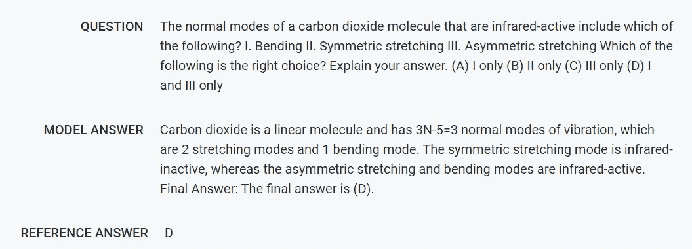
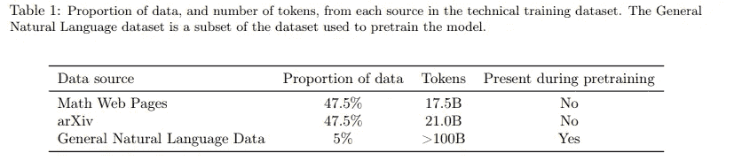
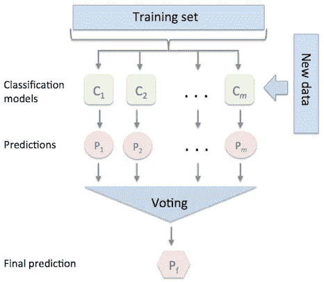
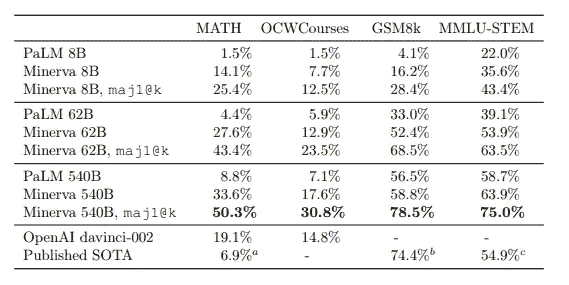
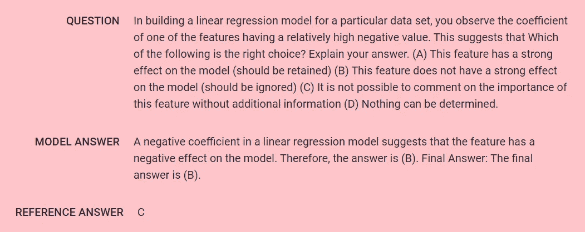

# 谷歌的 Minerva，用 AI 解决数学问题

> 原文：<https://towardsdatascience.com/googles-minerva-solving-math-problems-with-ai-4f0a6aaabaf1>

## 定量推理对人类来说很难，对计算机来说也很难。谷歌的新模型在解决数学问题上取得了惊人的成果。

来自 unsplash.com[的](https://unsplash.com/photos/4ApmfdVo32Q)[迈克尔·马特隆](https://unsplash.com/@michalmatlon)的图片

我们现在已经习惯了[语言模型](https://en.wikipedia.org/wiki/Language_model)，比如 [GPT-3](https://openai.com/api/) ，但是一般来说，它们的输出是文本的。[定量推理](https://study.com/learn/lesson/what-is-quantitative-reasoning.html)很难(我们很多人从大学到现在还在做微积分的噩梦)。对语言模型来说也很难，它们的表现远远没有达到人类的水平。解决数学或科学问题需要不同的技能，正如他们在[博客文章](https://ai.googleblog.com/2022/06/minerva-solving-quantitative-reasoning.html)中所说:

> 使用自然语言和数学符号正确解析一个问题，回忆相关的公式和常数，并生成涉及数值计算和符号操作的分步解决方案。

克服这些挑战是困难的，因此[预测模型将在 2025 年在数学数据集(包含 12，000 个高中数学问题的数据集)上达到最先进的精确度](https://bounded-regret.ghost.io/ai-forecasting/)。我们提前了三年，谷歌人工智能研究宣布了 Minerva。

在他们的[文章](https://arxiv.org/abs/2206.14858)中，他们提出了一个模型，该模型在解决不同学科(如代数、概率、物理、数论、几何、生物、天文、化学、机器学习等等)的问题时，取得了令人难以置信的结果。他们写道:

> Minerva 通过生成包括数值计算和符号操作的解决方案来解决这些问题，而不依赖于计算器等外部工具。

这里有一个代数的例子，Minerva 输入一个问题，并给出解决方案。请注意，该模型能够通过简化和替换变量来求解方程。

代数中一个问题的例子和 Minerva 模型提供的答案。图片来源:[原文章](https://arxiv.org/pdf/2206.14858.pdf)

您也可以在交互式样本浏览器中查看[，以查看来自其他 STEM 学科的其他问题示例。在这里，我只粘贴几个例子来展示它有多先进:](https://minerva-demo.github.io/#category=Algebra&index=1)

线性代数中一个问题的例子和 Minerva 模型提供的答案。图片来源:[原文](https://arxiv.org/pdf/2206.14858.pdf)

或者在生物学中:

生物学中一个问题的例子和 Minerva 模型提供的答案。图像取自[交互式样品浏览器](https://minerva-demo.github.io/#category=Algebra&index=1)

化学:

化学中一个问题的例子和 Minerva 模型提供的答案。图像取自[交互式样品浏览器](https://minerva-demo.github.io/#category=Algebra&index=1)。

或者机器学习:

机器学习中一个问题的例子和 Minerva 模型提供的答案。图像取自[交互式样品浏览器](https://minerva-demo.github.io/#category=Algebra&index=1)

Minerva 基于 [Pathways 语言模型](https://ai.googleblog.com/2022/04/pathways-language-model-palm-scaling-to.html) (PaLM)，该语言模型已经通过来自 arXiv 的 118 科学论文(在数学表达式中相当密集)进行了进一步训练。2022 年 4 月发布的 PaLM 模型是一个 5400 亿参数的语言模型，能够跨不同的领域和任务进行归纳。博文解释了培训的一个重要段落:

> 标准文本清理过程通常会删除对数学表达式的语义意义至关重要的符号和格式。通过在训练数据中维护这些信息，模型学习使用标准数学符号进行转换。

换句话说，需要一种不同的文本预处理方法来训练模型。

用于培训的数据集。图片来源:[原文章](https://arxiv.org/pdf/2206.14858.pdf)

有趣的是，Minerva 不仅生成了一个解决方案，还生成了不同的解决方案(虽然步骤不同，但正如他们所写的，总的来说，他们会得到相同的最终答案)。不同的解决方案分配了不同的概率，然后选择最常见的答案作为解决方案([多数投票](https://arxiv.org/abs/2203.11171)，这在 PaLM 中被证明是一个成功的策略)。

多数表决过程的说明，这是不同模型的基础。在 Minerva 案例中，模型为每个问题生成多个解决方案，并选择最常见的答案作为解决方案。图片来源:[此处](http://rasbt.github.io/mlxtend/user_guide/classifier/EnsembleVoteClassifier/)

然后，他们在不同的基准数据集上评估他们的方法。他们使用了 MATH(高中数学竞赛水平题)，但也使用了更复杂的数据集，如 OCWCourses(由[麻省理工学院开放课件](https://ocw.mit.edu/)收集的大学和研究生问题的集合)。在所有这些情况下，他们都达到了最先进的结果:

Minerva 在不同的定量推理基准数据集上展示了最先进的结果。摘自[原文](https://arxiv.org/pdf/2206.14858.pdf)

这些结果令人印象深刻，然而，该模型仍远非如所述的那样完美:

> 密涅瓦仍然犯了不少错误。

在文章中，他们指出了这些错误的原因:

> 大约一半是计算错误，另一半是推理错误，其中求解步骤没有遵循逻辑思维链。

至于人类学生，也有可能模型可以得出正确的最终答案，但使用了错误的推理(在论文中被定义为“假阳性”)。但据他们观察，这些情况不太常见(讽刺的是，人类学生也是如此):

> 在我们的分析中，我们发现假阳性率相对较低(Minerva 62B 在数学上产生的假阳性不到 8%)。

他们还注意到，当问题更困难时，假阳性更常见(从 1 到 5，当模型遇到难度为 5 的问题时，假阳性率更高)。

在文章中，他们将此描述为一种限制，因为当模型预测正确答案但使用错误推理时，不可能自动识别情况。

以下是一个错误示例:

机器学习中一个问题的例子和 Minerva 模型提供的答案。在这种情况下，模型提供了一个错误的答案。图像取自[交互式样品浏览器](https://minerva-demo.github.io/#category=Algebra&index=1)

有时错误在于模型误解了问题，或者使用了不正确的事实来回答。另一种错误是答案太短(没有推理就直接不正确，我们可以把这比作学生在不知道答案的情况下试图猜测答案)。在某些情况下，当模型生成不真实的事实或方程时，模型会产生他们所谓的“幻觉数学对象”。然而，这些情况是罕见的，普遍的错误是不正确的推理和不正确的计算。

在论文中，研究人员还讨论了他们模型的潜在社会影响。正如他们所认识到的，影响可能是巨大的:

> 能够在一般情况下解决定量推理问题的人工神经网络具有潜在的重大社会影响

然而，目前有两个主要限制因素正在降低潜在影响:

> Minerva 虽然朝着这个方向迈出了一步，但仍远未实现这一目标，因此其潜在的社会影响有限。该模型的性能仍然远低于人类的性能，此外，我们没有一个自动的方法来验证其输出的正确性。

根据研究人员的未来，这些模型可以帮助教师减少教育不平等。然而，计算器和电脑并没有减少教育不平等，反而加大了这些资源容易获得的国家与教育资金不足的国家之间的差距。在任何情况下，它都代表了对许多领域有用的强大工具的第一步。例如，研究人员会发现，作为一种帮助他们工作的工具是非常有益的。

# 如果你觉得有趣:

你可以寻找我的其他文章，你也可以 [**订阅**](https://salvatore-raieli.medium.com/subscribe) 在我发表文章时得到通知，你也可以在**[**LinkedIn**](https://www.linkedin.com/in/salvatore-raieli/)**上连接或联系我。**感谢您的支持！**

**这里是我的 Github 资源库的链接，我计划在那里收集代码，以及许多与机器学习、人工智能等相关的资源。**

** **