# 谷歌的巴利文:100 种语言的语言图像学习

> 原文：<https://towardsdatascience.com/googles-pali-language-image-learning-in-100-languages-31d32f9b74fe>

## 令人印象深刻的新型号，能够在复杂任务中达到最先进水平

unsplash.com[的](https://unsplash.com/)[格兰特·里奇](https://unsplash.com/@grantritchie)的图片

近年来的趋势是增加神经网络的容量。一方面，越来越多的参数的不同模型被公布，另一方面，用于训练的数据量增加。无论输入和任务是文本的还是视觉的，这种观点都是普遍的。

关于文本模型，增加的容量显示了改进的性能和有趣的涌现行为: [GPT](https://arxiv.org/abs/2005.14165) 、 [GLaM](https://ai.googleblog.com/2021/12/more-efficient-in-context-learning-with.html) 、 [PaLM](https://ai.googleblog.com/2022/04/pathways-language-model-palm-scaling-to.html) 、 [T5](https://ai.googleblog.com/2020/02/exploring-transfer-learning-with-t5.html) 等等。而对于图像，在卷积神经网络主导该领域之前，近年来的趋势一直是[视觉变压器](https://arxiv.org/abs/2010.11929)。

在所有两个领域(文本和视觉)中的类似进展已经允许在这两个领域的交叉点上打开一个新的领域:[视觉语言模型](https://lilianweng.github.io/posts/2022-06-09-vlm)。

**什么是视觉语言模型？**将图像和文本都视为输入的模型可用于各种任务。今年，我们惊讶于 DALL-E 或 T21 这样的模型是如何从文字描述中创造出详细的图像的。另一方面，这只是视觉语言模型可以解决的任务之一:

*   **可视字幕(VC)** :生成可视输入(图像、视频)的描述。该模型分析图像并提供表示该图像的文本描述。
*   **视觉问题回答(VQA)** :为视觉输入提供答案。
*   **视觉常识推理(VCR)** :从视觉输入中推断常识信息和认知理解。
*   **视觉生成(VG)** :从文本输入(提示)生成视觉输出。
*   **上下文光学字符识别(OCR)** : OCR 是将包含文本(打印、手写或印刷)的图像转换成计算机可以理解的文本输出。
*   **物体识别**

此外，许多模型仅使用英语进行训练，但是有数千种语言([估计有 7000 种语言](https://en.wikipedia.org/wiki/Language))并且重要的是其他语言被表示和包括在内。

本周展示了一个语言视觉模型，可以用 100 种语言执行任务。

总的模型参数是 170 亿(语言模型计数为 13 B，视觉组件为 4)。该模型由一个处理文本的[变压器](https://proceedings.neurips.cc/paper/2017/file/3f5ee243547dee91fbd053c1c4a845aa-Paper.pdf)编码器和一个生成测试输出的 n 自回归变压器解码器组成。图像输入由连接到编码器的[视觉转换器(Vit)](https://arxiv.org/abs/2010.11929) 处理。有趣的是，这些组件取自早期型号:

> PaLI 模型的一个关键组成部分是重用，其中我们用来自先前训练的单模态视觉和语言模型的权重来播种模型，例如 [mT5-XXL](https://arxiv.org/abs/2010.11934) 和大 [ViTs](https://ai.googleblog.com/2020/12/transformers-for-image-recognition-at.html) 。这种重用不仅能够转移单模态训练的能力，而且还节省了计算成本。— [谷歌人工智能](https://ai.googleblog.com/2022/09/pali-scaling-language-image-learning-in.html)

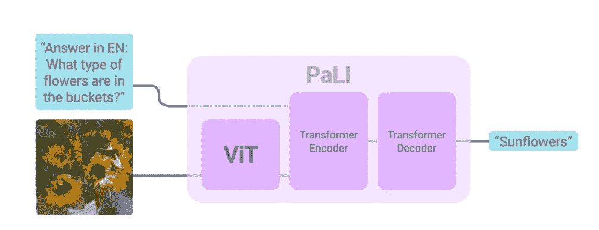

模型建筑。图片来源:[原文](https://arxiv.org/pdf/2209.06794.pdf)

事实上，作者创建了三个不同的模型，它们的参数越来越多，但架构相似(最终的模型容量最大)

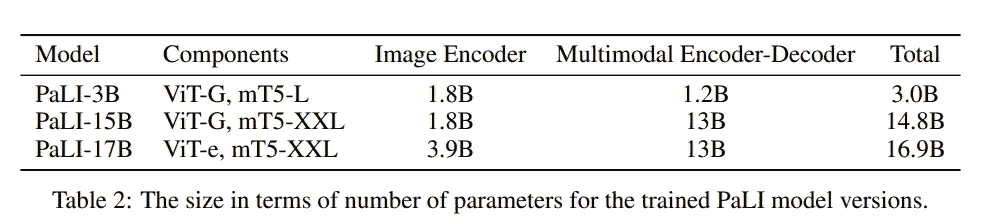

图片来源:[原文](https://arxiv.org/pdf/2209.06794.pdf)

作者专门为这个模型构建了一个数据集: WebLI。该数据集是通过从网上收集图像和文本构建的(它们不限于英语，而是收集了 109 种语言的数据)。他们因此收集了 120 亿张图像和 120 亿条[替代文本](https://en.wikipedia.org/wiki/Alt_attribute)(描述图像的文本)。他们还使用 GCP 视觉 API 提取了图像中的文本(OCR 注释)，产生了 290 亿个图像-OCR 对。最终，只有 10 亿张图像被用于训练。

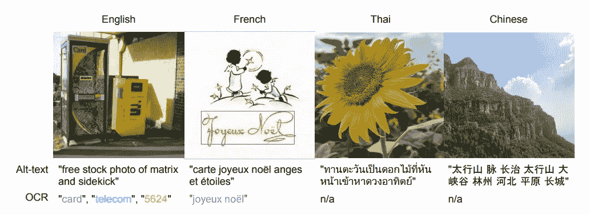

“与多语言替代文本(可用)和光学字符识别(使用 GCP 视觉 API5 计算)相关的样本图像 4”。图片来源:[原创文章](https://arxiv.org/pdf/2209.06794.pdf)

WebLI 中 alt-text 和 OCR 识别语言的统计。图片来源:[原创文章](https://arxiv.org/pdf/2209.06794.pdf)

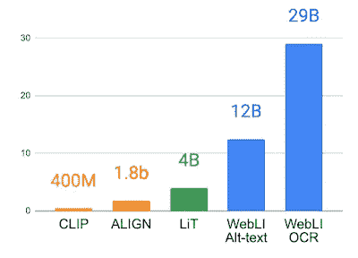

WebLI 等大规模视觉语言数据集的图文对计数、 [CLIP](https://openai.com/blog/clip/) 、 [ALIGN](https://arxiv.org/abs/2102.05918) 和 [LiT](https://arxiv.org/abs/2111.07991) 。图片来源:[原文](https://arxiv.org/pdf/2209.06794.pdf)

> 视觉语言任务需要不同的能力，有时会有不同的目标。一些任务本质上需要对象的本地化来精确地解决任务，而另一些任务可能需要更全局的视图。类似地，不同的任务可能需要长的或紧凑的答案。— [谷歌人工智能](https://ai.googleblog.com/2022/09/pali-scaling-language-image-learning-in.html)

正是因为这个原因，他们开发了一种特殊的训练策略，目的是每次为模型提供一个输入(图像+文本)并接收一个输出(文本)。事实上，该模型伴随着一系列预训练任务(仅文本损坏、本地和翻译的替代文本数据上的字幕、分割字幕等)，但仍保持相同的系统(输入:图像+文本；输出:文本)。因此，允许以相同的方式训练模型，同时仍然保持模型能够概括和能够执行其他任务。

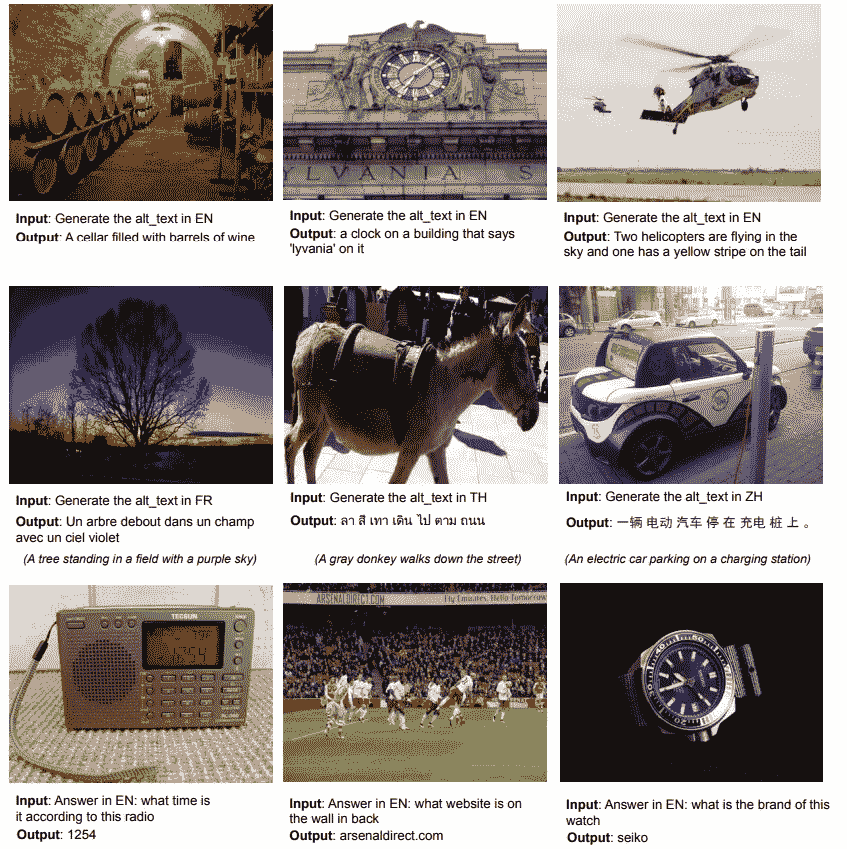

training.image 来源:[原文](https://arxiv.org/pdf/2209.06794.pdf)

> 模型在 [JAX](https://github.com/google/jax) 与[亚麻](https://github.com/google/flax)使用开源的 [T5X](https://github.com/google-research/t5x) 和 [Flaxformer](https://github.com/google/flaxformer) 框架进行训练。对于视觉组件，我们使用开源的 [BigVision](https://github.com/google-research/big_vision) 框架引入并训练了一个大型 [ViT](https://arxiv.org/abs/2010.11929) 架构，名为 ViT-e，具有 4B 参数。

一旦模型被训练，作者将它与其他最先进的方法(包括 [SimVLM](https://arxiv.org/abs/2108.10904) 、 [CoCa](https://arxiv.org/abs/2205.01917) 、 [GIT2](https://arxiv.org/pdf/2205.14100.pdf) 、 [Flamingo](https://www.deepmind.com/blog/tackling-multiple-tasks-with-a-single-visual-language-model) 、 [BEiT3](https://arxiv.org/abs/2208.10442) )进行比较，以完成多种视觉和语言任务:

*   **图像字幕。作者在三个数据集上测试了该模型的能力:COCO(标准基准)、NoCaps(类似于 COCO，但目标有更多的视觉概念)和 TextCaps(图像包含文本)。此外，他们使用了另一个数据集 XM-3600(与其他三个不同，它是多语言的)**

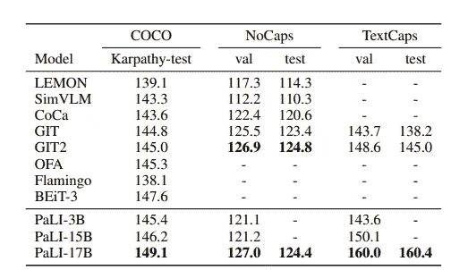

纯英文基准数据集上的图像字幕结果。图片来源:[原文](https://arxiv.org/pdf/2209.06794.pdf)

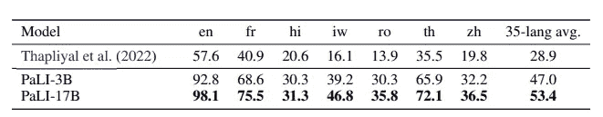

多语言数据集上的图像字幕结果(此处显示:英语、法语、印地语、希伯来语、罗马尼亚语、泰语和中文以及 35 种语言的平均值)。图片来源:[原文](https://arxiv.org/pdf/2209.06794.pdf)

*   **视觉问答**。正如作者指出的，这是一项艰巨的任务，因为答案必须完全匹配才能被认为是准确的，而巴利文的词汇有 100 种语言。尽管如此，他们在几个数据集上取得了非常好的结果:VQAv2、OKVQA(其中需要外部知识来回答它的问题，因为所有知识都不存在于输入图像中，必须进行推断)，TextVQA & VizWiz-QA(模型必须使用图像中存在的文本来回答)。他们还使用了跨语言和多语言数据集(xGQA 和 MaXM)。

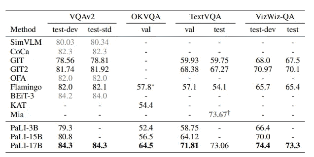

英语数据集上的可视化问答结果。图片来源:[原创文章](https://arxiv.org/pdf/2209.06794.pdf)

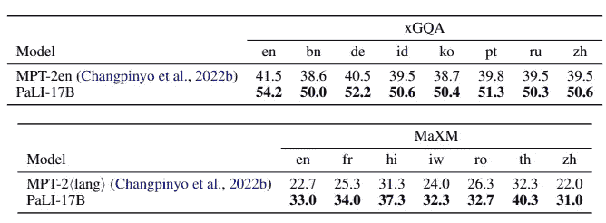

跨语言和多语言数据集的可视化问答。图片来源:[原创文章](https://arxiv.org/pdf/2209.06794.pdf)

*   语言理解能力。作者想知道模型一旦被训练用于多模态任务(图像+文本)是否会忘记它的语言建模能力。他们在英语和几种语言的数据集上测试了这些功能。该模型，尽管培训设置有利于多模态，保持了高水平的英语语言理解能力。

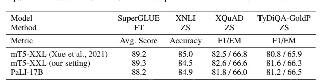

语言理解能力的结果。图片来源:[原创文章](https://arxiv.org/pdf/2209.06794.pdf)

*   零镜头图像分类。在这种情况下，作者没有通过在原始模型上添加分类器来修改模型。相反，他们调整了数据集。该模型显示了良好的性能，但仍低于最先进水平

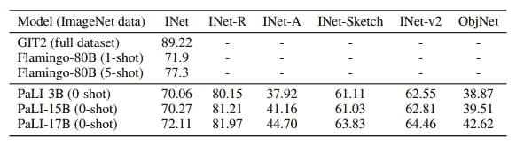

图片来源:[原文](https://arxiv.org/pdf/2209.06794.pdf)

虽然结果令人惊讶，但模型并不完美，**也有一些局限性**:

*   该模型不能描述有许多对象的情况，因为训练数据集无论如何都没有复杂的注释。
*   当模型针对纯英语数据进行微调时，会丢失一些多语言功能。
*   正如作者所言，这种评估存在固有的局限性:“模型可能会生成一个正确的响应，它是目标响应的同义词或释义，并且与目标不完全匹配。”

此外，他们试图减少潜在的偏差，并在文章的附录中提供了所用模型和数据集的详细表格([模型](https://modelcards.withgoogle.com/about)和[数据卡](https://arxiv.org/abs/2204.01075))。尽管正如作者在文章中指出的:

> 大型模型可能会产生更广泛的社会影响。虽然这些模型在公共基准上表现强劲，但它们可能包含未知的偏见或成见，或者传播不准确或扭曲的信息。虽然我们已经努力衡量其中的一些问题，但在用于特定目的之前，需要对这些模型进行仔细的重新评估。

**结论**

PaLI 表明，它在几项迄今为止被认为具有挑战性的任务中达到了最先进的水平。而且，不仅仅是英语，还有几种语言。

虽然它已经达到了最先进的水平，但很可能更多的视觉语言模型将很快发布(希望是开源的)。它还展示了一些趋势:

*   性能更高但不一定能力更强的型号(它比 [Flamingo](https://www.deepmind.com/blog/tackling-multiple-tasks-with-a-single-visual-language-model) 更好，但只有 18 个 B 对 80 个 B 参数)
*   除了英语之外，还接受多种语言训练的模特(如[梅塔的 NLLB](https://pub.towardsai.net/no-language-left-behind-579afea29e52) 或[布鲁姆](https://pub.towardsai.net/a-new-bloom-in-ai-why-the-bloom-model-can-be-a-gamechanger-380a15b1fba7))
*   这种情况下是多模态、图像和文本，但也有视频、音乐等…
*   专注于避免偏见

# 如果你觉得有趣:

你可以寻找我的其他文章，你也可以 [**订阅**](https://salvatore-raieli.medium.com/subscribe) 在我发表文章时得到通知，你也可以在**[**LinkedIn**](https://www.linkedin.com/in/salvatore-raieli/)**上连接或联系我。感谢您的支持！****

**这是我的 GitHub 知识库的链接，我计划在这里收集代码和许多与机器学习、人工智能等相关的资源。**

**<https://github.com/SalvatoreRa/tutorial>  

或者随意查看我在 Medium 上的其他文章:

</a-critical-analysis-of-your-dataset-2b388e7ca01e>  </machine-learning-to-tackle-climate-change-7911e004c3a2>  </speaking-the-language-of-life-how-alphafold2-and-co-are-changing-biology-97cff7496221>  </how-science-contribution-has-become-a-toxic-environment-6beb382cebcd> **