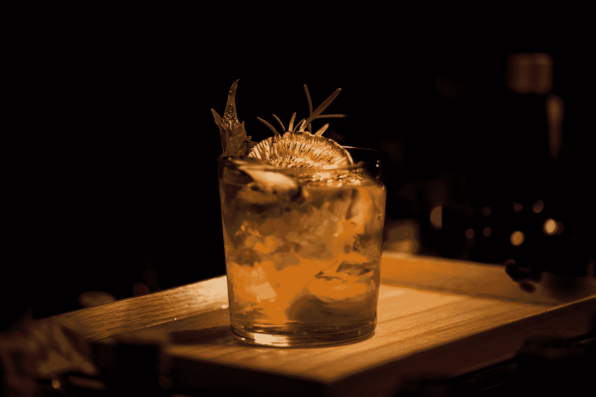

# GPT-3 生成的鸡尾酒配方

> 原文：<https://towardsdatascience.com/gpt-3-generated-cocktail-recipes-214512f2e78e>

## 如何创建自己的人工智能调酒师

我最近玩了 GPT-3，虽然它不是什么新东西，但我仍然无法表达它有多酷。对于那些从未尝试过 GPT-3 的人来说，我希望这个故事将展示开始使用它是多么容易。

GPT-3 的主要特点是它由 OpenAI 托管，所以你不需要在你的硬件上运行 model。这个事实有它自己的优点和缺点。一方面——它使得使用 GPT-3 变得非常简单，你只需要使用它的 API，非常简单，并且提供了 Python 和 JavaScript 的库。另一方面，这意味着它完全由 OpenAI 控制，你无法接触到它的内部。

但是我们才刚刚开始——我们还不需要内部设备，所以让我们只关注 GPT-3 的使用有多简单。

在浏览[快速入门指南](https://beta.openai.com/docs/quickstart)时，人们很容易对最初的[生成宠物名字的示例应用](https://github.com/openai/openai-quickstart-python)感到厌倦。真实的任务对我来说总是比编造的例子更有效。也许给宠物起名字很有趣，但我不能说这个示例应用程序将解决任何实际问题或增加实际价值——不能说我经常给宠物起名字。

因此，我修改了最初的示例应用程序([昵称生成器](https://github.com/openai/openai-quickstart-python))来根据名字生成鸡尾酒配方。你只需输入一种真实或想象的鸡尾酒的名字，GPT-3 就会为你生成配方。这给了我太多的乐趣！

照片由 [Ash Edmonds](https://unsplash.com/@badashproducts?utm_source=medium&utm_medium=referral) 在 [Unsplash](https://unsplash.com?utm_source=medium&utm_medium=referral) 上拍摄

首先，我尝试了真正的鸡尾酒。这是尼格罗尼给我的启示:

> 1 盎司杜松子酒，1 盎司甜苦艾酒，1 盎司金巴利，冰，橘子皮。在加满冰块的摇壶里混合杜松子酒、甜苦艾酒和金巴利酒。搅拌至完全冷却，滤入加满冰块的岩石杯。用橘子皮装饰。

好，看起来像一个真正的尼格罗尼！这并不出乎意料，因为 GPT 3 号在训练中确实学到了很多真正的鸡尾酒配方。可能如果准备一个聚会，我应该使用谷歌真正的鸡尾酒配方，而不是人工智能，但仍然，这是非常酷的结果！

所以，我决定继续玩下去。如果我会用我刚刚编造的名字制作鸡尾酒会怎么样？像这些:

> **伦敦热:** 1 1/2 盎司杜松子酒，1/2 盎司新鲜柠檬汁，1/4 盎司新鲜酸橙汁，1/4 盎司简单糖浆，1 份少量橙苦味酒，柠檬皮。在一个装满冰块的摇壶里混合所有的原料。摇匀后滤入冰过的鸡尾酒杯。用柠檬皮装饰。
> 
> **朗姆酒日记:**60 毫升深色朗姆酒，15 毫升糖浆，30 毫升酸橙汁，冰块，酸橙楔装饰。摇合所有原料，滤入加满冰块的飓风杯或柯林斯杯。用青柠角装饰。
> 
> **鲍里斯托辞:** 2 盎司伏特加，1 盎司咖啡利口酒，1 盎司贝利的爱尔兰奶油，1 盎司黑可可奶油，1 盎司对半，冰。将所有原料放入搅拌机中搅拌至均匀。平均分配在两个玻璃杯中。

很酷，是吧？！

但是我厌倦了所有这些严肃的事情，所以我开始玩参数，试图得到荒谬的食谱。毕竟，这就是我们喜欢所有这些 AI、ML 和其他神经工作人员的地方——有时它们可能会产生非常令人毛骨悚然和荒谬的结果，看起来非常滑稽。

GPT-3 不只是一个型号，而是一组[型号](https://beta.openai.com/docs/models/overview)，默认为名为达芬奇的型号，这是最强大的一个。所以，在玩[达芬奇](https://beta.openai.com/docs/models/davinci)的时候，我几乎每次尝试都得到或多或少正常的鸡尾酒配方，不考虑参数。有时不是，但它们并不好笑。

因此，我尝试了模型 [Ada](https://beta.openai.com/docs/models/ada) ，得到了太差的结果，并切换到 [Babbage](https://beta.openai.com/docs/models/babbage) ，它具有高*温度*和 *top_p* 参数，最终开始生成看起来有点奇怪的鸡尾酒配方，但同时保持人类仍然可以理解的文本。

这是另一个版本的**鲍里斯借口**，制作时有“奇怪”的设定:

> 100 毫升白葡萄酒，15 毫升 destillado 龙舌兰酒，2 杯葡萄酒，冰。在杯子里装满冰块，然后把德斯蒂拉多龙舌兰酒倒入其中。闭上眼睛，把鼻子贴近冰冷的玻璃。电气石立方体也可以添加到饮料中，以增加所谓的佛手柑风味。

这样看起来好多了！现在，对于每一种鸡尾酒的名字，我都可以拿出两种配方:一种“正常”，一种“奇怪”。我们继续玩吧！品牌名称会给我带来什么？

> **飞利浦**
> 
> 正常配方:30 毫升杜松子酒、15 毫升杏白兰地、7.5 毫升柠檬汁、7.5 毫升糖浆、1 个蛋白、冰。在鸡尾酒摇壶中摇合所有原料，滤入鸡尾酒杯。
> 
> 奇怪的配方:15 毫升蓝色苏打水，2 分钟 70 毫升干邑，3 盎司苏打水，2 茶匙石榴汁。摇合所有原料，滤入加冰的杯子。轻轻敲打玻璃上的闪光灯，这样所有的颜色混合将会对齐。淋上苏打水就可以上桌了。

你可以看到一些奇怪的拼写，但其他方面看起来不错。不过，如果我要求调酒的话，酒保可能会恨我。

由于微软现在独家获得了 GPT-3 的内部信息，我想知道微软的鸡尾酒是什么:

> 正常配方:1 1/2 盎司杜松子酒，1/2 盎司干苦艾酒，1/4 盎司甜苦艾酒，1/4 盎司三秒，1/4 盎司柠檬汁，冰。加冰摇合所有原料，滤入鸡尾酒杯，上桌。
> 
> 奇怪的配方:64 毫升 Beefeater 杜松子酒，26 毫升自制菠萝汁，2 条橘子皮，1/4 龙舌兰酒协会(50%龙舌兰)药丸，冰。将 Beefeater gin 倒入加冰的摇壶中，拧开盖子。加入菠萝汁、桔皮和龙舌兰酒协会。摇匀后滤入冰过的鸡尾酒杯。

我喜欢这首《扭断顶端》。

但是，还有什么比以自己名字命名的鸡尾酒更令人激动呢？！这是安德烈·塞门尤克鸡尾酒的配方:

> 正常配方:1.5 盎司伏特加，0.5 盎司蓝柑桂酒，0.5 盎司三秒，1 盎司蔓越莓汁，0.5 盎司酸橙汁，冰。加冰摇合所有原料，滤入冰过的鸡尾酒杯。
> 
> 奇怪的配方:安德烈 semenyuk 51525 龙舌兰酒和石灰。这种鸡尾酒是一种清澈的龙舌兰酒和葡萄柚品种，结合了柑橘的味道和龙舌兰酒的柔滑。这种饮料应该配有一个破碎的水晶摇壶，用冷水融化和更新。

后一个版本真的很奇怪也很有趣:-)不知道我有以自己名字命名的龙舌兰酒品牌。我还把两个食谱献给了我的妻子，她认为这是非常浪漫的举动:-)

所有代码都可以在我的回购中找到，请随意克隆和播放:【https://github.com/andrrey/openai-cocktails

希望这篇文章会鼓励你尝试 GPT 3，你可以看到它是多么容易使用，同时它是多么有趣。去探索吧，学习不一定是枯燥的，当你可以做这样有趣和酷的事情的时候！

*̶i̶̶w̶i̶l̶l̶̶g̶e̶n̶e̶r̶a̶t̶e̶̶c̶o̶c̶k̶t̶a̶i̶l̶s̶̶n̶a̶m̶e̶d̶̶a̶f̶t̶e̶r̶̶e̶v̶e̶r̶y̶o̶n̶e̶̶r̶e̶a̶c̶t̶e̶d̶̶t̶o̶̶t̶h̶i̶s̶̶p̶o̶s̶t̶̶a̶n̶d̶̶p̶o̶s̶t̶̶t̶h̶e̶m̶̶i̶n̶̶c̶o̶m̶m̶e̶n̶t̶s̶.̶*