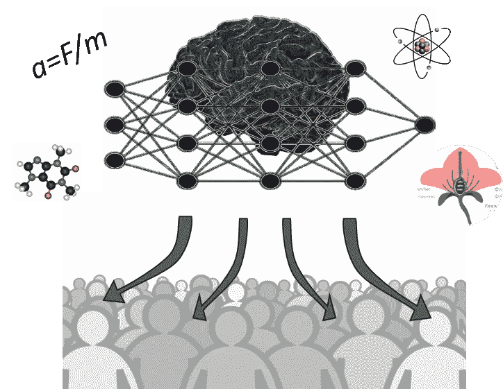

# 经过长期训练的类似 GPT 3 的模特可能成为未来生物学生的全天候导师

> 原文：<https://towardsdatascience.com/gpt-3-like-models-with-extended-training-could-be-the-future-24-7-tutors-for-biology-students-904d2ae7986a>

## 使用基于 GPT 协议 3 的软件辅助 STEM 教育系列

# 经过长期训练的类似 GPT 3 的模特可能成为未来生物学生的全天候导师

## 尽管其他科目的成绩相当令人沮丧，但 GPT 3 号在生物方面表现得相当不错，如果它的训练时间延长，就更好了。看看这组新的实验。

**跳转到:** [**简介**](#0ba4) **|** [**主考**](#4cf9) **|** [**通过延伸训练**](#93b0) **|** [**讨论**](#ac42) **|** [**结论**](#0377)

# 介绍

在我最近对 GPT-3 帮助学生学习科学科目的潜力进行的测试中，我发现除了作为一种更自然地检索系统从网络上“学习”的理论概念的工具，化学和物理很少或根本没有适用性。

 [## 设计测试来衡量 GPT-3 的基础科学知识

### 学生可以从 OpenAI 的最新语言模型中学习并将其用作全天候顾问吗？学生可以用它来…

towardsdatascience.com](/devising-tests-to-measure-gpt-3s-knowledge-of-the-basic-sciences-4bbfcde8286b)  [## 在基础物理上测试 GPT-3 揭示了一些重要的问题

### 该软件似乎是可靠的咨询理论概念，但不是他们的应用，与潜在的…

towardsdatascience.com](/testing-gpt-3-on-elementary-physics-unveils-some-important-problems-9d2a2e120280) 

生物学，至少在高中和大学早期阶段，是高度描述性的，因此可能是 GPT-3 和其他 NLP 模型的潜在应用领域。在这篇文章中，我通过遵循我以前文章中相同的过程，探索了这一点:我在 OpenAI 的操场上拿着 GPT-3 的达芬奇模型，就好像它是一个学生一样，我通过考试般的聊天对它进行了一系列概念的评估。

当然，GPT-3 缺乏任何思考能力，但我在下面的文章中认为，它仍然有可能通过自然语言作为信息检索的高级资源:

 [## 关于 GPT-3 及其(显然无效的)“思考”能力的说明

### 在我最近的文章中，有一些关于 GPT-3 的能力的说明，尽管令人印象深刻，但并不…

towardsdatascience.com](/a-note-on-gpt-3-and-its-obviously-null-thinking-capabilities-de84a26ac0f3) 

# 主要检查

先来看看我让达芬奇参加的主要考试。下面的文字中，以 Q 开头的每一行都是我问的问题，A 是达芬奇的回答(用默认设置运行)。我把所有的聊天记录都用引用的形式，我用粗体格式对聊天记录进行评论:

> 问:你好，我们来讨论一些关于生物的话题。当然可以。你想了解什么
> 
> 问:我们先来看看你对普通生物学了解多少。你如何根据细胞类型来划分生物？
> 答:有三种类型的细胞:原核细胞、真核细胞和古细菌细胞。

**严格地说，GPT-3 在这里所说的是错误的，因为它说“有三种类型的细胞”。而是在实际问题的背景下考虑(“如何根据细胞类型来划分生物体”)，而不是“有多少细胞类型？”)，答案正确。GPT-3 已经在领域水平上回答了我的问题，其中有细菌和古菌(生命的两个领域，都由单个原核细胞组成)，加上由一个或多个真核细胞组成的真核细胞。**

**因此给出的答案对一个学生来说不是最好的，但我承认这个问题本身不是最清楚的。我想一个学生也可能被弄糊涂了。让我们继续前进。**

> 问:原核细胞、真核细胞、古细菌细胞有什么异同？
> 答:原核细胞是最简单的细胞，它们没有细胞核或其他细胞器。真核细胞更复杂，它们有细胞核和其他细胞器。古细菌细胞类似于原核细胞，但它们有不同类型的细胞壁。

**所有这些都是正确的，并且与上述三种主要类型的分离细胞相一致。**

> 问:你能多比较一下原核细胞和真核细胞吗？
> 答:原核细胞一般比真核细胞小，没有细胞核或其他细胞器。真核细胞更复杂，它们有细胞核和其他细胞器。

**在这里，我试图引导它在原核细胞和真核细胞上特异性地发育，它做得很好。既然提到了细胞器，这是开始深入研究它们的好时机:**

> 问:很好。你能在真核细胞中找到哪种细胞器？
> 答:真核细胞有一个细胞核和其他细胞器，包括线粒体、核糖体和高尔基体。
> 
> 问:线粒体执行什么功能？
> 答:线粒体负责在细胞中产生能量。
> 
> 问:它们是如何产生能量的？
> 答:线粒体利用氧气分解葡萄糖等分子产生能量。
> 
> 问:这个过程叫什么名字？答:这个过程叫做细胞呼吸。
> 
> 问:很好，哪种是主要的呼吸酶？
> 答:主要的呼吸酶叫细胞色素 c 氧化酶。
> 
> 问:很好。细胞色素 c 氧化酶催化什么反应？
> 答:细胞色素 c 氧化酶催化氧气与葡萄糖反应生成水和二氧化碳。

到目前为止，GPT-3 已经非常好地回答了所有这些问题，它可以很好地对应高中生物学。我现在试着深入一点:

> 问:它从哪里获取电子？
> 答:电子来自葡萄糖分子。

**中间来源之一是葡萄糖，所以这是正确的。但我期待 GPT-3 告诉我电子来自三羧酸循环，或 NAD 分子，或电子传递链等。所以我多问了一点:**

> 问:但是电子是如何从葡萄糖中提取出来的呢？
> 答:细胞色素 c 分子从葡萄糖中提取电子。

**这是错误的。细胞色素 c 是最终的电子供体，但它本身并不直接从葡萄糖中获取电子。**

> 问:不完全是。我的意思是，葡萄糖在细胞内是如何降解的？
> 答:葡萄糖在细胞内通过糖酵解过程降解。

根据定义，这是正确的。

> 问:对，糖酵解的产物是什么？
> 答:糖酵解的产物是两分子丙酮酸。

**太好了，让我们再深入一点:**

> 问:丙酮酸会发生什么变化？
> 答:丙酮酸转化为乙酰辅酶 a，然后用于柠檬酸循环。
> 
> 问:什么是柠檬酸循环？
> 答:柠檬酸循环是将乙酰辅酶 a 转化为二氧化碳和水的一系列反应。
> 
> 问:在柠檬酸循环过程中，电子发生了什么变化？
> 答:电子转移到 NAD+和 FAD 产生能量。
> 
> 问:NAD 和 FAD 中的这些电子去了哪里？
> 答:NAD 和 FAD 中的电子去电子传递链。

这一部分非常完美。

> 问:呼吸酶在哪里？
> 答:呼吸酶叫做细胞色素 c 氧化酶。

我问的不是这个。让我们看看我能不能引导它:

> 问:它是电子传递链的一部分吗？答:不，电子传递链是蛋白质的独立链。

这是错误的，因为它实际上被认为是电子传递链的末端。我想我已经深入到 GPT 3 号能正确回答的程度了。

> 问:好吧，让我们来看看别的。动植物含有真核细胞还是原核细胞？
> 答:动植物含有真核细胞。
> 
> 问:所以你的意思是植物是真核生物。答:是的，植物是真核生物。
> 
> 问:动物和植物细胞包含相同种类的细胞器吗？不，动物和植物细胞包含不同种类的细胞器。
> 
> 问:多解释一下
> 答:动物细胞含有线粒体、核糖体等细胞器，植物细胞含有叶绿体、细胞壁等细胞器。

**一切都好。现在，既然提到了叶绿体，那就让我们深入研究一下:**

> 问:什么是叶绿体？
> 答:叶绿体是植物细胞中负责光合作用的细胞器。
> 
> 问:什么是光合作用？
> 答:光合作用是将光能转化为化学能的过程。
> 
> 问:请告诉我更多关于光合作用的工作原理。
> 答:在光合作用中，光能转化为葡萄糖和其他分子。
> 
> 问:怎么做？
> 答:叶绿体利用光能将二氧化碳和水转化为葡萄糖等分子。

所有这部分都很棒。让我们再测试一下。

> 问:太好了。这一切发生在哪个车厢？
> 答:叶绿体位于叶绿体膜内。
> 
> 问:在任何特殊的细胞中？
> 答:不，叶绿体位于所有植物细胞的叶绿体膜中。

我不会这么说。看看我能不能稍微引导一下:

> 问:但是细胞的非绿色部分也进行光合作用吗？
> 答:不能，只有细胞的绿色部分才能进行光合作用。

还好它能“纠正”自己，即使只是偶然。

> 问:啊，好，很好。为什么这些部分是绿色的？
> 答:细胞的绿色部分含有叶绿素，吸收光能。
> 
> 问:什么是叶绿素？
> 答:叶绿素是一种吸收光能并利用它产生葡萄糖的分子。

**虽然参与了光合作用，但说叶绿素类直接利用光产生葡萄糖也不为过，肯定混淆视听。**

> 问:光合作用发生在什么亚细胞结构中？
> 答:光合作用发生在植物细胞的叶绿体中。
> 
> 问:有什么特别的地点吗？答:不，光合作用发生在植物细胞的叶绿体中。

**我想知道更精确的位置，所以我一直在问:**

> 问:但是吸收光进行光合作用的蛋白质在哪里呢？
> 答:吸收光进行光合作用的蛋白质位于叶绿体的类囊体膜中。

**好。现在我转到生态学，只是为了在另一个话题上探索 GPT 3 号。**

> 问:好，很好。现在我们换个话题。什么是生态？生态学是对生物和它们的环境之间的关系的研究。
> 
> 问:生态系统中有哪些因素？答:在一个生态系统中，你有非生物因素和生物因素。
> 
> 什么是生物和非生物因素？
> 答:生物因素是生态系统中有生命的组成部分，而非生物因素是生态系统中无生命的组成部分。
> 
> 问:好的，请给我一些非生物因素的例子。答:非生物因素包括水、光、温度和土壤等。
> 
> 问:动物是生物的还是非生物的？答:动物是有生命的。

**好，现在让我看看我能不能把它搞混:**

> 问:那么细菌、植物和岩石呢？细菌、植物和岩石都是生物。

**嗯，它弄错了岩石。让我们一个一个地问，也用相关的词:**

> 问:岩石是有生命的吗？
> 答:是的，岩石是有生命的。
> 
> 问:石头是生物的还是非生物的？
> 答:石头是非生物的。
> 
> 问:岩石是生物的还是非生物的？
> 答:岩石是非生物的。

**用这种方式问它现在答对了。但是你可以看到上面说岩石是生物的时候有多肯定。对学生不好。**

**我又问了几个，他们都答对了:**

> 问:矿物是生物的还是非生物的？
> 答:矿物是非生物的。
> 
> 问:植物是生物的还是非生物的？答:植物是有生命的。

**继续讲一些关于生态学的不同的东西:**

> 问:好吧，让我们看看生态学范围内的其他东西。生物因素之间可以建立什么样的关系？
> 答:生物因素之间可以建立三种关系:竞争、捕食和共生。
> 
> 问:什么是竞争，什么是捕食，什么是共生？
> 答:竞争是两个或更多有机体之间的关系，其中每个有机体都试图使用与另一个相同的资源。捕食是生物和猎物之间的关系，捕食者吃掉猎物。共生是两个或多个有机体之间的关系，两个有机体都从这种关系中受益。
> 
> 问:你能举一个竞争的例子吗？
> 答:竞争的一个例子是两家工厂之间的关系，其中每家工厂都试图使用与另一家相同的资源。
> 
> 问:捕食的例子？
> 答:捕食的一个例子是狮子和斑马的关系，狮子吃掉了斑马。
> 
> 问:共生的一个例子是什么？
> 答:共生的一个例子是真菌和树木之间的关系，真菌帮助树木从土壤中吸收养分。

**又一个完美街区。我们再多问一点:**

> 好的，这让我想到另一个问题:什么是 lychen？
> 答:绿头菌是一种与树共生的真菌。

**不是最佳定义。让我们再深入一点:**

> 问:还有其他种类的母鸡吗？没有，只有三种地衣:地衣、菌根真菌和内生菌。

**我不是 lychens 方面的专家，但这个答案是错误的。**

让我们再一次转向不同的话题

> 问:好了，现在来点不同的，回到细胞和细胞器。真核细胞是怎么出现的有什么理论吗？关于真核细胞是如何出现的，有一个理论叫做内共生理论。
> 
> 问:它说什么？
> 答:内共生理论说真核细胞是由吞噬其他原核细胞的原核细胞进化而来。
> 
> 问:有什么具体的例子吗？答:内共生理论的一个例子是线粒体的起源。线粒体是真核细胞中产生能量的细胞器。据信，线粒体是由被另一个原核细胞吞噬的原核细胞进化而来的。

**完美。我们试着深入挖掘一下，了解一下有哪些原核生物被怀疑变成了线粒体。**

> 什么原核细胞？
> 答:据信吞噬另一个原核细胞的原核细胞是真核细胞的祖先。

**那种明显的循环答案，不具知识性。反正不是我问的；但是我的问题很简短，所以让我说得更清楚些:**

> 问:还记得是什么样的原核细胞让位于线粒体吗？
> 答:吞噬另一个原核细胞的原核细胞是真核细胞的祖先。

**还是一个循环的回答。让我们离开线粒体。**

> 问:还有其他例子吗？答:内共生理论的另一个例子是叶绿体的起源。叶绿体是真核细胞中从阳光中产生能量的细胞器。据信叶绿体是由被另一个原核细胞吞噬的原核细胞进化而来的。
> 
> 问:你是说像蓝藻？
> 答:蓝藻是原核细胞，从阳光中产生能量。人们认为叶绿体是由被另一种原核细胞吞噬的蓝细菌进化而来的。

**还行，但我忍不住了。**

# 通过扩展培训进行初步分析和更深入的调查

我很惊讶。尽管有一些不正确的和部分正确的答案，我对 GPT 三号学到的高质量和多种多样的“知识”感到惊讶。特别是，答案中的例子非常丰富，大多数都是正确的。所有这些都符合我在以前的文章中得出的结论:GPT-3 非常善于检索它在训练中看到的事实数据。

尽管“原样”使用 GPT-3 作为学习生物学的学生的无人监督的 24/7 顾问是有风险的，但很明显，在这一学科中的表现优于物理或化学。现在好的一面是，错误的答案，比如首先说岩石是生物的，或者指向三种主要类型的细胞，都是可以治愈的。很有可能通过进一步训练系统，它可以纠正这些问题。看这些进一步的测试，我先教系统一些信息，然后问:

## 先教后问

就像以前一样，如果我直截了当地询问细胞的类型，系统会返回一个错误的答案:

> 问:有哪些种类的细胞？
> 答:有三种细胞:原核细胞、真核细胞和植物细胞。

但是如果我先用一段话告诉它有两种主要的细胞类型，然后我再问这个问题，系统会给出预期的答案:

> 细胞有两种主要类型:原核细胞和真核细胞。
> 
> 问:有哪些种类的细胞？答:有两种主要的细胞:原核细胞和真核细胞。

请注意，即使问题的提出方式与给出的信息不同，这也是有效的:“细胞有两种主要类型”与“有哪几种细胞？”

此外，有趣的是，即使我在有正确答案的句子和实际问题之间给系统更多信息，这仍然有效:

> 细胞有两种主要类型:原核细胞和真核细胞。真核细胞含有细胞核、高尔基体等细胞器。植物也有叶绿体。有趣的是，线粒体和叶绿体似乎是在一些早期真核细胞吞噬细菌后进化而来的。立克次体可能让位于现代线粒体，而某些种类的蓝细菌可能变成了现代叶绿体。
> 
> 问:有哪些种类的细胞？
> 答:有原核和真核两种细胞。

注意，如果我去掉第一句话，那么 GPT-3 的答案又错了:

> 真核细胞含有细胞核、高尔基体等细胞器。植物也有叶绿体。有趣的是，线粒体和叶绿体似乎是在一些早期真核细胞吞噬细菌后进化而来的。立克次体可能让位于现代线粒体，而某些种类的蓝细菌可能变成了现代叶绿体。
> 问:有哪几种细胞？
> 答:有三种细胞:原核细胞、真核细胞和植物细胞。

现在做好准备。令人瞠目结舌。我又问了线粒体和它们的起源，用这一段我喂给系统，这是我得到的:

> 细胞有两种主要类型:原核细胞和真核细胞。真核细胞含有细胞核、高尔基体等细胞器。植物也有叶绿体。有趣的是，线粒体和叶绿体似乎是在一些早期真核细胞吞噬细菌后进化而来的。立克次体可能让位于现代线粒体，而某些种类的蓝细菌可能变成了现代叶绿体。
> 
> 问:有哪些种类的细胞？
> 答:有两种主要的细胞:原核细胞和真核细胞。
> 
> 问:什么是线粒体？
> 答:线粒体是真核细胞中发现的细胞器。它们负责以 ATP 的形式产生能量。
> 
> 问:线粒体从哪里来？
> 答:线粒体被认为是由早期真核细胞吞噬的细菌进化而来。
> 
> 问:什么细菌？答:人们认为立克次体细菌产生了现代线粒体，而某些种类的蓝细菌则变成了现代叶绿体。

我没有明确地告诉 GPT-3 立克次体是细菌(虽然它可以从我写的文本中获得)，然而系统想出了这个完美的句子，现在给出了我在考试中试图从中得出的正确、完整的答案！

现在，如果我去掉关于立克次体是线粒体前体的关键信息，那么最后一个问题的答案是错误的:

细胞有两种主要类型:原核细胞和真核细胞。真核细胞含有细胞核、高尔基体等细胞器。植物也有叶绿体。有趣的是，线粒体和叶绿体似乎是在一些早期真核细胞吞噬细菌后进化而来的。例如，某些种类的蓝细菌可能变成了现代的叶绿体。

> 问:有哪些种类的细胞？答:有两种主要的细胞:原核细胞和真核细胞。
> 
> 问:什么是线粒体？
> 答:线粒体是真核细胞中发现的细胞器。它们负责以 ATP 的形式产生能量。
> 
> 问:线粒体从哪里来？
> 答:线粒体被认为是由早期真核细胞吞噬的细菌进化而来。
> 
> 问:什么细菌？
> 答:有人认为某些种类的蓝藻成为了现代的线粒体。

最后一个答案是错误的。

# 讨论

正如上一节开头几段所总结的，我参加的 GPT-3 的达芬奇考试显示，它非常擅长回答生物学上的事实问题，甚至有相当丰富的例子。然而，它有时会失败，最糟糕的是，所有的答案似乎都给出了高度的信心——这是应用程序在支持学生方面的一个关键缺陷。

现在，发现你可以用精选的事实来训练系统是一个游戏规则的改变者。原则上，人们可以向 GPT-3 提供一个精选的语料库，这将有助于纠正所有这些类型的问题，甚至可能填补内容上的空白。让我给你看最后一个例子，把训练推向极限:

如果我问 GPT-3 的达芬奇这个问题，高度具体到磷酸脂类生物学:

> 问:肌醇焦磷酸的细胞受体是什么？

运行只是挂起并抛出一个错误，要求我重新表述输入提示。

但是如果我输入(这里只是一部分)关于特定主题的论文介绍，然后我问，我得到的信息是正确的:

> 关于 SPX-PHR 相互作用的调节以响应养分有效性的变化，提出了两种机制:SPX 结构域被提议作为直接 Pi 传感器，SPX-PHR 相互作用在存在毫摩尔浓度的 Pi 时发生。或者，SPX–PHR 复合物的完整性可以通过蛋白质降解来调节。事实上，通过 26S 蛋白酶体的 SPX 降解在 Pi 饥饿下增加。**真菌、植物和人类 SPX 结构域已被独立表征为肌醇焦磷酸** (PP-InsPs)的细胞受体，其以高亲和力和选择性结合 SPX 结构域。PP-InsPs 由完全磷酸化的肌醇环组成，分别在 C1 和/或 C5 位置携带一个或两个焦磷酸基团。在植物中，肌醇 1，3，4-三磷酸 5/6-激酶催化植酸(InsP6)磷酸化为 5PP-InsP5(下文称为 InsP7)。二磷酸肌醇五磷酸激酶 VIH1 和 VIH2 然后从 InsP7 产生 1，5(PP)2-InsP4(下文称为 InsP8)。植物二磷酸肌醇五磷酸激酶在遗传学上被认为在茉莉酸感知和植物防御反应中起作用，更重要的是，在衣藻属和拟南芥属中的营养感应中起作用。
> 
> 问:肌醇焦磷酸盐的细胞受体是什么？
> 答:真菌、植物和人类 SPX 结构域是肌醇焦磷酸的细胞受体。

请注意，我并没有完全按照文本中给出的答案(粗体)来提问，但是系统可以找到它。

此外，我可以继续问更多的问题:

> (介绍性文字同上)
> 
> 问:什么酶磷酸化植酸？
> 答:在植物中，肌醇 1，3，4-三磷酸 5/6-激酶催化植酸(InsP6)磷酸化为 5PP-InsP5(以下简称 InsP7)。

请注意，这个问题与答案的措辞并不完全一样。

**很明显，训练 GPT-3 号来扩展和修正它的知识库起作用了。我将在以后的文章中更详细地研究这一点——如果能从 OpenAI 和 NLP 专家那里听到这一点，那也是非常好的。**

# 结论

在全球范围内，我怀疑 GPT-3 真的有潜力成为一名 24/7 的生物学导师，如果用可靠的数据语料库进行训练的话。这种数据的可能来源可以包括由专家教师准备的材料、来自上面举例说明的学术评论和论文的文本，甚至可能包括同行评审的生物学科学材料的完全开放存取语料库，例如来自 PubMed 的完全免费的文章或至少其摘要的完整记录。自然，考虑到大量的数据，这样的再训练不会是微不足道的。但这与已经用于预先训练系统的方法相当，这个想法听起来并不太牵强。

GPT-3 或它的进一步进化有一天会教会人类并帮助他们工作吗？和我一起参加这个系列的文章来测试 GPT-3 的能力吧！由作家卢西亚诺·阿布利亚塔创作的人物。

我是一个自然、科学、技术、编程和 DIY 爱好者。生物技术专家和化学家，在潮湿的实验室和电脑前。我写我广泛兴趣范围内的一切。查看我的 [*列表*](https://lucianosphere.medium.com/lists) *了解更多故事。* [***成为中等会员***](https://lucianosphere.medium.com/membership) *访问其所有故事和* [***订阅获取我的新故事***](https://lucianosphere.medium.com/subscribe) ***通过电子邮件*** *(我为其获得小额收入的平台的原始附属链接，无需向您支付特殊费用)。* [***通过各种方式在这里捐赠***](https://lucianoabriata.altervista.org/office/donations.html)**。* [***联系我这里***](https://lucianoabriata.altervista.org/office/contact.html) *为任何一种查询。**

**到* ***咨询关于小工作*** *(关于编程、biotech+bio info 项目评估、科学外联+交流、分子数据分析与设计、分子图形、摄影、私人课程与教程、私人课程、教学与辅导等。)查看我的* [***服务页面这里***](https://lucianoabriata.altervista.org/services/index.html) *。**