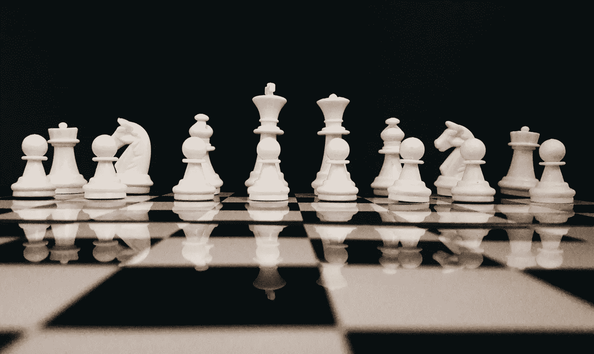
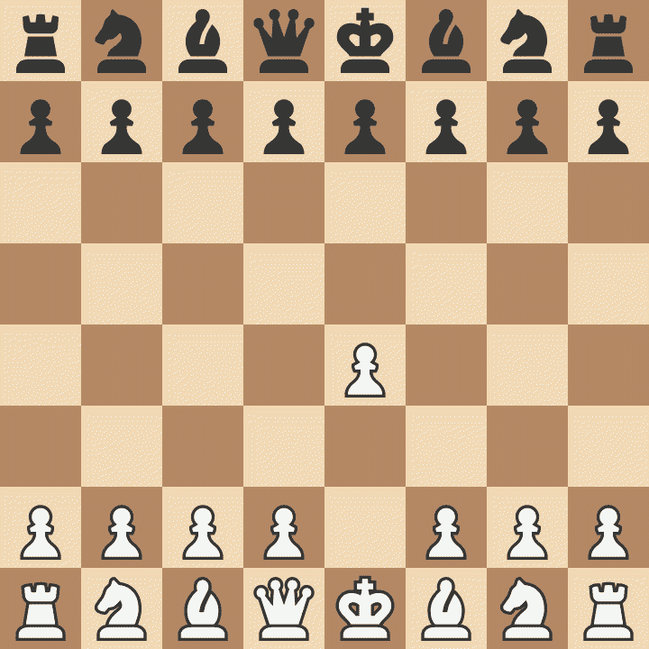
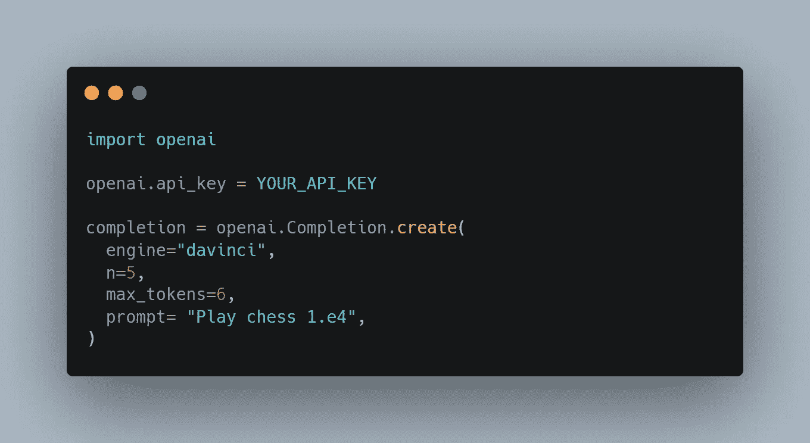
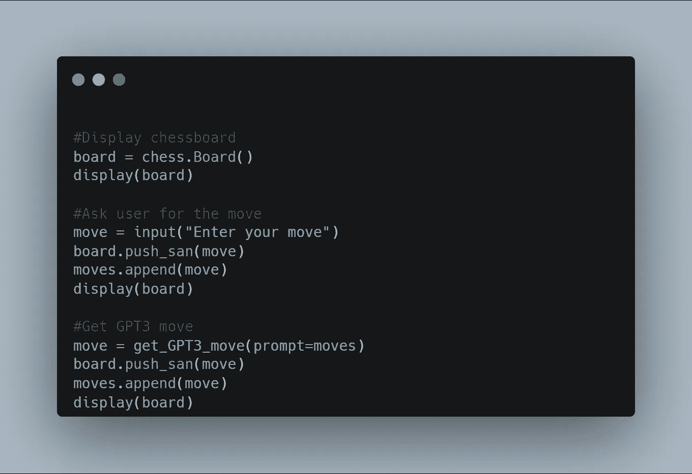
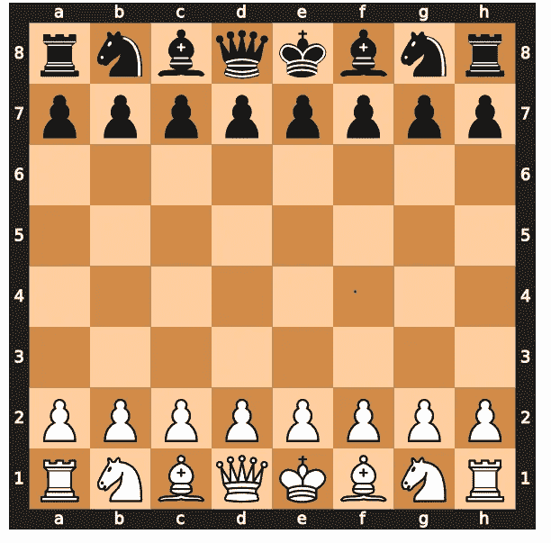

# GPT 3 号，下棋！

> 原文：<https://towardsdatascience.com/gpt-3-play-chess-d123a96096a9>

## 如何使用 GPT 3(open ai API)创建国际象棋引擎

照片由 [sk](https://www.pexels.com/@rgsk97?utm_content=attributionCopyText&utm_medium=referral&utm_source=pexels) 从 [Pexels](https://www.pexels.com/photo/white-chess-piece-on-top-of-chess-board-814133/?utm_content=attributionCopyText&utm_medium=referral&utm_source=pexels) 拍摄

这里有许多 GPT-3 在生成源代码、编写故事等方面创造奇迹的演示。我结合了我的两个兴趣，人工智能和国际象棋，探索用 GPT-3 创建一个国际象棋引擎的可能性。国际象棋人工智能很常见，它们甚至可以轻松击败最优秀的人类选手。利用 GPT-3 创建国际象棋引擎的目标是测试一个单一的人工智能模型是否可以执行几项工作，如编写故事和下棋。现有的 AI 解决方案是狭义的 AI，意味着它们只能完成一项任务。人工通用智能(AGI)，或可以像人类一样完成各种任务的人工智能，是 GPT-3 等人工智能模型的承诺。这篇文章讨论了我如何使用 GPT-3 来创建一个国际象棋引擎，以及它是如何运行的。

## 什么是 GPT-3？

GPT-3 是一个**1750 亿参数**的人工智能语言模型，已经在大量数据上进行训练。简单来说，语言模型是一个人工智能模型，它可以在给定一组输入单词的情况下预测下一组单词(非常像搜索引擎中的自动完成功能)。大型语言模型，如 GPT-3，更进了一步，能够根据描述或建议生成源代码或故事。GPT-3 背后的创业公司 OpenAI 已经通过 API 向开发者提供了它的模型。你可以在这里注册，你会得到 18 美元的积分。

## 语言模型怎么下棋？

乍一看，语言模型与国际象棋毫无关系。但是我们可以通过把下棋框定为文本生成问题来欺骗它下棋。棋盘上的每个方格都用一个字母和一个数字来命名。水平方块标记为“a”到“h ”,垂直方块标记为 1 到 8。因此，每个方块可以通过坐标对来识别，如左下方的 a1。国际象棋游戏被记录为一系列符号，俗称 PGN(便携式游戏符号)。例如:1.e4 e5 2。d4 d5 等。

使用这些符号，我们可以通过输入到目前为止游戏的 PGN 并要求它预测下一个单词(移动)来将下棋框定为一个文本生成任务。有理由期待 GPT 3 号的大量输入数据也一定包括一些国际象棋比赛的数据。我们可以看到 GPT-3 能多好地选择这些并玩游戏。这就是我使用 OpenAI APIs 所做的事情，细节将在本文后面介绍。

## 使用 GPT-3 创建国际象棋引擎

**我的游戏(白色)vs GPT-3(黑色)**【图片由作者使用 chess.com 创建】

既然 GPT-3 不知道什么是国际象棋，那么期望它通过使用默认模型来击败国际象棋大师是不合理的！我这个项目的目标是学习更多关于 OpenAI APIs 的知识，并展示使用 GPT 3 创建定制任务是多么简单。为了让 GPT-3 开始下棋，我只需给出以下提示:**“下棋 1。e4”。**就这么简单！我的第一步是将我的棋子移动到方块 e4(方块 e4)。根据这个提示，GPT-3 返回一个完整的游戏，从我的移动开始！我将输出限制为仅获取下一步棋，比如说 e5，然后进行第二步棋，比如说 d4，并将其馈送给 GPT-3(例如:1e4 e5 2。d4)。GPT-3 使用更新的 PGN 和迄今为止的所有动作来预测下一步。

## 把它编码

OpenAI 提供 API，细节可以在[这里](https://beta.openai.com/docs/api-reference/files)找到。你需要 OpenAI API 密匙来使用这些 API，它们是在注册时提供的。对于下棋，我使用了完成 API，它接受一个提示作为输入，并返回预测的完成，在我们的例子中是下一步棋。

指导 GPT-3 开始下棋(图片由作者提供)

GPT-3 API 调用中使用的参数解释如下。

***提示:*** 用于文本生成过程的提示

***发动机:***GPT-3 共有 4 种型号，命名为阿达、巴贝奇、居里、达芬奇(以字母 a、b、c、d 开头)。这些型号在性能和成本上也有所不同。为了获得最佳性能，请使用达芬奇，但请注意，它比最接近的 Curie 型号贵 10 倍。

***n:*** 要返回的预测数。由于 GPT-3 不能保证每次都提供合法的移动，所以最好提供大于 1 的 *n* 来获得有效的移动。

***max_tokens:*** 大致翻译为输出的字数。因为移动通常是一个字母和一个数字，2 是最小的。但一些复杂的移动需要更多的字母(如 Qxe8+)，所以提供 6 是安全的。

显示棋盘和移动的示例代码(图片由作者提供)

Jupyter 笔记本中创建的棋盘(图片由作者提供)

为了可视化棋盘并进行移动，我使用了 [python-chess](https://python-chess.readthedocs.io/en/latest/) 库。该库提供了一个 API 来在棋盘上移动。如果 GPT-3 返回的移动不合法，它将返回一个异常。这个异常可用于使用 GPT-3 返回的下一个最佳步骤。我用 Jupyter Notebook 把棋盘可视化，在虚拟棋盘上玩游戏。本文末尾提供了完整源代码的链接。

## 评估绩效

我已经向你展示了如何让 GPT-3 下棋。现在下一个问题是它的表现如何。这有点复杂，因为 GPT-3 下棋的方式与我玩过的其他人工智能棋非常不同。通常情况下，国际象棋引擎非常强大，玩得远远超出人类水平。为了达到人类的水平，他们故意间歇性地做出非常糟糕的动作。GPT-3 的打法非常不同。

GPT-3 开局打得很好，但在中局中挣扎，并在正式结束前输掉了比赛。我相信这是因为它正在根据它看到的训练数据来玩动作。由于开放是普遍的，它已经看到了很多这样的举动。因为中局的可能移动集合太大了，它不可能看到我们正在玩的游戏的精确移动集合。它开始出错，丢失棋子，并变得容易被提前将死。

GPT-3 如果能够打一场更好的中局，它会在残局中表现出色，因为残局的选择是有限的(如国王&卒 vs 国王)，而且它会在训练数据中看到许多这样的游戏。我注意到的另一个问题是，GPT-3 有时很难回应合法的举动。这是意料之中的，因为它只是一个语言模型，对国际象棋规则一无所知。为了解决这个问题，我们可以使用下一个最佳预测移动或要求 GPT-3 再次预测。OpenAI 提供了一个微调工具，可以有把握地认为，在我们对一个定制的象棋游戏数据集进行微调后，GPT-3 将表现得非常好。

## 结论

GPT-3 是人工智能的一项突破，为人工智能(AGI)迈出了充满希望的一步——你什么时候见过同样的人工智能解决方案被用于写歌和下棋！OpenAI APIs 非常直观，合理的成本使我们能够使用 GPT-3 构建生产应用程序。如图所示，这些 API 可以创造性地用于许多用例。这个实验的完整源代码可以在[这里](https://github.com/ShamzGuy/GPT3Chess)找到。和 GPT-3 下棋愉快！