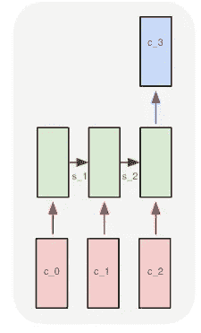
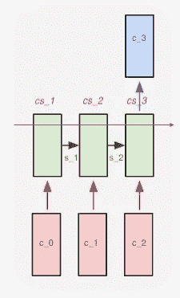
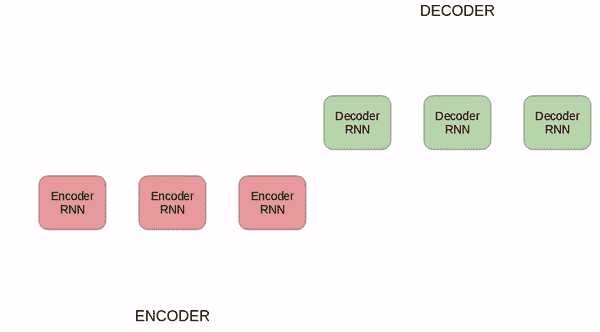

# GPT-3，RNNs 和所有这一切:深入研究语言建模

> 原文：<https://towardsdatascience.com/gpt-3-rnns-and-all-that-deep-dive-into-language-modelling-7f67658ba0d5>

## [实践教程](https://towardsdatascience.com/tagged/hands-on-tutorials)

# GPT-3，RNNs 和所有这一切:深入研究语言建模

## 神经网络如何用于语言建模:多层感知器、rnn 和变压器。

安德烈·德·森蒂斯峰在 Unsplash 上拍摄的图片。

由于我一直在做[柴](http://chai.ml)的工作，我已经接触到了大型语言模型(LLM)，一些我以前并不真正了解的东西。在这篇文章中，我将总结我在这个问题上所学到的一切。我们将从非常简单的(大约 40 年前研究人员正在做的)到最先进的，停留在一个大画面的水平。这个想法不是为了得到正确的数学细节，而是为了能够对这些语言模型中正在发生的事情给出一个好的“大体上”的解释。

## 我们到底在模拟什么？

说“我们训练一个理解语言的模型”很容易，但这是什么意思呢？这在实践中意味着一件简单的事情，即“给定一个字符序列，预测最可能的下一个字符”。例如，我们可以在一个英语单词语料库上训练一个模型，然后我们给它输入短语“Foo”，希望它会输出字符“d”(或“l”)，我们就会有单词“Food”或“Fool”。这些模型是**字符级语言模型**。另一个意思是“给定一个单词序列，预测下一个最有可能的单词”。这就是大型语言模型(LLM)用来解决的问题。

## 玩具问题:训练一个模型打招呼

我们可以想象一个超级简单的语言建模问题是这样的:假设我们只知道四个字母:H、E、L 和 O。如果我们在训练序列“heLLO”上训练一个模型，我们预计如果我们给它输入“HE ”,它将输出“L ”,如果我们给它输入“HELL ”,它将输出“O”。

更正式地说，我们可以这样写:什么字符 c_n 最大化概率 P(c_n | c_{n-1}，…，c_0)？

在上面的例子中，c_n 是字母“O”。

## 你是怎么用文字做数学的？

神经网络基本上是[大型演算机，处理大量偏导数](https://www.youtube.com/watch?v=aircAruvnKk&list=PLZHQObOWTQDNU6R1_67000Dx_ZCJB-3pi&ab_channel=3Blue1Brown)(用于反向传播)并应用非线性函数(如双曲正切函数或 sigmoid 函数)。但是你怎么用字母做微积分呢？你不知道。相反，您使用单词嵌入，这意味着将字符转换为向量的模式。这些方法中最简单的是 1-to-k 编码:在上面的小例子中，我们的词汇表是[H，E，L，O],因此字母 H 被编码为[1，0，0，0]向量，字母 E 被编码为[0，1，0，0]等等。好了，现在我们已经将字符转换为向量，我们肯定可以将向量输入到神经网络中(这是输入层)。

## 多层感知器在自然语言处理中的应用

你的训练数据是一个词的语料库(例如一本书)。语料库中的单词集就是你的词汇表。假设书上只说“吃披萨吃披萨吃披萨”。你的书里只有 3 个词:[“吃”、“the”、“披萨”]。这其中的每一个单词都有自己的嵌入(或编码):[1，0，0]是“吃”，[0，1，0]是“那个”，[0，0，1]是“披萨”。注意，每个向量的长度就是我们的词汇量的大小(即 3)。所以我们给我们的多层感知器(MLP)一个大小为 3 的输入层。然后，我们可以放置尽可能多的隐藏层，我们的输出层也必须有大小 3。然后是通常的故事:你用随机权重和偏差初始化你的网络，一个例子接一个例子地训练你的网络(一个编码字接一个编码字)，计算损耗，用反向传播调整参数等等…

如果你对 MLPs 的工作方式有点不确定，看看这个上的 [3blue1brown 的视频系列，我从未见过更清楚的解释。我们在这里学到的最酷的事情是，你可以使用这种技术来预测句子中的下一个单词——所以原则上这足以让](https://www.youtube.com/watch?v=aircAruvnKk&list=PLZHQObOWTQDNU6R1_67000Dx_ZCJB-3pi&ab_channel=3Blue1Brown)[建造一个聊天机器人](https://medium.com/mlearning-ai/build-and-deploy-a-gpt-j-chatbot-6b917b25b1a7)。

**MLPs 应用于 NLP 时的限制**:它们接受固定大小的向量输入，输出固定大小的向量输出。所以在预测文本的上下文中，我们可以给他们一个单词，他们会输出更多的单词。但是如果我想给他们一个句子，让他们输出下一个单词呢？办不到，我们只能给它最后一句话。这意味着它不能考虑句子中前面单词的上下文。

最后，我们给出了一个如何对单词进行编码的最简单的例子:我们的 1 到 k 编码。很明显，我们可以用其他方式对信息进行编码。人们使用 [word2vec](https://en.wikipedia.org/wiki/Word2vec) 或 [gloVe](https://en.wikipedia.org/wiki/GloVe_(machine_learning)) 但它们如何工作并不太重要，酷的事情是:取一个单词(或一个字符)→将其转换为向量→现在你可以用单词进行机器学习了！

## 为什么递归神经网络(RNNs)更合适

对于语言建模来说，RNNs 比 MLPs 更令人兴奋的关键是它们允许我们处理向量序列。所以我们可以输入一个句子，它是单词的向量表示序列，然后得到一个输出向量。

让我们把自己限制在这样的情况下，我们想要给出一个输入序列(例如，表示一个句子的向量列表)并得到一个输出。

RNNs 也学习状态向量，而不是像 MLPs 那样学习层之间的一组权重和偏差来产生输出。RNN 的输出是这个状态向量的函数。当我们向模型输入一系列向量时，这个状态向量就被传递了。假设我们给模型一个向量序列(代表单词),我们想要输出一个向量(代表最可能的下一个单词)。

c_i 是输入到模型的单词(矢量化),除了 c_3 是输出。s_i 是传递的状态向量。在每一步模型都可以产生一个输出，除了最后一步，这些都被去掉了，因为我们只对建立相关的状态向量来预测 C3 感兴趣。来源:[安德烈·卡帕西的博客](http://karpathy.github.io/2015/05/21/rnn-effectiveness/)。

假设我们输入三个单词，想要一个单词输出。我们将句子中的第一个向量(c_0)输入到模型中，将它的状态向量更新为 s_1。然后我们输入下一个向量 C1，它将状态向量更新为 C2。再做一次。该模型的输出是这个最终输入的函数、前一遍的状态向量(它本身是第一个向量的函数——因此对句子的开始有一些记忆)和在训练期间学习的权重矩阵。现在我们有了。在每一次传递中，我们基本上都在做与 MLP 相同的事情，但是我们也在更新这个状态向量并传递它。

## 消失梯度问题

如果你想给模型更多的上下文，你需要给它一个长的向量输入序列。但这意味着你的 RNN 会有很多步骤。

权重和偏差更新的方式是通过反向传播算法计算的。问题在于，一个层的权重和偏差的调整幅度与它和输出层之间所有层的损失函数的导数的乘积成比例。对于 RNNs 中使用的激活函数(通常为 tanh ),这些导数可能非常小，因此它们的乘积往往会消失。如果前几层中的权重和偏差由于这种消失梯度而很少更新，这意味着网络没有真正学会如何使用它们。

因此，rnn 在理解上下文方面肯定比 MLP 做得更好，至少他们有一些短期记忆，但不要指望他们因为消失的梯度而记住太多层的东西。

## 长短期记忆网络(LSTMs):调整了记忆时间更长的 rnn

LSTMs 是一种特殊的 RNN，设计用于处理输入序列中的长期相关性。这意味着，在句子输入的上下文中，如果句子很长，LSTMs 将比我们描述的普通 RNN 更好地考虑句子的开始。

LSTM 的关键创新是“细胞状态”，基本上这是另一个状态向量，就像我们之前图表中的 s_i，但它的更新方式不同。有一些被称为“门”的功能，在输入序列的每一步，控制细胞状态中什么被遗忘，什么被添加。有两个门:“忘记门”和“输入门”。它们可以分别删除和添加单元状态的信息。这些事情背后的确切机制并不特别复杂或有趣，就像机器学习的常见情况一样，它只是一些 sigmoids 和 tanh 函数应用程序的时髦组合，您可以将其应用于向量，结果是新的细胞状态。

cs_i 表示单元状态，就像一条信息传送带，在序列中的每个新输入处都会有选择地更新。来源:图片来自[安德烈·卡帕西的博客](http://karpathy.github.io/2015/05/21/rnn-effectiveness/)(由作者编辑)。

## 使用 rnn/lstm 的缺点

LSTMs 和 vanilla-rnn 在语言建模任务方面有很好的表现(还有一些其他非常酷的东西，比如玩星际争霸)。但是一个很大的缺点是训练它们需要很长时间。由于其架构的顺序性质，不可能并行训练这些模型。由于深度学习通常情况下(如果做得好)更多的数据、更多的层和更多的训练会导致更好的性能，因此无法加快大规模 rnn 的训练令人沮丧。

作为一名软件开发人员，我学到了一些东西，其中之一就是:当代码运行缓慢时，将它并行化！我听说过一个剑桥大学物理系的博士生的案例，他拿了一个需要几周才能运行的软件，他把加速它作为自己的使命。通过大规模并行化，他设法把时间缩短到几个小时。

## 编码器-解码器网络

我们将暂时进入机器翻译的世界(这是最初发明变形金刚的目的)。假设你想把一个句子从德语翻译成英语。你可以用两个 rnn 来实现，一个“编码器”，一个“解码器”。下图更清楚地说明了这一点:

首先，RNN(红色)对来自德语单词序列的信息进行编码。第二个 RNN(绿色)将这些信息翻译成英语。H_i 是状态向量(“隐藏状态”)，<sos>表示“序列的开始”。来源:[本文](https://www.scitepress.org/Papers/2021/103509/103509.pdf)由 Bezerra 等人撰写。</sos>

## 注意机制

当我们从编码器到解码器时，我们可以:给解码器网络最终的隐藏状态，或者我们可以给它所有隐藏状态的加权和。后者被称为“注意机制”。像往常一样，听起来很时髦的名字，但背后的想法很简单。据我所知，其他注意机制基本上只是“对隐藏状态进行加权平均”的更复杂版本。

好了，最后两段非常简单，但这是理解 transformer 的必要上下文。

## 变压器型号

这种模型架构[被认为是 NLP 中最先进的](https://aclanthology.org/2020.emnlp-demos.6/)。它们采用了编码器-解码器结构，但这两者都不是 rnn，而是 MLPs 和注意机制的组合。

在一个高层次上，转换器是这样工作的:取序列中的所有向量，使用“多头”注意力和 MLP 计算所有向量的编码器状态。您不需要知道序列中第一个元素的编码器状态来计算序列中后续元素的编码器状态。这非常巧妙，因为它有助于通过并行处理大大加快模型的训练。

“多头注意力”到底是什么，对于大致了解发生了什么并不太重要。基本上，事情是计算序列中的每个其他单词(向量)与正在处理的输入的相关程度。

然后，所有编码状态被传递到解码器网络，这些状态被顺序处理(因此这实际上不能被并行处理)以产生输出序列。

## GPT-3:一个变压器的例子

根据维基百科，GPT-3 是“一种自回归语言模型”。自回归只是一个花哨的说法:通常已知的模型(如线性回归)是“回归的”，即它们使用一组预测变量来预测目标变量的未来值。相比之下，自回归模型只使用目标变量的以前值来预测未来值。例如，如果你在模拟股票价格，我们会说你的模型是“自回归”的，如果你只用股票价格的过去值来预测未来值。如果你使用其他信息，比如市盈率，你的模型将是“回归的”。因此，我们在本文中研究的所有模型都是自回归的。

我们做到了！希望这篇文章能帮助你对语言建模在过去几十年中的发展有一个高层次的理解，这些东西是有用的:我们从 MLPs，到 RNNs，到 LSTMs，到 Transformers。

## 来源:

*   [3Blue1Brown 关于 MLPs 的系列讲座](https://www.youtube.com/watch?v=aircAruvnKk&list=PLZHQObOWTQDNU6R1_67000Dx_ZCJB-3pi)
*   [RNNs](http://karpathy.github.io/2015/05/21/rnn-effectiveness/)的不合理效力，作者安德烈·卡帕西
*   [了解 LSTMs](https://colah.github.io/posts/2015-08-Understanding-LSTMs/) ，Colah 的博客
*   你所需要的就是关注介绍变形金刚的文章(比任何博客文章都有用)