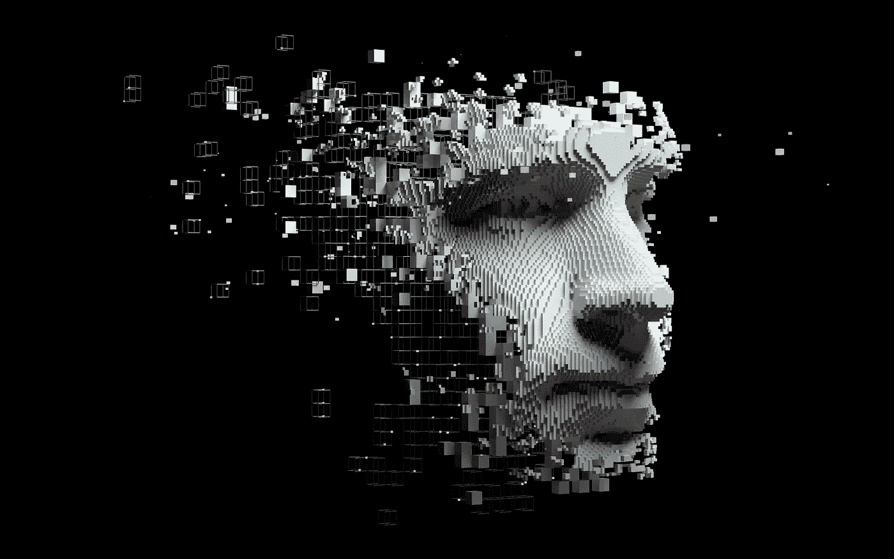

# GPT 4 号即将发射。以下是我们对它的了解

> 原文：<https://towardsdatascience.com/gpt-4-is-coming-soon-heres-what-we-know-about-it-64db058cfd45>

## 官方信息、当前趋势和预测。

照片由 Shutterstock 上的 Pinkeyes 拍摄

## 更新: [GPT-4 出局](https://thealgorithmicbridge.substack.com/p/gpt-4-in-10-keys)。

GPT 4 号的发布日期越来越近了。

GPT-3 于 2020 年 5 月宣布，差不多两年前。它是在 GPT-2 之后一年发布的，后者也是在 GPT 论文发表一年后发布的。如果这种趋势在各个版本中都保持不变，GPT 4 应该已经出现了。事实并非如此，但 OpenAI 的首席执行官萨姆·奥特曼(Sam Altman)几个月前表示，GPT 4 号即将到来。目前的估计预测发布日期在 2022 年的某个时候，可能在 7 月-8 月左右[。](https://www.metaculus.com/questions/7401/when-will-gpt-4-be-announced/)

尽管这是最令人期待的人工智能新闻之一，但关于 GPT-4 的公开信息很少:它会是什么样子，它的特点，或者它的能力。奥特曼去年进行了一次问答，并就 OpenAI 对 GPT 4 号的想法给出了一些提示(他要求参与者对这些信息保密，我一直保持沉默——但七个月是一个合理的时间余量)。他肯定的一点是，GPT-4 不会有 100T 的参数，正如我在之前的一篇文章中假设的[(这么大的型号还得等等)。](/gpt-4-will-have-100-trillion-parameters-500x-the-size-of-gpt-3-582b98d82253)

自从 OpenAI 透露任何关于 GPT 4 号的信息已经有一段时间了。然而，在人工智能领域，特别是在自然语言处理领域，一些正在获得巨大牵引力的新趋势可能会给我们提供 GPT-4 的线索。鉴于这些方法的成功和 OpenAI 的参与，从 Altman 的话中做出一些可接受的预测是可能的。当然，这些超越了众所周知的——也是令人厌倦的——让模型变得越来越大的做法。

根据我们从 OpenAI 和 Sam Altman 那里获得的信息，以及当前的趋势和人工智能语言的艺术水平，下面是我对 GPT-4 的预测。(明确的或者上下文的，我会说清楚哪些是猜测，哪些是确定的。)

# 模型尺寸:GPT-4 不会超级大

GPT-4 不会是最大的语言模型。奥特曼说它不会比 GPT 3 号大多少。与前几代神经网络相比，这个模型肯定会很大，但大小不会是它的显著特征。它可能位于 GPT-3 和[地鼠](/deepmind-is-now-the-undisputed-leader-in-language-ai-with-gopher-280b-79363106011f) (175B-280B)之间。

这个决定是有充分理由的。

由英伟达和微软去年建造的威震天-图灵 NLG ，以 530B 的参数保持着最大密集神经网络的头衔——已经比 GPT-3 大 3 倍——直到最近([谷歌的 PaLM](https://ai.googleblog.com/2022/04/pathways-language-model-palm-scaling-to.html) 现在保持着 540B 的头衔)。但值得注意的是，在 MT-NLG 之后出现的一些较小的型号达到了更高的性能水平。

越大≠越好。

更好的小模型的存在有两层含义。

首先，公司已经意识到使用模型大小作为提高性能的代理不是唯一的方法——也不是最好的方法。2020 年，OpenAI 的 [Jared Kaplan 和他的同事](https://arxiv.org/abs/2001.08361)得出结论，当计算预算的增加主要用于扩展参数数量时，性能提高最多，遵循幂律关系。谷歌、英伟达、微软、OpenAI、DeepMind 和其他开发语言模型的公司对这些指导方针信以为真。

但是 NLG 山虽然很大，但在性能方面并不是最好的。事实上，在任何单一类别的基准测试中，它都不是最好的。较小的型号，如 Gopher (280B)或[Chinchilla(70B)](/a-new-ai-trend-chinchilla-70b-greatly-outperforms-gpt-3-175b-and-gopher-280b-408b9b4510)——仅仅是它的一小部分——在任务上比 MT-NLG 好得多。

很明显，模型的大小并不是获得更好的语言理解的唯一因素，这让我想到了第二个含义。

公司开始拒绝“越大越好”的教条。拥有更多参数只是提高性能的众多因素之一。附带损害(例如碳足迹、计算成本或进入壁垒)使其成为最糟糕的考虑因素之一，尽管实施起来非常简单。当公司能够从一个较小的模型中获得类似的——或者更好的——结果时，他们会在建立一个巨大的模型之前三思。

奥尔特曼说，他们不再专注于让模型变得非常大，而是专注于让较小的模型发挥最大的作用。OpenAI 研究人员是[缩放假说](https://www.gwern.net/Scaling-hypothesis)的早期倡导者，但现在可能已经意识到其他未探索的途径可以导致改进的模型。

GPT 4 号不会比 GPT 3 号大多少，这就是原因。OpenAI 将把重点转向其他方面——如数据、算法、参数化或对齐——这可能会更干净地带来重大改进。我们还得等着看 100T 参数模型的能力。

# 最佳化:充分利用 GPT-4

当谈到优化时，语言模型受到一个严重的限制。这种培训非常昂贵，公司不得不在准确性和成本之间进行权衡。这通常会导致模型明显优化不足。

GPT-3 只训练了一次，尽管有些错误在其他情况下会导致重新训练。由于无法负担的成本，OpenAI 决定不这样做，这使得研究人员无法找到该模型的最佳超参数集(例如，学习率、批量大小、序列长度等)。

高培训成本的另一个后果是对模型行为的分析受到限制。当卡普兰的团队得出模型大小是提高性能的最相关变量的结论时，他们没有考虑训练令牌的数量，即模型输入的数据量。这样做需要大量的计算资源。

科技公司遵循卡普兰的结论，因为这是他们最好的结论。具有讽刺意味的是，谷歌、微软、脸书和其他公司在越来越大的模型上“浪费”了数百万美元——在这个过程中产生了大量的污染——而这恰恰是受经济限制的驱使。

现在，以 DeepMind 和 OpenAI 为首的公司正在探索其他方法。他们试图找到最佳模型，而不仅仅是更大的模型。

## 最佳参数化

上个月，微软和 OpenAI 证明了 [GPT-3 可以进一步改进](/how-microsoft-openai-are-squeezing-the-best-out-of-gpt-3-ad0990a66cbe)，如果他们用最佳超参数训练模型的话。他们发现，GPT-3 的 6.7B 版本的性能提高了很多，可以与最初的 13B GPT-3 模型相媲美。超参数调优—对于较大的模型不可行—导致了相当于参数数量翻倍的性能提升。

他们发现了一种新的参数化(μP ),其中小模型的最佳超参数也是同一家族中较大模型的最佳参数。μP 允许他们优化任意大小的模型，只需很少一部分训练成本。然后，超参数可以几乎无成本地转移到更大的模型中。

## 最佳计算模型

几周前，DeepMind 重新审视了卡普兰的发现，并意识到，与人们的想法相反，训练令牌的数量与模型大小一样影响性能。他们的结论是，随着更多计算预算可用，应该平均分配给扩展参数和数据。他们通过训练[龙猫](/a-new-ai-trend-chinchilla-70b-greatly-outperforms-gpt-3-175b-and-gopher-280b-408b9b4510)来证明他们的假设，这是一个 70B 的模型(比 Gopher 小 4 倍，以前的 SOTA)，数据量是自 GPT 3 以来所有大型语言模型的 4 倍(1.4T 令牌——来自典型的 300B)。

结果是明确的。在许多语言基准测试中，龙猫“一致且显著地”超过了地鼠、GPT-3、NLG 山和所有其他语言模型:当前的模型训练不足且过大。

鉴于 GPT-4 将略大于 GPT-3，它需要达到计算优化的训练令牌数量(根据 DeepMind 的发现)将约为 5 万亿——比当前的数据集高出一个数量级。他们训练模型以达到最小训练损失所需的失败次数将比他们在 GPT-3 中使用的次数多 10-20 倍左右(使用 Gopher 的计算预算作为代理)。

当奥特曼在问答中说 GPT-4 将比 GPT-3 使用更多的计算时，他可能指的就是这一点。

OpenAI 肯定会在 GPT-4 中实现优化相关的见解——尽管在多大程度上是不可预测的，因为他们的预算是未知的。可以肯定的是，除了模型尺寸之外，他们将专注于优化其他变量。找到最佳的超参数集以及最佳的计算模型大小和参数数量可以在所有基准测试中带来难以置信的改进。如果将这些方法结合到一个模型中，所有对语言模型的预测都将失败。

奥特曼还说，如果不把模型做大，人们不会相信模型能有多好。他可能是在暗示，扩大规模的努力暂时结束了。

# 多模态:GPT 4 将是一个纯文本模型

深度学习的未来是多模态模型。人类的大脑是多感官的，因为我们生活在一个多模态的世界里。一次以一种模式感知世界极大地限制了人工智能导航或理解世界的能力。

然而，好的多模态模型比好的纯语言或纯视觉模型更难构建。将视觉和文本信息组合成一个单一的表示是一项艰巨的任务。我们对大脑如何做到这一点的概念非常有限(不是说深度学习社区考虑了认知科学对大脑结构和功能的见解)，所以我们不知道如何在神经网络中实现它。

奥特曼在问答中说，GPT 4 不会是多模态的(像 DALL E 或 MUM)，而是一个纯文本的模型。我猜他们正试图达到语言模型的极限，在跳到下一代多模态人工智能之前，调整模型和数据集大小等因素。

# 稀疏性:GPT-4 将是一个密集模型

稀疏模型利用条件计算，使用模型的不同部分来处理不同类型的输入，最近获得了巨大的成功。这些模型可以轻松扩展到 1T 参数以上，而不会遭受高计算成本，从而在模型大小和计算预算之间建立了一种看似正交的关系。然而，MoE 方法的好处在非常大的模型上逐渐减少。

鉴于 OpenAI 专注于密集语言模型的历史，有理由期待 GPT-4 也将是一个密集模型。鉴于奥特曼说 GPT-4 不会比 GPT-3 大多少，我们可以得出结论，稀疏性不是 OpenAI 的一个选项——至少现在是这样。

稀疏性，类似于多模态，将很可能主导未来几代神经网络，因为我们的大脑——人工智能的灵感——严重依赖稀疏处理。

# 对齐:GPT-4 将比 GPT-3 更加对齐

OpenAI 已经付出了很多努力来解决人工智能对齐问题:如何让语言模型遵循我们的意图并坚持我们的价值观——无论这到底意味着什么。这不仅仅是一个数学上的难题(即我们如何才能让 AI 准确理解我们想要什么？)，但也是哲学上的(即，没有一种通用的方法可以让人工智能与人类保持一致，因为人类价值观在不同群体之间的差异是巨大的——而且往往是冲突的)。

然而，他们用 InstructGPT 进行了第一次尝试，这是一个更新的 GPT-3，经过人类反馈的训练，以学习遵循指令(这些指令是否是善意的尚未纳入模型)。

InstructGPT 的主要突破是，不管它在语言基准上的结果如何，它都被人类评委视为一个更好的模型(人类评委组成了一个非常同质的群体——open ai 员工和说英语的人——所以我们应该小心提取结论)。这突出了克服使用基准作为评估人工智能能力的唯一标准的必要性。人类如何看待这些模型同样重要，如果不是更重要的话。

鉴于 Altman 和 OpenAI 对有益的 AGI 的承诺，我相信 GPT-4 将实施——并建立在——他们从 InstructGPT 获得的发现的基础上。

他们将改进他们调整模型的方式，因为它仅限于 OpenAI 员工和讲英语的贴标机。真正的结盟应该包括具有各种起源和性别、种族、国籍、宗教等特征的群体。这是一个巨大的挑战，任何朝着这个目标的步骤都是受欢迎的(尽管我们应该谨慎地称之为调整，因为它并不适合大多数人)。

# 总结…

型号大小: GPT-4 将比 GPT-3 更大，但与目前最大的型号(MT-NLG 530B 和 PaLM 540B)相比不会很大。型号大小不会是一个显著的特征。

**优化:** GPT-4 将比 GPT-3 使用更多计算。它将在参数化(最优超参数)和比例法则(训练令牌的数量与模型大小一样重要)方面实现新的优化见解。

**多模态:** GPT-4 将是纯文本模式(非多模态)。OpenAI 希望在完全跳到 DALL E 这样的多模态模型之前，最大限度地利用语言模型——他们预测这种模型将在未来超过单模态系统。

**稀疏度:** GPT-4 将遵循 GPT-2 和 GPT-3 的趋势，成为一个密集模型(所有参数将用于处理任何给定的输入)。稀疏性在未来会变得更占优势。

结盟:GPT 4 号将比 GPT 3 号更与我们结盟。它将实现 InstructGPT 的学习，instruct GPT 是通过人类反馈训练的。尽管如此，人工智能调整是一个漫长的过程，应该仔细评估这些努力，不应该大肆宣传。

*订阅* [**算法桥**](https://thealgorithmicbridge.substack.com/) *。弥合算法和人之间的鸿沟。关于与你生活相关的人工智能的时事通讯。*

*您也可以直接支持我在 Medium 上的工作，并通过使用我的推荐链接* [**这里**](https://albertoromgar.medium.com/membership) 成为会员来获得无限制的访问权限！ *:)*