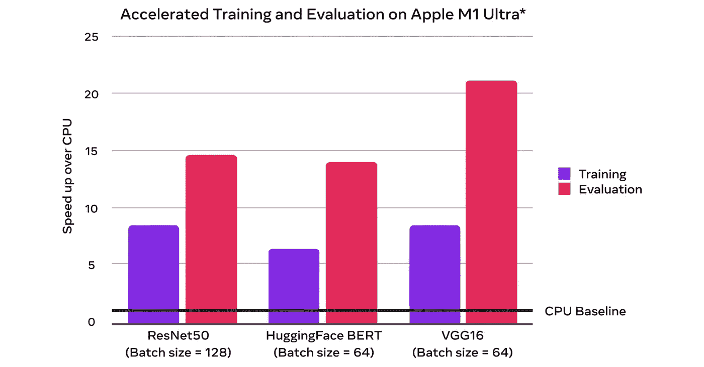
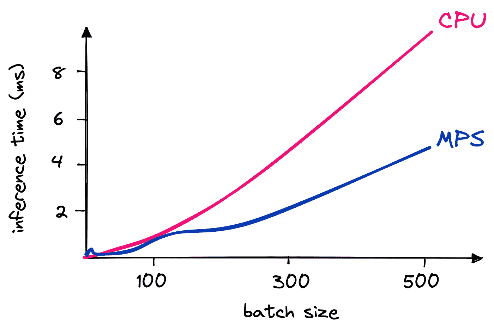
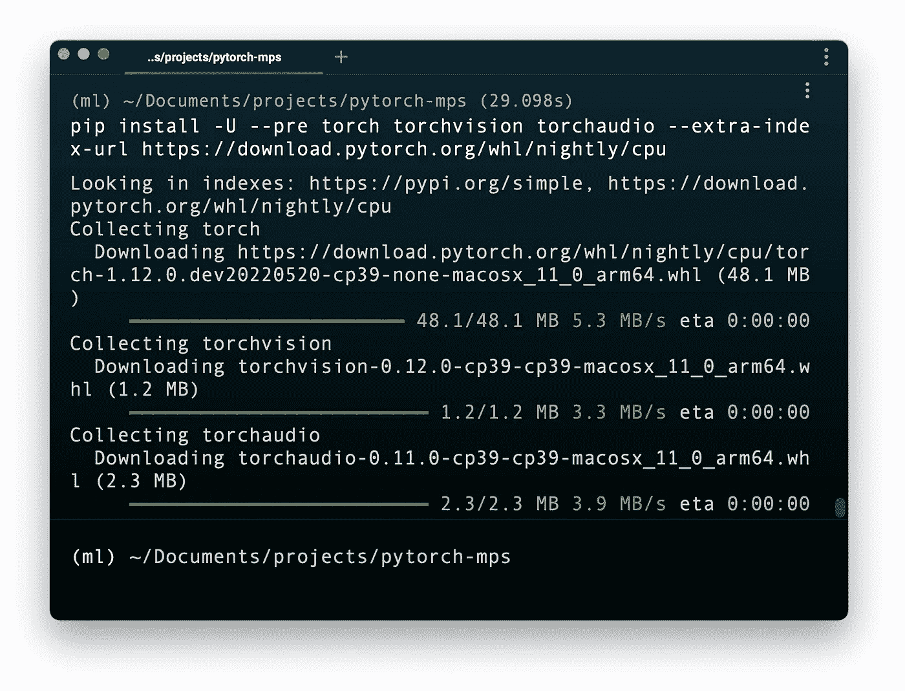
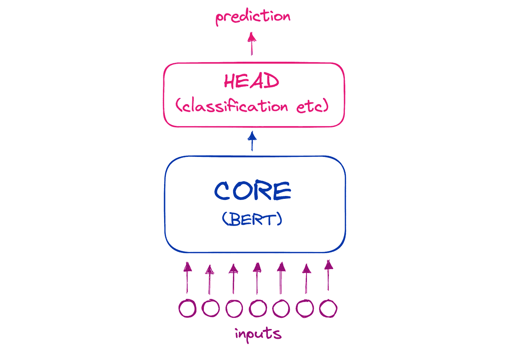

# GPU 加速来到 M1 MAC 电脑上的 PyTorch

> 原文：<https://towardsdatascience.com/gpu-acceleration-comes-to-pytorch-on-m1-macs-195c399efcc1>

## 新的 M1 芯片在新的 PyTorch 更新中表现如何？


照片由[内容小精灵](https://unsplash.com/@contentpixie?utm_source=medium&utm_medium=referral)在 [Unsplash](https://unsplash.com?utm_source=medium&utm_medium=referral) 上拍摄

2020 年 11 月 M1 苹果机的发布标志着苹果机器处理能力的显著提升[1]。不幸的是，这些新功能直到现在才被集成到 PyTorch *中。*

今天的深度学习模型在很大程度上归功于不断增加的模型规模。那些更大的模型需要更多的计算来训练和运行。

本文的视频版本🙌🏼

这些模型太大了，无法在 CPU 硬件上运行，因为 CPU 硬件执行大量的分步计算。相反，他们需要大规模的并行计算，就像 GPU 所执行的那样。

GPU 使用高度并行的结构，最初设计用于处理视觉繁重过程的图像。它们成为游戏中渲染实时 3D 图像的重要组件。

这种渲染 3D 图像的能力可以很好地处理深度学习模型中所需的多维计算。自然地，GPU 成为模型训练和推理的架构。

GPU 对于当今模型的规模至关重要。使用 CPU 使得许多这些模型太慢而无用，这可能使 M1 机器上的深度学习相当令人失望。

TensorFlow 从一开始就支持 GPU 加速[2]，但 TensorFlow 只是深度学习的两个主流库之一。PyTorch 失去了 M1 的支持。幸运的是，他们刚好赶上。

# 好吃吗？

PyTorch v1.12 引入了基于苹果芯片的 GPU 加速训练。这是 PyTorch 和苹果金属工程团队的合作成果。

它使用苹果的**M**et al**P**performance**S**haders(MPS)作为 PyTorch 操作的后端。MPS 针对每个 M1 芯片家族进行了微调。简而言之，这意味着整合速度很快。



使用新的 MPS 后端进行训练和推理/评估。[来源](https://pytorch.org/blog/introducing-accelerated-pytorch-training-on-mac/)。

看一看基线(使用 M1 超芯片)显示，对于流行的 BERT 模型，训练加速约 7 倍，推理加速约 14 倍。

不幸的是，在使用我自己的第一代 M1 MacBook Pro 时，我没有看到同样的加速，特别是当使用如上所示的 64 批次时。



使用基本规格的 M1 MacBook Pro 在不同批量下的 BERT 推断时间。

也许这是由于低效的代码或我相对弱小的基本规格 MacBook Pro，但我会采取 200%的加速任何一天。现在，让我们来看看如何使用这个新的支持 MPS 的 PyTorch，而不是看图表和数字。

# M1 上的 GPU 加速 PyTorch

## 操作系统和 Python 先决条件

甚至在开始之前，有一些事情可能会让你犯错。首先是先决条件。支持 MPS 的 PyTorch 需要 MacOS 12.3+ *和*一个 ARM Python 安装。我们可以通过以下方式检查这两种情况:

```
import platformplatform.platform()[GOOD] >> macOS-**12.4**-**arm64**-arm-64bit
[BAD]  >> macOS-**11.8**-**x86**_64-i386-64bit
```

这向我们展示了两件事，`[ 12.4 | 11.8 ]`指的是 MacOS 版本，这肯定是`12.3`或更高版本。如果不是，更新你的 MacOS！另一个是`[ arm64 | x86 ]`。我们想要`arm64`，如果你看到`x86`，那么我们需要为 Python 创建一个新的 ARM 环境。

如果使用 Anaconda，我们切换到终端窗口，创建一个新的 ARM 环境，如下所示:

```
CONDA_SUBDIR=osx-arm64 conda create -n ml python=3.9 -c conda-forge
```

这里我们设置 conda 版本变量来使用 ARM 环境。然后我们`create`一个新的`conda`环境，命名为(`-n` ) `ml`。接下来，我们将环境设置为使用 Python `3.9`，并确保`conda-forge`包存储库包含在我们的通道中(`-c`)。

*(如果使用的是 Python*[*的另一个版本*](https://www.python.org/downloads/) *，检查是从哪里安装的 ARM 版本)。*

初始化我们的环境后，我们用`conda activate ml`激活它，并修改`CONDA_SUBDIR`变量以永久使用`osx-arm64`。否则，对于将来的 pip 安装，我们可能会默认回到不正确的 *x84* 环境。

```
conda env config vars set CONDA_SUBDIR=osx-arm64
```

您可能会看到一条消息，要求您重新激活环境以使这些更改生效。如果是，使用以下命令切换出并回到`ml`环境:

```
conda activate
conda activate ml
```

## PyTorch 装置

要开始，我们需要安装 PyTorch v1.12 版。目前，它只在夜间发布。

```
pip3 install -U --pre torch torchvision torchaudio --extra-index-url https://download.pytorch.org/whl/nightly/cpu
```



在下载过程中，您应该能够看到类似于**下载 torch-1.1x.x. — arm64.whl** 的内容。最后的 **arm64.whl** 部分很重要，它告诉我们正在下载正确的版本。

我们将使用`transformers`和`datasets`库，它们是用`pip install transformers datasets`安装的。

***旁注:*** *变形金刚库使用 Rust 内置的记号化器(它让它们更快)。因为我们正在使用这个新的 ARM64 环境，我们可能会得到* ***错误:为记号赋予器*** *构建轮子失败。如果是这样，我们安装*<https://huggingface.co/docs/tokenizers/python/v0.9.4/installation/main.html#installation-from-sources>**(在相同的环境下)与:**

```
*curl — proto ‘=https’ — tlsv1.2 -sSf [https://sh.rustup.rs](https://sh.rustup.rs) | sh*
```

**然后* ` *pip 再次安装变压器数据集* ` *。**

*在 Python 中，我们可以使用`torch.has_mps`来确认 MPS 正在工作。*

# *测试 MPS*

## *数据准备*

*为了测试新的支持 MPS 的 PyTorch，我们需要一些数据。我们将提取 TREC 数据集的前 1000 行。*

*我们将使用 BERT 模型测试 MPS 的性能，为此我们必须使用 BERT 记号化器来记号化我们的数据。对于前几个测试，我们将只使用 TREC 数据集的 64 行。*

## *推理测验*

*在 CPU 上处理这些令牌时，我们得到的平均处理时间为 547 毫秒。我们可以通过将`tokens`张量和`model`移动到 MPS 设备来切换到 MPS。*

*使用相同的方法，在不同的批量下，我们可以看到 MPS 设备肯定优于 CPU，但是对于较小的批量，这不是很明显。*

**

*使用基本规格的 M1 MacBook Pro 在不同批量下的 BERT 推断时间。*

## *培训测试*

*在 Mac 上训练大型模型并不是真正的预期用例，特别是对于低端 M1 芯片(如这些测试正在运行的第一代 M1 MacBook Pro)。不过，*有*可能。*

*为了在 TREC 数据集上微调 BERT，我们将使用*文本*特征作为输入，使用*标签-粗略*特征作为目标标签。我们的标签特性包含*六个*唯一类，因此我们必须用*六个*输出类初始化 BERT。*

*请注意，我们将 BERT `model`移动到了 MPS 设备。在训练循环中遵循类似的步骤，其中每个张量被移动到 MPS 设备。*

*对于 1000 行 TREC 数据的训练，CPU 需要大约 25 分钟，MPS 需要大约 18 分钟。但是，这不是直接的比较。当微调完整的 BERT 模型时，MPS 设备(GPU)可以处理不超过一个*一个*的批处理大小，而对于 CPU，我们使用一个`32`的批处理大小。*

*这些测试正在优化整个 BERT 模型，这个模型非常庞大。对于大型语言模型(LLM)的微调，我们通常不需要微调整个模型。相反，我们可以冻结已经预先训练好的模型*核心*，并微调组成特定任务*头部*的最后几层。*

**

*变压器通常由一个经过预训练的大型**核心**和一个**头部**组成，后者针对分类等特定任务进行了微调。*

*使用这种方法，我们获得了更好的训练时间，大约为*四分钟*，最大 MPS 批量大约为 64。*

*这就是对新的支持 MPS 的 PyTorch 的介绍，以及如何在执行推理时使用它，甚至是用像 BERT 这样的流行模型进行训练。*

*如果你想了解我正在做的事情，我每周都会在 YouTube 上发帖子，你可以通过 Discord 直接联系我。我希望能见到你！*

# *资源*

*[1] [纽约时报 MacBook 评论](https://www.nytimes.com/wirecutter/reviews/best-macbooks/) (2021)*

*[2] P. Kanwar，F. Alcober，[在 Mac 上加速 TensorFlow 性能](https://blog.tensorflow.org/2020/11/accelerating-tensorflow-performance-on-mac.html) (2020)，TensorFlow 博客*

*[3] [文章笔记本](https://github.com/jamescalam/pytorch-mps)*

***除非另有说明，所有图片均出自作者之手***