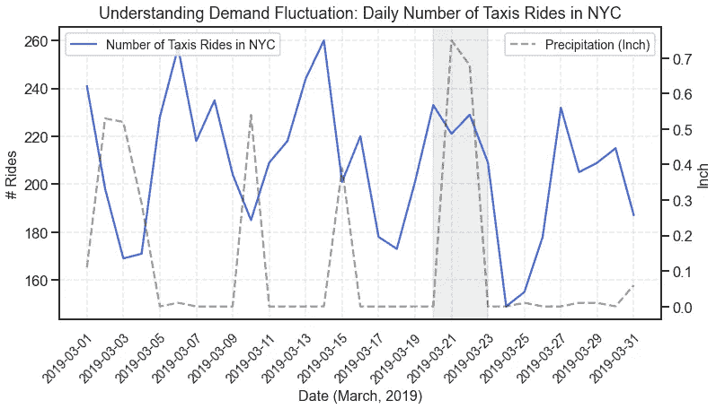
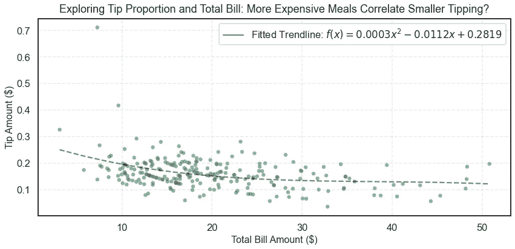
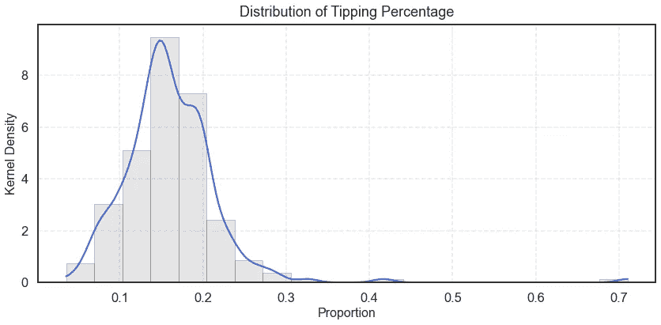
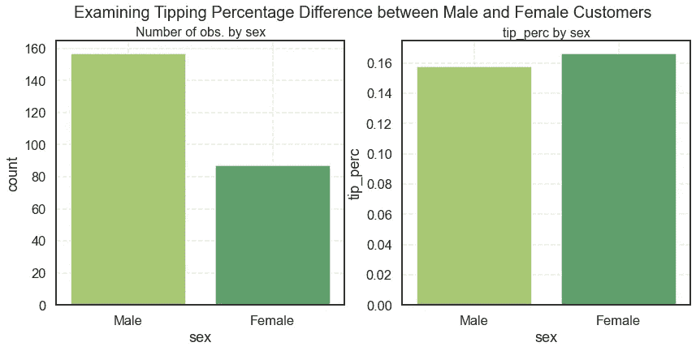

# 抓住并使用这四个有用的 Seaborn 可视化模板

> 原文：<https://towardsdatascience.com/grab-and-use-4-useful-seaborn-visualization-templates-6e5f11a210c9>

## 介绍了基于 Seaborn 的探索性数据分析的四种绘图功能及相关技巧

# 目录

1.  [简介](#45f6)
2.  [即 1:带辅助线/带的双轴时间序列图](#51e6)
3.  [即 2:拟合趋势线的散点图](#c524)
4.  [即 3:具有 KDE 线的分布图(核密度估计)](#6284)
5.  [即 4:分类柱状图系列](#5844)
6.  [总结](#55a1)

# 介绍

## 主动权

> “Matplotlib 和 seaborn 很丑，我只用 R 里的 ggplot2
> “seaborn API 是一种痛苦，使用起来非常僵硬”；
> “seaborn 和 matplotlib 的默认图很差，我每次都必须搜索正确的参数”；
> “还有哪些与 Jupyter Notebook 配合良好的绘图库？”

这些是我从我的计算社会科学家伙伴和数据科学家朋友那里听到的评论，我相信每个数据人都或多或少与他们有关联。诚然，matplotlib 和 seaborn 并不完美，但它们有一个无与伦比的优势:matplotlib 和 seaborn 比大多数复杂的可视化工具包(如 Plotly/Dash)都易于使用，并且它基于 Python，这意味着它们对于探索性数据分析(EDA)是不可替代的，我们应该接受它们。

为了让 EDA 的生活更容易，我想分享一些 seaborn 可视化模板和我个人使用的相关技巧，以便您可以在分析上花更多的时间。本文将强调**解决两个痛点:(1)美观；(2)功能性。**

## 这些功能对你有什么帮助？

非常欢迎您通过简单地更改数据集的输入来获取和使用可视化模板。您还可以修改函数体来满足自己的需要。为此，我总结了一些我个人在工作中经常使用的关键技巧(即 seaborn 参数/方法)。

## 数据集

我使用来自 seaborn 的 *taxis* 和 *tips* 数据集以及来自美国国家海洋和大气管理局(NOAA)的公开气象数据作为以下模板的示例。请随意使用嵌入的代码块复制可视化。

*taxi*和 *tips* 数据集通过 Seaborn 获得开源许可。它们可以通过`seaborn.load_dataset`方法在 Python 中自由访问，并根据它们的[许可许可](https://github.com/mwaskom/seaborn/blob/master/LICENSE)被允许用于商业用途。NOAA 天气数据的使用遵循[世界气象组织第 40 号决议文件](https://www.weather.gov/tg/addprod1#:~:text=In%20Annex%201%20to%20Resolution,country%20(or%20group%20of%20countries)。更多的细节可以在文章的底部以及参考文献中找到。

# 即 1:带辅助线/带的双轴时间序列图

双轴时间序列图可以非常直观地了解我们感兴趣的关键变量的趋势如何与其他外部因素相关联。它常用于时间序列分析。

作者图:该图描述了纽约市出租车乘坐次数的时间序列波动。它还指定了雨天作为参考，以帮助解释趋势。(*数据来源:Seaborn Taxis 数据集，*美国国家海洋和大气管理局 *)*

作者代码

## 双轴时间序列图的关键注释

*   我建议总是添加`sns.set(style=”...”,context=”...”)`来拥有一个漂亮的布局和 Arial 字体。请注意，在 Google Colab 中没有像这样的“捷径”,因为 Arial 字体类型没有正确安装在他们的虚拟机中。在 Colab 中更改字体类型的唯一方法是显式安装，然后将它们添加到 matplotlib 本地文件夹中，这可能会很麻烦。见[此处](https://stackoverflow.com/questions/51810908/custom-fonts-in-google-colaboratory-matplotlib-charts/72351664#72351664)。
*   `ax_y = ax.twinx()`是创造双轴剧情的关键棋子。
*   `ax.axvspan/ax.axhspan/ax.axvline/ax.axhline`是辅助线和阴影带的方法。
*   我更喜欢用网格线作为锚`ax.grid(linestyle=” — “, alpha=0.5)`，我会通过设置一个小阿尔法来确保网格不会分散注意力。
*   我个人发现下面的两个代码行(一个用于减少 x 刻度密度，一个用于旋转文本)在使用日期变量作为 x 轴时非常有用，这样我就可以**防止所有日期文本相互重叠时出现混乱的前景**。
    `ax_y.xaxis.set_major_locator(ticker.MultipleLocator(...))` `plt.setp(ax_y.get_xticklabels(), rotation=45, ha=”right”, rotation_mode=”anchor”)`

# Viz 2:拟合趋势线的散点图

散点图是捕捉两个连续变量之间关系的一种有效的可视化分类。散点图的好处是它提供了一种原始的相关性，因为它直接将每个单独的数据点投影到画布上。相应地，不明朗的趋势也变成了不利因素。因此，手动拟合直线并添加到散点图中通常被认为是一种良好的做法。

按作者分类的图:该图通过总账单金额($)和小费百分比将 244 个交易数据点投影到一个二维空间。还显示了拟合的多项式趋势线。(数据来源:Seaborn Tips 数据集)

作者代码

## 拟合趋势线散点图的关键注释

*   `sympy`包装上的乳胶文字样式可以使配方更具美感。
*   来自`scipy`的`curve_fit`通常用于确定拟合线的参数，但是尝试不同的模型(例如多项式、对数、指数)不会出错。

# 即 3:具有 KDE 线的分布图(核密度估计)

分布是我们在进行单变量数据分析时想要探索的最关键的统计方面之一。虽然 seaborn 提供了多种方法，如`displot`、`kdeplot`、`distplot`来使用 KDE(核密度估计)直接测量分布，但在本文中，我想强调一些特定的参数，并提醒您注意。

作者提供的数字:该图描述了小费百分比的分布情况。它表明，在大多数情况下，人们会给这顿饭总账单的 16%作为小费。(数据来源:Seaborn Tips 数据集)

作者代码

## KDE 线分布图的关键注释(核密度估计)

*   平滑的 KDE 线可能是一个很好的参考，但是当参数在具有极值的**多模态**或**偏斜** **分布**中被错误指定时，它可能会**误导**。因此，最好同时检查**直方图**，并相应调整`cut`、`clip`和`bw_adjust`。
*   `cut`、`clip`和`bw_adjust`是 KDE 线的三个非常重要的参数。我通常设置`cut=0`和`clip`等于数据的最小值和最大值，以在极限处截断 KDE 曲线，并迫使它不超出实际样本。值得注意的是，默认情况下，`cut`参数不是 0，因此 KDE 曲线有时可能与样本分布不同。
*   `bw_adjust`简而言之，控制着 KDE 曲线的‘平滑度’，因此应该仔细调整以反映真实的分布。我强烈建议阅读 kdeplot 官方文件[中的注释。](https://seaborn.pydata.org/generated/seaborn.kdeplot.html#seaborn.kdeplot)

# 即 4:分类柱状图系列

我个人认为最后一个有用且方便的可视化是这一系列的柱状图，因为我们不仅关心指标的**分解，还关心每个维度值的**样本构成**。否则，我们可能会陷入辛普森悖论，得出错误的结论。为了包含分类变量，我使用来自 seaborn 的流行的 Tips 数据集进行说明。**

按作者分类的图表:这张图表显示了按性别分类的小费金额占总账单金额的百分比。它还揭示了样本不平衡，女性观察较少。(数据来源:Seaborn Tips 数据集)

作者代码

# 摘要

本文提出了四种不同类型的可视化模板，分别对应于四种不同的用例:(1)分析时间序列趋势；(2)分析两个连续变量之间的关系；(3)分析分布情况；(4)分析不同维度分解下的度量性能。

对于每种类型的可视化，我都提供了代码和数据来复制可视化，并添加了主题演讲来突出关键的 seaborn 方法。目的是促进 Python 中更实用、更美观的绘图。

希望以上内容对你的数据之旅有一点帮助！

# Seaborn 许可证

本文依赖于 Seaborn 包中包含的数据集。Seaborn 许可证如下所示:

版权所有 2012–2021，迈克尔·l·瓦斯科姆
保留所有权利。

只要满足以下条件，允许以源代码和二进制形式(修改或不修改)重新分发和使用:

*   源代码的再分发必须保留上述版权声明、此条件列表和以下免责声明。
*   二进制形式的再分发必须在随分发提供的文档和/或其他材料中复制上述版权声明、此条件列表和以下免责声明。
*   未经事先明确的书面许可，不得使用项目的名称或其贡献者的名称来认可或推广由此软件衍生的产品。

本软件由版权所有者和贡献者“按原样”提供，拒绝任何明示或暗示的担保，包括但不限于适销性和特定用途适用性的暗示担保。在任何情况下，版权所有者或贡献者都不对任何直接、间接、附带、特殊、惩戒性或后果性损害(包括但不限于替代商品或服务的采购；用途、数据或利润的损失；或业务中断)以及任何责任理论，无论是合同责任、严格责任还是因使用本软件而产生的侵权行为(包括疏忽或其他),即使已被告知此类损害的可能性。

# 参考

*   瓦斯科姆，m，伯特温尼克，奥尔加，O '凯恩，德鲁，霍布森，保罗，卢卡斯卡斯，绍利乌斯，金珀林，大卫 C，… Qalieh，阿德尔。(2017).*mwaskom/seaborn:v 0 . 8 . 1(2017 年 9 月)*。芝诺多。[https://doi.org/10.5281/zenodo.883859](https://doi.org/10.5281/zenodo.883859)
*   美国。(2006). *NOAA 在线天气数据(NOWData):交互式数据查询系统:公共实况报道*。华盛顿特区:国家海洋和大气管理局。
*   Zolzaya Luvsandorj，Seaborn (Python)中更漂亮和定制地块的 6 个简单技巧，[https://towardsdatascience . com/6-simple-tips-for-bearer-and-customized-plots-in-Seaborn-Python-22f 02 ECC 2393](/6-simple-tips-for-prettier-and-customised-plots-in-seaborn-python-22f02ecc2393)
*   Anirudh Kashyap，让剧情看起来更好的 5 大诀窍，[https://medium . com/@ andykashyap/Top-5-tricks-to-make-plots-look-better-9f 6 e 687 C1 e 08](https://medium.com/@andykashyap/top-5-tricks-to-make-plots-look-better-9f6e687c1e08)
*   离子解决方案，“seaborn distplot 中的 y 轴是什么？”，[https://stackoverflow.com/a/51667318/18719482](https://stackoverflow.com/a/51667318/18719482)。2018 年 8 月。最后访问时间:2022 年 6 月 13 日
*   korakot，“Google 协同实验室 matplotlib 图表中的自定义字体”，[https://stack overflow . com/questions/51810908/Custom-fonts-in-Google-co-laboratory-matplotlib-charts/72351664 # 72351664](https://stackoverflow.com/questions/51810908/custom-fonts-in-google-colaboratory-matplotlib-charts/72351664#72351664)。2018 年 8 月。最后访问时间:2022 年 6 月 13 日
*   apdnu，“在 matplolib 中增加标题和情节之间的距离？”，[https://stack overflow . com/questions/16419670/increase-distance-between-title-and-plot-in-matplolib](https://stackoverflow.com/questions/16419670/increase-distance-between-title-and-plot-in-matplolib)。2018 年 3 月。最后访问时间:2022 年 6 月 13 日
*   如何在 seaborn lineplot 上绘制虚线？，[https://stack overflow . com/questions/51963725/how-to-plot-a-dashed-line-on-seaborn-line plot](https://stackoverflow.com/questions/51963725/how-to-plot-a-dashed-line-on-seaborn-lineplot)。2018 年 8 月。最后访问时间:2022 年 6 月 13 日
*   代码复制可视化，魏的 Github 要诀，
*   数据集复制可视化，魏的 Github 文件夹，[的](https://github.com/mintaow/MyMediumWork/tree/main/data)