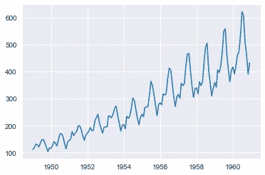
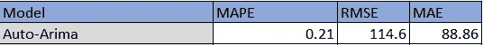
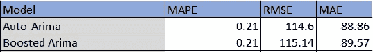
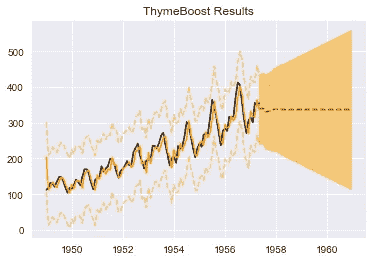
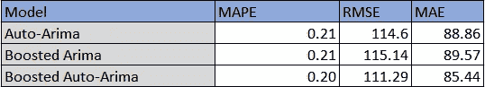
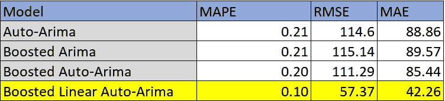

# 时间序列预测的梯度增强 ARIMA

> 原文：<https://towardsdatascience.com/gradient-boosted-arima-for-time-series-forecasting-e093f80772f6>

# 时间序列预测的梯度增强 ARIMA

## 提升 PmdArima 的 Auto-Arima 性能


图片由 [SpaceX](https://unsplash.com/@spacex) 在 [Unsplash](https://unsplash.com/) 上拍摄

**TLDR:** 将梯度推进添加到 ARIMA 增加了拟合过程的复杂性，但是如果我们在每一轮推进中针对新的(p，d，q)参数进行优化，也可以提高精度。虽然，升压结合其他方法可以获得更大的增益。

所有代码都住在这里:[百里香 Github](https://github.com/tblume1992/ThymeBoost)

查看这篇[文章](/thymeboost-a0529353bf34)，了解百里香的完整介绍。

# 介绍

梯度推进多年来一直是机器学习领域的一个热门话题，但在时间序列领域还没有获得太多的关注。理论工作已经完成，但没有多少像 ARIMA 等传统方法那样获得主流关注。这主要是因为 boosting 方法的大部分收益(通常)来自以某种方式对数据进行分区的方法，如决策树。我们当然可以尝试以某种方式划分我们的数据，但很多时候我们没有足够的数据来使用非常复杂的方法，这导致了较差的结果。另一方面，提升一些简单的东西，如线性回归，往往会正则化系数，但通常会采用更直接的正则化方法。

说了这么多，还是来助推一些时间序列的方法吧！

具体来说，我们将着眼于提高 ARIMA，并将其与 PmdArima 进行比较。为了增强效果，我们将使用一个我正在开发的包:[百里香增强](https://github.com/tblume1992/ThymeBoost)。这个包使用一个通用的 boosting 框架来进行时间序列分解和预测，同时包含了梯度 boosting 中一些通常不会应用的更有用的想法(据我所见)。但就我们的目的而言，我们将只做简单的助推。

我们的实验将使用一个非常常见的时间序列数据集来:

1.  从 PmdArima 拟合自动 arima
2.  使用找到的参数来增强简单的 ARIMA
3.  使用 PmdArima 增强以在每轮搜索新参数
4.  对比结果！

# 航空乘客数据集

我们将尝试的第一个数据集是航空乘客数据集，可以从 [Kaggle](https://www.kaggle.com/rakannimer/air-passengers) 中找到，并带有开放数据库许可证。让我们看看并导入所有必需的包:

```
import numpy as np
import pandas as pd
from matplotlib import pyplot as plt
import seaborn as sns
sns.set_style("darkgrid")#Airlines Data, if your csv is in a different filepath adjust this
df = pd.read_csv('AirPassengers.csv')
df.index = pd.to_datetime(df['Month'])
y = df['#Passengers']
plt.plot(y)
plt.show()
```



作者图片

为了判断预测方法，我们将把数据分割成标准的训练/测试分割，其中保留最后 30%的数据。

```
test_len = int(len(y) * 0.3)
al_train, al_test = y.iloc[:-test_len], y.iloc[-test_len:]
```

现在快速提醒一下，百里香增强对趋势和季节性做了一些非常具体的假设，所以我们不能在使用季节性(这个时间序列显然有)时直接将其与 auto-arima 进行比较。但是，我们还是会尝试，只是没有季节性。

首先我们使用 PmdArima:

```
import pmdarima as pm
# Fit a simple auto_arima model
arima = pm.auto_arima(al_train,
                      seasonal=False,
                      trace=True,
                      )
pmd_predictions = arima.predict(n_periods=len(al_test))
arima_mae = np.mean(np.abs(al_test - pmd_predictions))
arima_rmse = (np.mean((al_test - pmd_predictions)**2))**.5
arima_mape = np.sum(np.abs(pmd_predictions - al_test)) / (np.sum((np.abs(al_test))))
```

结果是:



作者图片

现在，我们将获取“最佳”参数，并将其传递给百里香增强，以用于每一轮增强。使用的顺序就是 PmdArima 字典中的顺序，当使用截距时，趋势参数(如果我理解文档的话)将是“c”。这些参数将被传递给百里香增强:

```
#get the order
auto_order = arima.get_params()['order']
from ThymeBoost import ThymeBoost as tb
boosted_model = tb.ThymeBoost(verbose=1)output = boosted_model.fit(al_train,
                            trend_estimator='arima',
                            arima_order=auto_order,
                            global_cost='mse')
predicted_output = boosted_model.predict(output, len(al_test))
tb_mae = np.mean(np.abs(al_test - predicted_output['predictions']))
tb_rmse = (np.mean((al_test - predicted_output['predictions'])**2))**.5
tb_mape = np.sum(np.abs(predicted_output['predictions'] - al_test)) / (np.sum((np.abs(al_test))))
```

结果是…非常糟糕:



作者图片

当看这些预测时，很容易明白为什么:

```
boosted_model.plot_results(output, predicted_output)
```



看起来，当增强(拟合简单的平均值/中值)使得先前发现的参数无用时，出现初始化回合。事实上，如果您查看日志，甚至不会发生任何提升！百里香中的助推程序完全改变了游戏，负面的。

但是，如果尝试使用 PmdArima 搜索新参数呢？

让我们试一试。

为此，我们只需为 arima_order 参数传递“auto”。让我们看看它是如何做到的:

```
from ThymeBoost import ThymeBoost as tb
boosted_model = tb.ThymeBoost(verbose=1)output = boosted_model.fit(al_train,
                            trend_estimator='arima',
                            arima_order='auto',
                            global_cost='mse')
predicted_output = boosted_model.predict(output, len(al_test))
tb_mae = np.mean(np.abs(al_test - predicted_output['predictions']))
tb_rmse = (np.mean((al_test - predicted_output['predictions'])**2))**.5
tb_mape = np.sum(np.abs(predicted_output['predictions'] - al_test)) / (np.sum((np.abs(al_test))))
```

结果是:



作者图片

略有改善！查看日志，我们看到总共有 4 轮:1 轮初始化和 3 轮提升。

但是，我们在这里不是为了边际改进。除了自动 Arima 之外，让我们用一个简单的线性趋势来看看效果如何。这可以通过简单地将它们作为列表传递来实现:

```
from ThymeBoost import ThymeBoost as tb
boosted_model = tb.ThymeBoost(verbose=1)output = boosted_model.fit(al_train,
                            trend_estimator=['linear', 'arima'],
                            arima_order='auto',
                            global_cost='mse')
predicted_output = boosted_model.predict(output, len(al_test))
tb_mae = np.mean(np.abs(al_test - predicted_output['predictions']))
tb_rmse = (np.mean((al_test - predicted_output['predictions'])**2))**.5
tb_mape = np.sum(np.abs(predicted_output['predictions'] - al_test)) / (np.sum((np.abs(al_test))))
```

结果是:



作者图片

与所有其他方法相比，这是一个显著的改进！

# **结论**

在本文中，我们探索了一种利用 ARIMA 的增强方法。我们看到，采用静态的“最佳”参数配置会导致升压过程中的可怕结果。另一方面，如果我们为每一轮提升动态地找到新的参数设置，我们可以在精度上获得边际收益。

但是，也许只是提高 ARIMA 并不总是最好的事情。相反，也许用其他模型增强 ARIMAs 可能会让我们有更好的表现。

如果你喜欢这种用时间序列方法提升的方式，我强烈推荐你看看我的另一篇文章:[用百里香提升的 M4 竞赛](/the-m4-time-series-forecasting-competition-with-thymeboost-b31196fc319)。本文是一系列文章中的第一篇，我们将应用许多不可靠的不同的百里香增强设置，努力学习所有这些方法如何在框架中工作，并最终(*剧透警告*)赢得 M4 竞赛。